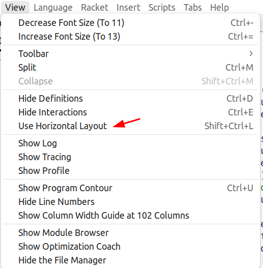

教材

https://mitp-content-server.mit.edu/books/content/sectbyfn/books_pres_0/6515/sicp.zip/index.html

SICP Scheme 版本

vscode 配置：

https://blog.csdn.net/qq1097759441/article/details/129171686

https://stackoverflow.com/questions/49183001/how-can-i-run-scheme-on-visual-studio-code

https://blog.csdn.net/weixin_40827685/article/details/109751129

- sudo apt-get install mit-scheme
- **sudo apt install racket**

使用DrRacket ！

开启自动括号

显示代码行数

DrRacket 的输出在右侧，如何修改为在下侧？

记得安装 sicp 的package

https://zhuanlan.zhihu.com/p/37056659

https://github.com/sicp-lang/sicp

scheme 教程

https://wizardforcel.gitbooks.io/teach-yourself-scheme/content/010-enter-scheme.html

ctrl + alt + n  vscode 运行程序

manual？

http://www.lispmachine.net/books/LISP_1.5_Programmers_Manual.pdf

exercise-answer

http://community.schemewiki.org/?sicp-solutions

https://sicp-solutions.net/

files-viewer

https://github.com/MatrixForChange/files-viewer

racket 快捷键

Ctrl+E             显示/隐藏交互窗口

Ctrl+D             显示/隐藏代码窗口

Ctrl+I               全文调整缩进

Ctrl+Shift+V    粘贴时自动缩进

Ctrl+T             新建标签

Ctrl+W            关闭当前窗口（或标签）

Ctrl+R或F5     运行
