## 1.2 Procedures and the Processes They Generate

我们已经使用了基本的算术运算，

我们已经组合了这些运算，

我们已经通过将这些运算定义为复合过程来抽象这些复合运算。


**基本运算、组合运算、复合运算。**

可视化所考虑的行为的结果的能力对于成为一名专业程序员是至关重要的。


什么是 过程？

A procedure is a pattern **for the local evolution of a computational process**.


### 1.2.1 Linear Recursion and Iteration

**线性递归和线性迭代**

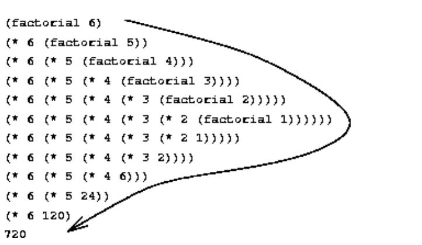

**呈现先膨胀后收缩的形状**

**有很明显的延迟计算的趋势**

**有一些额外的“隐藏”信息，由解释器维护，不包含在程序变量中，它指示进程在协商延迟操作链中的“位置”**

**链越长，必须保存的信息就越多**


A linear recursive process for computing 6!

上面就是一个线性递归计算 6 的阶乘的过程。

递归函数的定义

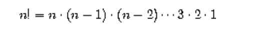

如果稍微变型一下：

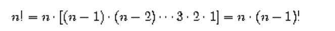

于是我们可以写一个递归函数：

```lisp
(define (factorial n)
    (if (= n 1)
        1
        (* n (factorial (- n 1)))))
```

还有一个办法，就是迭代，如下：

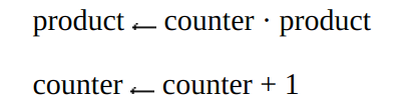

下面是迭代的过程可视化：

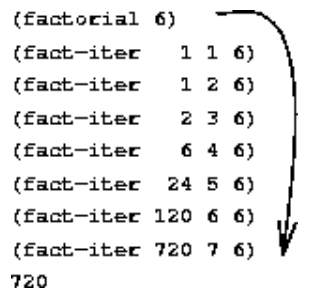

 A linear iterative process for computing 6!

**不会增长和收缩**

**迭代过程的状态可以通过固定数量的状态变量来总结，同时还有一个固定的规则来描述状态变量在过程从一个状态移动到另一个状态时应该如何更新，以及一个(可选的)结束测试来指定过程应该在哪些条件下终止。**

1. 有固定数量的状态变量
2. 有更新状态变量的规则
3. 可选的终止条件


迭代过程不需要辅助寄存器，只需要固定的寄存器就可以完成！

实现递归过程需要使用称为堆栈的辅助数据结构。


上面就是一个线性迭代计算 6 的阶乘的过程。

代码如下：

```lisp
(define (factorial n)
  (fact-iter 1 1 n))

(define (fact-iter product counter max-count)
  (if (> counter max-count)
      product
      (fact-iter (* counter product)
                 (+ counter 1)
                 max-count)))
```

如果将 n 隐藏，将 fact-iter 放到 factorial 中，就有：

```lisp
(define (factorial n)
    (define (iter product counter)
        (if (> counter n)
            product
            (iter (* counter product)
                  (+ counter 1))))
    (iter 1 1))
```


递归和迭代似乎没有什么不同，

这两种方法甚至执行相同的乘法序列，得到相同的部分积序列。

**当我们考虑这两个过程的“可视化形状”时，我们发现它们的演变完全不同。**


疑惑？fact-iter 不也是自己调用自己吗？也是递归。

即fact-iter本身是**递归**的，但是不是**线性递归**，我们将诸如fact-iter之类的递归过程称为**生成迭代过程**

It may seem disturbing that we refer to a recursive procedure such as fact-iter **as generating an iterative process.**

它的状态完全由它的三个状态变量捕获，并且解释器只需要跟踪三个变量就可以执行该过程

**只需要跟踪 product counter max-count 这三个变量就可以完成 fact-iter的过程，所以并不需要维护额外的信息，即不是线性递归。**


大多数语言(包括Ada、Pascal和C)的实现都是任何递归过程的解释都会消耗一定数量的内存，并且随着过程调用的数量而增长，**即使所描述的过程原则上是迭代的。**

因此，这些语言只能通过使用特殊用途的“循环结构”来描述迭代过程**，例如do、repeat、until、for和while。**


Scheme 并不同，它将在常数空间中执行迭代过程，**即使迭代过程是由递归过程描述的。**

即Scheme**没有循环结构也可以实现迭代过程**，即使在描述上是用递归过程描述迭代过程。


An implementation with this property is called **tail-recursive**.

即尾递归


### 1.2.2 Tree Recursion

另一种常见的计算模式称为“树递归”。

考虑计算斐波那契数列，其中每个数字都是前两个数字的和。

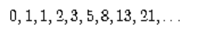

递推方程

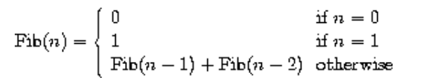

递归过程如下：

```lisp
(define (fib n)
  (cond ((= n 0) 0)
        ((= n 1) 1)
        (else (+ (fib (- n 1))
                 (fib (- n 2))))))
```

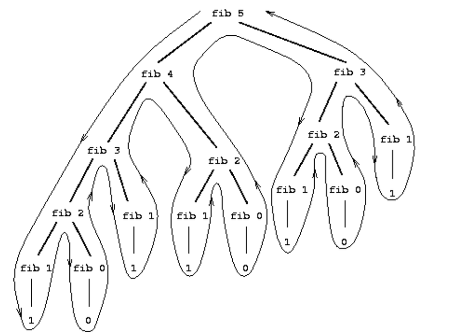

The tree-recursive process generated in computing `(fib 5)`

计算fib 5 的树型递归如上

分支在每一层都分成两个(除了底部)。

可以证明fib (n)的值随着n呈指数增长。

fib (n)是最接近

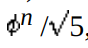

的整数。

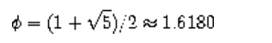

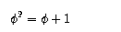

黄金分割比例

树递归过程所需的步骤数将与树中的节点数成正比，而所需的空间将与树的最大深度成正比。


可以使用迭代的思路进行计算：

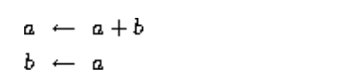

在进行n次变换之后，a和b分别等于Fib(n + 1)和Fib(n)

定义迭代过程如下：

```lisp
(define (fib n)
  (fib-iter 1 0 n))
(define (fib-iter a b count)
  (if (= count 0)
      b
      (fib-iter (+ a b) a (- count 1))))
```

将指数算法转化为了线性迭代算法


####  Example: Counting change

找零钱。

我们有多少种不同的方法把一美元找零，给你半美元、25美分、10美分、5美分和1美分?

每一个面值只有一张

更一般地说，我们是否可以编写一个程序来计算任意给定金额的货币有多少种改变方式?


The number of ways to change amount **a** using **n** kinds of coins equals

the number of ways to change amount a **using all but the first kind of coin**, plus the number of ways to change amount **a-d** using all **n kinds of coins**, where d is the **denomination of the first kind of coin**.


换零钱的总方法等于

不使用第一种硬币而换零钱的总方法数 加上 假设我们使用第一种硬币而换零钱的总方法数

**后一种数字等于用第一种硬币后剩下的硬币换零钱的方法的数量**


边界条件如下：

- **If a is exactly 0, we should count that as 1 way to make change.**
- **If a is less than 0, we should count that as 0 ways to make change.**
- **If *n* is 0, we should count that as 0 ways to make change.**


递归过程如下：

```lisp
(define (count-change amount)
  (cc amount 5))

(define (cc amount kinds-of-coins)
  (cond ((= amount 0) 1)
        ((or (< amount 0) (= kinds-of-coins 0)) 0)
        (else (+ (cc amount
                     (- kinds-of-coins 1))
                 (cc (- amount
                        (first-denomination kinds-of-coins))
                     kinds-of-coins)))))

(define (first-denomination kinds-of-coins)
  (cond ((= kinds-of-coins 1) 1)
        ((= kinds-of-coins 2) 5)
        ((= kinds-of-coins 3) 10)
        ((= kinds-of-coins 4) 25)
        ((= kinds-of-coins 5) 50)))
(count-change 100)
; 292
```

观察到树递归过程可能效率极低，但通常很容易编写和理解。

将递归过程转化为迭代过程就可以提高效率。

这个转化的过程最好交给编译器。


### 1.2.3 Orders of Growth

在一次只执行固定数量操作的计算机中，所需的时间将与**执行的基本机器操作的数量成正比**。

let *R*(*n*) be the amount of resources the process requires for a problem of size *n*.

Let *n* be a parameter that measures the size of the problem.

We say that *R*(*n*) has order of growth $\theta(f(n))$, written $R(n) = \theta(f(n))$ .

if there are positive constants *k*1 and *k*2 independent of *n* such that
$$
k_{1}f(n)\leq R(n)\leq k_{2}f(n)
$$
for any sufficiently large value of *n*

(换句话说，对于较大的n, R(n)的值夹在k1f(n)和k2f(n)之间。

线性就是 $\theta(n)$

常数就是 $\theta(1)$

tree-recursive Fibonacci 计算的时间复杂度是 $\theta(\phi^n)$，即指数


忽略常数，只看最高阶

For example, a process requiring $n^2$ steps and a process requiring $1000*n^2$ steps and a process requiring $3*n^2 + 10n+ 17$ steps all have $\theta(n^2)$ order of growth


### 1.2.4 Exponentiation

计算高阶幂 $b^n$

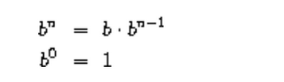

lisp的过程如下：

```lisp
(define (expt b n)
  (if (= n 0)
      1
      (* b (expt b (- n 1)))))
```

上面的空间和时间都是 $\theta(n)$，即是线性递归，a linear recursive process

可以改成一个等价的线性迭代：

```lisp
(define (expt b n)
  (expt-iter b n 1))

(define (expt-iter b counter product)
  (if (= counter 0)
      product
      (expt-iter b
                (- counter 1)
                (* b product)))) 
```

将expt-iter放入expt

```lisp
(define (expt b n)
    (define (expt-iter b counter product)
        (if (= counter 0)
            product
            (expt-iter b
                       (- counter 1)
                       (* b product)))) 
    (expt-iter b n 1))
```

改成迭代后，时间和空间分别为 $\theta(n)$，$\theta(1)$


**方法一：**

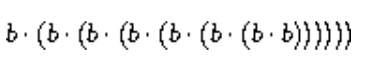

线性计算，太慢了

**方法二：**

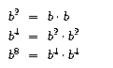

实现加速

This method works fine for exponents that are powers of 2

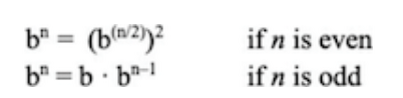


以上的算法就是快速幂

```lisp
(define (even? n)
    (= (remainder n 2) 0))
(define (fast-expt b n)
    (cond ((= n 0) 1)
        ((even? n) (square (fast-expt b (/ n 2))))
        (else (* b (fast-expt b (- n 1))))))
```

时间和空间都是**对数复杂度**

上面描述的是递归的方法，如果是迭代的话，就是每次都是使用连续平方的思想来迭代，以对数级的步数计算指数。


### 1.2.5 Greatest Common Divisors

两个整数a和b的最大公约数(GCD)定义为能除a和b且无余数的最大整数。

例如，16和28的GCD为4。

分式化简，16/28减少到4/7，就需要用到GCD。

如果r是a除以b的余数，那么a和b的公约数与b和r的公约数完全相同。

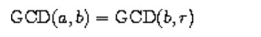

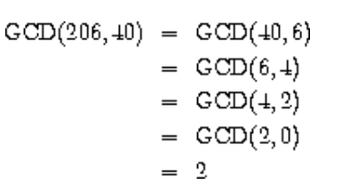


最终总会得到第二个数字为0的整数对。

那么GCD就是这对中的另一个数字。

This method for computing the GCD is known as *Euclid's Algorithm*

即欧几里德算法。

欧几里得算法之所以被称为欧几里得算法，是因为它出现在《欧几里得几何原理》(公元前300年第7卷)中。

递归过程描述如下：

```lisp
(define (gcd a b)
  (if (= b 0)
      a
      (gcd b (remainder a b))))
```

对数增长，The fact that the number of steps required by Euclid's Algorithm has logarithmic growth bears an interesting relation to the **Fibonacci numbers:**


**Lamé's Theorem:** If Euclid's Algorithm requires *k* steps to compute the GCD of some pair, then the smaller number in the pair must be greater than or equal to the *k*th Fibonacci number

lam<s:1>定理:如果欧几里得算法**需要k步来计算某对的GCD**，则该对中**较小的数必须大于或等于第k个斐波那契数**

这个定理是在1845年由法国数学家和工程师加布里埃尔·拉姆勒证明的。

To prove the theorem, we consider pairs $(a_k,b_k)$, where $a_k\geq b_k$, for which Euclid's Algorithm terminates in $k$ steps. 


The proof is based on the claim that, if $(a_{k+1},b_{k+1})\to(a_k,b_k)\to(a_{k-1}$, $b_{k-1}$) are three successive pairs in the reduction process, then we must have $b_{k+1}$ $\geq b_k+b_{k-1}.$ 

To verify the claim, consider that a reduction step is defined by applying the transformation $a_{k-1}=b_k,b_{k-1}=$ remainder of $a_k$ divided by $b_k$. 

The second equation means that $a_k=qb_k+b_{k-1}$ for some positive integer $q$. 

下面是证明这个定理的关键一步：

**And since $q$ must be at least 1 we have $a_k=qb_k+b_{k-1}\geq b_k+b_{k-1}$.** 

But in the previous reduction step we have $b_{k+1}=a_k.$ 

Therefore, $b_{k+1}=a_k\geq$ $b_k+b_{k-1}$. 

This verifies the claim. 

**Now we can prove the theorem by induction on $k$, the number of steps that the algorithm requires to terminate.** 

The result is true for $k=1$, since this merely requires that $b$ be at least as large as $Fib(1)=1.$ 

Now, assume that the result is true for all integers less than or equal to $k$ and establish the result for $k+$ 1. 

**Let $(a_{k+1},b_{k+1})\boldsymbol{\longrightarrow}(a_k,b_k)\boldsymbol{\longrightarrow}(a_{k-1},b_{k-1})$ be successive pairs in the reduction process.** 

By our induction hypotheses, **we have $b_{k- 1}\geq Fib( k- 1) $ and $b_k\geq Fib( k) .$** 

Thus, applying the claim we just proved together with the definition of the Fibonacci numbers gives **$b_{k+1}\geq b_k+b_{k-1}\geq Fib(k)+Fib(k-1)=Fib(k+1)$, which completes the proof of Lamé's Theorem.**


欧几里德算法的时间复杂度？即它的增长阶是？

Let *n* be the **smaller** of the two inputs to the procedure. 

If the process takes *k* steps, then we must have $n\geq Fib\mathrm{~(k)}\approx\Phi^k/\sqrt{5}.$

$\theta(log_{\Phi}n)$


### 1.2.6 Example: Testing for Primality

两种方法：

(1) $\theta(\sqrt{n})$  判断一个数是否是素数

(2) $\theta(log n)$ 使用概率算法判定一个数是素数


#### Searching for divisors

检验一个数是否是素数的一种方法是找出这个数的除数。

通过测试n是否能被从2开始的连续整数整除。

```lisp
(define (divides? a b)
    (= (remainder b a) 0))

(define (smallest-divisor n)
    (define (find-divisor test-divisor)
        (cond 
            ((> (square test-divisor) n) n)
            ((divides? test-divisor n) test-divisor)
            (else (find-divisor (+ test-divisor 1)))))
    (find-divisor 2))

(define (prime? n)
    (= n (smallest-divisor n)))
```

增长阶是 $\theta(\sqrt{n})$


#### The Fermat test

$\theta(log n)$ 复杂度的算法来源于费马小定理

费马小定理：如果n是质数，a是小于n的任何正整数，那么a的n次幂等于a对n取模。

Fermat's Little Theorem: If n is a prime number and a is any positive integer less than n, then a raised to the nth power is congruent to a modulo n.

(如果两个数除n后有相同的余数，**则称它们模n为同余**。

数a除n的余数也称为**模n的余数，或简称为模n**。)


If $n$ is not prime, then, in general, most of the numbers $a<n$ will not satisfy the above relation. 

This leads to the following algorithm for testing primality: 

Given a number $n$, pick a random number $a<n$ and compute the remainder of $a^n$ modulo $n$. 

- If the result is not equal to $a$, then $n$ is certainly not prime. 
- If it is $a$, then chances are good that $n$ is prime. 

Now pick **another random number $a$** and test it with the same method. 

If it also satisfies the equation, then we can be even more confident that $n$ is prime. 

**By trying more and more values of $a$, we can increase our confidence in the result.** 

This algorithm is known as the Fermat test.

下面是算法的过程描述：

```lisp
(define (expmod base exp m)
    (cond ((= exp 0) 1)
        ((even? exp)
         (remainder (square (expmod base (/ exp 2) m))
                    m))
        (else
         (remainder (* base (expmod base (- exp 1) m))
                    m)))) 

(define (fermat-test n)
    (define (try-it a)
        (= (expmod a n n) a))
    (try-it (+ 1 (random (- n 1)))))

(define (fast-prime? n times)
  (cond ((= times 0) true)
        ((fermat-test n) (fast-prime? n (- times 1)))
        (else false)))

(fast-prime? 29 4)
```

上面的算法十分类似于 fast-expt ，快速幂，只不过加了一个对m取模的过程。

在1和n - 1之间随机选择一个数a，检查a的n次幂的余数模n是否等于a。

随机数a是用random过程选择的，我们假设它是Scheme中的一个原语。

Random返回一个小于其整数输入的非负整数。

为了得到一个**介于1和n - 1之间的随机数**，我们调用random，输入为n - 1，**并在结果上加1。**


只要有一个1  ～ n-1 之间的随机数没有通过测试，那么就一定不是素数。

times就是进行费马测试的次数。


#### Probabilistic methods

- n不能通过费马检验，可以确定n不是素数。
- n能通过费马检验，仍然不能保证n是素数。

对于任意数字n，如果我们进行足够多的测试并且发现n总是通过测试，

**那么我们的素数测试的错误概率可以任意小。**


确实存在一些数字能够骗过费马检验，且这些数字n不是素数。

Such numbers are extremely rare, so the Fermat test is quite reliable in practice.

Numbers that fool the Fermat test are **called Carmichael numbers**, and little is known about them other than that they are extremely rare.

卡迈克尔数

在100,000,000以下有255个卡迈克尔号码。

最小的几个是561、1105、1729、2465、2821和6601。

在测试随机选择的非常大的数的素数时，偶然发现一个能骗过费马测试的值的几率**小于宇宙辐射导致计算机在执行“正确”算法时出错的几率**

概率素数检验最显著的应用之一是在密码学领域。

尽管现在计算上无法对任意200位数字进行因式分解，但这样一个数字的素数可以在几秒钟内用费马检验检验出来。

这一事实构成了Rivest、Shamir和Adleman(1977)提出的构建**“不可破解密码”**技术的基础。**由此产生的RSA算法已成为一种广泛使用的技术，以提高电子通信的安全性**


