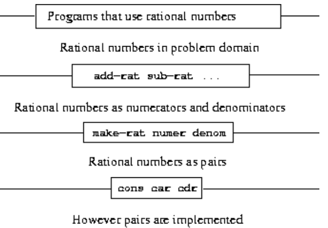

# Chapter 2 Building Abstractions with Data

we forget about what the symbols stand for. ... 

there are many operations which he may carry out with these symbols, **without ever having to look at the things they stand for.**


第一章总结：

- 如何使用**基本数据(数字)和基本操作(算术操作)**。
- 如何通过组合、条件和参数的使用将过程组合成**复合过程**。
- 如何使用define对过程进行抽象。
- 一个过程可以被看作是一个过程局部演化的模式。
- 高阶过程增强了我们语言的能力，使我们能够操纵，从而能够根据一般的计算方法进行推理。


第一章：

通过**组合过程**形成**复合过程**构建抽象

第二章：

通过**组合数据**对象形成**复合数据**来构建抽象

构造复合数据对象的能力使我们能够在比语言的**基本数据对象更高的概念级别上处理数据**

提高可操作的抽象层级就是数据抽象需要做的事情。


举例：

有理数，一个有理数可以被认为是**两个整数，一个分子和一个分母**。

如果我们能把分子和分母**“粘在一起”形成一对**。

当作一个复合数据对象，那就好处理了。


**什么是数据抽象？**

将处理**如何表示数据对象**的程序部分与处理**如何使用数据对象**的程序部分**分离开**来的一般技术是一种强大的设计方法，称为数据抽象。

The general technique of isolating the parts of a program that deal with **how data objects are represented from the parts of a program** that deal with **how data objects are used** is a powerful design methodology called data abstraction. 


线性组合的过程？

```lisp
(define (linear-combination a b x y) 
  (+ (* a x) (* b y)))
; ax + by
```

如果我们不关系 a b x y到底是什么类型的数字，那么我们可以写成：

```lisp
(define (linear-combination a b x y)     
  (add (mul a x) (mul b y))) 
```

rational numbers, complex numbers, polynomials, or whatever

有理数，复数，多项式等

**数据抽象能够在程序的不同部分之间建立适当的抽象屏障。**

Data abstraction enables us to erect suitable abstraction barriers between different parts of a program.


形成复合数据的关键是编程语言应该提供某种“粘合剂”，

以便可以将数据对象组合成更复杂的数据对象。

**只使用过程来形成复合数据，这将进一步模糊“过程”和“数据”之间的区别。**


就像一个给定的数值函数可以通过许多不同的计算过程来计算一样，

一个给定的数据结构可以用许多方法来表示，用更简单的对象来表示，而表示的选择会对操作数据的过程的时间和空间要求产生重大影响。

- **某种功能的过程**有多种表示形式
- **某种功能的数据结构**有多找方式表示

不同的表示方法在计算的时间和空间上都会有所不同。


## 2.1 Introduction to Data Abstraction


更复杂的过程时用作元素的过程不仅可以被视为**特定操作的集合**，

还可以被视为**过程抽象**。

我们可以进行一个**抽象**，将过程的使用方式与过程的实现细节(更原始的过程)分开。


复合数据 也是通过过程抽象构造出来的，所以实现了

将**复合数据对象的使用方式**与**从更原始的数据对象构造复合数据对象的细节**隔离开来


**如何使用**和**如何构造**的细节是分开的。


**选择器和构造器是关键**


###  2.1.1 Example: Arithmetic Operations for Rational Numbers

目标：

（1）支持有理数的算术

（2）加、减、乘、除、相等


过程的功能：

```lisp
(make-rat <n> <d>)
; 返回一个有理数，分子是 <n>，分母是 <d>
(numer <x>)
; 返回有理数 <x> 的分子
(denom <x>)
; 返回有理数 <x> 的分母
```

运算：
$$
\begin{aligned}
&\frac{n_{1}}{d_{1}}+\frac{n_{2}}{d_{2}}=\frac{n_{1}d_{2}+n_{2}d_{1}}{d_{1}d_{2}} \\
&\frac{n_{1}}{d_{1}}-\frac{n_{2}}{d_{2}}=\frac{n_{1}d_{2}-n_{2}d_{1}}{d_{1}d_{2}} \\
&\frac{n_{1}}{d_{1}}\cdot\frac{n_{2}}{d_{2}}=\frac{n_{1}n_{2}}{d_{1}d_{2}} \\
&\frac{n_{1}/d_{1}}{n_{2}/d_{2}}=\frac{n_{1}d_{2}}{d_{1}n_{2}} \\
&\frac{n_{1}}{d_{1}}=\frac{n_{2}}{d_{2}}\mathrm{~if~and~only~if~}n_{1}d_{2}=n_{2}d_{1}
\end{aligned}
$$
基础运算的过程表示：

```lisp
(define (add-rat x y)
  (make-rat (+ (* (numer x) (denom y))
               (* (numer y) (denom x)))
            (* (denom x) (denom y))))
(define (sub-rat x y)
  (make-rat (- (* (numer x) (denom y))
               (* (numer y) (denom x)))
            (* (denom x) (denom y))))
(define (mul-rat x y)
  (make-rat (* (numer x) (numer y))
            (* (denom x) (denom y))))
(define (div-rat x y)
  (make-rat (* (numer x) (denom y))
            (* (denom x) (numer y))))
(define (equal-rat? x y)
  (= (* (numer x) (denom y))
     (* (numer y) (denom x))))
```


#### Pairs

（1）使用 cons 给定两个数据对象，返回**一个复合数据对象**

（2）使用car 获取**第一个数据**

（3）使用cdr 获取**第二个数据**

```lisp
(define x (cons 1 2))
(car x)
; 1
(cdr x)
; 2
```

可以继续**复合构造**，即可以**组合构造**：

```lisp
(define x (cons 1 2))
(define y (cons 3 4))
(define z (cons x y))
(car (car z))
; 1
(car (cdr z))
; 3
```

这种**组合对**的能力意味着对可以用作通用的构建块来创建各种复杂的数据结构。

由对构造的数据对象称为**列表结构数据。**


#### Representing rational numbers

修改一下：

```lisp
(define (make-rat n d) (cons n d))
(define (numer x) (car x))
(define (denom x) (cdr x))
```

打印有理数：

```lisp
(define (print-rat x)
  (newline)
  (display (numer x))
  (display "/")
  (display (denom x)))
```

一些基本的应用：

```lisp
(define one-half (make-rat 1 2))
(print-rat one-half)
; 1/2
(define one-third (make-rat 1 3))
(print-rat (add-rat one-half one-third))
; 5/6
(print-rat (mul-rat one-half one-third))
; 1/6
(print-rat (add-rat one-third one-third))
; 6/9
```

分数的最简化可以用gcd求出分子和分母的最大公因数，然后分子分母同时除以这个gcd就可以了。

```lisp
(define (make-rat n d)
  (let ((g (gcd n d)))
    (cons (/ n g) (/ d g))))
(print-rat (add-rat one-third one-third))
; 2/3
```

在此强调，这里仅仅修改了构造函数，操作过程并没有改变。

### 2.1.2 Abstraction Barriers

数据抽象的基本思想是

- 为每种类型的数据对象确定**一组基本操作**，
- 然后在操作数据时**仅使用这些操作**。


水平线表示隔离系统不同**“层次”**的抽象障碍。

在每个级别上，屏障将**使用**数据抽象的程序(上面)与**实现数据抽象的程**序(下面)分开。

每个级别上的过程都是**定义抽象障碍并连接不同级别的接口**。



下面是具体实现，上面是使用这个实现。

越向上，越抽象。越向下，越具体。

At each level, the barrier separates the programs (above) that **use the data abstraction** from the programs (below) that **implement the data abstraction.**  

任何复杂的数据结构都可以用编程语言**提供的原始数据结构**以各种方式表示

有理数最简化的过程可以不放在 构造的时候，而是放在**访问**的时候。

```lisp
(define (make-rat n d)
  (cons n d))
(define (numer x)
  (let ((g (gcd (car x) (cdr x))))
    (/ (car x) g)))
(define (denom x)
  (let ((g (gcd (car x) (cdr x))))
    (/ (cdr x) g)))
```

有什么区别呢？

- 我们**多次访问**同一个有理数的分子和分母，那么最好在构造有理数时计算gcd。
- 如果没有，我们最好**等到访问时间再计算gcd**。

数据抽象方法为我们提供了一种**推迟决策**的方法，

而不会失去在系统其余部分取得进展的能力。


### 2.1.3 What Is Meant by Data?

make-rat、number 和 denom 需要满足什么条件。

 for any integer `n` and any non-zero integer `d`, **if `x` is (`make-rat n d`)**, then
$$
\frac{(\mathrm{numer~x})}{(\mathrm{denon~x})}=\frac{\mathrm{n}}{\mathrm{d}}
$$
数据是由一些选择器和构造器的集合定义的，

以及这些过程必须满足的指定条件，才能成为有效的数据表示。

**选择器 + 构造器 定义数据**


**如何严谨定义什么是数据？**

There are two approaches to giving such a formulation.  

（1）方法一

One, pioneered by C. A. R. Hoare (1972), is known as **the method of abstract models.**

抽象模型

一般来说，抽象模型根据先前定义的数据对象类型定义新的数据对象类型。因此，可以通过**将有关数据对象的断言简化为有关先前定义的数据对象的断言**来检查有关数据对象的断言。

In general, abstract models define new kinds of data objects in terms of previously defined types of data objects. Assertions about data objects can therefore **be checked by reducing them to assertions about previously defined data objects**.

（2）方法二

Another approach, introduced by Zilles at MIT, by Goguen, Thatcher, Wagner, and Wright at IBM (see Thatcher, Wagner, and Wright 1978), and by Guttag at Toronto (see Guttag 1977), is **called algebraic specification.** 

代数规范

它把过程看作一个抽象代数系统的元素，该系统的行为由与我们的条件相对应的公理来描述，**并使用抽象代数的技术来检查关于数据对象的断言**

It regards the "procedures" as elements of an abstract algebraic system whose behavior is specified by axioms that correspond to our "conditions,'' and uses the techniques of abstract algebra to check assertions about data objects.


"high-level" 的data objects是怎么得到的？

我们使用cons将两个对象粘合在一起，我们可以使用car和cdr检索对象。

cons、car和cdr满足这样的条件：

**对于任何对象x和y，如果z是(cons x y)，那么(car z)是x， (cdr z)是y**


cons、car和cdr的定义？

```lisp
(define (cons x y)
  (define (dispatch m)
    (cond ((= m 0) x)
          ((= m 1) y)
          (else (error "Argument not 0 or 1 -- CONS" m))))
  dispatch)
(define (car z) (z 0))
(define (cdr z) (z 1))
```

(cons x y)返回的值是一个过程，

如果给这个过程传递0，那么就返回x，传递1，就返回y。

```
(car (cons x y)) -> x
(cdr (cons x y)) -> y
```

但是数据的过程表示将在我们的编程中发挥核心作用。

从上面的cons、car和cdr的定义来看，数据是可以通过过程来表示的。


**cons、car、cdr的定义可能看上去比较奇怪，后续会继续学习这种表示方法，别急。**


