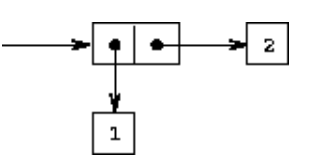
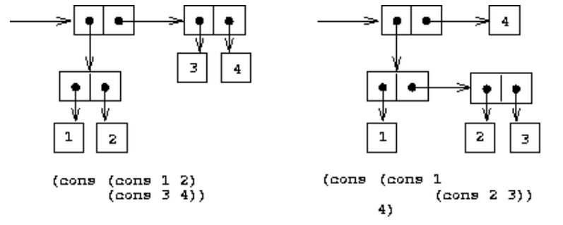
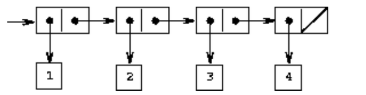

## 2.2 Hierarchical Data and the Closure Property


pair 可以用来构造复杂的数据。

可视化表示pair

```lisp
(cons 1 2)
```



**Box-and-pointer representation** of `(cons 1 2)`.

如果要将 1 2 3 4 绑在一起，要怎么做？

有两种方法。



cons 可以嵌套，即拥有闭包的特性。

an operation for combining data objects **satisfies the closure property** if the results of combining things with that operation can themselves **be combined using the same operation**

所以，cons可以创建层次结构。

在抽象代数中，如果对集合中的元素**应用该操作产生的元素再次成为集合中的元素**，则该元素集合在操作下被称为闭包。


即组合的元素本身可以是组合，这就是一种抽象代数里面的闭包。

在Fortran或Basic中，通常通过将数据元素组装成数组来组合数据元素，**但是不能形成元素本身就是数组的数组**

这要求程序员显式地操作指针，并遵守结构的每个字段**只能包含预先指定形式的元素的限制**

This limitation lies behind Alan Perlis's comment in his foreword to this book: 

"In Pascal the plethora of declarable data structures induces a specialization within functions that inhibits and penalizes casual cooperation.  

It is better to have 100 functions operate on one data structure than to have 10 functions operate on 10 data structures.''

用100个函数操作一个数据结构比用10个函数操作10个数据结构要好

### 2.2.1 Representing Sequences



数据对象的有序集合，即创建一个sequence。

an ordered collection of data objects

每一个pair的car是sequence中对应的 item，而 cdr是sequence中的**下一个pair**。

最后一个pair的cdr通过指向一个不同的值来表示序列的结束，该值**不是pair**，在框和指针图中表示为**对角线**，在程序中表示为变量**nil**的值。

```lisp
(cons 1
      (cons 2
            (cons 3
                  (cons 4 nil))))
```

这也被称为list

```lisp
; (list <a1> <a2> ... <an>)
; ->
; (cons <a1> (cons <a2> (cons ... (cons <an> nil) ...)))

(define one-through-four (list 1 2 3 4))
one-through-four
(1 2 3 4)
```

```lisp
(car one-through-four)
; 1
(cdr one-through-four)
; (2 3 4)
(cons 10 one-through-four)
; (10 1 2 3 4)
(cons 5 one-through-four)
; (5 1 2 3 4)
```

The word nil is a contraction of the Latin word nihil, which means "nothing.''

nil的值用于终止对链，可以认为是一个没有元素的序列，即空列表。

nil是一个普通的名称，将其用作值为列表结束标记的变量

(就像true是具有真值的普通变量一样)


#### List operations

过程list-ref接受一个列表和一个数字n作为参数，并返回列表的第n项。

习惯上**以0开头**对列表中的元素进行编号。

For n = 0, list-ref should return the car of the list.

Otherwise, **`list-ref` should return the (*n* - 1)st item of the `cdr` of the list**.

```lisp
(define (list-ref items n)
  (if (= n 0)
      (car items)
      (list-ref (cdr items) (- n 1))))
(define squares (list 1 4 9 16 25))
; 0 -> 1
; 1 -> 4 
; 2 -> 9
; 3 -> 16
; 4 -> 25
(list-ref squares 3)
; 16
```

得大 list 的长度？

```lisp
(define (length items)
  (if (null? items)
      0
      (+ 1 (length (cdr items)))))
(define odds (list 1 3 5 7))

(length odds)
; 4
; length 这个过程就是一个递归
```

Scheme includes a primitive predicate `null?`, 

**which tests whether its argument is the empty list**


如果使用迭代的方式描述 length？

```lisp
(define (length items)
  (define (length-iter a count)
    (if (null? a)
        count
        (length-iter (cdr a) (+ 1 count))))
  (length-iter items 0))
```

还需要实现一个 添加append的过程？

即将一个list拼接在另一个list的后面。

```lisp
(append squares odds)
; (1 4 9 16 25 1 3 5 7)

(append odds squares)
; (1 3 5 7 1 4 9 16 25)
```

递归过程描述入下：

```lisp
(define (append list1 list2)
  (if (null? list1)
      list2
      (cons (car list1) (append (cdr list1) list2))))
```


记住，list 是scheme自带的！


