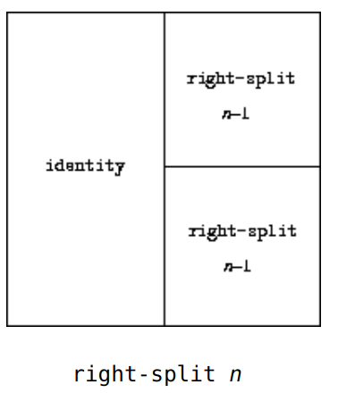
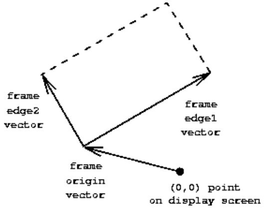

## 2.2 Hierarchical Data and the Closure Property


pair 可以用来构造复杂的数据。

可视化表示pair

```lisp
(cons 1 2)
```


**Box-and-pointer representation** of `(cons 1 2)`.

如果要将 1 2 3 4 绑在一起，要怎么做？

有两种方法。


cons 可以嵌套，即拥有闭包的特性。

an operation for combining data objects **satisfies the closure property** if the results of combining things with that operation can themselves **be combined using the same operation**

所以，cons可以创建层次结构。

在抽象代数中，如果对集合中的元素**应用该操作产生的元素再次成为集合中的元素**，则该元素集合在操作下被称为闭包。


即组合的元素本身可以是组合，这就是一种抽象代数里面的闭包。

在Fortran或Basic中，通常通过将数据元素组装成数组来组合数据元素，**但是不能形成元素本身就是数组的数组**

这要求程序员显式地操作指针，并遵守结构的每个字段**只能包含预先指定形式的元素的限制**

This limitation lies behind Alan Perlis's comment in his foreword to this book: 

"In Pascal the plethora of declarable data structures induces a specialization within functions that inhibits and penalizes casual cooperation.  

It is better to have 100 functions operate on one data structure than to have 10 functions operate on 10 data structures.''

用100个函数操作一个数据结构比用10个函数操作10个数据结构要好

### 2.2.1 Representing Sequences


数据对象的有序集合，即创建一个sequence。

an ordered collection of data objects

每一个pair的car是sequence中对应的 item，而 cdr是sequence中的**下一个pair**。

最后一个pair的cdr通过指向一个不同的值来表示序列的结束，该值**不是pair**，在框和指针图中表示为**对角线**，在程序中表示为变量**nil**的值。

```lisp
(cons 1
      (cons 2
            (cons 3
                  (cons 4 nil))))
```

这也被称为list

```lisp
; (list <a1> <a2> ... <an>)
; ->
; (cons <a1> (cons <a2> (cons ... (cons <an> nil) ...)))

(define one-through-four (list 1 2 3 4))
one-through-four
(1 2 3 4)
```

```lisp
(car one-through-four)
; 1
(cdr one-through-four)
; (2 3 4)
(cons 10 one-through-four)
; (10 1 2 3 4)
(cons 5 one-through-four)
; (5 1 2 3 4)
```

The word nil is a contraction of the Latin word nihil, which means "nothing.''

nil的值用于终止对链，可以认为是一个没有元素的序列，即空列表。

nil是一个普通的名称，将其用作值为列表结束标记的变量

(就像true是具有真值的普通变量一样)


#### List operations

过程list-ref接受一个列表和一个数字n作为参数，并返回列表的第n项。

习惯上**以0开头**对列表中的元素进行编号。

For n = 0, list-ref should return the car of the list.

Otherwise, **`list-ref` should return the (*n* - 1)st item of the `cdr` of the list**.

```lisp
(define (list-ref items n)
  (if (= n 0)
      (car items)
      (list-ref (cdr items) (- n 1))))
(define squares (list 1 4 9 16 25))
; 0 -> 1
; 1 -> 4 
; 2 -> 9
; 3 -> 16
; 4 -> 25
(list-ref squares 3)
; 16
```

得大 list 的长度？

```lisp
(define (length items)
  (if (null? items)
      0
      (+ 1 (length (cdr items)))))
(define odds (list 1 3 5 7))

(length odds)
; 4
; length 这个过程就是一个递归
```

Scheme includes a primitive predicate `null?`, 

**which tests whether its argument is the empty list**


如果使用迭代的方式描述 length？

```lisp
(define (length items)
  (define (length-iter a count)
    (if (null? a)
        count
        (length-iter (cdr a) (+ 1 count))))
  (length-iter items 0))
```

还需要实现一个 添加append的过程？

即将一个list拼接在另一个list的后面。

```lisp
(append squares odds)
; (1 4 9 16 25 1 3 5 7)

(append odds squares)
; (1 3 5 7 1 4 9 16 25)
```

递归过程描述入下：

```lisp
(define (append list1 list2)
  (if (null? list1)
      list2
      (cons (car list1) (append (cdr list1) list2))))
```


记住，list 是scheme自带的！


#### Mapping over lists

One extremely useful operation is to **apply some transformation to each element in a list and generate the list of results.**  


对list的每个元素进行缩放

```lisp
(define (scale-list items factor)
  (if (null? items)
      nil
      (cons (* (car items) factor)
            (scale-list (cdr items) factor))))
(scale-list (list 1 2 3 4 5) 10)
(10 20 30 40 50)
```

可以使用高阶过程对map的思想进行进一步抽象。

这里的高阶过程称为map。

```lisp
(define (map proc items)
  (if (null? items)
      nil
      (cons (proc (car items))
            (map proc (cdr items)))))
(map abs (list -10 2.5 -11.6 17))
; (10 2.5 11.6 17)
(map (lambda (x) (* x x))
     (list 1 2 3 4))
; (1 4 9 16)
```

使用map实现scale-list

```lisp
define (scale-list items factor)
  (map (lambda (x) (* x factor))
       items))
```

scheme 的标准提供了一个**更加强大，更加通用的map**：

```lisp
(map + (list 1 2 3) (list 40 50 60) (list 700 800 900))
; (741 852 963)

(map (lambda (x y) (+ x (* 2 y)))
     (list 1 2 3)
     (list 4 5 6))
; (9 12 15)
```

This more general map takes **a procedure of *n* arguments**, **together with *n* lists**, and applies the procedure to all the **first** elements of the lists, all the **second** elements of the lists, **and so on**, **returning a list of the results**

（1）一个n个参数的过程

（2）n个list

map有助于建立一个抽象屏障，**将转换列表的过程的实现**与**如何提取和组合列表元素的细节**隔离开来

**我们只需要关心list中的每个元素如何改变，不关心如何获取每个元素。**


### 2.2.2 Hierarchical Structures

构造 ((1 2) 3 4)

```lisp
(cons (list 1 2) (list 3 4))
```


树型结构的表示：


递归是处理树形结构的天然工具，因为我们经常可以将树上的操作简化为对其分支的操作，这些分支又简化为对分支的分支的操作，以此类推，直到我们到达树的叶子。

Recursion is a **natural tool for dealing with tree structures**, since we can often reduce operations on trees to operations on their branches, which reduce in turn to operations on the branches of the branches, and so on, **until we reach the leaves of the tree.**

```lisp
(define x (cons (list 1 2) (list 3 4)))

(length x)
; 3
(count-leaves x)
; 4

(list x x)
(((1 2) 3 4) ((1 2) 3 4))

(length (list x x))
; 2
(count-leaves (list x x))
; 8
```

上面代码比较了length 和 count-leaves 的不同

计算 length 的方法：

```
(1) Length of a list x is 1 plus length of the cdr of x.
(2) Length of the empty list is 0.
```

计算 count-leaves 的方法：

```
(1) Count-leaves of a tree x is count-leaves of the car of x plus count-leaves of the cdr of x. 
(2) Count-leaves of the empty list is 0.
(3) Count-leaves of a leaf is 1.
```

Scheme provides the primitive predicate `pair?`, **which tests whether its argument is a pair.** 

```lisp
(define (count-leaves x)
  (cond ((null? x) 0)  
        ((not (pair? x)) 1)
        (else (+ (count-leaves (car x))
                 (count-leaves (cdr x))))))
```

**(x nil) 的pair? 就返回 0，即只要cdr 返回的是nil，那么pair? 就返回 $f**


#### Mapping over trees

之前已经介绍过了如何对一个list进行map，下面就是如何对一个用list实现的tree进行map

首先是给出 对树的每个叶子结点进行scale的过程。

```lisp
(define (scale-tree tree factor)
  (cond ((null? tree) nil)
        ((not (pair? tree)) (* tree factor))
        (else (cons (scale-tree (car tree) factor)
                    (scale-tree (cdr tree) factor)))))
(scale-tree (list 1 (list 2 (list 3 4) 5) (list 6 7))
            10)
; (10 (20 (30 40) 50) (60 70))
```

- 我们映射序列，依次缩放每个子树，并返回结果列表。
- 在基本情况下，树是一片叶子，我们只需乘以这个因子。

第二种写法：

```lisp
(define (scale-tree tree factor)
  (map (lambda (sub-tree)
         (if (pair? sub-tree)
             (scale-tree sub-tree factor)
             (* sub-tree factor)))
       tree))
```

Many tree operations can be implemented 

**by similar combinations of sequence operations and recursion.**

**树的许多问题可以用 序列操作和递归实现。**


### 2.2.3 Sequences as Conventional Interfaces

数据抽象允许我们设计程序而不陷入数据表示的细节。

下面介绍 **the use of conventional interfaces**

首先是   the sum of the squares of the **leaves that are odd**

```lisp
(define (sum-odd-squares tree)
  (cond ((null? tree) 0)  
        ((not (pair? tree))
         (if (odd? tree) (square tree) 0))
        (else (+ (sum-odd-squares (car tree))
                 (sum-odd-squares (cdr tree))))))
```

树型结构的叶结点求和，只不只对奇数的那些叶子结点求和


然后是  a list of all the **even** Fibonacci numbers Fib(k), 

where k is less than or equal to a given integer n

Fib 数列，只保留 偶数

```lisp
(define (even-fibs n)
  (define (next k)
    (if (> k n)
        nil
        (let ((f (fib k)))
          (if (even? f)
              (cons f (next (+ k 1)))
              (next (+ k 1))))))
  (next 0))
```


这两个程序是有共同之处的。

（1）

**enumerates** the leaves of a tree; 枚举

**filters them, selecting the odd ones;** 过滤

squares each of the selected ones;  运算

**accumulates** the results using +, starting with 0. 累积


（2）
**enumerates** the integers from 0 to *n*; 枚举

**computes** the Fibonacci number for each integer; 运算

**filters** them, selecting the even ones; and 过滤

**accumulates** the results using `cons`, starting with the empty list. 累积


Our two procedures decompose the computations in a different way, spreading the **enumeration** over the program and mingling it with the **map**, the **filter**, and the **accumulation**.  


#### Sequence Operations

**（1）map，已经介绍过了** 

```lisp
(map square (list 1 2 3 4 5))
; (1 4 9 16 25)
```


**（2）filter**

```lisp
(define (filter predicate sequence)
  (cond ((null? sequence) nil)
        ((predicate (car sequence))
         (cons (car sequence)
               (filter predicate (cdr sequence))))
        (else (filter predicate (cdr sequence)))))
(filter odd? (list 1 2 3 4 5))
(; 1 3 5)
```


**（3）accumulation**

积累

```lisp
(define (accumulate op initial sequence)
  (if (null? sequence)
      initial
      (op (car sequence)
          (accumulate op initial (cdr sequence)))))
(accumulate + 0 (list 1 2 3 4 5))
; 15
(accumulate * 1 (list 1 2 3 4 5))
; 120
(accumulate cons nil (list 1 2 3 4 5))
; (1 2 3 4 5)
```


**（4）enumerate**

generate the sequence of integers in a given range

```lisp
(define (enumerate-interval low high)
  (if (> low high)
      nil
      (cons low (enumerate-interval (+ low 1) high))))
; (enumerate-interval 2 7)
; (2 3 4 5 6 7)
```


枚举一颗树的所有叶结点：

```lisp
(define (enumerate-tree tree)
  (cond ((null? tree) nil)
        ((not (pair? tree)) (list tree))
        (else (append (enumerate-tree (car tree))
                      (enumerate-tree (cdr tree))))))
(enumerate-tree (list 1 (list 2 (list 3 4)) 5))
; (1 2 3 4 5)
```


**重写 sum-odd-squaresfringe**

所有奇数的平方和

```lisp
(define (sum-odd-squares tree)
  (accumulate +
              0
              (map square
                   (filter odd?
                           (enumerate-tree tree)))))
```


**重写 even-fibs**

偶数fib数

```lisp
(define (even-fibs n)
  (accumulate cons
              nil
              (filter even?
                      (map fib
                           (enumerate-interval 0 n)))))
```

**优雅，太优雅了**

this helps us make program designs that are modular

**这有助于我们进行模块化的程序设计**

Modular construction is a powerful strategy for controlling **complexity in engineering design.**  

信号处理应用中，设计人员通常通过从标准化**的滤波器**和**换能器**系列中选择级联元件来构建系统

filters and transducers


**构建 Fib 数列的平方序列**

```lisp
(define (list-fib-squares n)
  (accumulate cons
              nil
              (map square
                   (map fib
                        (enumerate-interval 0 n)))))
(list-fib-squares 10)
; (0 1 1 4 9 25 64 169 441 1156 3025)
```

**奇数平方的乘积**

```lisp
(define (product-of-squares-of-odd-elements sequence)
  (accumulate *
              1
              (map square
                   (filter odd? sequence))))

(product-of-squares-of-odd-elements (list 1 2 3 4 5))
; 225
```

**不断重复使用某些过程，实现了高效的模块化**


**如果我们想得到 薪水最高的程序员的薪水，可以这么写：**

```lisp
(define (salary-of-highest-paid-programmer records)
  (accumulate max
              0
              (map salary
                   (filter programmer? records))))
```

太强大了！


Richard Waters (1979) developed a program that automatically analyzes **traditional Fortran programs**, 

viewing them in terms of **maps, filters, and accumulations.**  

He found that **fully 90 percent of the code** in the Fortran Scientific Subroutine Package fits neatly into this paradigm


Lisp作为一种编程语言取得成功的原因之一是，

列表提供了一种表达有序集合的**标准媒介**，

以便**可以使用高阶操作对它们进行操作**


**目前我们用到的都是有限序列，在3.5 会进一步介绍无限序列。**


#### Nested Mappings


This approach to nested mappings was shown to us by David Turner, **whose languages KRC and Miranda provide elegant formalisms for dealing with these constructs**.  

给定一个正整数n，找出所有不同的正整数i和j的有序对，

其中1<= j< i<= n，使得**i + j是素数**。

如果n = 6，则pairs如下:
$$
\begin{array}{c|ccccccc}{i}&{2}&{3}&{4}&{4}&{5}&{6}&{6}\\{j}&{1}&{2}&{1}&{3}&{2}&{1}&{5}\\\hline{i+j}&{3}&{5}&{5}&{7}&{7}&{7}&{11}\\\end{array}
$$
一般的做法是：

（1）生成所有的满足 1<=j<i<=n 的有序对

（2）筛选所有和为素数的对

（3）过滤每个对，生成三元组(i, j , i+j)


```lisp
(accumulate append
            nil
            (map (lambda (i)
                         (map (lambda (j) (list i j))
                              (enumerate-interval 1 (- i 1))))
                 (enumerate-interval 1 n)))
```

先枚举 i，也就是外层的map，然后枚举 j，也就是内层的map，

最后将构造的(list i j) 进行append，就得到了最后的结果。


将map 和 append的组合进行拼接，可以得到：

```lisp
(define (flatmap proc seq)
  (accumulate append nil (map proc seq)))
```

然后就是过滤出 i + j 是素数的 那些 list pair：

```lisp
(define (prime-sum? pair)
  (prime? (+ (car pair) (cadr pair))))
(define (make-pair-sum pair)
  (list (car pair) (cadr pair) (+ (car pair) (cadr pair))))
```


最终的答案：

```lisp
(define (prime-sum-pairs n)
    (map make-pair-sum
         (filter prime-sum?
                 (flatmap
                  (lambda (i)
                          (map (lambda (j) (list i j))
                               (enumerate-interval 1 (- i 1))))
                  (enumerate-interval 1 n)))))
```

真的奇妙。


再举一个例子：

**生成集合的全排列。**

假设我们希望生成集合S的所有排列，也就是集合中所有元素排序的方法。

例如，

{1，2，3}，{1，2，3}，{1，3，2}，{2，1，3}，{2，3，1}，{3，1 ，2}，{3，2，1}

For each item *x* in *S*, recursively generate the sequence of permutations of *S* - *x*, 

The set *S* - *x* is the set of all elements of *S*, excluding *x*

and adjoin *x* to the front of each one.

This yields, for each *x* in *S*, the sequence of permutations of *S* that begin with *x*. 

Combining these sequences for all *x* gives all the permutations of *S*.

```lisp
(define (permutations s)
  (if (null? s)                    ; empty set?
      (list nil)                   ; sequence containing empty set
      (flatmap (lambda (x)
                 (map (lambda (p) (cons x p))
                      (permutations (remove x s))))
               s)))

(define (remove item sequence)
  (filter (lambda (x) (not (= x item)))
          sequence))
```

要生成 集合 S 的全排列，首先是弄出S - x 的全排列序列，然后用map 对每个全排列进行操作，即

将 x 添加到 每个全排列list中，最后就是将这些全排列的list进行拼接。

remove 可以用一个简单的filter来实现。


**很神奇，这个表达式。。**

### 2.2.4 Example: A Picture Language


简单的绘图语言

The picture language is based on the language **Peter Henderson** created to construct images like M.C. Escher's **"Square Limit'' woodcut (see Henderson 1982)**.


#### The picture language

语言的原语、组合方式和抽象

画家绘制一幅图像，该图像被移动和缩放以适应指定的平行四边形框架。

有一个我们称之为**wave**的原始绘制器，它可以绘制粗糙的线条。


用虚线表示的框架不是图像的一部分。


威廉·巴顿·罗杰斯，麻省理工学院的创始人和第一任校长的图像。


wave4 这个过程基于两个阶段的wave：

```lisp
(define wave2 (beside wave (flip-vert wave)))
(define wave4 (below wave2 wave2))
```


The `beside` or `below` of two painters is itself a painter; 

**therefore, we can use it as an element in making more complex painters.**


wave4 的过程可以描述为：

```lisp
(define (flipped-pairs painter)
  (let ((painter2 (beside painter (flip-vert painter))))
    (below painter2 painter2)))
```

使用过程flipped-paris定义一个数据：

```lisp
(define wave4 (flipped-pairs wave))
```

**这个时候我就惊奇的发现过程和数据居然真的就是一个东西。。。**


接下来，定义一个递归的过程：

向右分裂：

```lisp
(define (right-split painter n)
  (if (= n 0)
      painter
      (let ((smaller (right-split painter (- n 1))))
        (beside painter (below smaller smaller)))))
```



向角落分裂：

```lisp
(define (corner-split painter n)
  (if (= n 0)
      painter
      (let ((up (up-split painter (- n 1)))
            (right (right-split painter (- n 1))))
        (let ((top-left (beside up up))
              (bottom-right (below right right))
              (corner (corner-split painter (- n 1))))
          (beside (below painter top-left)
                  (below bottom-right corner))))))
```


先用up-split定义上半部分，用right-split定义右半部分

用up 定义top-left，用right 定义bottom-right

corner-split继续递归定义corner

然后就是这个：

```lisp
(beside (below painter top-left)
        (below bottom-right corner))
```

使用beside和below描述了四个部分的位置。


**有点神奇。**


最后我们就得到了 square-limit

```lisp
(define (square-limit painter n)
  (let ((quarter (corner-split painter n)))
    (let ((half (beside (flip-horiz quarter) quarter)))
      (below (flip-vert half) half))))
```


- 先用corner-split得到四分之一的部分，quarter

- 然后利用beside和flip-horiz 得到 上一半，flip-horiz表示水平翻转，即将右上角向左翻，

- 最后就是将half进行垂直方向的翻转后放到half的下面。


#### Higher-order operations

可以将绘制操作视为要操作的元素，并且可以为这些元素编写组合方法。

即传入过程的参数是一个过程。

**将绘制操作作为参数并创建新绘制操作的过程**


flipped-pairs and square-limit each arrange **four** copies of 

**a painter's image in a square pattern**

抽象 flipped-pairs 和 square-limit 的过程。

`tl`, `tr`, `bl`, and `br` are the **transformations** to apply to 

- the top left copy
- the top right copy
- the bottom left copy
- the bottom right copy

```lisp
(define (square-of-four tl tr bl br)
  (lambda (painter)
    (let ((top (beside (tl painter) (tr painter)))
          (bottom (beside (bl painter) (br painter))))
      (below bottom top))))
```

使用square-of-four 定义 flipped-pairs 和 square-limit

```lisp
(define (flipped-pairs painter)
  (let ((combine4 (square-of-four identity flip-vert
                                  identity flip-vert)))
    (combine4 painter)))

(define flipped-pairs
  (square-of-four identity flip-vert identity flip-vert))
```

```lisp
(define (square-limit painter n)
    (let ((combine4 (square-of-four flip-horiz identity
                                    rotate180 flip-vert)))
         (combine4 (corner-split painter n))))
```

rotate180 就是旋转 180 度，

```lisp
(compose flip-vert flip-horiz)
```

compose 应该就是过程的复合。

```lisp
(define (compose f g)
  (lambda (x) (f (g x)))
)
```


#### Frames

一个坐标系可以用三个向量表示

an origin **vector** and two edge **vectors**

所以frame是一个描述平面上的任意位置的坐标系



```lisp
make-frame 
```

接收三个向量，返回一个frame

**origin-frame, edge1-frame, and edge2-frame**

We will use **coordinates** in the unit square $(0\leq x,y\leq1)$ to specify images.

unit square 就是单位矩阵


The map transforms the unit square into the frame 

by mapping the vector v = (x, y) to the vector sum
$$
\mathrm{Origin}(\mathrm{Frame})+\mathbf{x}\cdot\mathrm{Edge}_{1}(\mathrm{Frame})+y\cdot\mathrm{Edge}_{2}(\mathrm{Frame})
$$
(0,0)映射到帧的原点，

(1,1)映射到与原点对角线相对的顶点，

(0.5,0.5)映射到帧的中心。

Origin(Frame) 就是参数是Frame，返回其对应的Origin

Edge1(Frame) 就是参数是Frame，返回其对应的Edge1

Edge2(Frame) 就是参数是Frame，返回其对应的Edge2

```lisp
(define (frame-coord-map frame)
  (lambda (v)
    (add-vect
     (origin-frame frame)
     (add-vect (scale-vect (xcor-vect v)
                           (edge1-frame frame))
               (scale-vect (ycor-vect v)
                           (edge2-frame frame))))))
```

given a vector, returns a vector

If the argument vector is in the unit square, the result vector will be in the frame.

```lisp
((frame-coord-map a-frame) (make-vect 0 0))

; (origin-frame a-frame)
```

frame-corrd-map 的作用就是传递一个坐标系frame，然后传递一个frame这个坐标系中的一个向量坐标，最后返回这个向量在实际坐标系中的坐标。


#### Painters

given a frame as argument, draws a particular image **shifted and scaled to fit the frame**.  

Then we can create painters for line drawings,

suppose we have a procedure `draw-line` that draws a line on the screen between two specified points.

```lisp
(define (segments->painter segment-list)
  (lambda (frame)
    (for-each
     (lambda (segment)
       (draw-line
        ((frame-coord-map frame) (start-segment segment))
        ((frame-coord-map frame) (end-segment segment))))
     segment-list)))
```

遍历segment-list中的所有segment，然后用draw-line绘制segment，通过start-segment和end-segment来获取segment的起点和终点。


draw-line ？？？


####  Transforming and combining painters

flip-vert doesn't have to know how a painter works in order to flip it -- it just has to know how to turn a frame upside down: 

The flipped painter just uses the original painter, but in the inverted frame.

transform-painter 的描述入下：

which takes as arguments a painter and information on **how to transform a frame** and produces **a new painter**

```lisp
(define (transform-painter painter origin corner1 corner2)
  (lambda (frame)
    (let ((m (frame-coord-map frame)))
      (let ((new-origin (m origin)))
        (painter
         (make-frame new-origin
                     (sub-vect (m corner1) new-origin)
                     (sub-vect (m corner2) new-origin)))))))
```

When mapped into the frame, the first point specifies the new frame's origin and the other two specify the ends of its edge vectors. **Thus, arguments within the unit square specify a frame contained within the original frame.**

frame-coord-map 就是一个得到绝对坐标的转换过程。


**（1）垂直翻转**

flip-vert 

```lisp
(define (flip-vert painter)
  (transform-painter painter
                     (make-vect 0.0 1.0)   ; new origin
                     (make-vect 1.0 1.0)   ; new end of edge1
                     (make-vect 0.0 0.0))) ; new end of edge2
```


（2）

**shrink-to-upper-right**

缩放到右上角

```lisp
(define (shrink-to-upper-right painter)
  (transform-painter painter
                     (make-vect 0.5 0.5)
                     (make-vect 1.0 0.5)
                     (make-vect 0.5 1.0)))
```


**（3）旋转90度**

**rotate90**

```lisp
(define (rotate90 painter)
  (transform-painter painter
                     (make-vect 1.0 0.0)
                     (make-vect 1.0 1.0)
                     (make-vect 0.0 0.0)))
```


**（4）将图像压向frame的中心**

```lisp
(define (squash-inwards painter)
  (transform-painter painter
                     (make-vect 0.0 0.0)
                     (make-vect 0.65 0.35)
                     (make-vect 0.35 0.65)))
```


**（5）beside**

```lisp
(define (beside painter1 painter2)
  (let ((split-point (make-vect 0.5 0.0)))
    (let ((paint-left
           (transform-painter painter1
                              (make-vect 0.0 0.0)
                              split-point
                              (make-vect 0.0 1.0)))
          (paint-right
           (transform-painter painter2
                              split-point
                              (make-vect 1.0 0.0)
                              (make-vect 0.5 1.0))))
      (lambda (frame)
        (paint-left frame)
        (paint-right frame)))))
```

The beside procedure **need not know anything about the details of the component painters** other than that each painter will **draw something in its designated frame.**


#### Levels of language for robust design

数据抽象可以通过过程实现

过程的组合有闭包性

使用分层设计的方法实现程序设计

（1）电阻 + 晶体管 

（2）与门、非门、或门

（3）处理器、总线、存储

（4）计算机

（5）分布式系统

图像语言：

（1）segment-painter，绘制线段列表中的所有线段

（2）beside、below 等操作原语

（3）square-of-four

**分层设计可以让程序更加robust**

We could work at the **lowest** level to change **the detailed appearance of the wave element.**

We could work at the **middle** level to change the way **corner-split replicates the wave.**

We could work at the **highest** level to change how square-limit **arranges the four copies of the corner.** 


