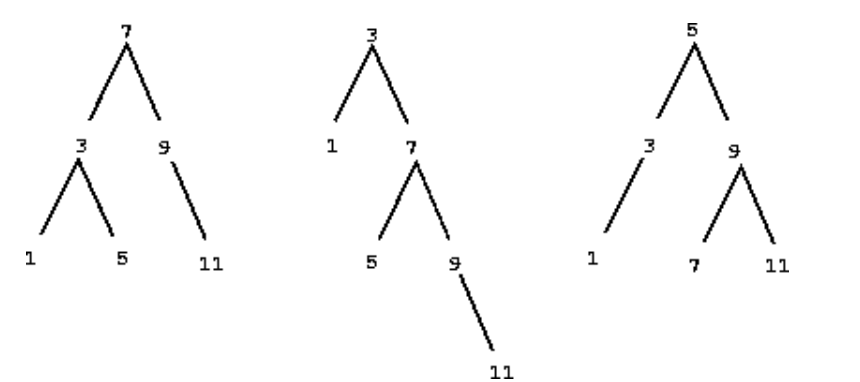
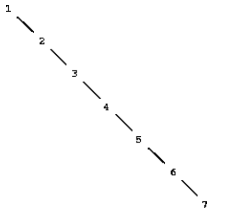

## 2.3 Symbolic Data

扩展语言的表示能力：

数据不仅仅通过数字来构造。

### 2.3.1 Quotation

使用symbols 作为复合数据

```lisp
(a b c d)
(23 45 17)
((Norah 12) (Molly 9) (Anna 7) (Lauren 6) (Charlotte 4))
(* (+ 23 45) (+ x 9))
(define (fact n) (if (= n 1) 1 (* n (fact (- n 1)))))
```

Allowing quotation in a language wreaks havoc with the ability to reason about the language in simple terms, because it destroys the notion that equals can be substituted for equals

如何区分symbol 和 数据本身？

```lisp
(define a 1)
(define b 2)
(list a b)
;(1 2)
(list 'a 'b)
;(a b)
(list 'a b)
;(a 2)
```

使用单引号

单引号可用于表示列表或符号，而双引号仅用于字符串。

Whereas the single quote can be used to denote lists or symbols, 

the double quote is used only with character strings. 

```lisp
(car '(a b c))
; a
(cdr '(a b c))
; (b c)
```

```
nil 就是 '()
```

检测 


symbol 是否相同？

```
eq?
```

使用eq? 实现 memq

```lisp
(define (memq item x)
  (cond ((null? x) false)
        ((eq? item (car x)) x)
        (else (memq item (cdr x)))))

(memq 'apple '(pear banana prune))
; false
(memq 'apple '(x (apple sauce) y apple pear))
; (apple pear)
```

This takes two arguments, a symbol and a list.

If the symbol is not contained in the list (i.e., is not `eq?` to any item in the list), then `memq` **returns false.** 

Otherwise, it returns the sublist of the list beginning **with the first occurrence of the symbol.**

### 2.3.2 Example: Symbolic Differentiation

对代数表达式进行符号微分？

这个过程将**一个代数表达式**和**一个变量**作为参数，并返回**表达式对变量的导数。**

如果过程的参数为$ax^2+bx+$ $c$和$x$，则过程应返回$2ax+b$


#### The differentiation program with abstract data

考虑一个非常简单的符号微分程序。

处理仅使用**带有两个参数的加法和乘法操作构建的**表达式。
$$
\frac {dc}{dx}= 0
\\
\frac{d\mathbf{x}}{d\mathbf{x}}=1
\\
\frac{d(u+v)}{dx}=\frac{du}{dx}+\frac{dv}{dx}
\\
\frac{d(uv)}{dx}=u\left(\frac{dv}{dx}\right)+v\left(\frac{du}{dx}\right)
$$
任何函数的导数都可以进行递归计算。

到最后，要么是常数，要么是变量x，导数要么是0，要么是1。

加设我们已经实现了下面的selectors、constructors和predicates。

```lisp
(variable? e)	
; Is e a variable?
(same-variable? v1 v2)	
; Are v1 and v2 the same variable?
(sum? e) 
; Is e a sum?
(addend e)	
; Addend of the sum e.
(augend e)	
; Augend of the sum e.
(make-sum a1 a2)	
; Construct the sum of a1 and a2.
(product? e)
; Is e a product?
(multiplier e)	
; Multiplier of the product e.
(multiplicand e)	
; Multiplicand of the product e.
(make-product m1 m2)	
; Construct the product of m1 and m2.
```

使用上面的过程就可以实现表达式的符号微分：

```lisp
(define (deriv exp var)
  (cond ((number? exp) 0); 常数，返回0
        ((variable? exp); 变量, 如果exp和var是相同的变量，返回1，否则，返回0
         (if (same-variable? exp var) 1 0))
        ((sum? exp); 如果表达式是求和表达式？
         (make-sum (deriv (addend exp) var); 加数
                   (deriv (augend exp) var))); 被加数
        ((product? exp); 如果表达式是求积表达式？
         (make-sum
           (make-product (multiplier exp); 乘数
                         (deriv (multiplicand exp) var)); 被乘数求导
           (make-product (deriv (multiplier exp) var); 乘法求导
                         (multiplicand exp)))); 被乘数
        (else
         (error "unknown expression type -- DERIV" exp))))
```


#### Representing algebraic expressions

下面我们将实现上面的selectors、constructors和predicates

我们将 ax + b 这个符号表达式写成前缀表达式：

```
(+ (* a x) b)
```

**（1）variable?**

```lisp
; The variables are symbols. 
(define (variable? x) (symbol? x))
```

**（2）same-variable?**

```lisp
; use eq?
(define (same-variable? v1 v2)
  (and (variable? v1) (variable? v2) (eq? v1 v2)))
```

**（3）sum and product**

```lisp
(define (make-sum a1 a2) (list '+ a1 a2))
(define (make-product m1 m2) (list '* m1 m2))
```

**（4）sum 表达式？**

```lisp
(define (sum? x)
  (and (pair? x) (eq? (car x) '+)))
; x 是一个list，且 x 的第一个symbol 是 +
```

**（5）加数和被加数**

addend 和 augend

```lisp
(define (addend s) (cadr s))
; the second item of the sum list
(define (augend s) (caddr s))
; the third item of the sum list
```

**（6）product 表达式？**

```lisp
(define (product? x)
  (and (pair? x) (eq? (car x) '*)))
; x 是一个list，且 x 的第一个symbol 是 *
```

**（7）乘数和被乘数**

multiplier 和 multiplicand 

```lisp
(define (multiplier p) (cadr p))
; the second item of the product list
(define (multiplicand p) (caddr p))
; the third item of the product list
```


```lisp
(deriv '(+ x 3) 'x)
; (+ 1 0)
(deriv '(* x y) 'x)
; (+ (* x 0) (* 1 y))
(deriv '(* (* x y) (+ x 3)) 'x)
;(+ (* (* x y) (+ 1 0))
;   (* (+ (* x 0) (* 1 y))
;      (+  x 3)))
```

$$
\frac{d(xy)}{dx}=x\cdot0+1\cdot y
$$

结果是对的，但是**没有化简**


在这里，我们只需要修改 make-sum 即可：

- 如果两个求和都是数字，则make-sum将它们相加并返回它们的和。
- 如果其中一个求和为0，则make-sum将返回另一个求和。

```lisp
(define (make-sum a1 a2)
  (cond ((=number? a1 0) a2)
        ((=number? a2 0) a1)
        ((and (number? a1) (number? a2)) (+ a1 a2))
        (else (list '+ a1 a2))))
```

=number? 就是检查表达式是否是给定的某个数字 num

```lisp
(define (=number? exp num)
  (and (number? exp) (= exp num)))
```

还有，就是修改 make-product 即可：

- 0乘以任何东西都是0
- 1乘以任何东西就是东西本身

```lisp
(define (make-product m1 m2)
  (cond ((or (=number? m1 0) (=number? m2 0)) 0)
        ((=number? m1 1) m2)
        ((=number? m2 1) m1)
        ((and (number? m1) (number? m2)) (* m1 m2))
        (else (list '* m1 m2))))
```


改进后：

```lisp
(deriv '(+ x 3) 'x)
; 1
(deriv '(* x y) 'x)
; y
(deriv '(* (* x y) (+ x 3)) 'x)
; (+ (* x y) (* y (+ x 3)))
```

代数化简的问题是复杂的

among other reasons, **a form that may be simplest for one purpose may not be for another**
$$
xy+y(x+3)=(2x+3)y
$$


### 2.3.3 Example: Representing Sets

rational numbers and algebraic expressions

（1）在构造的时候化简表达式

（2）使用list表示这些复合数据结构


集合的操作：

（1）union-set

并集

（2）intersection-set

交集

（3）element-of-set?

确定给定元素是否为集合的成员

（4）adjoin-set

添加元素到集合中

- For any set `S` and any object `x`, `(element-of-set? x (adjoin-set x S))` is true 
- "**Adjoining** an object to a set produces a set that contains the object''.
- For any sets `S` and `T` and any object `x`, `(element-of-set? x (union-set S T))` is equal to `(or (element-of-set? x S) (element-of-set? x T))` 
- "The elements of `(union S T)` are the elements that are in `S` or in `T`''
- For any object `x`, `(element-of-set? x '())` is false 
- "No object is an element of the empty set''.


#### Sets as unordered lists

（1）空集用空列表表示

（2）将集合表示为元素的列表

（3）每个元素不超过一次

（4）使用equal? ，而不是 eq? 来判断

```lisp
(define (element-of-set? x set)
  (cond ((null? set) false)
        ((equal? x (car set)) true)
        (else (element-of-set? x (cdr set)))))
```

```lisp
(define (adjoin-set x set)
  (if (element-of-set? x set)
      set
      (cons x set)))
```

```lisp
(define (intersection-set set1 set2)
  (cond ((or (null? set1) (null? set2)) '())
        ((element-of-set? (car set1) set2)        
         (cons (car set1)
               (intersection-set (cdr set1) set2)))
        (else (intersection-set (cdr set1) set2))))
```

交集：

遍历set1的每个元素，如果这个元素在set2中，就添加到集合中


需要注意：

elemen-of-set? 的时间复杂度是 $\theta(n)$

adjoin-set 的时间复杂度是 $\theta(n)$

**intersection-set 的时间复杂度是 $\theta(n^2)$**


#### Sets as ordered lists

使用递增list表示集合

我们可以按字典顺序比较符号，或者我们可以商定为对象分配唯一数字的某种方法，然后通过比较相应的数字来比较元素。

{2 3 4 5} 这个集合只能按照 {2 3 4 5} 这个顺序表示

- element-of-set? 在检查元素是否存在时，我们不再需要扫描整个集合

If we reach a set element that **is larger than the item we are looking for**, 

then we know that the item **is not in the set**.

```lisp
(define (element-of-set? x set)
  (cond ((null? set) false)
        ((= x (car set)) true)
        ((< x (car set)) false)
        (else (element-of-set? x (cdr set)))))
```

（1）最坏情况就是遍历完整个list

（2）平均情况是 n/2


- intersection-set 呢？

```lisp
(define (intersection-set set1 set2)
    (if (or (null? set1) (null? set2))
        '()    
        (let ((x1 (car set1)) (x2 (car set2)))
             (cond ((= x1 x2)
                    (cons x1
                          (intersection-set (cdr set1)
                                            (cdr set2))))
                 ((< x1 x2)
                  (intersection-set (cdr set1) set2))
                 ((< x2 x1)
                  (intersection-set set1 (cdr set2)))))))
```

比较两个集合的第一个元素 x1 和 x2

- 如果x1 == x2 ，那么集合的交集剩余部分就是 (cdr set1) 和 (cdr set2)
- 如果x1 < x2，那么x1 一定不在 set2 中，那么集合的交集就是 (cdr set1) 和 set2 的交集
- 如果x2 < x1，那么x2 一定不在 set1 中，那么集合的交集就是 (cdr set2) 和 set1 的交集


时间复杂度从 $O(n^2)$ 变成了 $O(n)$


####  Sets as binary trees

同一个集合可以用树以许多不同的方式表示。

左子树中的所有元素都小于节点条目，而右子树中的所有元素都大于节点条目。



- 如果x更小，搜索左子树。
- 如果x更大，搜索右子树。
- 如果树是“平衡的”，每个子树的大小将是原始树的一半。
- 每次大小为n的树都可以化为 n/2 树的问题，每次树的大小都会减一半，最后的复杂度就是 $O(log_n)$


使用 三元的 list 描述这样的二叉树：

```lisp
(define (entry tree) (car tree))
(define (left-branch tree) (cadr tree))
(define (right-branch tree) (caddr tree))
(define (make-tree entry left right)
  (list entry left right))
```

**（1）element-of-set?**

```lisp
(define (element-of-set? x set)
  (cond ((null? set) false)
        ((= x (entry set)) true)
        ((< x (entry set))
         (element-of-set? x (left-branch set)))
        ((> x (entry set))
         (element-of-set? x (right-branch set)))))
```

**（2）adjoin-set**

```lisp
(define (adjoin-set x set)
  (cond ((null? set) (make-tree x '() '()))
        ((= x (entry set)) set)
        ((< x (entry set))
         (make-tree (entry set) 
                    (adjoin-set x (left-branch set))
                    (right-branch set)))
        ((> x (entry set))
         (make-tree (entry set)
                    (left-branch set)
                    (adjoin-set x (right-branch set))))))
```

上面的 $O(logn)$ 复杂度的前提是构造的树 是平衡的二叉树。

其中搜索和插入都可以在(log n)步中完成。

B 树 和 红黑树可以满足条件。

定义一个操作，将任意树转换为具有相同元素的平衡树。

在每几个集合运算之后进行这个变换来保持集合的平衡。

否则 $O(logn)$ 会退化成 $O(n)$




#### Sets and information retrieval

集合主要用在信息检索

比如数据库


将数据库表示为一组记录。

如果记录集被实现为无序列表。

要定位具有给定键的记录，我们使用过程查找，该过程将一个键和一个数据库作为参数，**并返回具有该键的记录，如果没有这样的记录则返回false。**

```lisp
(define (lookup given-key set-of-records)
  (cond ((null? set-of-records) false)
        ((equal? given-key (key (car set-of-records)))
         (car set-of-records))
        (else (lookup given-key (cdr set-of-records)))))
; (car set-of-records) 就是取记录的过程，每个record有一个key，我们需要对比 record 的key 和given-key 的区别。
```

A key can be anything that uniquely identifies the record.

- For a personnel file, it might be an **employee's ID number.** 
- For an accounting system, it might be a **transaction number**

 `Lookup` is implemented in almost the same way as `element-of-set?`

If the data base is accessed in terms of abstract selectors and constructors, **this change in representation will not require any changes to the rest of the system.**


