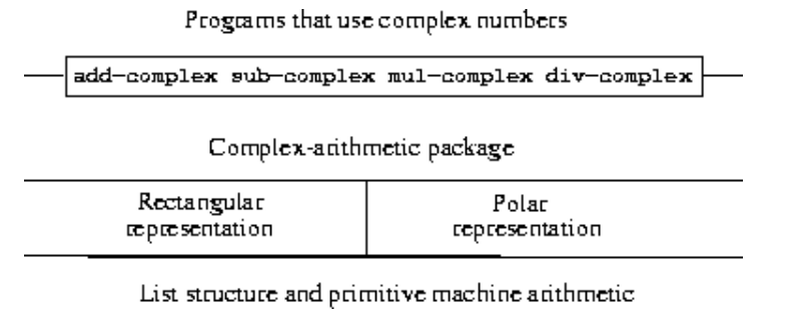
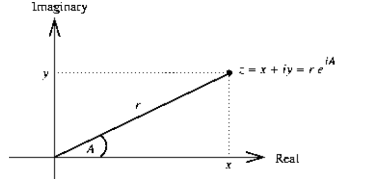
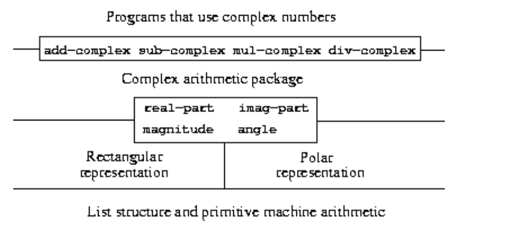
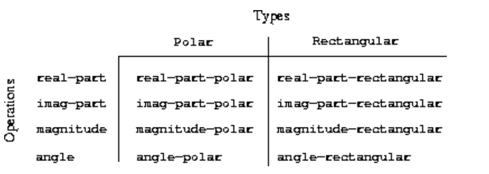

## 2.4 Multiple Representations for Abstract Data


回忆：

数据抽象，结构化的系统方法。

具体的运算和数据的表示没有关系。

层和层之间没有关联。


By isolating the underlying representations of data objects, we can **divide the task of designing a large program into smaller tasks that can be performed separately**.

But this kind of data abstraction **is not yet powerful enough**, because **it may not always make sense to speak of "the underlying representation'' for a data object.**

一个数据对象可能有不止一种有用的表示，我们**可能希望设计能够处理多种表示的系统**


复数表示

（1）real and imaginary parts

（2）magnitude and angle

复数可以用两种方式表示，**而操纵复数的过程可以用任何一种方式表示**

下面是抽象形成的屏障



isolate "higher-level" operations from "lower-level'' representations.  


学习如何处理可能由程序的**不同部分以不同方式表示的数据**

这需要构造泛型过程，**可以对可能以多种方式表示的数据进行操作的过程。**

**data-directed programming**


即我们需要实现**一种可以操作不同表示数据的过程。**


### 2.4.1 Representations for Complex Numbers

复数的表示？

**直角坐标还是极坐标。**

直角形式在大多数情况下优于极坐标形式，否则存在误差。

复数的集合可以被认为是一个具有两个正交轴的二维空间，**实轴和虚轴。**

数z = x + iy(其中$i^2 = - 1$)可以被认为是平面上实坐标为x，虚坐标为y的点。
$$
\begin{array}{l}{\text{Real-part}(z_{1}+z_{2})=\text{Real-part}(z_{1})+\text{Real-part}(z_{2})}\\\\{\text{Inaginary-part}(z_{1}+z_{2})=\text{Inaginary-part}(z_{1})+\text{Inaginary-part}(z_{2})}\\\end{array}
$$
加法和减法就是对应部分的加法和减法，也就是向量的加法和减法。


如果是乘法，就用极坐标比较好。

用极坐标的形式来表示复数，如**幅度和角度**。

两个复数的乘积是**将一个复数拉伸另一个的长度**，然后通过**另一个的角度旋转得到的向量**。
$$
\begin{array}{l}\text{Magnitude}(z_1\cdot z_2)=\text{Magnitude}(z_1)\cdot\text{Magnitude}(z_2)\\\\\text{Angle}(z_1\cdot z_2)=\text{Angle}(z_1)+\text{Angle}(z_2)\end{array}
$$



$$
z=x+iy=re^{iA}
$$
选择器如下：

```
real-part
imag-part
magnitude
angle
```

构造器如下：

```
(make-from-real-imag (real-part z) (imag-part z))
(make-from-mag-ang (magnitude z) (angle z))
```

复数的加法、减法、乘法和除法如下：

```lisp
(define (add-complex z1 z2)
  (make-from-real-imag (+ (real-part z1) (real-part z2))
                       (+ (imag-part z1) (imag-part z2))))
(define (sub-complex z1 z2)
  (make-from-real-imag (- (real-part z1) (real-part z2))
                       (- (imag-part z1) (imag-part z2))))
(define (mul-complex z1 z2)
  (make-from-mag-ang (* (magnitude z1) (magnitude z2))
                     (+ (angle z1) (angle z2))))
(define (div-complex z1 z2)
  (make-from-mag-ang (/ (magnitude z1) (magnitude z2))
                     (- (angle z1) (angle z2))))
```

如何进行转化？
$$
\begin{array}{ll}{\mathrm{x}=r\cos A}&{r=\sqrt{\mathrm{x}^{2}+y^{2}}}\\\\{y=r\sin A}&{A=\arctan(y,\mathrm{x})}\\\end{array}
$$
arctan 可以用Scheme 的 atan 过程计算。

接收 y 和 x 两个参数，返回 正切为 y/x 的角度。参数的符号决定了这个角的象限。

**如果以直角坐标为基础，写出极坐标的选择器和构造器，如下：**

```lisp
(define (real-part z) (car z))
(define (imag-part z) (cdr z))
(define (magnitude z)
  (sqrt (+ (square (real-part z)) (square (imag-part z)))))
(define (angle z)
  (atan (imag-part z) (real-part z)))
(define (make-from-real-imag x y) (cons x y))
(define (make-from-mag-ang r a) 
  (cons (* r (cos a)) (* r (sin a))))
```

**如果以极坐标为基础，写出直角坐标的选择器和构造器，如下：**

```lisp
(define (real-part z)
  (* (magnitude z) (cos (angle z))))
(define (imag-part z)
  (* (magnitude z) (sin (angle z))))
(define (magnitude z) (car z))
(define (angle z) (cdr z))
(define (make-from-real-imag x y) 
  (cons (sqrt (+ (square x) (square y)))
        (atan y x)))
(define (make-from-mag-ang r a) (cons r a))
```


### 2.4.2 Tagged data

**principle of least commitment**

如何让内存中同时存在 直角坐标表示 和 极坐标表示 的复数 ？

即如何区分 一个 pair 是直角坐标表示 复数，还是极坐标表示的复数？

A straightforward way to accomplish this distinction is to 

include a type tag -- 

**the symbol rectangular or polar** -- 

as part of each complex number. 

**加一个标志位就可以了。**


标志位的过程如下：

```lisp
(define (attach-tag type-tag contents)
  (cons type-tag contents))
(define (type-tag datum)
  (if (pair? datum)
      (car datum)
      (error "Bad tagged datum -- TYPE-TAG" datum)))
(define (contents datum)
  (if (pair? datum)
      (cdr datum)
      (error "Bad tagged datum -- CONTENTS" datum)))
```

- attach-tag 就是给一个 数据添加一个 tag
- type-tag 就是得到一个 数据的tag
- contents 就是得到 数据的具体内容

通过car 和 cdr 都可以实现。

于是，判定复数是 直角坐标表示，还是极坐标表示，可以用下面的谓词过程：

```lisp
(define (rectangular? z)
  (eq? (type-tag z) 'rectangular))
(define (polar? z)
  (eq? (type-tag z) 'polar))
```

那么就得到了添加了tag信息后的表示：

**（1）如果以直角坐标为基础，写出极坐标的构造器，如下**：

```lisp
(define (real-part-rectangular z) (car z))
(define (imag-part-rectangular z) (cdr z))
(define (magnitude-rectangular z)
    (sqrt (+ (square (real-part-rectangular z))
             (square (imag-part-rectangular z)))))
(define (angle-rectangular z)
    (atan (imag-part-rectangular z)
          (real-part-rectangular z)))
(define (make-from-real-imag-rectangular x y)
    (attach-tag 'rectangular (cons x y)))
(define (make-from-mag-ang-rectangular r a) 
    (attach-tag 'rectangular
                (cons (* r (cos a)) (* r (sin a)))))
```

**（2）如果以极坐标为基础，写出直角坐标的构造器，如下：**

```lisp
(define (real-part-polar z)
    (* (magnitude-polar z) (cos (angle-polar z))))
(define (imag-part-polar z)
    (* (magnitude-polar z) (sin (angle-polar z))))
(define (magnitude-polar z) (car z))
(define (angle-polar z) (cdr z))
(define (make-from-real-imag-polar x y) 
    (attach-tag 'polar
                (cons (sqrt (+ (square x) (square y)))
                      (atan y x))))
(define (make-from-mag-ang-polar r a)
    (attach-tag 'polar (cons r a)))
```

**（3）统一的选择器**

```lisp
(define (real-part z)
  (cond ((rectangular? z) 
         (real-part-rectangular (contents z)))
        ((polar? z)
         (real-part-polar (contents z)))
        (else (error "Unknown type -- REAL-PART" z))))
(define (imag-part z)
  (cond ((rectangular? z)
         (imag-part-rectangular (contents z)))
        ((polar? z)
         (imag-part-polar (contents z)))
        (else (error "Unknown type -- IMAG-PART" z))))
(define (magnitude z)
  (cond ((rectangular? z)
         (magnitude-rectangular (contents z)))
        ((polar? z)
         (magnitude-polar (contents z)))
        (else (error "Unknown type -- MAGNITUDE" z))))
(define (angle z)
  (cond ((rectangular? z)
         (angle-rectangular (contents z)))
        ((polar? z)
         (angle-polar (contents z)))
        (else (error "Unknown type -- ANGLE" z))))
```

每次在进行操作前都会检查一下tag，根据tag然后进行操作。


我们构造器有两套，但是所有操作数据的过程都是统一的：

```lisp
(define (add-complex z1 z2)
  (make-from-real-imag (+ (real-part z1) (real-part z2))
                       (+ (imag-part z1) (imag-part z2))))
```

实际上，构造器也可以统一：

```lisp
(define (make-from-real-imag x y)
  (make-from-real-imag-rectangular x y))
(define (make-from-mag-ang r a)
  (make-from-mag-ang-polar r a))
```




This discipline of **stripping off and attaching tags as data objects are passed from level to level** can be an important organizational strategy.


### 2.4.3 Data-Directed Programming and Additivity

The general strategy of checking the type of a datum and calling an appropriate procedure is called 

**dispatching on type.** 

过程的具体执行  根据类型进行 分配调度。

缺点：

（1）The generic interface procedures (real-part, imag-part, magnitude, and angle) **must know about all the different representations.**

（2）Even though the individual representations can be designed separately, we must guarantee **that no two procedures in the entire system have the same name.** 


主要就是如果想实现通过类型进行调度的泛型，需要**有一个程序员知道所有的接口过程和表示**。

但是一旦类型变多，那么就是很难办到的。


What we need is a means for **modularizing the system design even further.**

找到一个更加模块化的系统设计

This is provided by the programming technique known as **data-directed programming.** 

每当我们处理一组不同类型的通用操作时，

**我们实际上是在处理一个二维表，其中一个轴上包含可能的操作，另一个轴上包含可能的类型。**

**我们只需要向表中添加新条目就可以在系统中添加一个新的表示。**




Manipulating the operation-and-type table:

```
(put <op> <type> <item>)
```

installs the <item> in the table, indexed by the <op> and the <type>.

```
(get <op> <type>)
```

looks up the <op>, <type> entry in the table and returns the item found there. If no item is found, get returns false.

 本质就是一个二维数组的查找和赋值。


**（1）如果以直角坐标为基础，写出install 的代码，如下**： 

```lisp
(define (install-rectangular-package)
    ;; internal procedures
    (define (real-part z) (car z))
    (define (imag-part z) (cdr z))
    (define (make-from-real-imag x y) (cons x y))
    (define (magnitude z)
        (sqrt (+ (square (real-part z))
                 (square (imag-part z)))))
    (define (angle z)
        (atan (imag-part z) (real-part z)))
    (define (make-from-mag-ang r a) 
        (cons (* r (cos a)) (* r (sin a))))
    ;; interface to the rest of the system
    (define (tag x) (attach-tag 'rectangular x))
    (put 'real-part '(rectangular) real-part)
    (put 'imag-part '(rectangular) imag-part)
    (put 'magnitude '(rectangular) magnitude)
    (put 'angle '(rectangular) angle)
    (put 'make-from-real-imag 'rectangular 
         (lambda (x y) (tag (make-from-real-imag x y))))
    (put 'make-from-mag-ang 'rectangular 
         (lambda (r a) (tag (make-from-mag-ang r a))))
    'done)
```


**（2）如果以极坐标为基础，写出install 的代码，如下**： 

```lisp
(define (install-polar-package)
  ;; internal procedures
  (define (magnitude z) (car z))
  (define (angle z) (cdr z))
  (define (make-from-mag-ang r a) (cons r a))
  (define (real-part z)
    (* (magnitude z) (cos (angle z))))
  (define (imag-part z)
    (* (magnitude z) (sin (angle z))))
  (define (make-from-real-imag x y) 
    (cons (sqrt (+ (square x) (square y)))
          (atan y x)))
  ;; interface to the rest of the system
  (define (tag x) (attach-tag 'polar x))
  (put 'real-part '(polar) real-part)
  (put 'imag-part '(polar) imag-part)
  (put 'magnitude '(polar) magnitude)
  (put 'angle '(polar) angle)
  (put 'make-from-real-imag 'polar
       (lambda (x y) (tag (make-from-real-imag x y))))
  (put 'make-from-mag-ang 'polar 
       (lambda (r a) (tag (make-from-mag-ang r a))))
  'done)
```

这些定义现在是不同过程的内部定义，没有名称的冲突。


**（3）通用操作访问 option-and-type table**

In apply-generic, op has as its value the first argument to apply-generic and 

**args has as its value a list of the remaining arguments.**

参数的数量是不确定的。

```lisp
(define (apply-generic op . args)
  (let ((type-tags (map type-tag args)))
    (let ((proc (get op type-tags)))
      (if proc
          (apply proc (map contents args))
          (error
            "No method for these types -- APPLY-GENERIC"
            (list op type-tags))))))
```

op 就是操作名称， args 一般是 一个具体的数据。

通过 type-tag 就可以得到这个数据的具体类型。

然后传给 get op 和 type-tags 就可以得到具体的过程 proc。

如果option-and-type 表中有，那么就可以直接apply。

apply 的好处：给一个过程名，给过程的参数列表，就可以运行这个过程。


**使用 apply-generic 可以实现几个通用的选择器：**

```lisp
(define (real-part z) (apply-generic 'real-part z))
(define (imag-part z) (apply-generic 'imag-part z))
(define (magnitude z) (apply-generic 'magnitude z))
(define (angle z) (apply-generic 'angle z))
```

apply -generic也使用基本过程apply，

它接受两个参数，一个过程和一个列表。

apply应用该过程，使用列表中的元素作为参数。

```lisp
(apply + (list 1 2 3 4))
```


**还可以从表中提取过程作为外部的接口：**

```lisp
(define (make-from-real-imag x y)
  ((get 'make-from-real-imag 'rectangular) x y))
(define (make-from-mag-ang r a)
  ((get 'make-from-mag-ang 'polar) r a))
```


#### Message passing

data-directed programming 的核心思想是：

 handle generic operations in programs **by dealing explicitly with operation-and-type tables**

这将操作和类型表分解为行，**每个通用操作过程表示表的一行。**

实际上还可以将类型表分解为列，使用按操作名调度的**“智能数据对象”**而不是按数据类型调度的**“智能操作”。**

于是，就make-from-real-imag 可以写成：

```lisp
(define (make-from-real-imag x y)
  (define (dispatch op)
    (cond ((eq? op 'real-part) x)
          ((eq? op 'imag-part) y)
          ((eq? op 'magnitude)
           (sqrt (+ (square x) (square y))))
          ((eq? op 'angle) (atan y x))
          (else
           (error "Unknown op -- MAKE-FROM-REAL-IMAG" op))))
  dispatch)
```

现在只需将操作的名称提供给数据对象。

```
(define (apply-generic op arg) (arg op))
```


上面的编程风格就是消息传递。

The name comes from the image 

**that a data object is an entity that receives the requested operation name as a "message. ''** 

这里我们看到消息传递不是一个数学技巧，而是一种有用的技术，**用于组织具有泛型操作的系统**


data-directed 和 message passing 是两个极端。

- 一个是 传入一个数据，通过这个数据的tag进行操作的指派。
- 一个是 传入一个过程，对某个数据进行特定操作的指派。


