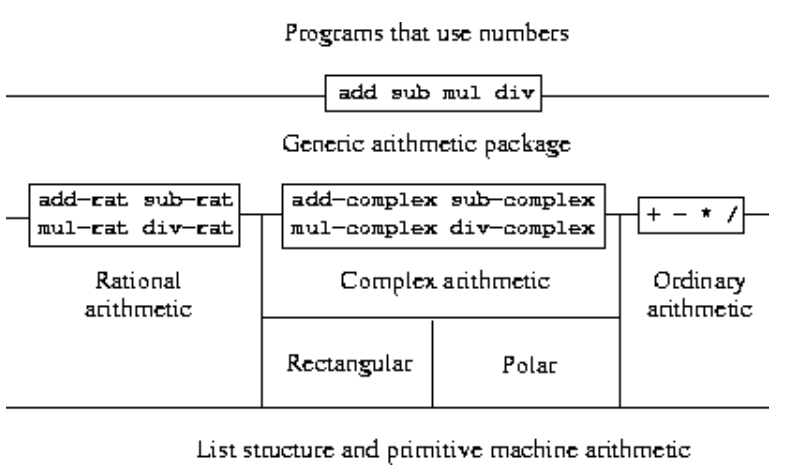
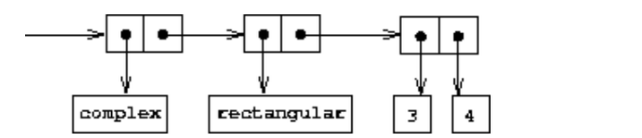
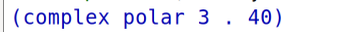
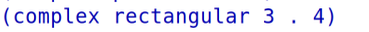
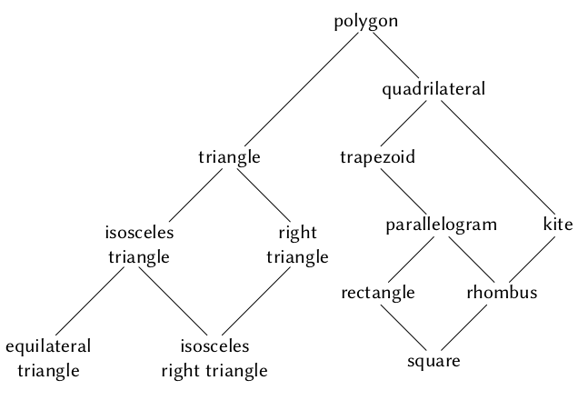

## 2.5 Systems with Generic Operations

之前讨论了**如何设计可以用多种方式表示数据对象的方法。**

The key idea is to link the code that specifies the data operations to the several representations **by means of generic interface procedures.**  

下面讨论如何实现不同表示的泛型操作。




上面就是一个用lisp编写的算术包**，包括了scheme普通的数字、复数、有理数。**

正是由于数据抽象，从而实现了层和层之间的抽象屏障。


### 2.5.1 Generic Arithmetic Operations

实现 "泛型加法"？

（1）普通数字，就用 +

（2）复数，就用 add-complex

（3）有理数，就用 add-rat

可以使用data-directed的方法，给每个类型加一个tag，然后根据类型指派。

We will attach a **type tag** to each kind of number and cause the generic procedure to **dispatch to an appropriate package according to the data type of its arguments.**

```lisp
(define (add x y) (apply-generic 'add x y))
(define (sub x y) (apply-generic 'sub x y))
(define (mul x y) (apply-generic 'mul x y))
(define (div x y) (apply-generic 'div x y))
```


**（1）首先是scheme普通的算术包**

```lisp
(define (install-scheme-number-package)
  (define (tag x)
    (attach-tag 'scheme-number x))    
  (put 'add '(scheme-number scheme-number)
       (lambda (x y) (tag (+ x y))))
  (put 'sub '(scheme-number scheme-number)
       (lambda (x y) (tag (- x y))))
  (put 'mul '(scheme-number scheme-number)
       (lambda (x y) (tag (* x y))))
  (put 'div '(scheme-number scheme-number)
       (lambda (x y) (tag (/ x y))))
  (put 'make 'scheme-number
       (lambda (x) (tag x)))
  'done)
(define (make-scheme-number n)
  ((get 'make 'scheme-number) n))
```

**（2）然后是有理数的算术包**

```lisp
(define (install-rational-package)
  ;; internal procedures
  (define (numer x) (car x))
  (define (denom x) (cdr x))
  (define (make-rat n d)
    (let ((g (gcd n d)))
      (cons (/ n g) (/ d g))))
  (define (add-rat x y)
    (make-rat (+ (* (numer x) (denom y))
                 (* (numer y) (denom x)))
              (* (denom x) (denom y))))
  (define (sub-rat x y)
    (make-rat (- (* (numer x) (denom y))
                 (* (numer y) (denom x)))
              (* (denom x) (denom y))))
  (define (mul-rat x y)
    (make-rat (* (numer x) (numer y))
              (* (denom x) (denom y))))
  (define (div-rat x y)
    (make-rat (* (numer x) (denom y))
              (* (denom x) (numer y))))
  ;; interface to rest of the system
  (define (tag x) (attach-tag 'rational x))
  (put 'add '(rational rational)
       (lambda (x y) (tag (add-rat x y))))
  (put 'sub '(rational rational)
       (lambda (x y) (tag (sub-rat x y))))
  (put 'mul '(rational rational)
       (lambda (x y) (tag (mul-rat x y))))
  (put 'div '(rational rational)
       (lambda (x y) (tag (div-rat x y))))

  (put 'make 'rational
       (lambda (n d) (tag (make-rat n d))))
  'done)
(define (make-rational n d)
  ((get 'make 'rational) n d))
```

**（3）最后是复数包**

```lisp
(define (install-complex-package)
  ;; imported procedures from rectangular and polar packages
  (define (make-from-real-imag x y)
    ((get 'make-from-real-imag 'rectangular) x y))
  (define (make-from-mag-ang r a)
    ((get 'make-from-mag-ang 'polar) r a))
  ;; internal procedures
  (define (add-complex z1 z2)
    (make-from-real-imag (+ (real-part z1) (real-part z2))
                         (+ (imag-part z1) (imag-part z2))))
  (define (sub-complex z1 z2)
    (make-from-real-imag (- (real-part z1) (real-part z2))
                         (- (imag-part z1) (imag-part z2))))
  (define (mul-complex z1 z2)
    (make-from-mag-ang (* (magnitude z1) (magnitude z2))
                       (+ (angle z1) (angle z2))))
  (define (div-complex z1 z2)
    (make-from-mag-ang (/ (magnitude z1) (magnitude z2))
                       (- (angle z1) (angle z2))))
  ;; interface to rest of the system
  (define (tag z) (attach-tag 'complex z))
  (put 'add '(complex complex)
       (lambda (z1 z2) (tag (add-complex z1 z2))))
  (put 'sub '(complex complex)
       (lambda (z1 z2) (tag (sub-complex z1 z2))))
  (put 'mul '(complex complex)
       (lambda (z1 z2) (tag (mul-complex z1 z2))))
  (put 'div '(complex complex)
       (lambda (z1 z2) (tag (div-complex z1 z2))))
  (put 'make-from-real-imag 'complex
       (lambda (x y) (tag (make-from-real-imag x y))))
  (put 'make-from-mag-ang 'complex
       (lambda (r a) (tag (make-from-mag-ang r a))))
  'done)
(define (make-complex-from-real-imag x y)
  ((get 'make-from-real-imag 'complex) x y))
(define (make-complex-from-mag-ang r a)
  ((get 'make-from-mag-ang 'complex) r a))
```


**复数包用了 two-level tag system。**




构建抽象屏障后，无论是普通的数字、复数还是有理数，其运算都是：

add、sub、div、mul

不区分具体是哪种类型。


```lisp
(define z1 (make-complex-from-mag-ang 3 40))
z1
```




```lisp
(define z2 (make-complex-from-real-imag 3 4))
z2
```




### 2.5.2 Combining Data of Different Types

之前设计的系统将每个数据类型都分隔开了，即每个类型是独立的。

但是，有些时候我们需要让类型交叉。

What we have not yet considered is the fact that **it is meaningful to define operations that cross the type boundaries, such as the addition of a complex number to an ordinary number.** 

复数类型可以和一个普通数字类型相加。


增加一个新的tag：

**tag (complex scheme-number)**

```lisp
;; to be included in the complex package
(define (add-complex-to-schemenum z x)
  (make-from-real-imag (+ (real-part z) x)
                       (imag-part z)))
(put 'add '(complex scheme-number)
     (lambda (z x) (tag (add-complex-to-schemenum z x))))
```

add-complex-to-schemenum 就是只将实部相加，然后虚部保留


该方法还**破坏了我们将单独的包组合起来的能力，**

或者至少**限制了单个包的实现者需要考虑其他包的程度。**

在设计包含许多包和许多跨类型操作的系统时，

**在包之间的职责划分上制定一致的策略可能是一项艰巨的任务。**


#### Coercion

Fortunately, 

we can usually do better **by taking advantage of additional structure that may be latent in our type system.** 

不同的数据类型**不是完全独立**的，并且可能存在一种类型的对象被视为另一种类型的方法

如果我们被要求将一个普通数字与一个复数进行算术组合，

我们可以将这个**普通数字视为一个虚部为零的复数。**

这将问题**转换为两个复数的组合问题**，这可以通过**复数算术包**以普通方式处理。

即先将一个类型（强制转化）为另一个类型，这样类型就实现了统一，

**然后就可以用一个类型的过程进行运算了。**

we can implement this idea by designing coercion procedures 

**that transform an object of one type into an equivalent object of another type.**


**（1）将 scheme-number 强制转化为 complex**

```lisp
(define (scheme-number->complex n)
  (make-complex-from-real-imag (contents n) 0))
; 实部保留，虚部为0
(put-coercion 'scheme-number 'complex scheme-number->complex)
```

这里的put-coercion和之前的那个put是不同的，是另一个表，专门用于强制类型转化。

表中不会包含一般的complex->scheme-number过程，原因是**无法将任意复数强制转换为普通数**


**（2）有了强制类型转换表，我们需要修改apply-generic**

如果第一种类型的对象一般不能被强制转换为第二种类型，

我们就用另一种方式进行强制转换，看看是否有办法**将第二个参数强制转换为第一个参数**的类型。

最后，**如果没有已知的方法将任意一种类型强制转换为另一种类型，则放弃。**

**这里是加设只有两个参数，实际上可以有多个参数。**

```lisp
(define (apply-generic op . args)
  (let ((type-tags (map type-tag args)))
    (let ((proc (get op type-tags)))
      (if proc
          (apply proc (map contents args))
          (if (= (length args) 2)
              (let ((type1 (car type-tags))
                    (type2 (cadr type-tags))
                    (a1 (car args))
                    (a2 (cadr args)))
                (let ((t1->t2 (get-coercion type1 type2))
                      (t2->t1 (get-coercion type2 type1)))
                  (cond (t1->t2
                         (apply-generic op (t1->t2 a1) a2))
                        (t2->t1
                         (apply-generic op a1 (t2->t1 a2)))
                        (else
                         (error "No method for these types"
                                (list op type-tags))))))
              (error "No method for these types"
                     (list op type-tags)))))))
```


我们仍然需要编写强制过程来关联类型。

**对于有n个类型的系统可能需要编写 $n * (n-1)$ 个过程。**

类型之间的适当转换仅**取决于类型本身**，而不取决于要应用的过程。


其实我们可以用**少于**  $n * (n-1)$ 个过程**实现强制类型转化。**

如果我们知道如何**从类型1转换到类型2，**

以及如何从类型2转换到类型3，那么我们就可以使用已有的过程**将类型1转换到类型3**。


#### Hierarchies of types

通常，不同类型之间的关系具有更“全局”的结构。

构建一个通用算术系统来处理**整数、有理数、实数和复数**

而有理数又是一种特殊的实数，而实数又是一种特殊的复数

**整数是有理数的子类型**


```
integer -> raitional -> real -> complex
```

complex 是最大的超集，integer 是最小的子集。


如果要将整数与复数相加，则**不需要显式定义特殊的强制转换过程 integer->complex**

一点一点转化即可：

- 将整数转换为有理数
- 将有理数转换为实数
- 将实数转换为复数

我们允许系统通过这些步骤将整数转换为复数，**然后将两个复数相加**


对于每种类型，我们需要提供一个raise过程，**该过程将该类型的对象“提升”到塔中的一层**

当系统需要对不同类型的对象进行操作时，它可以依次提升较低类型的对象，**直到所有对象在塔中处于同一水平。**


我们可以很容易地实现**每个类型“继承”在超类型上定义的所有操作的概念**

如果我们不提供求整数实部的特殊过程，

**我们仍然应该期望整数的实部是定义的，因为整数是复数的一个子类型**


从下往上爬类型塔进行类型转化。

从上往下继承超集的过程。


可以将数据对象“降低”到**最简单的表示形式**，就比如 2 + 3i 与 4 - 3i相加 为  6 + 0i，可以继续化简为  6，

即将complex 类型转化为 integer 类型。


#### Inadequacies of hierarchies

下面的拓扑图显示了不同类型几何图形之间的关系：

- 一个类型可以有多个子类型。
- 一个类型可以有多个超类型。
- 三角形和四边形都是多边形的子类型。
- 个等腰直角三角形既可以看作是等腰三角形，也可以看作是直角三角形。



在大型系统的设计中，**处理大量相互关联的类型，**

**同时仍然保持模块化是非常困难的**。


### 2.5.3 Example: Symbolic Algebra

**符号代数。**

代数表达式可以看作是一个**层次结构**，一个**应用于操作数的操作符树**。

符号代数中的典型抽象概念是**线性组合、多项式、有理函数或三角函数**等概念
$$
x^2\sin(y^2+1)+x\cos2y+\cos(y^3-2y^2)
$$
先设计一个**简单的多项式代数**，不实现一个完整的符号代数系统，否则系统太过复杂。

the arithmetic of polynomials


#### Arithmetic on polynomials

第一个任务是确定多项式是什么。

to decide just what a polynomial is。

下面是多项式的简化定义：


我们将**多项式**定义

**为一组项的和，每一项要么是一个系数，一个不定式的幂，要么是一个系数和一个不定式的幂的乘积。**

系数被定义为不依赖于多项式的不定式的代数表达式。

We will define a polynomial 

to be a sum of terms, each of which is either a coefficient, a power of the indeterminate, 

or a product of a coefficient and a power of the indeterminate.  

（1）is a simple polynomial in x
$$
5x^2+3x+7
$$
（2）a polynomial in x **whose coefficients are polynomials in y**
$$
(y^2+1)x^3+(2y)x+1
$$
giving the value of a polynomial at a given set of points can be a particularly good representation.  

也就是说我们**仅考虑一种单变量多项式。**

要得到以这种方式表示的两个多项式的和，**我们只需要将多项式在对应点的值相加。**


为了转换回更熟悉的表示，

我们可以使用拉格朗日插值公式，该公式显示了如何恢复**给定n次多项式在n + 1个点上的值的系数。**


**多项式的两个形式相互转化：**

（1）将多项式转化为 n + 1 个点的形式。

（2）可以用拉格朗日插值法将 n + 1 个点的形式转化为 n 个系数的形式。


**多项式的表示：**

我们将使用一种称为poly的数据结构来表示多项式，**它由一个变量和一组项组成。**

- 选择器：variable、term-list
- 构造器：make-poly


**多项式的加法和乘法的过程描述：**

- 多项式加法按项执行，同一阶的项(即具有相同的幂的项)必须组合在一起。
- 通过形成一个同阶的新项来完成的，**它的系数是加数系数的和**。
- 一个加数中的项如果在另一个加数中没有相同阶数的项，则**简单地累加到正在构造的和多项式中**。

```lisp
(define (add-poly p1 p2)
  (if (same-variable? (variable p1) (variable p2))
      (make-poly (variable p1)
                 (add-terms (term-list p1)
                            (term-list p2)))
      (error "Polys not in same var -- ADD-POLY"
             (list p1 p2))))
(define (mul-poly p1 p2)
  (if (same-variable? (variable p1) (variable p2))
      (make-poly (variable p1)
                 (mul-terms (term-list p1)
                            (term-list p2)))
      (error "Polys not in same var -- MUL-POLY"
             (list p1 p2))))
```


**多项式实际也可以放入我们的算术运算包，所以为了嵌入进去，可以添加一个tag：**

```lisp
(define (install-polynomial-package)
  ;; internal procedures
  ;; representation of poly
  (define (make-poly variable term-list)
    (cons variable term-list))
  (define (variable p) (car p))
  (define (term-list p) (cdr p))
  <procedures same-variable? and variable? from section 2.3.2>
  ;; representation of terms and term lists
  <procedures adjoin-term ...coeff from text below>

  ;; continued on next page

  (define (add-poly p1 p2) ...)
  <procedures used by add-poly>
  (define (mul-poly p1 p2) ...)
  <procedures used by mul-poly>
  ;; interface to rest of the system
  (define (tag p) (attach-tag 'polynomial p))
  (put 'add '(polynomial polynomial) 
       (lambda (p1 p2) (tag (add-poly p1 p2))))
  (put 'mul '(polynomial polynomial) 
       (lambda (p1 p2) (tag (mul-poly p1 p2))))
  (put 'make 'polynomial
       (lambda (var terms) (tag (make-poly var terms))))
  'done)
```


