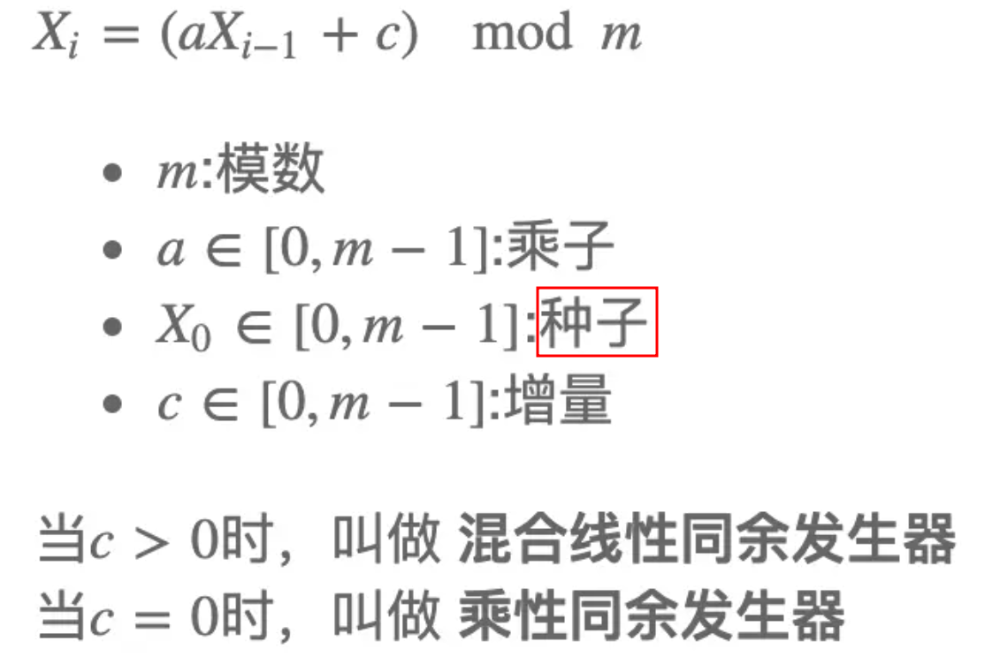

# Chapter 3 Modularity, Objects, and State

模块化、对象和状态


（1）将primitive procedures 和 primitive data 组合，可以构建复合的对象。

（2）抽象是处理大型系统的有效手段。


第三章：

we need strategies to help us structure large systems **so that they will be modular**

更加模块化的手段。

对于系统中的每个对象，**我们构造一个相应的计算对象。**

添加新功能，局部有效即可。


两个组织代码的策略：

（1）The first organizational strategy concentrates on objects, **viewing a large system as a collection of distinct objects whose behaviors may change over time.**

（2）An alternative organizational strategy concentrates **on the streams of information that flow in the system**, much as an electrical engineer views a signal-processing system.


- 对象 ：object-based approach
- 信息流：stream-processing approach


计算模型的转变：

substitution model of computation 

->

**environment model of computation.**


使用延迟求值技术让流方法得到最充分的利用：

decouple simulated time in our model from the order of the events **that take place in the computer during evaluation**


## 3.1 Assignment and Local State

（1）对象有状态

each of which has a state that changes over time.

（2）状态随时间改变

（3）状态受历史状态影响

"Can I withdraw $100? "  depends upon **the history of deposit and withdrawal transactions**

（4）使用足够多的状态变量来描述对象的状态

characterize an object's state by one or more state variables


举例：

我们可以通过**当前余额来描述一个账户的状态**，而不是记住整个账户交易的历史

**a current balance** rather than by remembering the entire history of account transactions.


（5）对象是相互联系、相互影响的。

一个对象的状态变量与其他对象的状态变量可以耦合。


新的计算模型：

（1）分解为**多个计算对象**

（2）每个计算对象必须有自己的**局部状态变量** 描述实际对象的状态

（3）对象的状态**随时间而变化**，相应计算对象的状态变量也必须改变

（4）提供赋值操作符，使我们能够**更改与变量关联的值**。


### 3.1.1 Local State Variables

对**从银行账户取款**的情况进行建模

model the situation of **withdrawing money from a bank account.**


（1）withdraw

takes as argument an amount to be withdrawn.

If there is enough money in the account to accommodate the withdrawal, **then withdraw should return the balance remaining after the withdrawal.**

Otherwise, withdraw should return the **message Insufficient funds.**

假设原始有 100 $

```lisp
(define balance 100)

(define (withdraw amount)
  (if (>= balance amount)
      (begin (set! balance (- balance amount))
             balance)
      "Insufficient funds"))

(withdraw 25)
; 75
(withdraw 25)
; 50
(withdraw 60)
; "Insufficient funds"
(withdraw 15)
; 35
```


一个奇怪的地方：

withdraw 是一个过程，两次传入的**参数相同，但是结果不同**。

computing mathematical functions **就是参数相同，那么结果就相同**。


until we introduce assignment, **we have no way to create such procedures ourselves.


set! 语句：

```lisp
(set! <name> <new-value>)
```

`Set!` changes <*name*> **so that its value is the result obtained by evaluating <*new-value*>**

改变变量的值


begin语句：

first decrementing balance and **then returning the value of balance.**

```lisp
(begin <exp1> <exp2> ... <expk>)
```

causes the expressions $<exp_1>$ through $<exp_k>$ to be evaluated in sequence and the value of the final expression $<exp_k>$ to **be returned as the value of the entire `begin` form.**


顺序计算、返回最后一个表达式的值


改进：

balance is a name defined **in the global environment** and is freely accessible to be examined or modified by any procedure.

balance is **a local state variable** used by withdraw to keep track of the state of the account.

将全局变量改为局部变量。


```lisp
(define new-withdraw
  (let ((balance 100))
    (lambda (amount)
      (if (>= balance amount)
          (begin (set! balance (- balance amount))
                 balance)
          "Insufficient funds"))))
```

它的行为与withdraw完全相同，**但是它的变量balance不能被任何其他过程访问**

封装反映了被称为隐藏原则的**一般系统设计原则。**

Encapsulation reflects **the general system-design principle** known as the hiding principle


set + 局部变量是一种通用编程技术。

无法使用求值的替代模型来对上面的程序进行分析。

需要新的方法来对构建的程序进行解释。


下面是 make-withdraw 的 过程描述：

```lisp
(define (make-withdraw balance)
  (lambda (amount)
    (if (>= balance amount)
        (begin (set! balance (- balance amount))
               balance)
        "Insufficient funds")))
(define W1 (make-withdraw 100))
(define W2 (make-withdraw 100))
(W1 50)
; 50
(W2 70)
; 30
(W2 40)
; "Insufficient funds"
(W1 40)
; 10
```

 `W1` and `W2` are completely independent objects, each with its own local state variable `balance`. 

**Withdrawals from one do not affect the other.**

构建独立的对象！


make-account ：

```lisp
(define (make-account balance)
  (define (withdraw amount)
    (if (>= balance amount)
        (begin (set! balance (- balance amount))
               balance)
        "Insufficient funds"))
  (define (deposit amount)
    (set! balance (+ balance amount))
    balance)
  (define (dispatch m)
    (cond ((eq? m 'withdraw) withdraw)
          ((eq? m 'deposit) deposit)
          (else (error "Unknown request -- MAKE-ACCOUNT"
                       m))))
  dispatch)

(define acc (make-account 100))
((acc 'withdraw) 50)
; 50
((acc 'withdraw) 60)
; "Insufficient funds"
((acc 'deposit) 40)
; 90
((acc 'withdraw) 60)
; 30


(define acc2 (make-account 100))
; produce a completely separate account object, which maintains its own local balance.
```

account，传入 withdraw，就执行 withdraw 这个过程。传入 deposit ，就执行 deposit 这个过程。取款和存款。


（1）make-account，会创建一个有局部变量 balance 的环境

（2）dispatch 就是 message passing 的编码风格


### 3.1.2 The Benefits of Introducing Assignment

将系统视为具有局部状态的对象集合**是维护模块化设计的一种强大技术**。

考虑一个过程' rand '的设计，**无论何时调用它，它都会返回一个随机选择的整数。**

我们大概想要的是连续调用rand来产生**一个具有均匀分布统计特性的数字序列。**

```
x2 = (rand-update x1)
x3 = (rand-update x2)
```

then the sequence of values *x*1, *x*2, *x*3, `...`, will have the desired statistical properties

x is updated to ax + b modulo m, **where a, b, and m are appropriately chosen integers.**

Given the **same** input twice, it produces the **same** output.


通过上面的 ( ax + b ) % m 的方式产生的随即数是**伪随机，并不是真随机**。

随机数序列的每个数字**与前一个数字无关才是真随机**。

伪随机序列是由精心确定的计算产生的，但具有适当的统计性质。


实现 rand：

**（1）random-init**

We can implement `rand` as a procedure with a local state variable `x` that is initialized to some fixed value `random-init`

**（2）rand-update**

Each call to `rand` computes `rand-update` of the current value of `x`, returns this as the random number, and also stores this as the new value of `x`.

```lisp
(define rand
  (let ((x random-init))
    (lambda ()
      (set! x (rand-update x))
      x)))
```

```lisp
(define random-init 0) 
(define (rand-update x) 
  (let ((a 16807) (b 0) (m 2147483647))
    (modulo (+ (* a x) b) m)
    ))
```

```lisp
(define random-init 1) 
(define (rand-update x) 
    (let ((a 48271) (b 0) (m 2147483647))
         (modulo (+ (* a x) b) m)
         ))
```




使用随机数来实现一种称为**蒙特卡罗模拟**。

*Monte Carlo simulation*.

从一个大的集合中随机选择样本实验，然后根据从这些实验结果制表估计的概率进行推断。

The Monte Carlo method consists of choosing sample experiments **at random from a large set** and then making deductions on the basis of the probabilities estimated from tabulating the results of those experiments.

we can approximate  $\pi$ using the fact that $6/\pi^2 $ is the probability that two integers chosen at random will have no factors in common; that is, **that their greatest common divisor will be 1**


（1）大量实验

（2）每次实验选择两个随机数，然后看这两个数的gcd是否为1

（3）得到的概率就可以估计 $\pi$


```lisp
(define (estimate-pi trials)
  (sqrt (/ 6 (monte-carlo trials cesaro-test))))
(define (cesaro-test)
   (= (gcd (rand) (rand)) 1))
(define (monte-carlo trials experiment)
  (define (iter trials-remaining trials-passed)
    (cond ((= trials-remaining 0)
           (/ trials-passed trials))
          ((experiment)
           (iter (- trials-remaining 1) (+ trials-passed 1)))
          (else
           (iter (- trials-remaining 1) trials-passed))))
  (iter trials 0))
```

赋值将随机数生成器的状态**封装在rand过程中**，

**因此随机数生成的细节与程序的其余部分保持独立**。


如果使用 rand-update，而不是 rand ，那么过程描述可以改写如下：

```lisp
(define (estimate-pi trials)
  (sqrt (/ 6 (random-gcd-test trials random-init))))
(define (random-gcd-test trials initial-x)
  (define (iter trials-remaining trials-passed x)
    (let ((x1 (rand-update x)))
      (let ((x2 (rand-update x1)))
        (cond ((= trials-remaining 0)   
               (/ trials-passed trials))
              ((= (gcd x1 x2) 1)
               (iter (- trials-remaining 1)
                     (+ trials-passed 1)
                     x2))
              (else
               (iter (- trials-remaining 1)
                     trials-passed
                     x2))))))
  (iter trials 0 initial-x))
```

随机数生成器没有本地状态，random-gcd-test**必须显式地操作随机数x1和x2，并通过迭代循环回收x2作为rand更新的新输入**


我们用**局部状态变量来模拟状态**，我们**用这些变量的赋值来模拟状态的变化**。

所以**赋值语句是必要的，用来模拟状态的变化。**


通过**引入赋值和在局部变量中隐藏状态的技术**，我们能够以一种**更加模块化的方式构建系统**，而**不是通过传递附加参数显式地操纵所有状态**。


### 3.1.3 The Costs of Introducing Assignment

set! operation enables us to **model objects that have local state.**

Our programming language **can no longer be interpreted in terms of the substitution model of procedure application**

可以构建一种有局部状态的对象

但是无法用替代模型进行解释

不使用任何赋值的编程，正如我们在本书的前两章中所做的那样，**因此被称为函数式编程**

functional programming

只要我们不使用赋值，对具有相同参数的同一个过程进行两次求值就会产生相同的结果，**因此过程可以被视为计算数学函数**


简化版的 make-withdraw ：

```lisp
(define (make-simplified-withdraw balance)
  (lambda (amount)
    (set! balance (- balance amount))
    balance))

(define W (make-simplified-withdraw 25))
(W 20)
; 5
(W 10)
; - 5
```

没有if判断，直接进行set，然后返回balance


没有使用set!的版本

```lisp
(define (make-decrementer balance)
  (lambda (amount)
    (- balance amount)))
(define D (make-decrementer 25))
(D 20)
; 5
(D 10)
; 15
```

但是在**连续调用中没有累积效果**


没有使用set!，就可以用替代模型进行分析。

```lisp
((make-decrementer 25) 20)
->
((lambda (amount) (- 25 amount)) 20)
->
(- 25 20)
->
5
```


如果使用了set!，尝试用替代模型进行分析？

```lisp
((make-simplified-withdraw 25) 20)
->
((lambda (amount) (set! balance (- 25 amount)) 25) 20)
->
(set! balance (- 25 20)) 25
```

答案是25，显然不合理

we would have to somehow distinguish **the first occurrence of balance** (before the effect of the set!) from **the second occurrence of balance** (after the effect of the set!), and **the substitution model cannot do this**


怎么对之前的替代模型进行修正呢？

the value of a variable can change, **a variable can no longer be simply a name**

Now a variable somehow refers to **a place where a value can be stored, and the value stored at this place can change.**

一个变量的value存在某个地方，这个值可以改变。


#### Sameness and change

```lisp
(define D1 (make-decrementer 25))
(define D2 (make-decrementer 25))
```

没有使用set!，D1 和 D2的效果是一样的，即D1和D2是相同的。


```lisp
(define W1 (make-simplified-withdraw 25))
(define W2 (make-simplified-withdraw 25))
(W1 20)
; 5
(W1 20)
; - 15
(W2 20)
; 5
```

使用set!，W1和W2的效果就独立了，W1和W2是不同的。

但在任何表达式中，**W1都不可能在不改变表达式计算结果的情况下取代W2**。

W1 和 W2 是独立的。

**reasoning about programs that use assignment** becomes drastically more difficult.

对使用赋值语句的程序解释十分困难。


we can determine that two apparently identical objects are indeed "the same one'' **only by modifying one object and then observing whether the other object has changed in the same way.**

改变一个，看另一个是否也变化。


（1）情况1

```lisp
(define peter-acc (make-account 100))
(define paul-acc (make-account 100))
```

peter-acc 和 paul-acc 有各自的账户，改变一个账户，另一个不会发生改变，独立


（2）情况2

```lisp
(define peter-acc (make-account 100))
(define paul-acc peter-acc)
```

peter-acc 和 paul-acc 共享同一个账户，改变一个账户，另一个也会发生改变，不独立


The phenomenon of a single computational object being accessed by more than one name is **known as aliasing.**

也就是变量的别名


但是alias会产生一些难以理解的bug，所以有人希望不引入别名：

some people have proposed that programming languages be designed **in such a way as to not allow side effects or aliasing.**


#### Pitfalls of imperative programming

functional programming Vs. imperative programming

一个不使用set!，一个广泛使用set!


（1）**函数式**风格编写阶乘

```lisp
(define (factorial n)
  (define (iter product counter)
    (if (> counter n)
        product
        (iter (* counter product)
              (+ counter 1))))
  (iter 1 1))
```

（2）**命令式**风格编写阶乘

```lisp
(define (factorial n)
  (let ((product 1)
        (counter 1))
    (define (iter)
      (if (> counter n)
          product
          (begin (set! product (* counter product))
                 (set! counter (+ counter 1))
                 (iter))))
    (iter)))
```

需要严格控制set!的顺序，否则会出错。

```lisp
(define (factorial n)
  (let ((product 1)
        (counter 1))
    (define (iter)
      (if (> counter n)
          product
          (begin (set! counter (+ counter 1))
                 (set! product (* counter product))
                 (iter))))
    (iter)))
```


it is ironic that introductory programming **is most often taught in a highly imperative style.**

This may be a vestige of a belief, common throughout the 1960s and 1970s, **that programs that call procedures must inherently be less efficient than programs that perform assignments.**


问题是：

（1）大部分接触编程都是从命令式开始的

（2）一个不正确的观念是过程调用的效率比赋值低

（3）实际上，命令式编程会让编程更加复杂化，**原因是我们需要考虑变量赋值的顺序问题**


