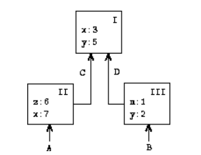
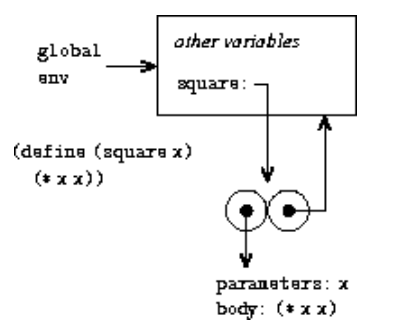
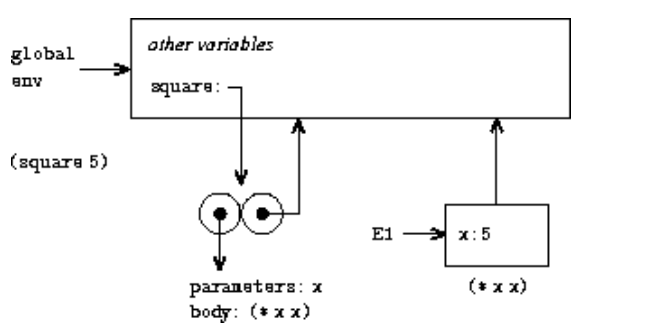
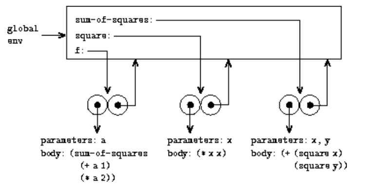
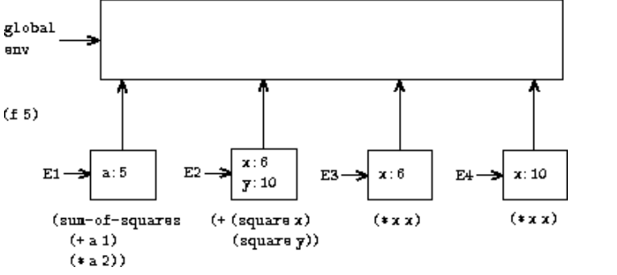

## 3.2 The Environment Model of Evaluation


求值的替代模型：

对过程体进行求值，其中每个形式形参都由相应的实参替换。


environment model：

a variable must somehow designate a "place'' in which values can be stored.


- An environment is a sequence of ***frames*.**
- Each frame is a **table (possibly empty) of bindings**, which associate variable names with their corresponding values.
- Each frame also has a **pointer** to its enclosing environment.
- The value of a variable with respect to an environment is the value given by the binding of the variable **in the first frame in the environment** **that contains a binding for that variable.**
- If **no frame** in the sequence specifies a binding for the variable, then the variable is said to be **unbound** in the environment.


- environment -> frames -> tables -> bindings
- frame - - - > environment




（1）三个 frame：I、II、III

（2）四个指向environment的指针：A、B、C、D

（3）C和D指向相同的environment

**（4）顺着 environment 指针找，只要找到了一个变量的绑定，那么值就是它**


- 编程语言中的表达式**本身**没有任何意义。
- 表达式只有在对其进行评估的**环境中**才获得意义。


我们需要假设存在一个全局环境，这样一些内置的变量就可以进行正常绑定。

we will suppose that there is a global environment, **consisting of a single frame (with no enclosing environment) that includes values for the symbols associated with the primitive procedures.**


### 3.2.1 The Rules for Evaluation


回顾之前的替代模型：

- Evaluate the **subexpressions** of the combination.
- Apply the value of the **operator** subexpression to the values of the operand subexpressions.

计算子表达式，然后用操作符对这个子表达式进行运算。

引入set!后：

the presence of assignment allows us to write expressions that will **produce different values depending on the order in which the subexpressions in a combination are evaluated**


子表达式的顺序不同，结果也不同。

所以我们需要做的是让一个过程的子表达式的求值 **给定一个求值顺序**。


（1）A procedure is always a pair consisting of some **code** and a **pointer** to an environment

（2）Procedures are created in one way only: **by evaluating a lambda expression**.

（3）This produces a procedure whose code is obtained from **the text of the lambda expression** and whose environment is the environment **in which the lambda expression was evaluated to produce the procedure.**


一个过程的定义：

代码+环境指针

一个过程的evaluation：

执行lambda表达式的代码，环境就是这个lambda 表达式进行执行的环境


```lisp
(define (square x)
  (* x x))
(define square
  (lambda (x) (* x x)))
```

过程定义的语法就是一个语法糖，

本质还是将一个变量square和一个lambda表达式进行绑定。


**（1）定义一个过程：**



- 其代码指定过程有一个形式参数，即x和一个过程体(* x x)。
- 过程的环境部分是一个指向全局环境的指针。

通过define创建绑定的定义。


**（2）对一个过程求值**



创建一个新的环境 E1，E1有global env 的指针。

- constructing a frame, 
- binding the formal parameters of the procedure to the arguments of the call,
- evaluating the body of the procedure in the context of the new environment constructed
- the new frame has as **its enclosing environment the environment part of the procedure object being applied.**


也就是说每对一个过程求值，就会有一个新的闭包环境产生。


set! 会先找到这个变量绑定环境的第一个frame，

然后修改这个frame中的这个绑定即可。

如果变量在环境中未绑定，则 set!报错。

为了防止多次define 同一个变量导致的隐式使用 set!，我们规定不能多次define同一个变量。


### 3.2.2 Applying Simple Procedures

```lisp
(define (square x)
  (* x x))
(define (sum-of-squares x y)
  (+ (square x) (square y)))
(define (f a)
  (sum-of-squares (+ a 1) (* a 2)))

(f 5)
```



（1）f、square和sum-of-squares 各有一个自己的environment

（2）Each procedure object consists of **some code**, together with **a pointer to the global environment.**


```lisp
(sum-of-squares (+ a 1) (* a 2))
```



如何计算这个过程？

每个 square 都有一个自己的environment。

每次对一个子过程进行分析，都会有一个新的environment。

After the subexpressions are evaluated, **the results are returned.**

