## 3.3 Modeling with Mutable Data

recall chapter2：

数据抽象的原则，数据结构用**构造函数和选择器来指定**，构造函数创建数据对象，**选择器访问复合数据对象的各个部分**。

pair作为合成复合数据的通用“粘合剂”。


现在：

我们需要定义**可变数据类型**。

为了对状态变化的复合对象进行建模，除了选择器和构造器之外，我们还将设计数据抽象，包括称为mutator的操作，这些操作**可以修改数据对象**。

为其定义了mutator的数据对象称为**可变数据对象**。

复杂系统被建模为具有**局部状态的对象集合**。

为最基本的pair定义mutator，

**然后就可以根据这个有mutator性质的变量构造mutable data objects**


### 3.3.1 Mutable List Structure


```lisp
; x
(list (list a b) c d)
; y
(list e f)
```


下面为pair添加两个新的过程：

**（1）set-car!**

```
(set-car! x y)
```

x 必须是一个pair，将x 的 car 替换为 y

```lisp
(define x (list (list a b) c d))
(define y (list e f))
(set-car! x y)
; (list (list e f) c d)
```


这样可能会有一些“垃圾”生成，可以用垃圾回收解决。

```lisp
(define z (cons y (cdr x)))
```


**（2）set-cdr!**

```
(set-cdr! x y)
```

x 必须是一个pair，将x 的 cdr 替换为 y

```lisp
(define x (list (list a b) c d))
(define y (list e f))
(set-cdr! x y)
```


（3）使用 set-car!，set-cdr!和 get-new-pair 可以实现 cons：

```lisp
(define (cons x y)
  (let ((new (get-new-pair)))
    (set-car! new x)
    (set-cdr! new y)
    new))
```

get-new-pair是Lisp实现中必须作为内存管理的一部分来实现的操作之一。


#### Sharing and identity

如果不同的数据对象共享同一个pair时，set!可能会出现问题。

```lisp
(define x (list 'a 'b))
(define z1 (cons x x))
(define z2 (cons (list 'a 'b) (list 'a 'b)))
```

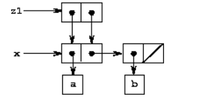

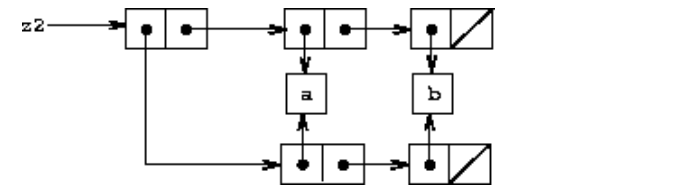

symbol 是唯一的，但是这个symbol是共享的，z2作为共享的结构很难被察觉到

每个list都会有一个新的指针出现，但是symbol只有一个！


```lisp
(define x (list 'a 'b))
(define z1 (cons x x))
(define z2 (cons (list 'a 'b) (list 'a 'b)))

(define (set-to-wow! x)
  (set-car! (car x) 'wow)
  x)
z1
; ((a b) a b)
(set-to-wow! z1)
;((wow b) wow b)

z2
; ((a b) a b)
(set-to-wow! z2)
;((wow b) a b)
```

"the same list" ，不同的结果


使用`eq?`检验共享

```lisp
(eq? (car z1) (cdr z1))
; true
(eq? (car z2) (cdr z2))
; false
```

利用共享来极大地扩展可以用对表示的数据结构。

除非我们很好地理解数据对象是如何共享的，否可能会产生意想不到的结果。


#### Mutation is just assignment

recall：

pair 可以用过程来进行表示。

```lisp
(define (cons x y)
  (define (dispatch m)
    (cond ((eq? m 'car) x)
          ((eq? m 'cdr) y)
          (else (error "Undefined operation -- CONS" m))))
  dispatch)
(define (car z) (z 'car))
(define (cdr z) (z 'cdr))
```

我们可以使用赋值和局部状态将可变数据对象实现为过程。

可变数据类型也可以表示为过程，太奇妙了！

```lisp
(define (cons x y)
  (define (set-x! v) (set! x v))
  (define (set-y! v) (set! y v))
  (define (dispatch m)
    (cond ((eq? m 'car) x)
          ((eq? m 'cdr) y)
          ((eq? m 'set-car!) set-x!)
          ((eq? m 'set-cdr!) set-y!)
          (else (error "Undefined operation -- CONS" m))))
  dispatch)
(define (car z) (z 'car))
(define (cdr z) (z 'cdr))
(define (set-car! z new-value)
  ((z 'set-car!) new-value)
  z)
(define (set-cdr! z new-value)
  ((z 'set-cdr!) new-value)
  z)
```

assignment and mutation are equipotent: Each can be implemented in terms of the other.

assignment 和 mutation 是等价的！

assignment requires us to modify the environment, which is itself a mutable data structure

赋值操作要求我们修改环境，**而环境本身就是一个可变的数据结构**。


### 3.3.2 Representing Queues

set-car! 和 set-cdr! 可以允许我们构建 不能用 car 和 cdr 构建的 数据结构：

（1）Queues

A queue is a sequence in which 

items are inserted at one end (called the rear of the queue) and deleted from the other end (the front). 

A queue is sometimes called a **FIFO** (first in, first out) buffer

Items are always removed in the order in which they are inserted

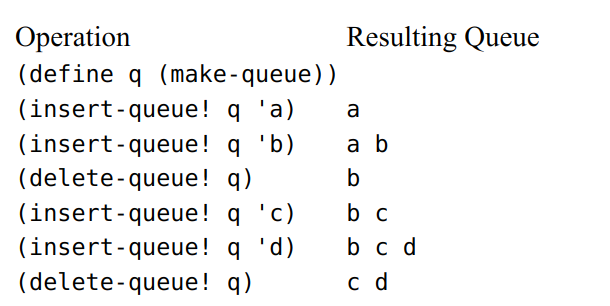

定义的构造器、选择器和修改器

**<1> a constructor:**

```lisp
(make-queue)
```

returns an **empty** queue (a queue containing no items).

构造一个空的队列

**<2> two selectors:**

```lisp
(empty-queue? <queue>)
```

tests if the queue is **empty**.

```lisp
(front-queue <queue>)
```

returns **the object at the front of the queue**, signaling an error if the queue is empty; it does not modify the queue.

队列是否空？

取队首的元素

**<3> two mutators:**

```lisp
(insert-queue! <queue> <item>)
```

**inserts the item at the rear of the queue** and returns the modified queue as its value.

```lisp
(delete-queue! <queue>)
```

removes the item at the front of the queue and returns the modified queue as its value, signaling an error if the queue is empty before the deletion.

将元素插入队列的尾部

弹出队首的元素

我们当然可以将其表示为普通list，但是insert-queue! 的效率会变为 $O(n)$

而如果用queue，就是 $O(1)$ 插入，$O(1)$ 删除

为了能够快速得到list末尾的指针，我们动态维护一个就可以：

将队列表示为一个列表，**加上一个指示列表中最后 一个 pair 的额外指针**

我们可以参考 rear 指针，从而**避免扫描列表**

queue：

front-ptr 和 rear-ptr 的cons

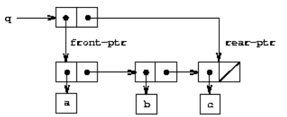

```lisp
(define (front-ptr queue) (car queue))
(define (rear-ptr queue) (cdr queue))
(define (set-front-ptr! queue item) (set-car! queue item))
(define (set-rear-ptr! queue (define (delete-queue! queue)
  (cond ((empty-queue? queue)
         (error "DELETE! called with an empty queue" queue))
        (else
         (set-front-ptr! queue (cdr (front-ptr queue)))
         queue))) item) (set-cdr! queue item))
```

上面是针对 front-ptr 和 rear-ptr 的 辅助过程

实现实际的队列操作如下：

```lisp
(define (empty-queue? queue) (null? (front-ptr queue)))
```

```lisp
(define (make-queue) (cons '() '()))
```

```lisp
(define (front-queue queue)
  (if (empty-queue? queue)
      (error "FRONT called with an empty queue" queue)
      (car (front-ptr queue))))
```

```lisp
(define (insert-queue! queue item)
  (let ((new-pair (cons item '())))
    (cond ((empty-queue? queue)
           (set-front-ptr! queue new-pair)
           (set-rear-ptr! queue new-pair)
           queue)
          (else
           (set-cdr! (rear-ptr queue) new-pair)
           (set-rear-ptr! queue new-pair)
           queue)))) 
```

先根据 item 构建一个新的 pair

然后分类看：

（1）如果原queue为空，那么就将queue的front和rear设置为new-pair

（2）如果原queue非空，那么需要设置queue 的 rear 的cdr 为new-pair，然后将rear-ptr 指向这个 new-pair

最后都是需要返回一个新的queue

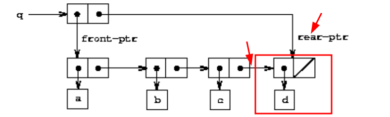


```lisp
(define (delete-queue! queue)
  (cond ((empty-queue? queue)
         (error "DELETE! called with an empty queue" queue))
        (else
         (set-front-ptr! queue (cdr (front-ptr queue)))
         queue))) 
```

如果发现queue是空的，还在delete，那么直接error即可

否则就只需要修改 queue 的front-ptr 即可，将front-ptr设置为front的cdr即可

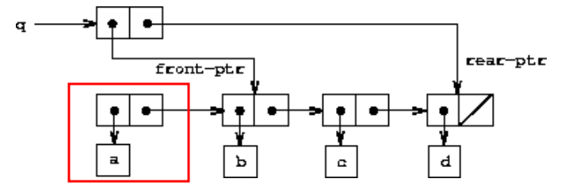


### 3.3.3 Representing Tables

回顾之前实现过的表结构：

（1）maintaining **a table of records** indexed **by identifying keys**

（2）**two-dimensional tables**, in which information is stored and retrieved using **two keys**

一个是有一个key的记录索引表

一个是有两个key二维表


接下来介绍构造可变的表结构。

```
a:  1
b:  2
c:  3
```

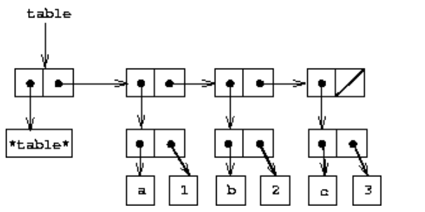

一个表由多个表项组成，每个表项就是一个pair，将这些pair串起来，就是一个table。


**（1）查找 lookup**

```lisp
(define (lookup key table)
  (let ((record (assoc key (cdr table))))
    (if record
        (cdr record)
        false)))
(define (assoc key records)
  (cond ((null? records) false)
        ((equal? key (caar records)) (car records))
        (else (assoc key (cdr records)))))
```

assoc 就是 根据records的指针和一个给定的key，查找table中的具体一个record。

lookup就是看assoc是否返回了有效的record，如果找到了，将cdr，也就是record的value返回即可。


**（2）插入 insert** 

```lisp
(define (insert! key value table)
  (let ((record (assoc key (cdr table))))
    (if record
        (set-cdr! record value)
        (set-cdr! table
                  (cons (cons key value) (cdr table)))))
  'ok)
```

  (if record
        (set-cdr! record value)
        (set-cdr! table
                  (cons (cons key value) (cdr table)))))
  'ok)先用 assoc 查找一下是否存在 record？

如果找到了record，通过set-cdr!就可以修改 value。

如果没有找到，就需要通过cons构建一个新的pair，然后通过set-cdr!将pair头插到table中。


**（3）构建 make-table**

```lisp
(define (make-table)
  (list '*table*))
```


#### Two-dimensional tables

```
math:
    +:  43
    -:  45
    *:  42
letters:
    a:  97
    b:  98
```

二维的表用多个一维表构造即可

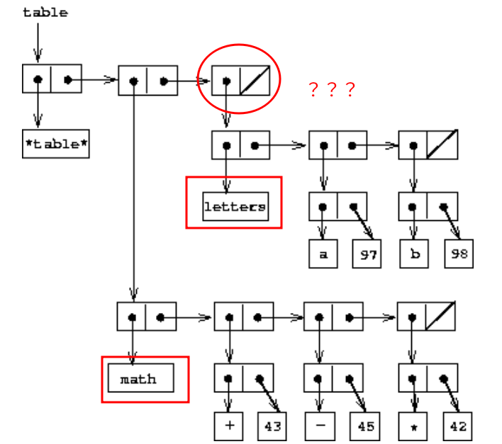

仔细看，其实二维表的结构和一维表的结构是一样的，将 pair 的 key 换为 子表的 名字，将 value 换为 子表本身即可。

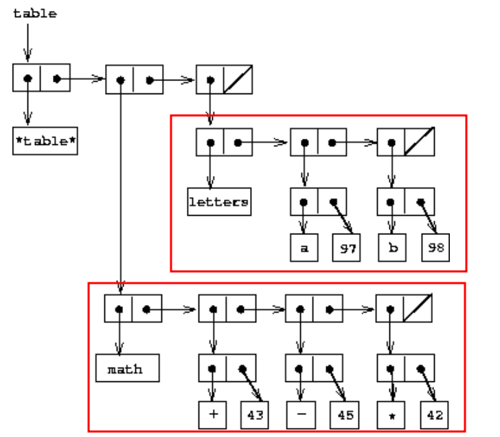

通过第一个key查找子表，然后用第二个key查找子表中的record即可

**（1）查找 lookup** 

```lisp
(define (lookup key-1 key-2 table)
  (let ((subtable (assoc key-1 (cdr table))))
    (if subtable
        (let ((record (assoc key-2 (cdr subtable))))
          (if record
              (cdr record)
              false))
        false)))
```

稍微改一下  一维表的 lookup 就可以了。


**（2）插入 insert**

```lisp
(define (insert! key-1 key-2 value table)
  (let ((subtable (assoc key-1 (cdr table))))
    (if subtable
        (let ((record (assoc key-2 (cdr subtable))))
          (if record
              (set-cdr! record value)
              (set-cdr! subtable
                        (cons (cons key-2 value)
                              (cdr subtable)))))
        (set-cdr! table
                  (cons (list key-1
                              (cons key-2 value))
                        (cdr table)))))
  'ok)
```

先根据key-1 查询对应的子表是否存在？

如果不存在，那么需要通过cons创建一个pair，然后用list创建一个list，最后通过cons和(cdr table)实现子表的头插！

如果key-1 存在，需要看key-2 在key-1 的子表中是否存在？

如果存在，通过assoc找到的record，直接修改 value 即可。

如果不存在，需要cons 和 set-cdr! 将 构建的 key - value pair头插到子表中。


#### Creating local tables

如果用之前的 local variables + dispatch ，message passing 的方式改写 table？

```lisp
(define (make-table)
  (let ((local-table (list '*table*)))
    (define (lookup key-1 key-2)
      (let ((subtable (assoc key-1 (cdr local-table))))
        (if subtable
            (let ((record (assoc key-2 (cdr subtable))))
              (if record
                  (cdr record)
                  false))
            false)))
    (define (insert! key-1 key-2 value)
      (let ((subtable (assoc key-1 (cdr local-table))))
        (if subtable
            (let ((record (assoc key-2 (cdr subtable))))
              (if record
                  (set-cdr! record value)
                  (set-cdr! subtable
                            (cons (cons key-2 value)
                                  (cdr subtable)))))
            (set-cdr! local-table
                      (cons (list key-1
                                  (cons key-2 value))
                            (cdr local-table)))))
      'ok)    
    (define (dispatch m)
      (cond ((eq? m 'lookup-proc) lookup)
            ((eq? m 'insert-proc!) insert!)
            (else (error "Unknown operation -- TABLE" m))))
    dispatch))

(define operation-table (make-table))
(define get (operation-table 'lookup-proc))
(define put (operation-table 'insert-proc!))
```

将 insert 和 lookup 进行简单的封装，就可以让表的结构作为局部变量隐含在make-table中。


### 3.3.4 A Simulator for Digital Circuits

Digital systems are constructed by interconnecting **simple elements.**

单个元素的行为很简单，但它们的网络可能具有非常复杂的行为

**Computer simulation** of proposed circuit designs is an important tool used by digital systems engineers.

计算机仿真进行数字系统的设计。

a kind of program called an **event-driven simulation**, in which **actions ("events'')** trigger further events that happen at a later time, which in turn trigger more events, and so so

事件驱动的仿真


（1）基本元件+传输数字信号的电线

（2）一个数字信号在任何时刻可能只有两个值中的一个，0和1

（3）输出信号延迟的时间取决于function box的类型


**逆变器**

an inverter is a primitive function box that inverts its input.

- If the input signal to an inverter changes to 1, 
- then one inverter-delay later the inverter will change its output signal to 0.

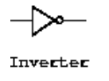


**与门**

An and-gate is a primitive function box with two inputs and one output.

- if both of its input signals become 1, then one and-gate-delay time later the and-gate will force its output signal to be 1;
- otherwise the output will be 0.

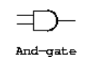

**或门**

An or-gate is a similar two-input primitive function box that drives its output signal to a value that is the logical or of the inputs.

- the output will become 1 if at least one of the input signals is 1;
- the output will become 1 if at least one of the input signals is 1;
- otherwise the output will become 0.

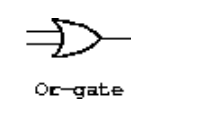


由于涉及到延迟，输出可能会在不同的时间产生。

数字电路设计中的许多困难都源于这一事实。


**半加器**

使用多个基本的逻辑门构建更加复杂功能的电路。

We can connect primitive functions together to **construct more complex functions.**

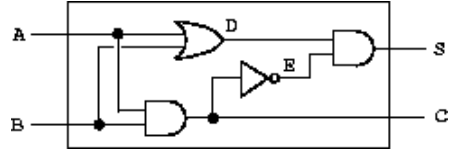

the half-adder circuit consists of an **or-gate, two and-gates, and an inverter.**

It takes two input signals, A and B, and has two output signals, S and C. 

S will become 1 whenever precisely one of A and B is 1, and C will become 1 whenever A and B are both 1.

- A和B中的一个恰好为1时，S就变成1。
- A和B都为1时，C就变成1。


**（1）make-wire**

```lisp
(define a (make-wire))
(define b (make-wire))
(define c (make-wire))

(define d (make-wire))
(define e (make-wire))
(define s (make-wire))
```

构建六根导线 a b c d e s

**（2）四个基本逻辑门**

```lisp
(or-gate a b d)
;ok

(and-gate a b c)
;ok

(inverter c e)
;ok

(and-gate d e s)
;ok
```

输入的参数是多个 wire 类型的变量

**（3）实现半加器**

```lisp
(define (half-adder a b s c)
  (let ((d (make-wire)) (e (make-wire)))
    (or-gate a b d)
    (and-gate a b c)
    (inverter c e)
    (and-gate d e s)
    'ok))
```

**（4）实现全加法器**

A full-adder circuit

```lisp
(define (full-adder a b c-in sum c-out)
  (let ((s (make-wire))
        (c1 (make-wire))
        (c2 (make-wire)))
    (half-adder b c-in s c1)
    (half-adder a s sum c2)
    (or-gate c1 c2 c-out)
    'ok))
```

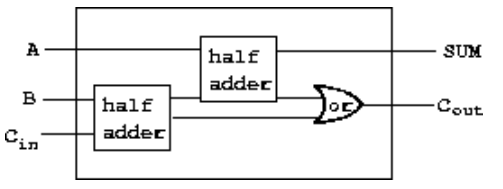

we can say that the **primitive function boxes** form the primitive elements of the language, **that wiring boxes together provides a means of combination**, and that specifying wiring patterns as procedures serves as **a means of abstraction.**


#### Primitive function boxes

为了构建基本的逻辑门，我们需要有下面三个过程：

```lisp
(get-signal <wire>)
```

returns the **current** value of the signal on the wire.

```lisp
(set-signal! <wire> <new value>)
```

**changes** the value of the signal on the wire to the new value.

```lisp
(add-action! <wire> <procedure of no arguments>)
```

asserts that the designated procedure should be run whenever the signal on the wire changes value. 

Such procedures are the vehicles by which **changes in the signal value on the wire are communicated to other wires.**

将导线上的信号值的变化传递给其他导线。

add-action!：只要导线上的信号有变化，就运行制定的过程。

after-delay：

takes a time delay and a procedure to be run and executes the given procedure after the given delay

延迟一段时间，然后执行给定的过程。


**（1）构建 inventer**

```lisp
(define (inverter input output)
  (define (invert-input)
    (let ((new-value (logical-not (get-signal input))))
      (after-delay inverter-delay
                   (lambda ()
                     (set-signal! output new-value)))))
  (add-action! input invert-input)
  'ok)
(define (logical-not s)
  (cond ((= s 0) 1)
        ((= s 1) 0)
        (else (error "Invalid signal" s))))
```


**（2）构建 and-gate**

```lisp
(define (and-gate a1 a2 output)
  (define (and-action-procedure)
    (let ((new-value
           (logical-and (get-signal a1) (get-signal a2))))
      (after-delay and-gate-delay
                   (lambda ()
                     (set-signal! output new-value)))))
  (add-action! a1 and-action-procedure)
  (add-action! a2 and-action-procedure)
  'ok)
```


#### Representing wires

下面介绍如何正确表示 wires！

A wire in our simulation will be a computational object with two local state variables: 

**a signal-value (initially taken to be 0)** and **a collection of action-procedures** to be run **when the signal changes value.**

信号值和一组操作过程。

message passing风格的代码如下：

```lisp
(define (make-wire)
  (let ((signal-value 0) (action-procedures '()))
    (define (set-my-signal! new-value)
      (if (not (= signal-value new-value))
          (begin (set! signal-value new-value)
                 (call-each action-procedures))
          'done))
    (define (accept-action-procedure! proc)
      (set! action-procedures (cons proc action-procedures))
      (proc))
    (define (dispatch m)
      (cond ((eq? m 'get-signal) signal-value)
            ((eq? m 'set-signal!) set-my-signal!)
            ((eq? m 'add-action!) accept-action-procedure!)
            (else (error "Unknown operation -- WIRE" m))))
    dispatch))
(define (call-each procedures)
  (if (null? procedures)
      'done
      (begin
        ((car procedures))
        (call-each (cdr procedures)))))
```

（1）'get-signal触发 signal-value

返回局部变量  signal-value 即可

（2）'set-signal!触发 set-my-signal!

如果发现signal发生变化，那么就设置signal-value为new-value

并且遍历 action-procedures，重新执行每个过程（call-each）。

（3） 'add-action!触发 accept-action-procedure!

头插法将proc插入action-procedures这个list中

**实现 get-signal、get-signal!和add-action!**

```lisp
(define (get-signal wire)
  (wire 'get-signal))
(define (set-signal! wire new-value)
  ((wire 'set-signal!) new-value))
(define (add-action! wire action-procedure)
  ((wire 'add-action!) action-procedure))
```

In a language in which we can deal with procedures as objects, **there is no fundamental difference between "procedures'' and  "data,''** and we can choose our **syntactic sugar** to allow us to program in whatever style we choose.

1. 将wire 看作成了一个过程，传递给其一个message，得到这个message对应的过程
2. 通过封装  get-signal等又看成了将wire作为数据的一个过程
3. 过程和数据似乎没有明显的边界


#### The agenda

我们需要完成after-delay

为此，我们需要实现agenda

**（1）构造器**

```lisp
(make-agenda)
```

returns a new empty agenda.

**（2）谓词**

```lisp
(empty-agenda? <agenda>)
```

is true if the specified agenda is empty.

**（3）选择器**

```lisp
(first-agenda-item <agenda>)
```

returns **the first item on the agenda.**

```lisp
(current-time <agenda>)
```

returns **the current simulation time.**

**（4）修改器**

```lisp
(remove-first-agenda-item! <agenda>)
```

modifies the agenda **by removing the first item.**

```
(add-to-agenda! <time> <action> <agenda>)
```

modifies the agenda by **adding the given action procedure to be run at the specified time.**

**（5）实现 after-dalay**

```lisp
(define (after-delay delay action)
  (add-to-agenda! (+ delay (current-time the-agenda))
                  action
                  the-agenda))
```

1. procedure propagate在agenda上操作，按顺序执行agenda上的每个过程
2. 随着simulation运行，新的item将被添加到agenda中，只要agenda上有item，propagate将继续simulation

```lisp
(define (propagate)
  (if (empty-agenda? the-agenda)
      'done
      (let ((first-item (first-agenda-item the-agenda)))
        (first-item)
        (remove-first-agenda-item! the-agenda)
        (propagate))))
```


#### A sample simulation

```lisp
(define (probe name wire)
  (add-action! wire
               (lambda ()        
                 (newline)
                 (display name)
                 (display " ")
                 (display (current-time the-agenda))
                 (display "  New-value = ")
                 (display (get-signal wire)))))
```

places a "probe'' on a wire, shows **the simulator in action.** 

The probe tells the wire that, whenever its signal changes value, **it should print the new signal value, together with the current time and a name that identifies the wire**

probe：探针，其实就是一个tracer，只要wire的signal发生了变化，那就会触发这个过程

**打印name、current-time和new-signal**


**（1）定义agenda和基本逻辑门的延迟**

```lisp
(define the-agenda (make-agenda))
(define inverter-delay 2)
(define and-gate-delay 3)
(define or-gate-delay 5)
```

**（2）构建四个wire，并对两个output wire 设置probe**

 ```lisp
 (define input-1 (make-wire))
 (define input-2 (make-wire))
 (define sum (make-wire))
 (define carry (make-wire))
 (probe 'sum sum)
 ;sum 0  New-value = 0
 (probe 'carry carry)
 ;carry 0  New-value = 0
 ```

**（3）构建半加法器，修改输入input-1为1，看结果**

```lisp
(half-adder input-1 input-2 sum carry)
;ok
(set-signal! input-1 1)
;done
(propagate)
;sum 8  New-value = 1
;done
```

**（4）修改 input-2为1，看结果**

```lisp
(set-signal! input-2 1)
;done
(propagate)
;carry 11  New-value = 1
;sum 16  New-value = 0
;done
```


#### Implementing the agenda

接下来，我们将实现 agenda

A newly constructed agenda has no time segments and **has a current time of 0**

The agenda is made up of time segments.

一维的时间段表，按照时间的增加顺序排序。

Each time segment is a pair consisting of a number (the time) and a queue that holds the procedures that are scheduled to be run during that time segment.

- 多个时间片组成
- 每个时间片是一个pair
- 每个pair是一个time和一个将在这个时间执行的过程队列

```lisp
(define (make-time-segment time queue)
  (cons time queue))
(define (segment-time s) (car s))
(define (segment-queue s) (cdr s))
```

queue已经实现了

we store the current time (i.e., the time of the **last action** that was processed) at the head of the agenda

但是由于列表是按时间命名的，我们**不需要额外的假头**

we do not need an additional dummy header **(such as the \*table\* symbol used with tables).**


agenda的过程如下：

```lisp
(define (make-agenda) (list 0))
(define (current-time agenda) (car agenda))
(define (set-current-time! agenda time)
  (set-car! agenda time))
(define (segments agenda) (cdr agenda))
(define (set-segments! agenda segments)
  (set-cdr! agenda segments))
(define (first-segment agenda) (car (segments agenda)))
(define (rest-segments agenda) (cdr (segments agenda)))
(define (empty-agenda? agenda)
  (null? (segments agenda)))
;An agenda is empty if it has no time segments
```

向agenda中添加一个time和action：

```lisp
(define (add-to-agenda! time action agenda)
  (define (belongs-before? segments)
    (or (null? segments)
        (< time (segment-time (car segments)))))
  (define (make-new-time-segment time action)
    (let ((q (make-queue)))
      (insert-queue! q action)
      (make-time-segment time q)))
  (define (add-to-segments! segments)
    (if (= (segment-time (car segments)) time)
        (insert-queue! (segment-queue (car segments))
                       action)
        (let ((rest (cdr segments)))
          (if (belongs-before? rest)
              (set-cdr!
               segments
               (cons (make-new-time-segment time action)
                     (cdr segments)))
              (add-to-segments! rest)))))
  (let ((segments (segments agenda)))
    (if (belongs-before? segments)
        (set-segments!
         agenda
         (cons (make-new-time-segment time action)
               segments))
        (add-to-segments! segments))))
```

（1）如果agenda为空，即没有时间片，那么需要用make-new-time-segment构建一个时间片。

（2）agenda 是按照时间片递增的顺序进行存储的，那么如果time小于第一个时间片的time，那么就直接构建一个新时间片，然后插入agenda的最前面。

（3）否则，就需要用add-to-segments!扫描整个agenda，

- 如果找到指定时间的片段，将action插入这个时间片的queue即可
- 如果没有找到时间的片段，而是找到了一个比time更大的时间片，那么我们需要构建一个新的时间片并将这个时间片插到它的前面。
- 如果到了agenda的最后，就需要插入agenda的最后。


本质应该就是一个按照time递增的有序表。

agenda删除移除item

```lisp
(define (remove-first-agenda-item! agenda)
  (let ((q (segment-queue (first-segment agenda))))
    (delete-queue! q)
    (if (empty-queue? q)
        (set-segments! agenda (rest-segments agenda)))))
```

（1）取第一个时间片的queue，弹出第一个item即可

（2）如果发现queue空了，那么就将时间片从agenda中移除

 `if` expression returns an unspecified value **if the predicate is false and there is no <*alternative*>.**


每次获取agenda中的第一个item时，需要更新current time

```lisp
(define (first-agenda-item agenda)
  (if (empty-agenda? agenda)
      (error "Agenda is empty -- FIRST-AGENDA-ITEM")
      (let ((first-seg (first-segment agenda)))
        (set-current-time! agenda (segment-time first-seg))
        (front-queue (segment-queue first-seg)))))
```

返回的是first-seq的queue的第一个item，通过front-queue获取


