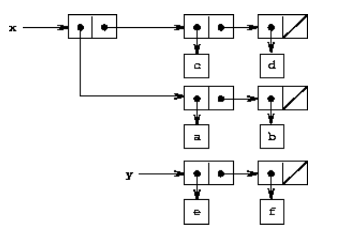
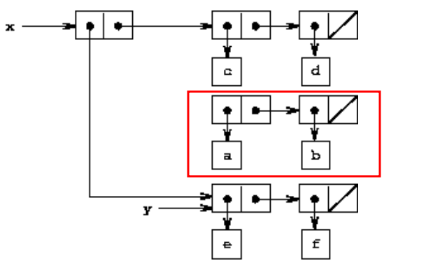
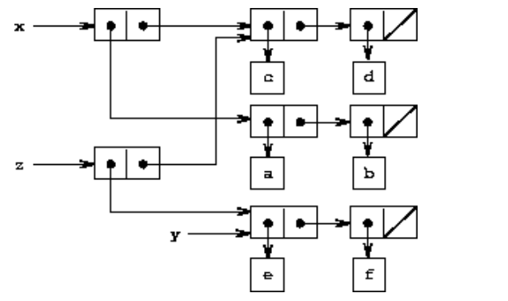
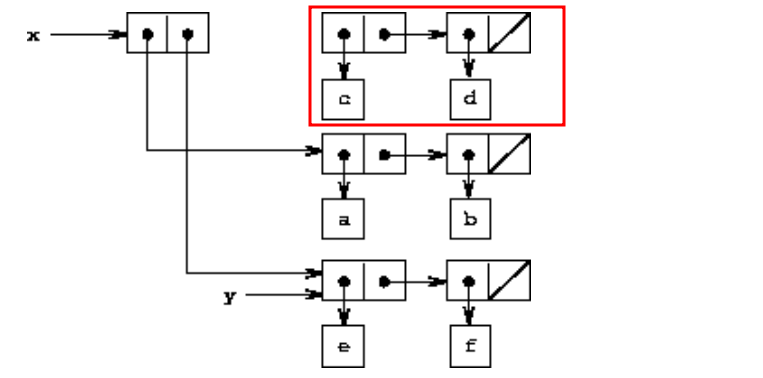

## 3.3 Modeling with Mutable Data

recall chapter2：

数据抽象的原则，数据结构用**构造函数和选择器来指定**，构造函数创建数据对象，**选择器访问复合数据对象的各个部分**。

pair作为合成复合数据的通用“粘合剂”。


现在：

我们需要定义**可变数据类型**。

为了对状态变化的复合对象进行建模，除了选择器和构造器之外，我们还将设计数据抽象，包括称为mutator的操作，这些操作**可以修改数据对象**。

为其定义了mutator的数据对象称为**可变数据对象**。

复杂系统被建模为具有**局部状态的对象集合**。

为最基本的pair定义mutator，

**然后就可以根据这个有mutator性质的变量构造mutable data objects**


### 3.3.1 Mutable List Structure



```lisp
; x
(list (list a b) c d)
; y
(list e f)
```


下面为pair添加两个新的过程：

**（1）set-car!**

```
(set-car! x y)
```

x 必须是一个pair，将x 的 car 替换为 y

```lisp
(define x (list (list a b) c d))
(define y (list e f))
(set-car! x y)
; (list (list e f) c d)
```



这样可能会有一些“垃圾”生成，可以用垃圾回收解决。

```lisp
(define z (cons y (cdr x)))
```




**（2）set-cdr!**

```
(set-cdr! x y)
```

x 必须是一个pair，将x 的 cdr 替换为 y

```lisp
(define x (list (list a b) c d))
(define y (list e f))
(set-cdr! x y)
```



（3）使用 set-car!，set-cdr!和 get-new-pair 可以实现 cons：

```lisp
(define (cons x y)
  (let ((new (get-new-pair)))
    (set-car! new x)
    (set-cdr! new y)
    new))
```

get-new-pair是Lisp实现中必须作为内存管理的一部分来实现的操作之一。


