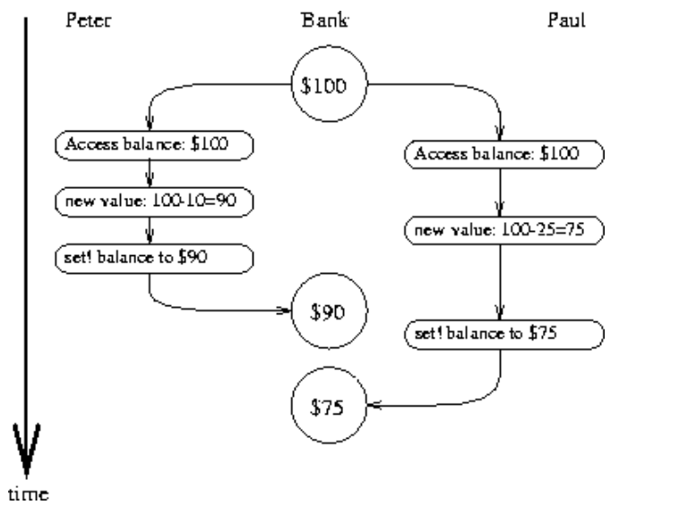

## 3.4 Concurrency: Time Is of the Essence


一旦语言引入了set!，即有了具有local state 的对象，那么会下面的问题：

the loss of referential transparency, giving rise to a thicket of questions about **sameness and change**

the need to abandon the substitution model of evaluation in favor of the more **intricate environment model**

（1）同一性问题不好处理

（2）抛弃替代模型，而是使用环境模型

（3）没有引入set!，那么就所有的过程给定相同的参数，那么结果都是一样的，但是引入了set!，就需要考虑time对结果的影响。

```lisp
(withdraw 25)
;75
(withdraw 25)
;50
```

we are forced to **admit time** into our computational models

Building models in terms of computational objects with local state forces us to **confront time as an essential concept in programming.**


（1）并发更加符合实际

（2）并发速度快

（3）将一个人物切分为多个子部分，每个子部分之间通信少，**那么就会有和处理器数量成比例的速度优势**

（4）并发不好理解，复杂性高


Time is a device that was invented to **keep everything from happening at once**

时间是一种装置，被发明出来是为了防止一切同时发生。


### 3.4.1 The Nature of Time in Concurrent Systems

what is time？

**It is an ordering imposed on events.**


银行有 \$100，A要取  \$10，B要取 \$25

那么可能的序列是：

- \$100 -> \$90 -> \$65
- $100 -> \$75 -> \$65


有问题的语句就是这个 set!

```lisp
(set! balance (- balance amount))
```

(1) accessing the value of the `balance` variable; 

(2) computing the new balance; 

(3) setting `balance` to this new value. 


两个同时执行这个语句的对象，可能会有多种可能的顺序，

由于balance是共享的，那么就有数据竞争。


为了保证一致性，需要设计一些**复杂的保护机制**防止出现问题。


- 几个过程可能**共享一个共同的状态变量**。
- 多个进程可能同时试图操作**共享状态**。
- 在每个过程期间，**每个进程都应该能够像其他进程不存在一样运行指令。**


#### Correct behavior of concurrent programs

我们需要对共享一个变量的进程的set!进行限制：



上面的就是错误情况。


For distributed banking, it would require the system designer to ensure that only one transaction could proceed at a time. 

**This would be both inefficient and overly conservative.**


（1）如果顺序不同，结果相同，那么限制就弱，不用控制顺序也行。

（2）如果和顺序完全没有关系，那么限制就是最弱的，没有任何限制，随便写。

A program for simulating diffusion (say, **the flow of heat in an object**) might consist of **a large number of processes**, each one representing a small volume of space, that update their values concurrently.

Each process repeatedly changes its value to **the average of its own value and its neighbors' values**.

This algorithm **converges to the right answer** independent of the order in which the operations are done;

there is **no need for any restrictions** on concurrent use of the shared values.

即结果和过程无关，就不需要关注并发带来的问题。


### 3.4.2 Mechanisms for Controlling Concurrency

处理并发进程的困难根源于需要考虑**不同进程中事件顺序的交错**


两个 进程，各自有3个语句，那么可能的顺序有20种。
$$
\frac{A_6^6}{A_3^3A_3^3}=\frac{6*5*4*3*2*1}{3*2*1*3*2*1}=20
$$
Many mechanisms have been developed for this purpose. 

**In this section, we describe one of them, the *serializer*.**


#### Serializing access to shared state

Processes will execute concurrently, **but there will be certain collections of procedures that cannot be executed concurrently.**

serialization creates distinguished sets of procedures such **that only one execution of a procedure in each serialized set is permitted to happen at a time**

If some procedure in the set is being executed, **then a process that attempts to execute any procedure in the set will be forced to wait until the first execution has finished**.


#### Serializers in Scheme

创建同时执行的进程，pk 不带参数：

```lisp
(parallel-execute <p1> <p2> ... <pk>)
```

```lisp
(define x 10)
(parallel-execute (lambda () (set! x (* x x)))
                  (lambda () (set! x (+ x 1))))
```

可能的结果：

11、100、101、121、110


下面构造Serializer：

```lisp
(define x 10)
(define s (make-serializer))
(parallel-execute (s (lambda () (set! x (* x x))))
                  (s (lambda () (set! x (+ x 1)))))
```

可能的结果：

101、121。

交叉执行的可能性被消除了。


下面是对 make-account 的串行化：

```lisp
(define (make-account balance)
  (define (withdraw amount)
    (if (>= balance amount)
        (begin (set! balance (- balance amount))
               balance)
        "Insufficient funds"))
  (define (deposit amount)
    (set! balance (+ balance amount))
    balance)
  (let ((protected (make-serializer)))
    (define (dispatch m)
      (cond ((eq? m 'withdraw) (protected withdraw))
            ((eq? m 'deposit) (protected deposit))
            ((eq? m 'balance) balance)
            (else (error "Unknown request -- MAKE-ACCOUNT"
                         m))))
    dispatch))
```

**每个帐户都有自己的序列化器，因此不同帐户的存取款可以同时进行。**


#### Complexity of using multiple shared resources

（1）只有一个共享资源，用 serializer 十分简单

（2）多个共享资源，用serializer十分困难

while using serializers is relatively straightforward when there is only a single shared resource (such as a single bank account), **concurrent programming can be treacherously difficult when there are multiple shared resources.**


下面给出一个例子：

- 交换两个account的账户余额
- 访问每个帐户以查找余额，**计算余额之间的差额，从一个帐户提取差额，并将其存入另一个帐户**

我们利用存款信息接受负数的事实，简化了兑换，实际上是不正确的，输入不能为负数。

```lisp
(define (exchange account1 account2)
  (let ((difference (- (account1 'balance)
                       (account2 'balance))))
    ((account1 'withdraw) difference)
    ((account2 'deposit) difference)))
```


即使对个人帐户进行了帐户存取款序列化(如本节中所示的make-account过程)，

exchange仍然可能产生不正确的结果。


原因是 exchange 并不是原子操作。。。

For correct behavior, we must arrange for the exchange procedure to lock out any other concurrent accesses to the accounts during the entire time of the exchange.


下面需要为 account 添加一个新的message，即 balance-serializer。

```lisp
(define (make-account-and-serializer balance)
  (define (withdraw amount)
    (if (>= balance amount)
        (begin (set! balance (- balance amount))
               balance)
        "Insufficient funds"))
  (define (deposit amount)
    (set! balance (+ balance amount))
    balance)
  (let ((balance-serializer (make-serializer)))
    (define (dispatch m)
      (cond ((eq? m 'withdraw) withdraw)
            ((eq? m 'deposit) deposit)
            ((eq? m 'balance) balance)
            ((eq? m 'serializer) balance-serializer)
            (else (error "Unknown request -- MAKE-ACCOUNT"
                         m))))
    dispatch))
```


```lisp
(define (deposit account amount)
  (let ((s (account 'serializer))
        (d (account 'deposit)))
    ((s d) amount)))
```


下面是给出新的 exchange 的过程描述：

```lisp
(define (serialized-exchange account1 account2)
  (let ((serializer1 (account1 'serializer))
        (serializer2 (account2 'serializer)))
    ((serializer1 (serializer2 exchange))
     account1
     account2)))
```

实际上就是在原先的 exchange 的基础上加一层 serializer 。


#### Implementing serializers 

The term "mutex'' is an abbreviation for **mutual exclusion.**

The general problem of arranging a mechanism that permits concurrent processes to safely share resources is called the **mutual exclusion problem.**

Our mutex is **a simple variant of the semaphore** mechanism.

The acquire and release operations were originally **called P and V**, from the Dutch words passeren (to pass) and vrijgeven (to release), in reference to the semaphores used on railroad systems.

Dijkstra's classic exposition (1968b) was one of the first to clearly present the issues of **concurrency control,** and showed how to **use semaphores to handle a variety of concurrency problems**.


互斥锁：

A mutex is an object that supports two operations -- 

the mutex can be **acquired**, and the mutex can be **released**.

Given a procedure p

- the serializer returns a procedure 
- that acquires the mutex,
- runs p
- releases the mutex.

Once a mutex has been acquired, 

**no other acquire operations on that mutex may proceed until the mutex is released**


```lisp
(define (make-serializer)
  (let ((mutex (make-mutex)))
    (lambda (p)
      (define (serialized-p . args)
        (mutex 'acquire)
        (let ((val (apply p args)))
          (mutex 'release)
          val))
      serialized-p)))
```


关键就是 (mutex 'acquire) 和 (mutex 'release) 怎么写？

The mutex is a mutable object (here we'll use a **one-element list**, 

which we'll refer to as a cell) that can **hold the value true or false.**

When the value is **false**, the mutex is available to **be acquired**.

When the value is **true**, the mutex is **unavailable**, 

and any process that attempts to acquire the mutex **must wait**.


acquire：

If the mutex is available, we set the cell contents to true and proceed.

Otherwise, w**e wait in a loop, attempting to acquire over and over again, until we find that the mutex is available**


release：

we set the cell contents to false.


mutex 的定义如下：

```lisp
(define (test-and-set! cell)
  (if (car cell)
      true
      (begin (set-car! cell true)
             false)))

(define (clear! cell)
  (set-car! cell false))

(define (make-mutex)
  (let ((cell (list false)))            
    (define (the-mutex m)
      (cond ((eq? m 'acquire)
             (if (test-and-set! cell)
                 (the-mutex 'acquire))) ; retry
            ((eq? m 'release) (clear! cell))))
    the-mutex))
```

我们必须保证，一旦某个进程测试了单元格并发现它为false，**那么在任何其他进程可以测试单元格之前，单元格内容实际上将被设置为true**

we must guarantee that, once a process has tested the cell and found it to be false, **the cell contents will actually be set to true before any other process can test the cell.**

If we do not make this guarantee, then the mutex can fail.


必须要要保证test-and-set!是原子的！！！


需要补充注意的点：

（1）大多数分时操作系统中，被互斥锁阻塞的进程**不会像上面那样浪费时间“忙等待”**。

（2）当第一个进程等待时，系统安排另一个进程运行，**当互斥锁可用时，被阻塞的进程被唤醒**。

（3）在进行test-and-set!的时候，记得关闭中断，保证原子性。

```lisp
(define (test-and-set! cell)
  (without-interrupts
   (lambda ()
     (if (car cell)
         true
         (begin (set-car! cell true)
                false)))))
```

（4）test-and-test!有许多的变种：

```
test-and-test
test-and-clear
test-and-swap
compare-and-exchange
load-reserve
store-conditional
```

design must be carefully matched to **the machine's processor-memory interface.**

它们的设计必须小心地**与机器的处理器-内存接口相匹配**。


（5）如果两个过程同时进行访问，那么据需要决定到底给谁，这个就是仲裁者。

且无法制造物理上的100%公平的仲裁硬件。。。。

Arbiters usually boil down to **some sort of hardware device.**

it is possible to prove that one cannot physically construct a fair arbiter **that works 100% of the time unless one allows the arbiter an arbitrarily long time to make its decision.**

The fundamental phenomenon here was originally observed by **the fourteenth-century French philosopher Jean Buridan in his commentary on Aristotle's De caelo.**

由14世纪法国哲学家让·布里丹在他对亚里士多德的《论凯洛》的评论中观察到的。

如果一只完全理性的狗被放在**两个同样吸引人的食物来源之间，它会饿死**，因为它无法决定先吃哪个。


#### Deadlock

**Each process is stalled forever, waiting for the other.**

This situation is called a deadlock.

Deadlock is always a danger in systems that provide concurrent access to multiple shared resources


如何解决死锁？

为每个帐户提供唯一标识号并重写序列化交换，以便进程总是尝试进入**保护编号最低的帐户的过程**

give each account a **unique identification number** and rewrite serialized-exchange so that a process will always attempt to enter a procedure **protecting the lowest-numbered account first.**


exchange problem 有用，但是其他问题没用，需要用更加复杂的办法，或者是根本没法解决dead lock。


如果没法避免死锁？就需要用死锁恢复技术！

Situations where deadlock cannot be avoided require deadlock-recovery methods, which entail having processes **"back out'' of the deadlocked state and try again.**


（1）The general technique for avoiding deadlock **by numbering the shared resources** and acquiring them in order is due to Havender (1968).

（2）**Deadlock-recovery** mechanisms are widely used in database management systems, a topic that is treated in detail in Gray and Reuter 1993.


#### Concurrency, time, and communication

it's not always clear what is meant by "shared state.''

到底的共享状态意味着什么？


现代处理器也并没有使用 serializer 来解决互斥。。。否则效率会特别低下，

在任意时间检查全局共享标志，由于流水线和缓存内存等优化技术，**内存的内容可能不会在每个瞬间都处于一致的状态。**

One such alternative to serialization is called barrier synchronization.

The programmer permits concurrent processes to execute as they please, **but establishes certain synchronization points ("barriers'') through which no process can proceed until all the processes have reached the barrier.**

Modern processors provide machine instructions that **permit programmers to establish synchronization points at places where consistency is required.**

使用内存屏障构建一个同步点！！！


并发控制中的任何时间概念都必须与通信紧密联系在一起。

In essence, any notion of time in concurrency control must be intimately tied to **communication**

It is intriguing that a similar connection **between time and communication** also arises in **the Theory of Relativity**, where the speed of light **(the fastest signal that can be used to synchronize events)** is a fundamental **constant relating time and space.**

The complexities we encounter in dealing with time and state in our computational models **may in fact mirror a fundamental complexity of the physical universe.**

在相对论中也出现了类似的时间和通信之间的联系，

其中光速(可用于同步事件的最快信号)是时间和空间的基本常数。

我们在计算模型中处理时间和状态时遇到的复杂性，实际上可能反映了**物理世界的基本复杂性**。


分布式系统中如何构建事件顺序？

For distributed systems, this perspective was pursued by Lamport (1978), **who showed how to use communication to establish "global clocks'' that can be used to establish orderings on events in distributed systems.**

如何使用通信来建立“全局时钟”，该时钟**可用于在分布式系统中建立事件顺序**。


**parallel-execute 代码**

```lisp
(define (parallel-execute . thunks)
  (let ((my-threads '()))
    (define (terminator)
      (without-interrupts
       (lambda ()
         (for-each kill-thread my-threads)
         (set! my-threads '())
         unspecific)))
    (without-interrupts
     (lambda ()
       (set! my-threads
             (map (lambda (thunk)
                    (let ((thread (create-thread #f thunk)))
                      (detach-thread thread)
                      thread))
                  thunks))
       unspecific))
    terminator))
```


