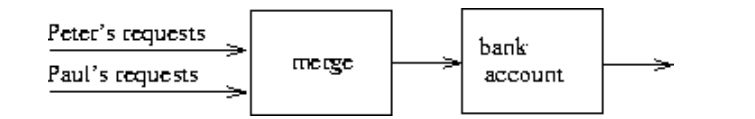

## 3.5 Streams

In this section, we explore an alternative approach to modeling state, 

**based on data structures called *streams*.**


使用 streams 来缓解modeling state 的复杂性。


（1）引入stream，其实就是一个 list

（2）每个变量都是 t 的函数，即 x(t)

（3）引入延迟求值的技术

the technique of delayed evaluation


###  3.5.1 Streams Are Delayed Lists


回忆：

list 的通用接口，map、filter、accumulate等

简洁又优雅的方法。

但是效率低。

our programs must construct and **copy data structures (which may be huge) at every step of a process**


计算区间内所有素数和：

（1）程序1，迭代风格

```lisp
(define (sum-primes a b)
  (define (iter count accum)
    (cond ((> count b) accum)
          ((prime? count) (iter (+ count 1) (+ count accum)))
          (else (iter (+ count 1) accum))))
  (iter a 0))
```

（2）程序2，使用accumulate

```lisp
(define (sum-primes a b)
  (accumulate +
              0
              (filter prime? (enumerate-interval a b))))
(car (cdr (filter prime?
                  (enumerate-interval 10000 1000000))))
```

We **construct** a list of almost a million integers, **filter** this list by testing each element for primality, and then **ignore** almost all of the result.


为什么使用 stream？

We can formulate programs elegantly **as sequence manipulations**, while attaining the efficiency of incremental computation.

we design our **stream implementation** to automatically and transparently **interleave** the construction of the stream with its use.


stream 的构造器和选择器？

```lisp
(stream-car (cons-stream x y)) = x
(stream-cdr (cons-stream x y)) = y
```


empty-stream和stream-null?

There is a distinguishable object, **the-empty-stream**, which cannot be the result of any cons-stream operation, and which **can be identified with the predicate stream-null?**


**（1）stream-ref**

```lisp
(define (stream-ref s n)
  (if (= n 0)
      (stream-car s)
      (stream-ref (stream-cdr s) (- n 1))))
```

类似于根据 n 取出 stream 的第 n 个


**（2）stream-map**

```lisp
(define (stream-map proc s)
  (if (stream-null? s)
      the-empty-stream
      (cons-stream (proc (stream-car s))
                   (stream-map proc (stream-cdr s)))))
```

和 list 的map一样，就是通过递归遍历整个 stream，对stream 的每个 car 进行 proc 的运算后得到一个新的 stream。


**（3）stream-for-each** 

```lisp
(define (stream-for-each proc s)
  (if (stream-null? s)
      'done
      (begin (proc (stream-car s))
             (stream-for-each proc (stream-cdr s)))))
```

这个和map十分类似，但是并没有用 cons-stream，

仅仅是遍历整个 stream，然后对stream的每个car 调用 proc。

`Stream-for-each` is useful for viewing streams:

```lisp
(define (display-stream s)
  (stream-for-each display-line s))

(define (display-line x)
  (newline)
  (display x))
```


To make the stream implementation **automatically and transparently interleave** the construction of a stream with its use, we will arrange for the **cdr of a stream** to be evaluated **when it is accessed by the stream-cdr** procedure rather than when the stream is constructed by cons-stream.

（1）不在cons-stream进行cdr的evaluate

（2）而是在 stream-cdr时进行cdr的evaluate

With **ordinary lists**, both the car and the cdr are evaluated **at construction time**.

With **streams**, the cdr is evaluated **at selection time**.


为了实现 stream，我们需要 delay 和 force这两个过程：

**（1）delay：**

Evaluating (delay &lt;exp&gt;) does not evaluate the expression &lt;exp&gt;, but rather returns **a so-called delayed object**, which we can think of **as a "promise'' to evaluate &lt;exp&gt; at some future time.**

在未来的某个时刻promise，保证evaluate <exp>！


**（2）force：**

takes a delayed object as argument and performs the evaluation -- 

**in effect, forcing the delay to fulfill its promise.**

强制 dealy 履行其承诺


```lisp
(cons-stream <a> <b>)
(cons <a> (delay <b>))
```

两者等价


rather than placing the value of the rest of the stream into the cdr of the pair **we will put there a promise to compute the rest if it is ever requested.**


```lisp
(define (stream-car stream) (car stream))
(define (stream-cdr stream) (force (cdr stream)))
```


**cons-stream must be a special form.**

**delay** must be a special form, though **force** can be an **ordinary procedure.**


- cons-stream 和 delay 必须是特殊的过程
- 但是 force 可以是一个普通的过程。


#### The stream implementation in action

使用stream重新描述 计算某个区间的素数和？

```lisp
(define (stream-enumerate-interval low high)
  (if (> low high)
      the-empty-stream
      (cons-stream
       low
       (stream-enumerate-interval (+ low 1) high))))

(define (stream-filter pred stream)
  (cond ((stream-null? stream) the-empty-stream)
        ((pred (stream-car stream))
         (cons-stream (stream-car stream)
                      (stream-filter pred
                                     (stream-cdr stream))))
        (else (stream-filter pred (stream-cdr stream)))))

(stream-car
 (stream-cdr
  (stream-filter prime?
                 (stream-enumerate-interval 10000 1000000))))
; 得到第二个素数就停下来！
```


**（1）解释一下 stream-enumerate-interval？**

```lisp
(cons 10000
      (delay (stream-enumerate-interval 10001 1000000)))
->
(stream-filter prime?
                 (stream-enumerate-interval 10000 1000000))
```

其cdr是一个承诺，如果有request，将继续执行 (stream-enumerate-interval)。


**（2）解释一下 stream-filter？**

用 stream-car 看一下car对应的数，发现是 10000，不是素数，于是强制执行 stream-enumerate-interval

就这样，一直强制执行 stream-enumerate-interval，

直到发现 10007 不是素数，

 于是 stream-filter 返回

```lisp
(cons 10007
      (delay
        (stream-filter
         prime?
         (cons 10008
               (delay
                 (stream-enumerate-interval 10009
                                            1000000))))))
```


we can think of delayed evaluation as **"demand-driven'' programming**, whereby each stage in the stream process **is activated only enough to satisfy the next stage.**


计算是增量进行的，并没有一次性计算完，**只是表现得像一次性全部计算完了**。。。


也就是一种 "lazy evaluation"，能不计算，就不计算。


####  Implementing `delay` and `force`

**（1） delay**

```lisp
(delay <exp>)
->
(lambda () <exp>)
```

delay must package an expression 

本质就是用 lambda 表达式将 exp 进行 "保存"。


**（2）force**

```lisp
(define (force delayed-object)
  (delayed-object))
```

本质就是 直接调用 delay 的lambda 表达式，将保存的 exp  "释放" 出来。


In many applications, we end up **forcing the same delayed object many times.**

This can lead to serious **inefficiency** in recursive programs involving streams.

为了提高效率，需要优化 force ，使用记忆化！！！

第一次运行时，它保存计算结果，在随后的求值中，它只返回结果。


```lisp
(define (memo-proc proc)
  (let ((already-run? false) 
        (result false))
    (lambda ()
      (if (not already-run?)
          (begin (set! result (proc))
                 (set! already-run? true)
                 result)
          result))))
(memo-proc (lambda () <exp>))
```

The memoizing optimization is also known as **call-by-need.**

按需调用。


```lisp
(define (delay exp)
    (define (memo-proc proc)
        (let ((already-run? false) 
              (result false))
             (lambda ()
                     (if (not already-run?)
                         (begin (set! result (proc))
                                (set! already-run? true)
                                result)
                         result))))
    (memo-proc (lambda () exp))
    )
(define (force delayed-object)
  (delayed-object))
```

改进后的delay：

- already-run? 表示这个proc是否被执行过？
- result表示记录的结果，如果proc被执行过，直接返回第一次运行时保存的result即可。


### 3.5.2 Infinite Streams

（1）stream实现了一个假的list，我们只需要计算stream的一部分

（2）可以用stream表示无限流，即无限长的序列


表示 正整数：

```lisp
(define (integers-starting-from n)
  (cons-stream n (integers-starting-from (+ n 1))))
(define integers (integers-starting-from 1))
```

This is an infinitely long stream, **but in any given time we can examine only a finite portion of it.**


不能被7整除的无限流：

```lisp
(define (divisible? x y) (= (remainder x y) 0))
(define no-sevens
  (stream-filter (lambda (x) (not (divisible? x 7)))
                 integers))
(stream-ref no-sevens 100)
;117
```


定义无限的斐波那契数流：

```lisp
(define (fibgen a b)
  (cons-stream a (fibgen b (+ a b))))
(define fibs (fibgen 0 1))
```


使用多个无限流的组合得到 the *sieve of Eratosthenes*

```lisp
(define (sieve stream)
  (cons-stream
   (stream-car stream)
   (sieve (stream-filter
           (lambda (x)
             (not (divisible? x (stream-car stream))))
           (stream-cdr stream)))))
(define primes (sieve (integers-starting-from 2)))
(stream-ref primes 50)
;233
```


理解上面的过程？

1. (integers-starting-from 2) 就是构造一个从2开始的无限流
2. 第一次取出的stream-car 就是2，而2本身就是一个素数，使用 stream-filter 过滤 从3开始的无限流中将2整除的数，依此类推。
3. 最后得到的就是一堆素数！！！


Henderson disgram 如下：


The input stream feeds into an "**unconser**'' that separates the first element of the stream from the rest of the stream.

Not only is the stream infinite, but the signal processor is also infinite, because the sieve contains a sieve within it.

（1）unconser 就是  将 car 和 cdr 分开

（2）cons 就是 将 car 和 cdr 进行拼接

（3）对cdr 进行filter后和经过sieve后的部分进行cons拼接


#### Defining streams implicitly

利用延迟求值来隐式地定义流

```lisp
(define ones (cons-stream 1 ones))
```

如果我们访问 stream-cdr ，那么 ones 会给我们一个返回ones的 promise


定义 add-streams ：

```lisp
(define (add-streams s1 s2)
  (stream-map + s1 s2))
```


使用 add-streams 定义 正整数：

```lisp
(define integers (cons-stream 1 (add-streams ones integers)))
```


integers 是一个流

第一个元素是 1

第二个元素是 1 + 1

第三个元素是 1 + 2

...


定义 Fibonacci numbers：

```lisp
(define fibs
  (cons-stream 0
               (cons-stream 1
                            (add-streams (stream-cdr fibs)
                                         fibs))))
```

0 1 ...

1 ...


这个

```
(add-streams (stream-cdr fibs) fibs)
```

十分有灵性

fibs 的第一个是0，第二个是1，剩余的部分是 fib 本身和 fib 偏移一个的和！


定义 scale-stream

```lisp
(define (scale-stream stream factor)
  (stream-map (lambda (x) (* x factor)) stream))
(define double (cons-stream 1 (scale-stream double 2)))
;produces the stream of powers of 2: 1, 2, 4, 8, 16, 32, ....
```


定义prime?和prime：

```lisp
(define (prime? n)
  (define (iter ps)
    (cond ((> (square (stream-car ps)) n) true)
          ((divisible? n (stream-car ps)) false)
          (else (iter (stream-cdr ps)))))
  (iter primes))

(define primes
  (cons-stream
   2
   (stream-filter prime? (integers-starting-from 3))))
```

在**任何时候**，已经生成了**足够的素数流**来测试我们接下来需要检查的数字的素数性


 关于素数的三个不等式：
$$
p_{n+1}\leq p_n^2\\
p_{n+1}\leq 2p_n\\
p_{n+1}\leq p_1p_2\cdots p_n+1\\
$$
$p_k$ denotes the $k$ th prime.


**Bertrand's hypothesis**

伯特兰假设


### 3.5.3 Exploiting the Stream Paradigm

（1）providing many of the benefits **of local state and assignment.**

（2）avoid some of the theoretical tangles that **accompany the introduction of assignment into a programming language**

（3）allows us to build systems with **different module boundaries** than systems organized around assignment to state variables


#### Formulating iterations as stream processes

丢弃用set进行的状态表示

而是用无限的stream表示某个状态序列

生成一个**越来越好的x的平方根猜测序列**：

```lisp
(define (sqrt-improve guess x)
  (average guess (/ x guess)))
```

```lisp
(define (stream-map proc s)
  (if (stream-null? s)
      the-empty-stream
      (cons-stream (proc (stream-car s))
                   (stream-map proc (stream-cdr s)))))
(define (sqrt-stream x)
  (define guesses
    (cons-stream 1.0
                 (stream-map (lambda (guess)
                               (sqrt-improve guess x))
                             guesses)))
  guesses)
(display-stream (sqrt-stream 2))
;1.
;1.5
;1.4166666666666665
;1.4142156862745097
;1.4142135623746899
;...
```


再举一个例子：
$$
\frac{\pi}{4}=1-\frac{1}{3}+\frac{1}{5}-\frac{1}{7}+\cdots 
$$

```lisp
(define (scale-stream stream factor)
  (stream-map (lambda (x) (* x factor)) stream))

(define (partial-sums s) 
    (add-streams s (cons-stream 0 (partial-sums s)))) 
  
(define (pi-summands n)
  (cons-stream (/ 1.0 n)
               (stream-map - (pi-summands (+ n 2)))))
(define pi-stream
  (scale-stream (partial-sums (pi-summands 1)) 4))
(display-stream pi-stream)
;4.
;2.666666666666667
;3.466666666666667
;2.8952380952380956
;3.3396825396825403
;2.9760461760461765
;3.2837384837384844
;3.017071817071818
;...
```

我们可以用**序列加速器转换流**， 

transform a stream with a sequence accelerator

该加速器将一个近似序列转换为一个收敛到与原始序列相同值的新序列，只是速度更快

that converges to the same value as the original, only faster


 the eighteenth-century Swiss mathematician **Leonhard Euler：**

 if $S_n$ is the *n*th term of the original sum sequence, then the accelerated sequence has terms
$$
S_{n+1}-\frac{(S_{n+1}-S_{n})^{2}}{S_{n-1}-2S_{n}+S_{n+1}}
$$

```lisp
(define (euler-transform s)
  (let ((s0 (stream-ref s 0))           ; Sn-1
        (s1 (stream-ref s 1))           ; Sn
        (s2 (stream-ref s 2)))          ; Sn+1
    (cons-stream (- s2 (/ (square (- s2 s1))
                          (+ s0 (* -2 s1) s2)))
                 (euler-transform (stream-cdr s)))))

(display-stream (euler-transform pi-stream))
;3.166666666666667
;3.1333333333333337
;3.1452380952380956
;3.13968253968254
;3.1427128427128435
;3.1408813408813416
;3.142071817071818
;3.1412548236077655
;...
```


递归地加速：

```lisp
(define (make-tableau transform s)
  (cons-stream s
               (make-tableau transform
                             (transform s))))
```

$$
\begin{matrix}{s_{00}}&{s_{01}}&{s_{02}}&{s_{03}}&{s_{04}}&{\ldots}\\
&{s_{10}}&{s_{11}}&{s_{12}}&{s_{13}}&{\ldots}\\
&&{s_{20}}&{s_{21}}&{s_{22}}&{\ldots}\\
&&&&{\ldots}\\
\end{matrix}
$$

每次只取第一个 ：

```lisp
(define (accelerated-sequence transform s)
  (stream-map stream-car
              (make-tableau transform s)))
```


使用accelerated-sequence 实现 $\pi$ 的加速收敛：

```lisp
(display-stream (accelerated-sequence euler-transform
                                      pi-stream))
;4.
;3.166666666666667
;3.142105263157895
;3.141599357319005
;3.1415927140337785
;3.1415926539752927
;3.1415926535911765
;3.141592653589778
;...
```


the stream formulation is **particularly elegant and convenient** because the entire sequence of states is available to us as a data structure that **can be manipulated with a uniform set of operations.**

使用一个统一的过程**对一整个序列**进行操作


#### Infinite streams of pairs

（1）stream可以对序列进行操作

（2）infinte stream 可以 用在难以表示为 循环的 无限集


produce the stream of pairs of *all* integers (*i*,*j*) with *i* < *j* such that *i* + *j* is prime. 

```lisp
(stream-filter (lambda (pair)
                 (prime? (+ (car pair) (cadr pair))))
               int-pairs)
```

如何得到 int-pairs ？


矩形流：


我们只要 lie on or above the diagonal


Also note that the second piece (the rest of the first row) is

```lisp
(stream-map (lambda (x) (list (stream-car s) x))
            (stream-cdr t))
```


形成 pair 的stream：

```lisp
(define (pairs s t)
  (cons-stream
   (list (stream-car s) (stream-car t))
   (<combine-in-some-way>
       (stream-map (lambda (x) (list (stream-car s) x))
                   (stream-cdr t))
       (pairs (stream-cdr s) (stream-cdr t)))))
```


如何实现pairs？

```lisp
(define (stream-append s1 s2)
  (if (stream-null? s1)
      s2
      (cons-stream (stream-car s1)
                   (stream-append (stream-cdr s1) s2))))

(define (interleave s1 s2)
  (if (stream-null? s1)
      s2
      (cons-stream (stream-car s1)
                   (interleave s2 (stream-cdr s1)))))
```


stream-append 为什么不合适？

because it takes all the elements from the first stream before incorporating the second stream

无限流没有办法递归到最后！

**interleave 为什么可以？**

**every element will eventually be reached** if we let our program run long enough.

即使是无限流，也可以交叉遍历！！！

interleave takes elements **alternately** from the two streams


最终版本：

```lisp
(define (pairs s t)
  (cons-stream
   (list (stream-car s) (stream-car t))
   (interleave
    (stream-map (lambda (x) (list (stream-car s) x))
                (stream-cdr t))
    (pairs (stream-cdr s) (stream-cdr t)))))
```


第一行的第一个：

```lisp
(list (stream-car s) (stream-car t))
```

第一行的rest：

```lisp
stream-map (lambda (x) (list (stream-car s) x))
                (stream-cdr t))
```

其余的：

```
(pairs (stream-cdr s) (stream-cdr t))
```


#### Streams as signals

使用流以一种非常直接的方式来**模拟信号处理系统**，将连续时间间隔的信号值表示为流的连续元素

（1）integrator or summer
$$
S_{i}=C+\sum_{j=1}^{i}\mathbf{x}_{j}dt_i
$$
输入 
$$
x=(x_i)
$$
输出
$$
S=(S_i)
$$

```lisp
(define (integral integrand initial-value dt)
  (define int
    (cons-stream initial-value
                 (add-streams (scale-stream integrand dt)
                              int)))
  int)
```


### 3.5.4 Streams and Delayed Evaluation

（1）stream 可以模拟包含反馈回路的信号系统

```lisp
(define int
  (cons-stream initial-value
               (add-streams (scale-stream integrand dt)
                            int)))
```


（2）下面是一个求解微分方程 $dy/dt = f(y)$ 的信号系统

```lisp
(define (solve f y0 dt)
  (define y (integral dy y0 dt))
  (define dy (stream-map f y))
  y)
```

代码无效，原因是 solve 的第一行需要的dy在第二行才产生


$$
dy=f(y)dt\\
$$


（3）重新定义integral

we will redefine integral to **expect the integrand stream to be a delayed argument**

当需要生成多于输出流的第一个元素时，Integral才强制对被积函数进行求值

```lisp
(define (integral delayed-integrand initial-value dt)
  (define int
    (cons-stream initial-value
                 (let ((integrand (force delayed-integrand)))
                   (add-streams (scale-stream integrand dt)
                                int))))
  int)
```


（4）重新定义 solve 

```lisp
(define (integral delayed-integrand initial-value dt)
  (define int
    (cons-stream initial-value
                 (let ((integrand (force delayed-integrand)))
                   (add-streams (scale-stream integrand dt)
                                int))))
  int)

(define (solve f y0 dt)
  (define y (integral (delay dy) y0 dt))
  (define dy (stream-map f y))
  y)

(stream-ref (solve (lambda (y) y) 1 0.001) 1000)
; y0 = 1 
; dt = 0.001
; 2.716924
```

可以看到 integral 传入的流是**延迟参数**

估计 $e\approx 2.718$


#### Normal-order evaluation

普通过程和接受延迟实参的过程

创建单独的过程类也会迫使我们创建**单独的高阶过程类**


ML语言(Gordon, Milner, and Wadsworth 1979)，它的“**多态数据类型**”包括用于数据类型之间高阶转换的模板。

ML包含一种**类型推断机制**，该机制**使用环境中的信息来推断新定义过程的数据类型**


采用一种求值模型，在这种模型中，**过程的所有参数都自动延迟**，只有在实际需要时才强制使用参数

a model of evaluation in which all arguments to procedures **are automatically delayed** and arguments are forced only when they are actually needed


在过程调用中包含延迟会**严重破坏我们设计依赖于事件顺序的程序的能力，**

例如使用赋值、改变数据或执行输入或输出的程序

mutability and delayed evaluation do not mix well in programming languages

可变性和延迟求值在编程语言中不能很好地混合在一起


### 3.5.5 Modularity of Functional Programs and Modularity of Objects


（1）使用stream实现随机数序列的模块化实现

```lisp
; old
(define rand
  (let ((x random-init))
    (lambda ()
      (set! x (rand-update x))
      x)))

; new
(define random-numbers
  (cons-stream random-init
               (stream-map rand-update random-numbers)))
```


（2）利用cesaro-stream构建 蒙特卡罗序列

```lisp
(define (map-successive-pairs f s)
  (cons-stream
   (f (stream-car s) (stream-car (stream-cdr s)))
   (map-successive-pairs f (stream-cdr (stream-cdr s)))))

(define cesaro-stream
  (map-successive-pairs (lambda (r1 r2) (= (gcd r1 r2) 1))
                        random-numbers))
```


（3）蒙特卡罗 估计 $\pi$

```lisp
(define (monte-carlo experiment-stream passed failed)
  (define (next passed failed)
    (cons-stream
     (/ passed (+ passed failed))
     (monte-carlo
      (stream-cdr experiment-stream) passed failed)))
  (if (stream-car experiment-stream)
      (next (+ passed 1) failed)
      (next passed (+ failed 1))))
(define pi
  (stream-map (lambda (p) (sqrt (/ 6 p)))
              (monte-carlo cesaro-stream 0 0)))
```


没有赋值语句、也没有任何的local  state 就可以实现一个模块化的 monte-carlo 过程！！


#### A functional-programming view of time

我们引入了赋值和可变对象，为用**状态**对系统建模的程序的**模块化构造**提供了一种机制

我们构造了带有**局部状态变量**的计算对象，并使用**赋值**来修改这些变量

相应**计算对象的时间行为**来模拟世界中**对象的时间行为**

**流**提供了一种用**局部状态**对对象建模的替代方法

可以使用表示**连续状态的时间历史的流**来模拟一个**变化的量**，比如某个对象的局部状态


（1）使用 局部变量 + 赋值 set：

```lisp
(define (make-simplified-withdraw balance)
  (lambda (amount)
    (set! balance (- balance amount))
    balance))
```

（2）使用stream进行建模：

```lisp
(define (stream-withdraw balance amount-stream)
  (cons-stream
   balance
   (stream-withdraw (- balance (stream-car amount-stream))
                    (stream-cdr amount-stream))))
```

其输出完全由其输入决定


**没有赋值，没有局部状态变量**

但是我们却完成了模块化的建模，即我们可以用stream表示一个随时间变换的变量？

Yet the system has state


但用户在这里的感觉是与一个状态不断变化的系统进行交互

the user's perception here is one of **interacting with a system that has a changing state.**


很关键：

（1）如果我们将用户的交互看作是 stream 组成的一个序列，那么就是没有状态的

（2）如果我们将用户的交互看作是 stream 组成的序列的每个值，那么就是有状态的

If the user could step back from the interaction and think **in terms of streams of balances** rather than individual transactions, **the system would appear stateless**


用户的时间存在给系统施加了状态

**the user's temporal existence** that imposes **state on the system.**


当我们观察一个运动的粒子时，我们说这个粒子的位置(状态)在变化。

when we observe a **moving particle**, we say that **the position (state) of the particle** is changing

从粒子的**时空世界线**的角度来看，没有涉及到变化。

from the perspective of the **particle's world line in space-time** there is **no change involved**


其实就是一个是微观在变，一个是宏观不变。


在Henderson 1980和Darlington, Henderson, and Turner 1982中给出了函数式编程的一个很好的概述


stream 可以 在 并发问题上有很好的应用：

我们可以通过合并Peter的交易请求流和Paul的请求流并将结果提供给银行账户流流程

**来模拟Peter和Paul拥有共同银行账户的事实**



我们发现需要引入**显式同步**来确保在具有状态的对象的并发处理中**事件的“正确”顺序**

不能简单的将两个流进行交替！

"merge'' is a **relation** rather than a function -- the answer is not a deterministic function of the inputs


太哲学了：

- 我们可以将世界建模为一个独立的、有时间限制的、与状态相互作用的对象的集合，
- 我们可以将世界建模为一个单一的、永恒的、无状态的统一体

We can model the world as a collection of **separate**, **time-bound**, **interacting** objects with **state**, or we can model the world as a **single, timeless, stateless unity**.

A grand unification **has yet to emerge.**


The **functional model** does not modularize along object boundaries.

The **object model** is useful when the unshared state of the "objects'' is much larger than the state that they share.

The object model approximates the world **by dividing it into separate pieces.**

An example of a place where the **object viewpoint fails** is **quantum mechanics**, where thinking of things as individual particles leads to paradoxes and confusions.

物体观点失败的一个例子是量子力学，在**量子力学**中，**将事物视为单个粒子会导致悖论和混乱。**

Unifying the object view with the functional view may have little to do with programming, **but rather with fundamental epistemological issues.**

**object view** 和 **functional view **可能与编程无关，而是与基本的认识论问题有关。


