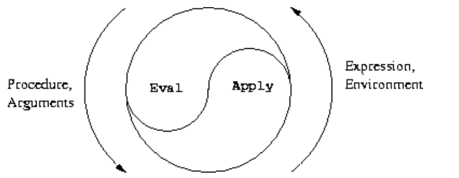

# Chapter 4 Metalinguistic Abstraction


The real magic is to understand which words work, and when, and for what;

the trick is to learn the trick.

And those words are made from the letters of our alphabet: 

a couple-dozen squiggles we can draw with the pen.

And the treasure, too, **if we can only get our hands on it!**

**It's as if -- as if the key to the treasure is the treasure!**


回忆之前介绍的程序设计：

将原始元素组合成复合对象，将复合对象抽象成更高级的构建块，

并通过采用适当的系统结构的大规模视图来保持模块化


面对越来越复杂的问题时，任何固定的编程语言，都不足以满足我们的需求。


为了更有效地表达我们的思想，我们必须**不断地使用新的语言。**


电气工程师使用许多不同的语言来描述电路。

Two of these are **the language of electrical networks** and the **language of electrical systems.**


The **network language** emphasizes the physical **modeling of devices in terms of discrete electrical elements.**

用离散的电子元件对设备进行物理建模。

工程师关心的是设计的物理特性。

as resistors, capacitors, inductors, and transistors, which are characterized in terms **of physical variables called voltage and current**

原始的电子元件，如**电阻器、电容器、电感器和晶体管**，它们以称为**电压和电流**的物理变量来表征


the primitive objects of the system language are signal-processing modules **such as filters and amplifiers**.

系统语言的基本对象是信号处理模块，如滤波器和放大器

只有模块的**功能行为**是相关的，并且信号被操纵而不关心其物理实现为电压和电流。

系统语言是建立在网络语言之上的，信号处理系统的元素是由电子网络构建的

the elements of signal-processing systems are constructed from **electrical networks.**


编程的语言？

（1）physical languages, such as **the machine languages** for particular computers.

These languages are concerned with the representation of data and control in terms of individual bits of storage and primitive machine instructions.

数据的表示和根据单个存储位和原始机器指令的控制

使用给定的硬件来建立系统和实用程序，以便有效地实现资源有限的计算

（2）**High-level languages**

These languages have means **of combination and abstraction**, such as procedure definition, that are appropriate to the larger-scale organization of systems.

建立在机器语言基础上的高级语言

具有**组合和抽象**的方法，例如过程定义，它们适合于更大规模的系统组织


元语言抽象？

Metalinguistic abstraction -- establishing new languages

because in programming not only can we formulate new languages **but we can also implement these languages by constructing evaluators**


An evaluator (or interpreter) for a **programming language** is a procedure that, when applied to an expression of the language, performs **the actions required to evaluate that expression.**

编程语言的求值器(或解释器)是一个**过程**，当应用于该语言的表达式时，它**执行求值该表达式所需的操作**。


The evaluator, which determines the meaning of expressions in a programming language, **is just another program.**

在编程语言中决定表达式含义的求值器只是另一个程序。

We come to see ourselves as designers of languages, **rather than only users of languages designed by others.**

我们开始把自己看作是语言的设计者，而**不仅仅是别人设计的语言的使用者。**


we can regard almost any program as the evaluator for some language.

可以**把任何程序看作某种语言的求值器**


- 多项式计算系统？the polynomial manipulation system
- 数字逻辑模拟器？the digital-logic simulator
- 约束传播器？ the constraint propagator

它们各自都有自己的原语、组合方式和抽象方式

each with its own **primitives**, means of **combination**, and means of **abstraction**.


计算机科学本身就变成了**构建适当的描述性语言的学科**

and computer science itself becomes no more (and no less) than the **discipline of constructing appropriate descriptive languages.**


之后介绍的是：

任何面向表达式的语言的求值器的基本结构，这些语言是为顺序机器编写程序而设计的

the **essential structure** of an evaluator for any expression-oriented language designed for writing programs for a sequential machine.


The most important features that our evaluator **leaves out** are mechanisms **for handling errors and supporting debugging.**


（1）语言可以根据其他语言建立起来

 languages are established in terms of other language

（2）将修改底层语言以提供一种更优雅的方法，通过修改求值器来**提供正常顺序的求值**

we'll change the underlying language to provide for a more elegant approach, **by modifying the evaluator to provide for normal-order evaluation.**

（3）表达式有多个值，而不仅仅是一个值

a more ambitious linguistic change, **whereby expressions have many values, rather than just a single value**

In this language of **nondeterministic** computing, it is natural to express processes that generate all possible values for expressions and then **search for those values that satisfy certain constraints.**

让时间分支成一组“可能的未来”，然后寻找合适的时间线

（4）实现逻辑编程语言，在这种语言中，知识是用关系来表示的，而不是用输入和输出的计算来表示的

**a logic-programming language**

knowledge is expressed in terms of **relations**, rather than in terms of computations with inputs and outputs.

we will see that the **logic-programming evaluator** shares **the essential structure of the Lisp evaluator.**

基本结构和Lisp解释器一样


## 4.1 The Metacircular Evaluator

evaluation is a process, so it is appropriate to describe the evaluation process using Lisp, which, **after all, is our tool for describing processes.**

An evaluator that is written in the same language that it evaluates is said to be **metacircular**.

The most important of these are the **detailed mechanisms** by which procedures call other procedures and return values to their callers.


基本原理

the environment model of evaluation ：

\1. To evaluate a combination (a compound expression other than a special form), evaluate the **subexpressions** and then apply the value of the **operator** **subexpression** to the values of the operand **subexpressions**.

若要计算组合(非特殊形式的复合表达式)，请先**计算子表达式**，然后将操作符**子表达式的值应用于操作数子表达式的值。**

\2. To apply a compound procedure to a set of arguments, evaluate the body of the procedure in a new environment. To construct this environment, extend the environment part of the procedure object by a frame in which the formal parameters of the procedure are bound to the arguments to which the procedure is applied.

若要将复合过程应用于一组参数，请在新环境中计算过程体。

To construct this environment, **extend the environment part of the procedure object by a frame in which the formal parameters of the procedure are bound to the arguments to which the procedure is applied.**

可以通过一个frame扩展过程对象的环境部分，在这个frame中，**过程的形式参数被绑定到应用该过程的参数。**


这两条规则描述了求值过程的本质，一个基本循环，在这个循环中，要在环境中求值的表达式被简化为要应用于参数的过程，而参数又被简化为要在新环境中求值的新表达式，以此类推，直到我们深入到符号(其值在环境中查找)和直接应用的原始过程

These two rules describe the essence of the evaluation process, a basic cycle in which expressions to be evaluated in environments are reduced to procedures to be applied to arguments, which in turn are reduced to new expressions to be evaluated in new environments, and so on, **until we get down to symbols**, whose values are looked up in the environment, and to **primitive procedures**, which are applied directly


明确：

（1）求值器的工作不是指定语言的原语，而是提供连接组织

组合的方式和抽象的方式，即将原语集合绑定起来形成语言

The job of the evaluator is not to specify the primitives of the language, **but rather to provide the connective tissue**

（2）求值器使我们能够处理嵌套表达式

The evaluator enables us to deal with **nested expressions.**

（3）求值器的一个重要作用是编排过程组合

One important role of the evaluator is to **choreograph procedure composition**

（4）求值器允许我们使用变量

The evaluator allows us to **use variables.**

（5）求值器允许我们定义复合过程

The evaluator allows us to **define compound procedures.**

keeping track of procedure **definitions**, knowing how to use these definitions in evaluating expressions, and providing a mechanism that enables procedures to accept arguments

（6）求值器提供特殊的形式，必须以不同于过程调用的方式求值。

provides the **special forms**, which must be evaluated differently from procedure calls

（7）求值器的实现将取决于定义要求值的表达式语法的过程。

The implementation of the evaluator will depend upon **procedures that define the syntax of the expressions to be evaluated.**


但是有一些抽象的，独立于语言本身的表示：

（1）abstract predicate **assignment?**

（2）we use abstract selectors **assignment-variable** and **assignment-value** to access **the parts of an assignment**

（3）**make-procedure** constructs **compound** procedures,

（4）**lookup-variable-value** accesses the **values** of variables

（5）**apply-primitive-procedure** applies a **primitive procedure** to a given list of arguments


### 4.1.1 The Core of the Evaluator



The eval-apply cycle exposes the essence of a **computer language.**

The evaluation process can be described as the **interplay** between two procedures: **eval and apply.**


#### Eval

接受一个表达式和一个环境作为参数

takes as arguments an **expression** and an **environment**.

It classifies the expression and **directs its evaluation.**


抽象地表达表达式类型的确定。

每种类型的表达式都有一个测试它的谓词和一个选择其组成部分的抽象方法。

a **predicate** that tests for it and an abstract means for **selecting** its parts.


##### Primitive expressions

（1）返回表达式本身

self-evaluating expressions, such as numbers, eval returns the expression itself.

（2）从environemnt中查找这个变量

必须查找**环境**中的变量以找到它们的值

must **look up variables in the environment** to find their values. 


##### Special forms

引号表达式、赋值、if表达式、lambda表达式、begin语句、cond语句


（1）带**引号**的表达式，eval返回带引号的表达式

For **quoted** expressions, eval returns the expression that was quoted.

（2）对变量的**赋值(或定义)**必须递归地调用eval来计算与该变量关联的新值

An **assignment** to (or a definition of) a variable must **recursively call eval** to **compute the new value to be associated with the variable.**

必须修改环境以更改(或创建)变量的绑定。

The environment must be modified to change (or create) the binding of the variable.

赋值：计算新值、修改环境的变量绑定值

（3）**if表达式**需要对其各部分进行特殊处理，以便在谓词为真时求结果，否则求可选结果。

An **if expression** requires special processing of its parts, **so as to evaluate the consequent if the predicate is true, and otherwise to evaluate the alternative.**

（4）必须通过将lambda表达式指定的参数和主体与求值环境打包在一起，将lambda表达式转换为可应用的过程。

**A lambda expression** must be transformed into an applicable procedure by packaging together the parameters and body specified by the lambda expression with the environment of the evaluation.

Lambda 表达式需要将 parameters 和 body 进行打包，绑定

（5）begin表达式要求按其表达式序列出现的顺序**求值**。

**A begin expression** requires evaluating its sequence of expressions in the order in which they appear.

（6）cond被转换成**if表达式的嵌套**，然后求值

A case analysis (cond) is transformed into a nest of if expressions and then evaluated.


##### Combinations

For a procedure application, eval must **recursively evaluate the operator part and the operands of the combination.**

The resulting procedure and arguments are passed to apply, **which handles the actual procedure application.**


- eval 先进行 evaluate the operator part and the operands of the combination
- apply 然后进行  the actual procedure application


eval 的过程描述：

```lisp
(define (eval exp env)
  (cond ((self-evaluating? exp) exp)
        ((variable? exp) (lookup-variable-value exp env))
        ((quoted? exp) (text-of-quotation exp))
        ((assignment? exp) (eval-assignment exp env))
        ((definition? exp) (eval-definition exp env))
        ((if? exp) (eval-if exp env))
        ((lambda? exp)
         (make-procedure (lambda-parameters exp)
                         (lambda-body exp)
                         env))
        ((begin? exp) 
         (eval-sequence (begin-actions exp) env))
        ((cond? exp) (eval (cond->if exp) env))
        ((application? exp)
         (apply (eval (operator exp) env)
                (list-of-values (operands exp) env)))
        (else
         (error "Unknown expression type -- EVAL" exp))))
```

实际上可以用 data-directed 风格的代码实现，而不需要修改 eval


#### Apply

Apply接受两个参数，**一个过程和一个应用该过程的参数列表。**

a **procedure** and **a list of arguments** to which the procedure should be applied.

（1）It calls **apply-primitive-procedure** to apply primitives;

（2）It applies **compound procedures** by sequentially evaluating the expressions that make up the body of the procedure.


也就是 一个是 primitive-procedure， 一个是 compound procedures

The environment for t**he evaluation of the body** of a compound procedure is constructed by extending the base environment carried **by the procedure to include a frame that binds the parameters of the procedure to the arguments** to which the procedure is to be applied.

（1）得到 frame

（2）将参数进行实参绑定


```lisp
(define (apply procedure arguments)
  (cond ((primitive-procedure? procedure)
         (apply-primitive-procedure procedure arguments))
        ((compound-procedure? procedure)
         (eval-sequence
           (procedure-body procedure)
           (extend-environment
             (procedure-parameters procedure)
             arguments
             (procedure-environment procedure))))
        (else
         (error
          "Unknown procedure type -- APPLY" procedure))))
```


#### Procedure arguments

得到 apply 的参数列表：

List-of-values takes as an argument the operands of the combination.

**It evaluates each operand and returns a list of the corresponding values**


- 可以使用map进行简化，即用 eval + map 实现每个参数的求值
- 也可以在不使用任何高阶过程的情况下实现求值

```lisp
(define (list-of-values exps env)
  (if (no-operands? exps)
      '()
      (cons (eval (first-operand exps) env)
            (list-of-values (rest-operands exps) env))))
```


#### Conditionals

Eval-if evaluates the predicate part of an **if expression** in the given environment.

evaluate if 语句的结果

consequent or alternative

```lisp
(define (eval-if exp env)
  (if (true? (eval (if-predicate exp) env))
      (eval (if-consequent exp) env)
      (eval (if-alternative exp) env)))
```

注意区别 eval-if 和 if、if-predicate 和 true?


#### Sequences

Eval-sequence is used by apply to **evaluate the sequence of expressions** in a procedure body and by eval to evaluate the sequence of expressions in **a begin expression.**

It takes as **arguments a sequence of expressions** and an **environment**, and evaluates the expressions in the order in which they occur.

它接受**一系列表达式和一个环境**作为参数，并**按照表达式出现的顺序求值。**

The value returned is **the value of the final expression.**

返回的值是最终表达式的值。

```lisp
(define (eval-sequence exps env)
  (cond ((last-exp? exps) 
         (eval (first-exp exps) env))
        (else (eval (first-exp exps) env)
              (eval-sequence (rest-exps exps) env))))
```


#### Assignments and definitions

It calls eval to find the value **to be assigned** and transmits the variable and the resulting value to set-variable-value! to be installed in the designated environment.

现用eval计算，将 新值 给 variable-value! 进行赋值，即将变量放入 environment

```lisp
(define (eval-assignment exp env)
  (set-variable-value! (assignment-variable exp)
                       (eval (assignment-value exp) env)
                       env)
  'ok)
```


变量的定义也类似。

```lisp
(define (eval-definition exp env)
  (define-variable! (definition-variable exp)
                    (eval (definition-value exp) env)
                    env)
  'ok)
```


