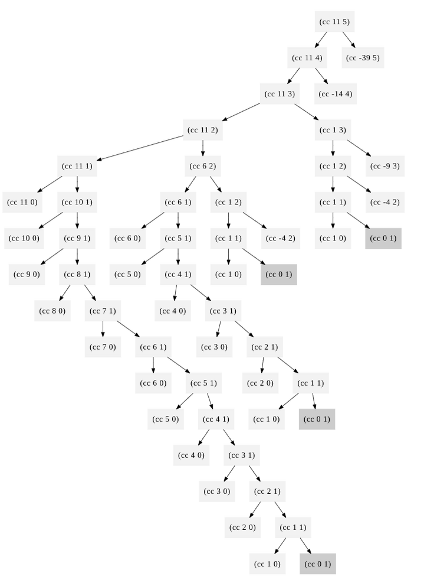
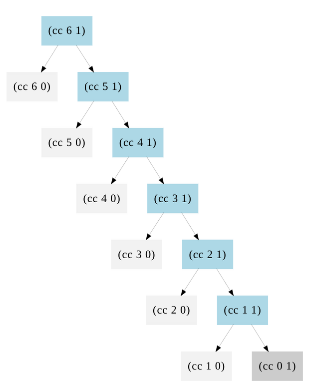

#### **Exercise 1.1.** 

Below is a sequence of expressions. What is the result printed by the interpreter in response to each expression? Assume that the sequence is to be evaluated in the order in which it is presented.

下面是一个表达式序列。解释器在响应每个表达式时打印的结果是什么?假设该序列将按照其呈现的顺序进行评估。

```lisp
10
(+ 5 3 4)
(- 9 1)
(/ 6 2)
(+ (* 2 4) (- 4 6))
(define a 3)
(define b (+ a 1))
(+ a b (* a b))
(= a b)
(if (and (> b a) (< b (* a b)))
    b
    a)
(cond ((= a 4) 6)
      ((= b 4) (+ 6 7 a))
      (else 25))
(+ 2 (if (> b a) b a))
(* (cond ((> a b) a)
         ((< a b) b)
         (else -1))
   (+ a 1))
```

```
10
12
8
3
6
19
#f
4
16
6
16
```


#### **Exercise 1.2.** 

Translate the following expression into prefix form


```lisp
(/ (+ 5 4 (- 2 (- 3 (+ 6 (/ 4 5))))) (* 3 (- 6 2) (- 2 7)))
```


#### **Exercise 1.3.** 

Define a procedure that takes three numbers as arguments and returns the sum of the squares of the two larger numbers.

定义一个过程，该过程接受三个数字作为参数，并返回两个较大数字的平方和。

```lisp
(define (square x) (* x x))
(define (square_sum x y) (+ (square x) (square y)))

(define (max_square_sum x y z) (cond ( (and (<= x y) (<= x z) ) (square_sum y z))
                                     ( (and (<= z x) (<= z y) ) (square_sum x y))
                                     ( (and (<= y x) (<= y z) ) (square_sum x z))
                                     )
  )
(max_square_sum 1 2 3) 
(max_square_sum 1 1 1) 
(max_square_sum 1 2 2) 
(max_square_sum 1 1 2) 
(max_square_sum 1 4 3) 
```


#### **Exercise 1.4.** 

Observe that our model of evaluation allows for combinations whose operators are compound expressions. Use this observation to describe the behavior of the following procedure:

注意，我们的求值模型允许操作符为复合表达式的组合。用这个观察来描述以下过程的行为:

```lisp
(define (a-plus-abs-b a b)
  ((if (> b 0) + -) a b))
```

运算符也可以作为选择表达式的结果

```
 (a + |b|) 
 A plus the absolute value of B 
```

```lisp
(define (a-plus-abs-b a b)
  ((if (> b 0) + -) a b))

(a-plus-abs-b 1 3)
(a-plus-abs-b 1 -3) 
```

```
4
4
```


#### **Exercise 1.5.** 

Ben Bitdiddle has invented a test to determine whether the interpreter he is faced with is using applicative-order evaluation or normal-order evaluation. He defines the following two procedures:

Ben Bitdiddle发明了一个测试来确定他所面对的解释器是使用应用顺序评估还是正常顺序评估。

他定义了以下两个程序:

```lisp
(define (p) (p))
(define (test x y)
  (if (= x 0)
      0
      y))
```

Then he evaluates the expression

然后对表达式求值

```lisp
(test 0 (p))
```

What behavior will Ben observe with an interpreter that uses **applicative-order evaluation**? 

What behavior will he observe with an interpreter that uses **normal-order evaluation**? 

Explain your answer. 

(Assume that the evaluation rule for the special form `if` is the same whether the interpreter is using normal or applicative order: **The predicate expression is evaluated first, and the result determines whether to evaluate the consequent or the alternative expression**.)

对于使用应用程序顺序评估的解释器，Ben将观察到什么行为?

对于使用正常顺序求值的解释器，他将观察到什么行为?

解释你的答案。

(假设特殊形式' if '的求值规则是相同的，

无论解释器是使用正常顺序还是应用顺序:

首先求值谓词表达式，结果决定是求值结果表达式还是求值替代表达式。)


程序似乎卡住了。。。

Using *applicative-order* evaluation, the evaluation of `(test 0 (p))` never terminates, 

**because `(p)` is infinitely expanded to itself:**

```
(test 0 (p)) 
(test 0 (p)) 
(test 0 (p)) 
```

lisp 用的是 applicative-order evaluation，所以会先进行替代，将 p 进行替换，

但发现替换后还是自己，于是就死循环了。

如果是normal-order evalution，就不会先替换，而是先展开，

```lisp
(test 0 (p)) 
->
(if (= 0 0) 0 (p)) 
->
(if #t 0 (p)) 
->
0 
```

于是就跳过了 (p) 这个死循环替代。


#### **Exercise 1.6.** 

Alyssa P. Hacker doesn't see why `if` needs to be provided as a special form. "Why can't I just define it as an ordinary procedure in terms of `cond`?'' she asks. Alyssa's friend Eva Lu Ator claims this can indeed be done, and she defines a new version of `if`:

Alyssa P. Hacker不明白**为什么“if”需要作为一个特殊的形式提供**。“为什么我不能把它定义为一个普通的程序呢?”她问道。Alyssa的朋友Eva Lu Ator声称这是可以做到的，她定义了一个新版本的“如果”:

```lisp
(define (new-if predicate then-clause else-clause) 
    (cond (predicate then-clause)    
        (else else-clause)))
```

Eva demonstrates the program for Alyssa:

Eva为Alyssa演示了这个程序:

```lisp
(new-if (= 2 3) 0 5)
(new-if (= 1 1) 0 5)
```

```
5
0
```

Delighted, Alyssa uses `new-if` to rewrite the square-root program:

Alyssa很高兴，用“new-if”重写了平方根程序:

```lisp
(define (sqrt-iter guess x)
  (new-if (good-enough? guess x)
          guess
          (sqrt-iter (improve guess x)
                     x)))
```

What happens when Alyssa attempts to use this to compute square roots? Explain.

当Alyssa试图用这个来计算平方根时会发生什么?解释一下。


程序报错：

Interactions disabled; out of memory

内存爆了？

看上去是一直在调用这个new-if函数，然后就栈溢出了。


问题的关键就在于，Lisp是使用应用顺序求值，所以每次会计算new-if的两个参数，即会反复调用自身，从而爆栈。

if 不是这样，if计算谓词后，判断true 和 false，然后只会调用一个。


- 使用if时，只计算两个表达式中的一个
- 而使用new-if计算两个表达式


```
(define (try a)
  (if (= a 0) 1 (/ 1 0))
```

Calling `(try 0)` does not result in an error, **because the else-clause is never evaluated.**

`new-if` is a procedure, not a special-form, **which means that all sub-expressions are evaluated before `new-if` is applied to the values of the operands.** 


#### **Exercise 1.7.** 

The `good-enough?` test used in computing square roots will not be very effective for finding the square roots of very small numbers. Also, in real computers, arithmetic operations are almost always performed with limited precision. This makes our test inadequate for very large numbers. Explain these statements, with examples showing how the test fails for small and large numbers. An alternative strategy for implementing `good-enough?` is to watch how `guess` changes from one iteration to the next and to stop when the change is a very small fraction of the guess. Design a square-root procedure that uses this kind of end test. Does this work better for small and large numbers?

“足够好?”在计算平方根时使用的测试对于求非常小的数的平方根不是很有效。此外，在真实的计算机中，算术运算几乎总是以有限的精度执行。这使得我们的测试不适用于非常大的数字。解释这些语句，并举例说明对于小数和大数，测试是如何失败的。另一种实现“足够好?”就是观察“guess”从一次迭代到下一次迭代是如何变化的，当变化只是猜测的很小一部分时就停止。设计一个使用这种结束测试的平方根程序。这对于小数字和大数字是否更有效?


大的数和小的数都不准确。就是因为这个tolerance没有随着传入的数字的大小变化而变化。

增加测试：

```
(sqrt 0.0001) // -> 0.01 不正常
(sqrt 1000000000000) // 12 个0 正常
(sqrt 10000000000000) // 13 个0 卡住
```


两种方法进行改进：

（1）要么tolerance不固定

（2）要么看guess的变化差是否校于恒定的tolerance？


##### method 1

```lisp
;iterates until guess and next guess are equal, 
;automatically produces answer to limit of system precision 
(define (good-enough? guess x) 
    (= (improve guess x) guess)) 
```

如果 对 guess 进行修正后还和guess一样，那么就停下来！

if the answer is some form of **repeating fractional numbe**r, then the equal comparison will never succeed, resulting in an infinite loop.


##### method 2

还可以有下面的改法

```lisp
;Modified version to look at difference between iterations 
(define (good-enough? guess x) 
    (< (abs (- (improve guess x) guess)) 
       (* guess .001))) 

;Another take on the good-enough? function 
(define (good-enough? guess x) 
    (< (/ (abs (- (square guess) x)) guess) 
       (* guess 0.0001))) 
```

figure out how far guess is from improved guess and then see if that amount is less than .1% of guess. 

If it is, stop the program

如果修改后的guess的变化量小于 0.1%，那么程序就停下来，即表示已经没有什么变化了


##### method 3

```lisp
; A guess is good enough when: 
;    abs(improved-guess - original-guess) / original-guess < 0.001 

(define (good-enough? guess x) 
    (< (abs (/ (- (improve guess x) guess) 
               guess)) 
       0.001)) 
```

先计算修正后的guess，然后看这个修正后的guess和原先的guess的改变量占原guess的百分比是否小于1%

watch how guess changes from one iteration to the next and to stop **when the change is a very small fraction of the guess**

using the classic (X1 - X0) / X0

X1 就是 修正量

X0 就是 原始值

In this case **X1 = (improve guess x)** and **X0 = guess**


##### method 4

```lisp
(define (good-enough? guess x) 
    (< (abs (- x (square guess)))
       (* 0.0001 x)))   
```

o stop iteration when the error (i.e. abs(guess^2 - x)) is less than a given proportion of x.

改进

```lisp
(define (good-enough? guess x) 
    (< (abs (- (improve guess x) guess)) 
       (cond ((< x 1) (* guess 0.001)) 
           (else 0.001)))) 
```


回顾一下这个问题

There are two main risks in it. 

For a small number x, 0.001 simply might be too large to be a tolerance threshold. 

For a large number x, and this is where people get confused, the real reason for hanging is because (improve guess x) never actually improve the result because of the limitation of bits, **the "improved guess" will simply be equal to "old guess" at some point, results in (- y^2 x) never changes and hence never reach inside the tolerance range**


小的数字出问题的原因是 tolerance 太大

大的数字出问题的原因是 精读不够，导致 imporved guess 的值和 old guess 一样，然后就一直循环


#### **Exercise 1.8.** 

Newton's method for cube roots is based on the fact that if *y* is an approximation to the cube root of *x*, then a better approximation is given by the value

牛顿求立方根的方法是基于这样一个事实:

如果*y*是*x*的立方根的近似值，那么一个更好的近似值是由这个值给出的


Use this formula to implement a **cube-root procedure** analogous to the square-root procedure. 

(In section 1.3.4 we will see how to implement Newton's method in general as an abstraction of these square-root and cube-root procedures.)


注意需要处理负数！

```lisp
(define (cube-root x)
    (if (< x 0)
        (* -1 (cube-root-iter 1.0 (abs x)))
        (cube-root-iter 1.0 x)
        ))
```


#### **Exercise 1.9.** 

Each of the following two procedures defines a method for adding two positive integers in terms of the procedures `inc`, which increments its argument by 1, and `dec`, which decrements its argument by 1.

以下两个过程中的每一个都定义了一种方法，用于将两个正整数相加，

其中过程' inc '将其参数加1，而' dec '将其参数减1。

```lisp
(define (+ a b)
  (if (= a 0)
      b
      (inc (+ (dec a) b))))

(define (+ a b)
  (if (= a 0)
      b
      (+ (dec a) (inc b))))

```

Using the substitution model, illustrate the process generated by each procedure in evaluating `(+ 4 5)`. Are these processes iterative or recursive?

使用替代模型，说明每个程序在求“(+ 4 5)”时产生的过程。

这些过程是迭代的还是递归的?


第一种是

```
(+ 4 5) 
(inc (+ (dec 4) 5)) 
(inc (+ 3 5)) 
(inc (inc (+ (dec 3) 5))) 
(inc (inc (+ 2 5))) 
(inc (inc (inc (+ (dec 2) 5)))) 
(inc (inc (inc (+ 1 5)))) 
(inc (inc (inc (inc (+ (dec 1) 5))))) 
(inc (inc (inc (inc (+ 0 5))))) 
(inc (inc (inc (inc 5)))) 
(inc (inc (inc 6))) 
(inc (inc 7)) 
(inc 8) 

9 
```

线性递归


第二种是

```
(+ 4 5) 
(+ (dec 4) (inc 5)) 
(+ 3 6) 
(+ (dec 3) (inc 6)) 
(+ 2 7) 
(+ (dec 2) (inc 7)) 
(+ 1 8) 
(+ (dec 1) (inc 8)) 
(+ 0 9) 

9 
```

线性迭代

都是递归过程，但是第二种的过程在顶层


- 线性递归是不断压栈、但是不弹出，继续压栈，最后慢慢弹栈。
- 线性迭代是先压栈，**然后马上弹出**，所以本质就和while循环的逻辑一致。


#### **Exercise 1.10.** 

The following procedure computes a mathematical function called Ackermann's function.

下面的程序计算一个称为阿克曼函数的数学函数。

```lisp
(define (A x y)
    (cond ((= y 0) 0)
        ((= x 0) (* 2 y))
        ((= y 1) 2)
        (else (A (- x 1)
                 (A x (- y 1))))))
```

What are the values of the following expressions?

下列表达式的值是什么?

```lisp
(A 1 10)
(A 2 4)
(A 3 3)
```

答案是

```
1024
65536
65536
```


Consider the following procedures, where `A` is the procedure defined above:

考虑以下程序，其中' A '是上面定义的程序:

```lisp
(define (f n) (A 0 n))
(define (g n) (A 1 n))
(define (h n) (A 2 n))
(define (k n) (* 5 n n))
```

Give concise mathematical definitions for the functions computed by the procedures `f`, `g`, and `h` for positive integer values of *n*. For example, `(k n)` computes  $5*n^2$.

对于*n*的正整数，给出由过程' f '， ' g '和' h '计算的函数的简明数学定义。例如，' (k n) '计算$5*n^2$。


(f n) 的作用就是 计算 2 * n

(g n) 的作用就是 计算 2 ^ n

f 和 g 可以找规律，h 就需要思考一下。


(h n) 的作用就是 计算 ？？


```
(h 3)
(A 2 3)
(A 1 (A 2 2))
(A 1 (A 1 (A 2 1)))
(A 1 (A 1 2))
(A 1 (A 0 (A 1 1)))
(A 1 (A 0 2))
(A 1 4)
(A 0 (A 1 3))
(A 0 (A 0 (A 1 2)))
(A 0 (A 0 (A 0 (A 1 1))))
(A 0 (A 0 (A 0 2)))
(A 0 (A 0 4))
(A 0 8)
16
```

```
(A 1 4)
-> 
(g 4)
->
2 ^ 4
```

再来模拟一个

```
(h 4)
(A 2 4)
(A 1 (A 2 3))
(A 1 (A 1 (A 2 2)))
(A 1 (A 1 (A 1 (A 2 1))))
(A 1 (A 1 (A 1 2))
(A 1 (A 1 (A 0 (A 1 1)))
(A 1 (A 1 (A 0 2)))
(A 1 (A 1 4))
(A 1 (A 0 (A 1 3)))
(A 1 (A 0 (A 0 (A 1 2))))
(A 1 (A 0 (A 0 (A 0 A(1 1)))))
(A 1 (A 0 (A 0 (A 0 2))))
(A 1 (A 0 (A 0 4)))
(A 1 (A 0 8))
(A 1 16)
-> ?
(g 16)
->
2 ^ 16
```

归纳一下：

```
(h 0) -> 0
(h 1) -> 2
(h 2) -> 4
(h 3) -> 16
(h 4) -> 65536
(h n) -> 2 ^ {?} 
```

$$
2\\2^2\\2^{2^2}\\2^{2^{2^2}}
$$


#### **Exercise 1.11.** 

A function *f* is defined by the rule that *f*(*n*) = *n* if *n*<3 and *f*(*n*) = *f*(*n* - 1) + 2*f*(*n* - 2) + 3*f*(*n* - 3) if *n*> 3. 

Write a procedure that computes *f* by means of a recursive process. 

Write a procedure that computes *f* by means of an iterative process.

写两个过程，一个是递归的，一个是迭代的。

``` 
f(0) = 0
f(1) = 1
f(2) = 2
f(3) = 2 + 2 * 1 + 3 * 0 = 4
f(4) = 4 + 2 * 2 + 3 * 1 = 11
...
```


#### **Exercise 1.12.** 

The following pattern of numbers is called *Pascal's triangle*.

下面的数字模式被称为帕斯卡三角形。


The numbers at the edge of the triangle are all 1, and each number inside the triangle is the sum of the two numbers above it.

Write a procedure that computes elements of Pascal's triangle by means of a recursive process.

三角形边缘的数字都是1，三角形内的每个数字都是上面两个数字的和。

写一个程序，用递归的方法计算帕斯卡三角形的元素。

```
assert(i>=j)
assert(i>=1)
assert(j>=1)

def f:
    if j == 1:
        return 1
    else if i == j:
        return 1
    else
        return f(i-1, j-1) + f(i-1, j)
```

代码中没有检查参数是否合法，但是上面的伪代码有限制。

下标从1开始。


#### **Exercise 1.13.** 

Prove that *F**i**b*(*n*) is the closest integer to


 Hint: Let


Use induction and the definition of the Fibonacci numbers

 to prove that


https://sicp-solutions.net/post/sicp-solution-exercise-1-13/#solution

 

**首先需要证明**


加设成立，代入方程，然后化简，看最后是否得到一个恒等式：


去掉根号5


配凑，使其指数都是n


提取括号


时用两个变量的定义代入


整理一下分母


通分，准备做加法


分式进行加法


整理一下分子


合并


整理，发现是恒等式


**然后就是证明**


观察变量，得到变量的范围：


对Fib(n) 进行分解


重写，对Fib(n) 确定大小区间：


#### **Exercise 1.14.** 

Draw the tree illustrating the process generated by the `count-change` procedure of section 1.2.2 in making change for 11 cents. **What are the orders of growth of the space and number of steps** used by this process as the amount to be changed increases?

```
(count-change 11)
|
(cc 11 5)__
|          \
(cc 11 4)   (cc -39 5)
|       \___
|           \
(cc 11 3)   (cc -14 4)
|       \_______________________________________________________
|                                                               \
(cc 11 2)                                                      (cc 1 3)
|       \_________________________                              |     \__
|                                 \                             |        \
(cc 11 1)                        (cc 6 2)                      (cc 1 2) (cc -9 3)
|       \___                      |     \__                     |     \__
|           \                     |        \                    |        \
(cc 11 0)   (cc 10 1)            (cc 6 1) (cc 1 2)             (cc 1 1) (cc -4 2)
         __/ |                 __/ |       |     \__            |     \__
        /    |                /    |       |        \           |        \
(cc 10 0)   (cc 9 1)  (cc 6 0)   (cc 5 1) (cc 1 1) (cc -4 2)   (cc 1 0) (cc 0 1)
         __/ |                 __/ |       |     \__
        /    |                /    |       |        \
(cc 9 0)    (cc 8 1)  (cc 5 0)   (cc 4 1) (cc 1 0) (cc 0 1)
         __/ |                 __/ |
        /    |                /    |
(cc 8 0)    (cc 7 1)  (cc 4 0)   (cc 3 1)
         __/ |                 __/ |
        /    |                /    |
(cc 7 0)    (cc 6 1)  (cc 3 0)   (cc 2 1)
         __/ |                 __/ |
        /    |                /    |
(cc 6 0)    (cc 5 1)  (cc 2 0)   (cc 1 1)
         __/ |                 __/ |
        /    |                /    |
(cc 5 0)    (cc 4 1)  (cc 1 0)   (cc 0 1)
         __/ |
        /    |
(cc 4 0)    (cc 3 1)
         __/ |
        /    |
(cc 3 0)    (cc 2 1)
         __/ |
        /    |
(cc 2 0)    (cc 1 1)
         __/ |
        /    |
(cc 1 0)    (cc 0 1)
```

空间复杂度就是 树的高度，也就是 $\theta(a + n) = \theta(a)$

n 是常数，a 是规模大小

时间复杂度就是 树的结点数，也就是 $\theta(a^n)$
$$
R(a, 0) = 1\\
R(a, n) = 1 + ⌈a/d(n)⌉ + Σ_{i = 0}^{⌈a/d(n)⌉ − 1} R(a − i × d(n), n − 1) = Θ(a^n).
$$


https://sicp-solutions.net/post/sicp-solution-exercise-1-14/


**先看 (cc 6 1)**



只有右边的(c x 1)节点会递归得更深。

所有的(c x 0)都是这棵树的叶子因为它表明没有更多类型的硬币可以使用。

- there are 6 blue nodes from `(c 6 1)` to `(c 1 1)`
- there are 6 grey nodes from `(c 6 0)` to `(c 1 0)`
- there is one dark grey node `(c 0 1)` with a mount of 0, indicating a solution


If $T(n,m)$ is the number of call to cc for amount n and m type of coin.
$$
T(6,1)=2*6+1
$$

$$
T(n,1) = 2n+1
$$


**再看 (cc 12 2)**


we see that we have a neat 2 dimensional array

- There are **4 green nodes** for `(c x 2)` corresponding to how many time you can subtract a nickel from 12, plus one.
- Then for each of the green node, there is the option of using only pennies, which is the case that we looked at first.


For an amount n, there is at **most** $Floor(\frac{n}{5})+1$ times you can subtract nickels from it before reaching zero or a negative value.


$$
T(n,m) = \theta(n^m)
$$


#### **Exercise 1.15.** 

The sine of an angle (specified in radians) can be computed by making use of the approximation 

$\sin x\approx x$  if *x* is sufficiently small, and the trigonometric identity

$\sin x=3\sin\frac{x}{3}-4\sin^{3}\frac{x}{3}$

to reduce the size of the argument of sin.  (For purposes of this exercise an angle is considered ``sufficiently small'' if its magnitude is not greater than 0.1 radians.)  

These ideas are incorporated in the following procedures:

```lisp
(define (cube x) (* x x x))
(define (p x) (- (* 3 x) (* 4 (cube x))))
(define (sine angle)
   (if (not (> (abs angle) 0.1))
       angle
       (p (sine (/ angle 3.0)))))
```

a. How many times is the procedure `p` applied when `(sine 12.15)` is evaluated?

b. What is **the order of growth in space and number of steps** (as a function of *a*) used by the process generated by the `sine` procedure when `(sine a)` is evaluated?

a.当计算' (sine 12.15) '时，过程' p '应用了多少次?

b.当求值“(sine a)”时，由“sin”过程生成的过程所使用的空间增长阶和步数(作为*a*的函数)是什么?

```
(sine 12.15) 
->
(p (sine 4.05)) 
->
(p (p (sine 1.35))) 
->
(p (p (p (sine 0.45)))) 
->
(p (p (p (p (sine 0.15))))) 
->
(p (p (p (p (p (sine 0.05)))))) 
->
(p (p (p (p (p 0.05))))) 
```

过程p被apply了5次

The angle `a` is divided by 3 each time the procedure `p` is applied. 

复杂度是 $\theta(log(a))$


a / 0.1 得到一个数，然后这个数不断除以 3，直到为1，总共除了多少次，就运算了多少次。

显然是对数复杂度


#### **Exercise 1.16.** 

Design a procedure that evolves an **iterative exponentiation process** that uses successive squaring and uses a **logarithmic number of steps, as does `fast-expt`.** 

(Hint: Using the observation that$(b^{n/2})^2=(b^2)^{n/2},$ **keep along with the exponent *n* and the base *b***, an additional state variable *a*, and define the state transformation in such a way that the product *a* $b^{n}$ is unchanged from state to state. 

**At the beginning of the process *a* is taken to be 1**, and the answer is given by the value of *a* at the end of the process. In general, the technique of defining an *invariant quantity* that remains unchanged from state to state is a powerful way to think about the design of iterative algorithms.)

大致就是用迭代的方法写快速幂。


counter > 0，无论counter 为奇数还是偶数，最后一定会来到count = 1的阶段，然后product就被 b 更新了

```lisp
(define (fast-expt b n)
    (define (expt-iter b counter product)
      (cond ((= counter 0) product)
            ((even? counter) (expt-iter (* b b) (/ counter 2) product) )
            (else (expt-iter b (- counter 1) (* product b)))
      )) 
    (expt-iter b n 1))
```


#### **Exercise 1.17.** 

The exponentiation algorithms in this section are based on performing exponentiation by means of repeated multiplication. In a similar way, one can perform integer multiplication by means of repeated addition. The following multiplication procedure (in which it is assumed that our language can only add, not multiply) is analogous to the `expt` procedure:

本节中的求幂算法基于通过重复乘法来执行求幂。

同样，可以通过重复加法来进行整数乘法。

下面的乘法过程(假设我们的语言只能加，不能乘)类似于' expt '过程:

```lisp
(define (* a b)
  (if (= b 0)
      0
      (+ a (* a (- b 1)))))
```

This algorithm takes a number of steps that is linear in `b`. 

Now suppose we include, together with addition, operations `double`, which doubles an integer, and `halve`, which divides an (even) integer by 2. 

Using these, design a multiplication procedure analogous to `fast-expt` that uses a logarithmic number of steps.

这个算法的步骤在b中是线性的。

现在假设我们在加法运算中包括了“double”操作，它将一个整数加倍，以及“half”操作，它将一个(偶数)整数除以2。

使用这些，设计一个类似于“快速幂”的乘法过程，**使用对数级复杂度的过程**。


#### **Exercise 1.18.** 

Using the results of exercises 1.16 and 1.17, devise a procedure that generates an iterative process for multiplying two integers **in terms of adding, doubling, and halving and uses a logarithmic number of steps.**

"Russian peasant method'' of multiplication


#### **Exercise 1.19.**  

There is a clever algorithm for computing the Fibonacci numbers in a logarithmic number of steps. 

有一种聪明的算法可以以对数的步骤计算斐波那契数

Recall the transformation of the state variables *a* and *b* in the `fib-iter` process of section  1.2.2 $a\longleftarrow a+b\mathrm{~and~}b\longleftarrow a.$

Call this transformation *T*, and observe that applying *T* over and over again *n* times, starting with 1 and 0, produces the pair Fib(*n* + 1) and Fib(n). 

In other words, the Fibonacci numbers are produced by applying $T^n$, the n th power of the transformation *T*, starting with the pair (1,0). 

Now consider *T* to be the special case of *p* = 0 and *q* = 1 in a family of transformations $T_{pq}$, where $T_{pq}$ transforms the pair (*a*,*b*) according to $a\leftarrow bq+aq+ap$ and $b\leftarrow bp+aq$

Show that if we apply such a transformation $T_{pq}$ twice, the effect is the same as using a single transformation $T_{p'q'}$ of the same form, and compute *p*' and *q*' in terms of *p* and *q*. 

This gives us an explicit way to square these transformations, and thus we can compute $T^n$ using successive squaring, as in the `fast-expt` procedure. 

Put this all together to complete the following procedure, which runs in a logarithmic number of steps:

```lisp
(define (fib n)
  (fib-iter 1 0 0 1 n))
(define (fib-iter a b p q count)
  (cond ((= count 0) b)
        ((even? count)
         (fib-iter a
                   b
                   <??>      ; compute p'
                   <??>      ; compute q'
                   (/ count 2)))
        (else (fib-iter (+ (* b q) (* a q) (* a p))
                        (+ (* b p) (* a q))
                        p
                        q
                        (- count 1)))))
```

迭代一次：
$$
a' = bq + aq + ap = a (p + q) + b q\\
b' = aq + bp
$$
再迭代一次：
$$
a'' = a'*(p+q) + b'*q\\
=(ap+aq+bq)(p+q)+(aq+bp)q\\
=(ap^2+apq+apq+aq^2+bpq+bq^2)+aq^2+bpq\\
=a*(p^2+2q^2+2pq)+b*(q^2+2pq)
$$

$$
b'' = a'q + b'p 
\\= (bp + aq) p + (bq + aq + ap) q
\\= b p^2 + apq + bq^2 + aq^2 + apq
\\= b p^ 2 + a q^2 + 2 apq
\\= a*(2pq + q^2) + b * (p^2+q^2)
$$
观察一下：

a 对应的p q迭代变化如下，
$$
p\rightarrow p^2+q^2\\
q\rightarrow q^2+2pq
$$
b 对应的p q迭代变化如下，
$$
p\rightarrow p^2 + q^2\\
q\rightarrow q^2+2pq
$$
居然用对数复杂度计算Fib，太妙了！！！


#### **Exercise 1.20.** 

The process that a procedure generates is of course dependent on the rules used by the interpreter. As an example, consider the iterative `gcd` procedure given above. Suppose we were to interpret this procedure using normal-order evaluation, as discussed in section 1.1.5. (The normal-order-evaluation rule for `if` is described in exercise 1.5.) Using the substitution method (for normal order), illustrate the process generated in evaluating `(gcd 206 40)` and indicate the `remainder` operations that are actually performed. How many `remainder` operations are actually performed in the normal-order evaluation of `(gcd 206 40)`? In the applicative-order evaluation?

https://sicp-solutions.net/post/sicp-solution-exercise-1-20/

使用normal-order进行evaluation ？

太多了。。。

```lisp
(gcd 206 40)

(if (= 40 0)
    206
    (gcd 40 (remainder 206 40)))

(gcd 40 (remainder 206 40))

(if (= (remainder 206 40) 0)
    40
    (gcd (remainder 206 40)
         (remainder 40 (remainder 206 40))))
; 1*remainder
(if (= 6 0)
    40
    (gcd (remainder 206 40)
         (remainder 40 (remainder 206 40))))

(gcd (remainder 206 40)
     (remainder 40 (remainder 206 40)))

(if (= (remainder 40 (remainder 206 40)) 0)
    (remainder 206 40)
    (gcd (remainder 40 (remainder 206 40))
         (remainder (remainder 206 40) (remainder 40 (remainder 206 40)))))
; 1*remainder
(if (= (remainder 40 6) 0)
    (remainder 206 40)
    (gcd (remainder 40 (remainder 206 40))
         (remainder (remainder 206 40) (remainder 40 (remainder 206 40)))))
; 1*remainder
(if (= 4 0)
    (remainder 206 40)
    (gcd (remainder 40 (remainder 206 40))
         (remainder (remainder 206 40) (remainder 40 (remainder 206 40)))))

(gcd (remainder 40 (remainder 206 40))
     (remainder (remainder 206 40) (remainder 40 (remainder 206 40))))

(if (= (remainder (remainder 206 40) (remainder 40 (remainder 206 40))) 0)
    (remainder 40 (remainder 206 40))
    (gcd (remainder (remainder 206 40) (remainder 40 (remainder 206 40)))
         (remainder (remainder 40 (remainder 206 40)) (remainder (remainder 206 40) (remainder 40 (remainder 206 40)))))
; 4*remainder
(if (= 2 0)
    (remainder 40 (remainder 206 40))
    (gcd (remainder (remainder 206 40) (remainder 40 (remainder 206 40)))
         (remainder (remainder 40 (remainder 206 40)) (remainder (remainder 206 40) (remainder 40 (remainder 206 40))))))

(gcd (remainder (remainder 206 40) (remainder 40 (remainder 206 40)))
     (remainder (remainder 40 (remainder 206 40)) (remainder (remainder 206 40) (remainder 40 (remainder 206 40)))))

(if (= (remainder (remainder 40 (remainder 206 40)) (remainder (remainder 206 40) (remainder 40 (remainder 206 40)))) 0)
    (remainder (remainder 206 40) (remainder 40 (remainder 206 40)))
    (gcd (remainder (remainder 40 (remainder 206 40)) (remainder (remainder 206 40) (remainder 40 (remainder 206 40)))) (remainder a  (remainder (remainder 40 (remainder 206 40)) (remainder (remainder 206 40) (remainder 40 (remainder 206 40)))))))
; 7*remainder
(if (= 0 0)
    (remainder (remainder 206 40) (remainder 40 (remainder 206 40)))
    (gcd (remainder (remainder 40 (remainder 206 40)) (remainder (remainder 206 40) (remainder 40 (remainder 206 40)))) (remainder a  (remainder (remainder 40 (remainder 206 40)) (remainder (remainder 206 40) (remainder 40 (remainder 206 40)))))))

(remainder (remainder 206 40) (remainder 40 (remainder 206 40)))
; 4*remainder
2
```


使用applicative-order进行evaluation？

```lisp
(gcd 206 40)
->
(if (= 40 0)
    206
    (gcd 40 (remainder 206 40)))
->
(gcd 40 6)
->
(if (= 6 0)
    40
    (gcd 6 (remainder 40 6)))
->
(gcd 6 4)
->
(if (= 4 0)
    6
    (gcd 4 (remainder 6 4)))
->
(gcd 4 2)
->
(if (= 2 0)
    4
    (gcd 2 (remainder 4 2)))
->
(gcd 2 0)
->
(if (= 2 0)
    2
    (gcd 2 (remainder 4 2)))
->
2
```


#### **Exercise 1.21.** 

Use the `smallest-divisor` procedure to find the smallest divisor of each of the following numbers: 

199, 1999, 19999.

```
199
1999
7
```


#### **Exercise 1.22.** 

Most Lisp implementations include a primitive called `runtime` that returns an integer that specifies the amount of time the system has been running (measured, for example, in microseconds). 

The following `timed-prime-test` procedure, when called with an integer *n*, prints *n* and checks to see if *n* is prime. If *n* is prime, the procedure prints three asterisks followed by the amount of time used in performing the test.

```lisp
(define (timed-prime-test n)
  (newline)
  (display n)
  (start-prime-test n (runtime)))
(define (start-prime-test n start-time)
  (if (prime? n)
      (report-prime (- (runtime) start-time))))
(define (report-prime elapsed-time)
  (display " *** ")
  (display elapsed-time))
```

Using this procedure, write a procedure `search-for-primes` that checks the primality of **consecutive odd integers in a specified range**. 

使用这个过程，编写一个' search-for-primes '过程，检查指定范围内连续奇数的素数。

Use your procedure to find the **three smallest primes** larger than 1000; larger than 10,000; larger than 100,000; larger than 1,000,000. 

**Note the time needed to test each prime.** 

Since the testing algorithm has order of growth of $\theta(\sqrt{n})$,you should expect that testing for primes around 10,000 should take about $\sqrt{n}$ times as long as testing for primes around 1000. 

Do your timing data bear this out? 

How well do the data for 100,000 and 1,000,000 support the $\sqrt{n}$ prediction? 

Is your result compatible with the notion that programs on your machine run in time proportional to the number of steps required for the computation?

您的结果是否符合计算机上的程序与计算所需的步数成正比的概念?


（1）注意过滤掉所有的非素数

（2）注意只输出最小的3个素数


#### **Exercise 1.23.** 

The `smallest-divisor` procedure shown at the start of this section does lots of needless testing: **After it checks to see if the number is divisible by 2 there is no point in checking to see if it is divisible by any larger even numbers**. 

This suggests that the values used for `test-divisor` should not be 2, 3, 4, 5, 6, `...`, but **rather 2, 3, 5, 7, 9,** `...`. 

没有必要每次都检验偶数，所以每次跳过偶数（除了2之外）

To implement this change, define a procedure `next` that returns 3 if its input is equal to 2 and otherwise returns its input plus 2. 

Modify the `smallest-divisor` procedure to **use `(next test-divisor)` instead of `(+ test-divisor 1)`**. 

With `timed-prime-test` incorporating this modified version of `smallest-divisor`, run the test for each of the 12 primes found in exercise 1.22. 

Since this modification halves the number of test steps, **you should expect it to run about twice as fast.** 

应该有两倍的加速。

Is this expectation confirmed? 

If not, what is the observed ratio of the speeds of the two algorithms, and how do you explain the fact that it is different from 2?


并不是 2，而大致是 1.5


#### **Exercise 1.24.** 

Modify the `timed-prime-test` procedure of exercise 1.22 to use `fast-prime?` (the Fermat method), and test each of the 12 primes you found in that exercise. 

Since the Fermat test has $\theta(log(n))$ growth, how would you expect the time to test primes near 1,000,000 to compare with the time needed to test primes near 1000? 

Do your data bear this out? 

Can you explain any discrepancy you find?

使用Fermat测试实现fast-prime。

你的数据能证明这一点吗?

你能解释一下你发现的差异吗?


If the function ran in logarithmic time, we would expect running time to be linear in the number of digits, but the growth is faster than that.  This is probably because performing primitive operations on sufficiently large numbers is not constant time, but grows with the size of the number.

如果函数在对数时间内运行，我们会期望运行时间在位数上是线性的，但增长速度比这快。

这可能是因为对足够大的数字执行基本操作所需的时间不是恒定的，而是随着数字的大小而增长。

Since fermat-test uses a random number, **it's possible that the number we use when testing 1,000,000 is not 1000 times larger than the number we use when testing 1000.** 

由于费马测试使用的是一个随机数，所以我们在测试1,000,000时使用的数字**可能不是**测试1000时使用的数字的1000倍。


#### **Exercise 1.25.** 

Alyssa P. Hacker complains that we went to a lot of extra work in writing `expmod`. 

After all, she says, since we already know how to compute exponentials, we could have simply written

```lisp
(define (expmod base exp m)
  (remainder (fast-expt base exp) m))
```

Is she correct? Would this procedure serve as well for our fast prime tester? Explain.

需要每次运算后都取模长，否则在中间计算的过程中就溢出了？并不会，只是会导致中间计算时间会变长，因为一直没有取模让其变短。


#### **Exercise 1.26.** 

Louis Reasoner is having great difficulty doing exercise 1.24. 

His `fast-prime?` test seems to run more slowly than his `prime?` test. Louis calls his friend Eva Lu Ator over to help. 

When they examine Louis's code, **they find that he has rewritten the `expmod` procedure to use an explicit multiplication, rather than calling `square`:**

```lisp
(define (expmod base exp m)
  (cond ((= exp 0) 1)
        ((even? exp)
         (remainder (* (expmod base (/ exp 2) m)
                       (expmod base (/ exp 2) m))
                    m))
        (else
         (remainder (* base (expmod base (- exp 1) m))
                    m))))
```

"I don't see what difference that could make", says Louis. 

"I do.'' says Eva. 

"By writing the procedure like that, you have transformed the $\theta(log\,n)$ process into a $\theta(n)$.'' Explain.

Instead of a linear recursion, the rewritten `expmod` generates a tree recursion, whose execution time grows exponentially with the depth of the tree, which is the logarithm of *N*. Therefore, the execution time is linear with *N*.

对数的指数就是线性的！
$$
\theta(2^{log_2n})=\theta(n)
$$


#### **Exercise 1.27.** 

Demonstrate that the Carmichael numbers listed in footnote 47 really do fool the Fermat test. 

That is, write a procedure that takes an integer *n* and tests whether $a^n$ is congruent to *a* modulo *n* for every *a*<*n*, and try your procedure on the given Carmichael numbers.

这样的数有：

561, 1105, 1729, 2465, 2821, and 6601

Carmichael numbers are **composite numbers that satisfy the same condition as prime numbers in Fermat's little theorem**


这些数字都不是素数，但是费马测试却认为它们是素数。


#### **Exercise 1.28.** 

One variant of the Fermat test that cannot be fooled is called the *Miller-Rabin test* (Miller 1976; Rabin 1980). 

费马检验的一个变种被称为**米勒-拉宾检验**。

This starts from an alternate form of Fermat's Little Theorem, which **states that if *n* is a prime number and *a* is any positive integer less than *n*, then *a* raised to the (*n* - 1)st power is congruent to 1 modulo *n***. 

To test the primality of a number *n* by the Miller-Rabin test, we pick a random number *a*<*n* and raise ***a* to the (*n* - 1)st power modulo *n* using the `expmod` procedure**. 

However, whenever we perform the squaring step in `expmod`, we check to see if we have discovered a "nontrivial square root of 1 modulo *n*,'' that is, **a number not equal to 1 or *n* - 1 whose square is equal to 1 modulo *n***. 

这个数不等于1且不等于n-1，且它的平方模n等于1

It is possible to prove that if such a nontrivial square root of 1 exists, **then *n* is not prime**. 

It is also possible to prove that **if *n* is an odd number that is not prime**, then, for at least half the numbers *a*<*n*, computing $a^{n-1}$ in this way will reveal a nontrivial square root of 1 modulo *n*.

 (This is why the Miller-Rabin test cannot be fooled.) 

Modify the `expmod` procedure to signal if it discovers a nontrivial square root of 1, and use this to implement the Miller-Rabin test with a procedure analogous to `fermat-test`.

Check your procedure by testing various known primes and non-primes. 

**Hint: One convenient way to make `expmod` signal is to have it return 0.**

