#### **Exercise 2.1.** 

Define a better version of `make-rat` that handles both positive and negative arguments. `Make-rat` should normalize the sign so that 

if the rational number is positive, **both the numerator and denominator are positive**, and 

if the rational number is negative, **only the numerator is negative**.

（1）如果有理数是正数，那么其分子和分母都是正数

（2）如果有理数是负数，那么其分母是正数，分子是负数


#### **Exercise 2.2.** 

Consider the problem of **representing line segments in a plane**. 

平面上表示线段

Each segment is represented as a pair of points: **a starting point and an ending point.** 

每个段表示为一对点：**一个起点和一个终点。**

Define a constructor `make-segment` and selectors `start-segment` and `end-segment` that define the representation of segments in terms of points. 

make、start、end

Furthermore, a point can be represented as a pair of numbers: **the *x* coordinate and the *y* coordinate.** 

一个点可以表示为一对数字：***x*坐标和*y*坐标**。

Accordingly, specify a constructor `make-point` and selectors `x-point` and `y-point` that define this representation. 

相应地，指定一个构造函数make-point和选择器x-point和y-point来定义这种表示。

Finally, using your selectors and constructors, define a procedure `midpoint-segment` that takes a line segment as argument and **returns its midpoint** (the point whose coordinates are the average of the coordinates of the endpoints)

定义过程，返回线段的中点。 

To try your procedures, you'll need a way to print points:

```lisp
(define (print-point p)
  (newline)
  (display "(")
  (display (x-point p))
  (display ",")
  (display (y-point p))
  (display ")"))
```


#### **Exercise 2.3.** 

Implement a representation for rectangles in a plane. 

实现平面中矩形的表示。

(Hint: You may want to make use of exercise 2.2.) 

In terms of your **constructors and selectors**, create procedures that compute the perimeter and the area of a given rectangle. 

计算矩形的周长和面积

Now implement a different representation for rectangles. 

Can you design your system with suitable abstraction barriers, so that the same perimeter and area procedures will work using either representation?


使用抽象屏障构建两种不同的矩形的表示？

（1）左上角point + 右下角point

（2）左上角point + 长 + 宽


第二种的右下角point可以通过第一种的左上角point + 长 + 宽推导出来。


**实现的方法和具体的数据结构细节没有关系**

**也就是说如果我们修改了数据结构的定义，计算周长和面积的定义是不需要改的。**


**等等，这里平面中的矩形可以是倾斜的！！！**

https://sicp-solutions.net/post/sicp-solution-exercise-2-3/

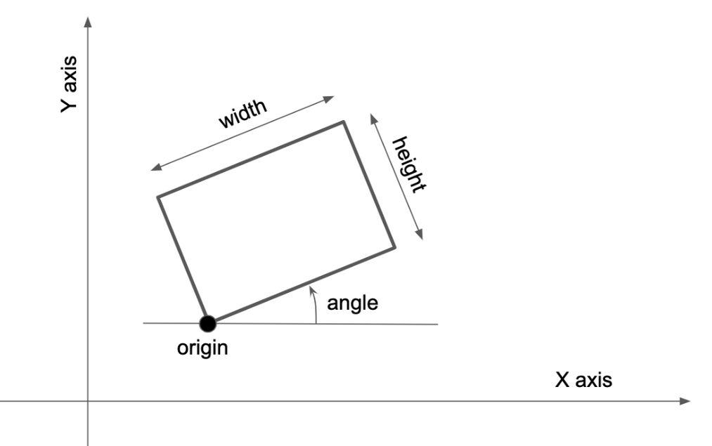

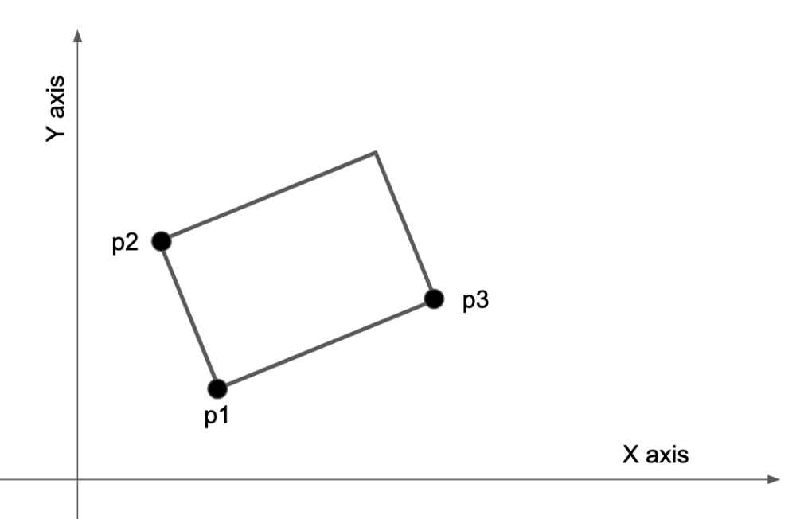


#### **Exercise 2.4.** 

Here is an alternative procedural representation of pairs. 

For this representation, verify that `(car (cons x y))` yields `x` for any objects `x` and `y`.

```lisp
(define (cons x y)
  (lambda (m) (m x y)))

(define (car z)
  (z (lambda (p q) p)))
```

What is the corresponding definition of `cdr`? 

(Hint: To verify that this works, make use of the substitution model of section 1.1.5.)

验证合理性，并写出cdr？

```
(car (cons x y))
->
((cons x y) (lambda (p q) p))
->
((lambda (p q) p) (x y))
->
x
```


#### **Exercise 2.5.** 

Show that we can represent pairs of nonnegative integers using only numbers and arithmetic operations if we represent **the pair *a* and *b* as the integer that is the product $2^a 3^b$.** 

Give the corresponding definitions of the procedures `cons`, `car`, and `cdr`.

（1）cons返回 $2^a3^b$

（2）car返回 a 

（3）cdr返回 b


#### **Exercise 2.6.** 

In case **representing pairs as procedures** wasn't mind-boggling enough, consider that, in a language that can manipulate procedures, we can get by without numbers (at least insofar as nonnegative integers are concerned) by implementing 0 and the operation of adding 1 as

```lisp
(define zero (lambda (f) (lambda (x) x)))
(define (add-1 n)
  (lambda (f) (lambda (x) (f ((n f) x)))))
```

可以用多种不同的方法表示 pair 。

This representation is known as ***Church numerals***, after its inventor, Alonzo Church, the logician who invented the $\lambda$ calculus.

**丘奇数字，Church numerals，即$\lambda $ 算术。**

Define `one` and `two` **directly** (not in terms of `zero` and `add-1`). 

**直接**按照上面的方法定义 数字 1 和 数字 2 

(Hint: Use substitution to evaluate `(add-1 zero)`). 

**Give a direct definition of the addition procedure `+`** 

(not in terms of repeated application of `add-1`).

给出加法 '+' 的**直接定义**，不要用 add - 1 进行运算。

```lisp
(add-1 zero)
->
(lambda (f)
        (lambda (x)
                (f
                 (((lambda (f)
                           (lambda (x) x)) f) x))))
->
(lambda (f)
        (lambda (x)
                (f ((lambda (x) x) x))))
->
(lambda (f)
        (lambda (x)
                (f x)))
```

```lisp
(add-1 one)
->
(lambda (f)
        (lambda (x)
                (f (
                    ((lambda (f) (lambda (x) (f x))) f)
                    x))))
->
(lambda (f)
        (lambda (x)
                (f ((lambda (x) (f x)) x))))
->
(lambda (f)
        (lambda (x)
                (f (f x))))
```

丘奇数的加法？

对 b 施加 a 次 add-1 就可以。

```lisp
; 对 b 施加一次 add-1
(lambda (f) (lambda (x) (f ((b f) x))))

; 对 b 施加两次 add-1
(lambda (f)
        (lambda (x)
                (f (((lambda (f) (lambda (x) (f ((b f) x)))) f) x))))
->
(lambda (f)
        (lambda (x)
                (f ((lambda (x) (f ((b f) x))) x))))
->
(lambda (f)
        (lambda (x)
                (f (f ((b f) x)))))
; 所以对 b 施加 a 次 add-1,就是在((b f) x)外层施加 a 次 f
->
(lambda (f)
        (lambda (x)
                ((a f) ((b f) x))))
; 比如 a = 2
(lambda (f)
        (lambda (x)
                ((two f) ((b f) x))))
->
(lambda (f)
        (lambda (x)
                (((lambda (f) (lambda (x) (f (f x)))) f) ((b f) x))))
->
(lambda (f)
        (lambda (x)
                ((lambda (x) (f (f x))) ((b f) x))))
->
(lambda (f)
        (lambda (x)
                (f (f ((b f) x)))))
```


#### **Exercise 2.7.** 

Alyssa's program is incomplete because she has not specified the implementation of the interval abstraction. 

Here is a definition of the interval constructor:

```lisp
(define (make-interval a b) (cons a b))
```

Define selectors `upper-bound` and `lower-bound` to complete the implementation.

需要实现 区间计算的定义。


#### Exercise 2.8. 

Using reasoning analogous to Alyssa's, describe how the difference of two intervals may be computed. 

Define a corresponding subtraction procedure,  called **sub-interval.**

编写 sub-interval 这个过程。

（1）左端点：最小减最大

（2）右端点：最大减最小


#### **Exercise 2.9.** 

The *width* of an interval is **half of the difference between its upper and lower bounds**. 

区间的宽度是它的上下界之差的一半。

The width is a measure of the uncertainty of the number specified by the interval. 

宽度是对区间所指定的数字的**不确定性的度量**。

For some arithmetic operations the width of the result of combining two intervals is a function only of the widths of the argument intervals, whereas for others the width of the combination is not a function of the widths of the argument intervals. 

运算结果的区间宽度 width **不一定是 参数区间宽度的函数。**

Show that the width of the sum (or difference) of two intervals is a function only of the widths of the intervals being added (or subtracted). 

**加法和减法**的结果区间宽度是参数区间参数的函数

Give examples to show that this is not true for **multiplication or division.**

加法和减法可以直接证明？

乘法和除法可以举例，可以找出不成立的例子。

```
[0, 10] * [0, 2] = [0, 20]
// 5 * 5 =? 10
[-5, 5] * [-1, 1] = [-5, 5]
// 5 * 1 =? 5
```

主要原因可以是乘法和除法都有min 和 max 的运算，非线性？

```
加法：

I1 -> (l1 u1)
I2 -> (l2 u2)
w1 = (u1 - l1) / 2
w2 = (u2 - l2) / 2 
I1 + I2 = I3 
I3 -> (l3 u3)
w3 = (u3 - l3) / 2
u3 = u1 + u2
l3 = l1 + l2
w3 = (u1 + u2 - l1 - l2) / 2 = w1 + w2

减法:

I1 - I2 = I4
I4 -> (l4 u4)
l4 = l1 - u2
u4 = u1 - l2
w4 = (u4 - l4) / 2 = (u1 - l2 - l1 + u2) / 2 = w1 + w2
```

加法和减法是一样的。


#### **Exercise 2.10.** 

Ben Bitdiddle, an expert systems programmer, looks over Alyssa's shoulder and comments that it is not clear what it means to divide **by an interval** that **spans zero**. 

Modify Alyssa's code to check for this condition and to signal an error if it occurs.

除以一个跨度为零的区间是什么意思？

修改，如果发现跨度为0作为“除区间”，那么报错。

加一个assert 就可以了。


#### Exercise 2.11.   

In passing, Ben also cryptically comments: 

"By testing the signs of the endpoints of the intervals, it is possible to break **mul-interval** into **nine cases**, **only one of which requires more than two multiplications**. '' 

Rewrite this procedure using Ben's suggestion.

通过**测试区间端点的符号**，可以将**区间乘法**分解为九种情况，**其中只有一种需要两次以上的乘法**

```
[l1 u1]
[l2 u2]
-> 
[L, U]
保证有 u1 > l1, u2 > l2
区间1有三种情况
(1) l1 >= 0, u1 > 0
(2) l1 < 0, u1 <= 0
(3) l1 < 0, u1 > 0
区间2有三种情况
(1) l2 >= 0, u2 > 0
(2) l2 < 0, u2 <= 0
(3) l2 < 0, u2 > 0
我们已经考虑了 0，那么就是 [-, -]、[+, +] 和 [-,+] 3种 
总共有 3 * 3 = 9 种情况
```

```lisp
; patt |  min  |  max 

; 最大乘以最大，就是最大。
; 最小乘以最小，就是最小。
; ++++ | al bl | ah bh
; ---- | ah bh | al bl

; 负区间的最小乘以正区间的最大，就是最小（负的越多）
; 负区间的最大乘以正区间的最小，就是最大（负得越少）
; ++-- | ah bl | al bh
; --++ | al bh | ah bl

; 最小就是最小的负数乘以最大的正数，
; 最大就是最大的负数乘以最小的负数。(负数乘以负数)
; ---+ | al bh | al bl 
; -+-- | ah bl | al bl 
; 最大就是最大的正数乘以最大的正数。(正数乘以正数)
; -+++ | al bh | ah bh 
; ++-+ | ah bl | ah bh

; -+-+ | trouble case
```


#### **Exercise 2.12.** 

Define a constructor `make-center-percent` that takes a **center** and a percentage **tolerance** and produces the desired **interval**. 

You must also define a selector `percent` that produces the percentage tolerance for a given **interval**. The `center` selector is the same as the one shown above.

```
center * tolerance -> upper-bound = center + center * tolerance 
center * tolerance -> lower-bound = center - center * tolerance
```


#### **Exercise 2.13.** 

Show that under the assumption of **small percentage tolerances** there is a simple formula for the **approximate percentage tolerance** of **the product of two intervals** in terms of the tolerances of the factors. 

You may simplify the problem by assuming that all **numbers are positive.**

```
a -> [Ca Ta]
[Ca - Ca * Ta, Ca + Ca * Ta]
b -> [Cb Tb]
[Cb - Cb * Tb, Cb + Cb * Tb]
加设端点都是正的。
a*b ->
[Ca*Cb*(1-Ta)*(1-Tb), Ca*Cb*(1+Ta)*(1+Tb)]
=
[Ca*Cb*(1+Ta*Tb-Ta-Tb), Ca*Cb*(1+Ta*Tb+Ta+Tb)]
Ta*Tb 可以忽略
->
[Ca*Cb*(1-Ta-Tb), Ca*Cb*(1+Ta+Tb)]
->
[Ca*Cb*(1-(Ta+Tb), Ca*Cb*(1+(Ta+Tb)))]
```

it appears that for small tolerances, the tolerance of the product will be approximately **the sum of the component tolerances.**


After considerable work, Alyssa P. Hacker delivers her finished system. 

Several years later, after she has forgotten all about it, she gets a frenzied call from an irate user, Lem E. Tweakit. 

It seems that Lem has noticed that the formula for parallel resistors can be written in two algebraically equivalent ways:
$$
\begin{aligned}

&\frac{1}{1/R_{1}+1/R_{2}}\\
&\frac{R_{1}R_{2}}{R_{1}+R_{2}}
\end{aligned}
$$
He has written the following two programs, each of which computes the parallel-resistors formula differently:

```lisp
(define (par1 r1 r2)
  (let ((one (make-interval 1 1))) 
    (div-interval one
                  (add-interval (div-interval one r1)
                                (div-interval one r2)))))
(define (par2 r1 r2)
  (div-interval (mul-interval r1 r2)
                (add-interval r1 r2)))
```

Lem complains that Alyssa's program **gives different answers for the two ways of computing.  This is a serious complaint.**

上面两种计算 并联 公式的结果不一样！


公式1：
$$
\frac{1}{1/R_{1}+1/R_{2}}
$$
分子分母同时乘以 R1R2 就得到了公式2：
$$
\frac{R_{1}R_{2}}{R_{1}+R_{2}}
$$

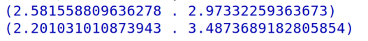

可以发现 公式1 是正确的。

```lisp
(define R1 (make-interval-percent 6.8 0.1))
(define R2 (make-interval-percent 4.7 0.05))
```


#### **Exercise 2.14.** 

Demonstrate that Lem is right. Investigate the behavior of the system on a variety of arithmetic expressions. 

Make some intervals *A* and *B*, and use them in computing the expressions *A*/*A* and *A*/*B*. 

You will get the most insight **by using intervals whose width is a small percentage of the center value**. 

Examine the results of the computation in **center-percent form** (see exercise 2.12).

使用 width 占 center 较小的那些interval 进行测试。

tolerance 越小，运算结果的 center 越符合数学算术，

比如 A 的 center 是 Ca，B 的center是Cb，

那么运算A op B 的center 就越接近 Ca op Cb


这里的区间运算的核心前提是 **每个区间都是独立的，如果不独立，那么运算结果就是错的**。

A 和 A 是不独立的，所以 A/A 的结果是错的。

A 和 B 是独立的，所以A/B的结果是正确的。


#### **Exercise 2.15.** 

Eva Lu Ator, another user, has also noticed the different intervals computed by different but algebraically equivalent expressions. 

She says that a formula to compute with intervals using Alyssa's system will produce tighter error bounds **if it can be written in such a form that no variable that represents an uncertain number is repeated.** 

Thus, she says, `par1` is a "better'' program for parallel resistances than "par2". Is she right? Why?


不同的代数等价表达式计算出的不同区间。

只要独立，那么就是正确的。

R1 + R2 和 R1 * R2 是相关的，所以 直接用 R1R2/(R1 + R2) 来代替并联公式是错的。

1/R1 和 1/R2 是独立的，(1, 1) 和  1/R1 + 1/R2 是独立的，所以原始的 并联计算公式是正确的。


#### **Exercise 2.16.** 

Explain, in general, why equivalent algebraic expressions may lead to different answers. 

为什么等价的代数表达式可能导致不同的答案？

Can you devise an interval-arithmetic package that does not have this shortcoming, or is this task impossible? (Warning: This problem is very difficult.)

您能设计一个没有这个缺点的区间算术包吗？

或者这个任务是不可能完成的？


这个任务是不可能完成的，本质应该是一个多元函数求最大值和最小值的问题。

无法用这种区间算术来计算。


#### **Exercise 2.17.** 

Define a procedure `last-pair` that returns the **list** that contains only the last element of a given (**nonempty**) list:

```lisp
(last-pair (list 23 72 149 34))
; (34)
```


#### **Exercise 2.18.** 

Define a procedure `reverse` that takes a list as argument and returns a list of the same elements in reverse order:

```lisp
(reverse (list 1 4 9 16 25))
; (25 16 9 4 1)
```

并以相反的顺序返回一个相同元素的列表。

```lisp
(cons 1
      (cons 2
            (cons 3
                  (cons 4 nil))))
->
(cons 4
      (cons 3
            (cons 2
                  (cons 1 nil))))
```

递归不好实现，迭代好实现。

```lisp
(define (reverse items) 
  (define (iter items result) 
    (if (null? items) 
        result 
        (iter (cdr items) (cons (car items) result))))   
  (iter items nil))
```


#### **Exercise 2.19.** 

Consider the **change-counting program** of section 1.2.2. 

It would be nice to be able to easily **change the currency used by the program**, so that we could compute the number of ways to change **a British pound**, for example. 

As the program is written, the knowledge of the currency is distributed partly into the procedure `first-denomination` and partly into the procedure `count-change` (which **knows that there are five kinds of U.S. coins**). It would be nicer to be able to supply a list of coins to be used for making change.

如果能够提供一份用于**找零的硬币列表**就更好了。

We want to **rewrite the procedure `cc`** so that its second argument is a list of the values of the coins to use **rather than an integer specifying which coins to use**. 

We could then have lists that defined each kind of currency:

```lisp
(define us-coins (list 50 25 10 5 1))
(define uk-coins (list 100 50 20 10 5 2 1 0.5))
```

We could then call `cc` as follows:

```lisp
(cc 100 us-coins)
; 292
```

To do this will require changing the program `cc` somewhat. 

It will still have the same form, **but it will access its second argument differently**, as follows:

```lisp
(define (cc amount coin-values)
  (cond ((= amount 0) 1)
        ((or (< amount 0) (no-more? coin-values)) 0)
        (else
         (+ (cc amount
                (except-first-denomination coin-values))
            (cc (- amount
                   (first-denomination coin-values))
                coin-values)))))
```

**Define the procedures `first-denomination`, `except-first-denomination`, and `no-more?`** 

in terms of primitive operations on list structures. 

Does **the order of the list `coin-values` affect the answer produced by `cc`?** 

Why or why not?


coin-values 的 顺序是否对 cc 的结果有影响？

没有影响 ！


#### **Exercise 2.20.** 

The procedures `+`, `*`, and `list` take arbitrary numbers of arguments. 

list 的参数数量是不确定的，即可以接受任意数量的参数。

One way to define such procedures is to **use `define` with *dotted-tail notation*.** 

In a procedure definition, a parameter list that has a dot before the last parameter name indicates that, when the procedure is called, the initial parameters (if any) will have as values the initial arguments, as usual, **but the final parameter's value will be a *list* of any remaining arguments.** 

但**最终参数的值将是任何剩余参数的*列表***

For instance, given the definition

```lisp
(define (f x y . z) <body>)
; using lambda
(define f (lambda (x y . z) <body>))
```

the procedure `f` can be called **with two or more arguments.** 

If we evaluate

```
(f 1 2 3 4 5 6)
```

then in the body of `f`, **`x` will be 1, `y` will be 2, and `z` will be the list `(3 4 5 6)`**. 

Given the definition

```lisp
(define (g . w) <body>)
; using lambda
(define g (lambda w <body>))
```

the procedure `g` can be called with zero or more arguments. 

If we evaluate

```
(g 1 2 3 4 5 6)
```

**then in the body of `g`, `w` will be the list `(1 2 3 4 5 6)`.**

Use this notation to write a procedure `same-parity` that takes **one or more integers** and **returns a list of all the arguments that have the same even-odd parity as the first argument.** 

For example,

```lisp
(same-parity 1 2 3 4 5 6 7)
; (1 3 5 7)

(same-parity 2 3 4 5 6 7)
; (2 4 6)
```

**返回参数中所有和第一个参数相同奇偶性的所有参数。**


**这个题目介绍了过程的可变参数是怎么实现的，就是用一个list串起来。**


#### **Exercise 2.21.** 

The procedure `square-list` takes a list of numbers as argument and returns a list of the squares of those numbers.

```lisp
(square-list (list 1 2 3 4))
; (1 4 9 16)
```

Here are two different definitions of `square-list`. 

Complete both of them by filling in the missing expressions:

```lisp
(define (square-list items)
  (if (null? items)
      nil
      (cons <??> <??>)))
(define (square-list items)
  (map <??> <??>))
```

实现 平方的map


#### **Exercise 2.22.** 

Louis Reasoner tries to rewrite the first `square-list` procedure of exercise 2.21 so that it evolves an iterative process:

```lisp
(define (square-list items)
  (define (iter things answer)
    (if (null? things)
        answer
        (iter (cdr things) 
              (cons (square (car things))
                    answer))))
  (iter items nil))
```

Unfortunately, defining `square-list` this way produces the answer list in the reverse order of the one desired. Why?

Louis then tries to fix his bug by interchanging the arguments to `cons`:

```lisp
(define (square-list items)
  (define (iter things answer)
    (if (null? things)
        answer
        (iter (cdr things)
              (cons answer
                    (square (car things))))))
  (iter items nil))
```

This doesn't work either. Explain.

想用迭代而不是递归来重写 square-list，试了两次都不行。

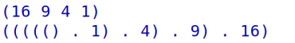


#### **Exercise 2.23.** 

The procedure `for-each` is similar to `map`. It takes as arguments a procedure and a list of elements. 

However, rather than forming a list of the results, `for-each` just applies the procedure to each of the elements in turn, from left to right. 

“for-each”不是形成一个结果列表，**而是从左到右依次对每个元素应用该过程**

The values returned by applying the procedure to the elements are not used at all -- `for-each` is used with procedures that perform an action, such as printing. 

不使用返回值。

For example,

```lisp
(for-each (lambda (x) (newline) (display x))
          (list 57 321 88))
; 57
; 321
; 88
```

The value returned by the call to `for-each` (not illustrated above) can be something arbitrary, such as true. 

Give an implementation of `for-each`.


#### **Exercise 2.24.** 

Suppose we evaluate the expression `(list 1 (list 2 (list 3 4)))`. 

Give the **result** printed by the interpreter, **the corresponding box-and-pointer structure, and the interpretation of this as a tree** (as in figure 2.6).

（1）编译器打印的结果

（2）box-and-pointer 结构图

（3）tree的结构图

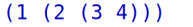

```
 (1 (2 (3 4)))
      ^
    /   \
   1     ^ (2 (3 4))
       /   \
      2     ^ (3 4)
          /   \
         3     4
```

```
                 
 (1 (2 (3 4)))  ((2 (3 4)))                                           
   +---+---+    +---+---+
   | * | *-+--->| * | / |
   +-+-+---+    +-+-+---+
     |            |   
     V            V (2 (3 4))   ((3 4))   
   +---+        +---+---+      +---+---+
   | 1 |        | * | *-+----->| * | / | 
   +---+        +-+-+---+      +---+---+
                  |              |
                  V              V (3 4)
                +---+          +---+---+    +---+---+
                | 2 |          | * | *-+--->| * | / |
                +---+          +-+-+---+    +-+-+---+
                                 |            |
                                 V            V
                               +---+        +---+
                               | 3 |        | 4 |
                               +---+        +---+
```


#### **Exercise 2.25.** 

Give combinations of `car`s and `cdr`s that will pick 7 from each of the following lists:

```lisp
(1 3 (5 7) 9)
((7))
(1 (2 (3 (4 (5 (6 7))))))
```

```lisp
(car (cdr (car (cdr (cdr list1)))))
(car (car list2))
(car (cdr (car (cdr (car (cdr (car (cdr (car (cdr (car (cdr list3))))))))))))
```


#### **Exercise 2.26.** 

Suppose we define `x` and `y` to be two lists:

```lisp
(define x (list 1 2 3))
(define y (list 4 5 6))
```

What result is printed by the interpreter in response to evaluating each of the following expressions:

```lisp
(append x y)
(cons x y)
(list x y)
```

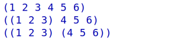


#### **Exercise 2.27.** 

Modify your `reverse` procedure of exercise 2.18 to produce a `deep-reverse` procedure that **takes a list as argument and returns as its value the list with its elements reversed and with all sublists deep-reversed as well**. 

For example,

```lisp
(define x (list (list 1 2) (list 3 4)))

x
; ((1 2) (3 4))

(reverse x)
; ((3 4) (1 2))

(deep-reverse x)
; ((4 3) (2 1))
```


#### **Exercise 2.28.** 

Write a procedure `fringe` that takes as argument **a tree** (represented **as a list**) and returns **a list** whose **elements are all the leaves of the tree arranged in left-to-right order.** 

For example,

```lisp
(define x (list (list 1 2) (list 3 4)))

(fringe x)
; (1 2 3 4)

(fringe (list x x))
; (1 2 3 4 1 2 3 4)
```

从左到右顺序排列的树的所有叶子


思路可以参考  count-leaves的实现


#### **Exercise 2.29.** 

A **binary mobile** consists of two branches, **a left branch and a right branch.** 

Each **branch** is a rod of a certain length, from which hangs either a **weight** or another **binary mobile.** 

We can represent a binary mobile using **compound data** by constructing it from two branches (for example, using `list`) ：

使用list构建一个两个分支的mobile

```lisp
(define (make-mobile left right)
  (list left right))
```

A **branch** is constructed from a `length` (which must be a **number**) together with a `structure`, which may be either a number (representing a simple **weight**) or another **mobile**:

```lisp
(define (make-branch length structure)
  (list length structure))
```

- length 是一个数字，表示branch的长度。
- **structure 可能是一个数字（表示weight），也可能是一个mobile。**

a. Write the corresponding **selectors** `left-branch` and `right-branch`, which return the branches of a mobile, and `branch-length` and `branch-structure`, which return the components of a branch.

- **（1）实现 left-branch、right-branch**
- **（2）实现 branch-length、branch-structure**

b. Using your selectors, define a procedure `total-weight` that returns the total weight of a mobile.

- **（3）实现 total-weight**

c. A **mobile** is said to be *balanced* if the torque applied by its **top-left** branch is equal to that applied by its **top-right** branch (that is, **if the length of the left rod multiplied by the weight hanging from that rod is equal to the corresponding product for the right side**) and if each of the submobiles hanging off its branches is balanced.

- **（4）检验是否平衡？** 

Design a **predicate** that tests whether a binary mobile is balanced.

**平衡要求每个mobile 的左分支重力矩和右分支的重力矩相等。**

d. Suppose we change the representation of mobiles so that the constructors are

```lisp
(define (make-mobile left right)
  (cons left right))
(define (make-branch length structure)
  (cons length structure))
```

How much do you need to change your programs to convert to the new representation?

**（5）如果将make-mobile和make-branch修改为用pair实现，而不是list，所有过程是否需要修改？需要修改多少？**

**修改一下mobile 和 branch的定义和selector函数即可。**


#### **Exercise 2.30.** 

Define a procedure `square-tree` analogous to the `square-list` procedure of exercise 2.21. 

That is, `square-list` should behave as follows:

```lisp
(square-tree
 (list 1
       (list 2 (list 3 4) 5)
       (list 6 7)))
; (1 (4 (9 16) 25) (36 49))
```

Define `square-tree` both directly (i.e., **without using any higher-order procedures) and also by using `map` and recursion.**

直接实现，不要用map或者其他的高阶过程。


#### **Exercise 2.31.** 

Abstract your answer to exercise 2.30 to produce a procedure `tree-map` with the property that `square-tree` could be defined as

```lisp
(define (square-tree tree) (tree-map square tree))
```


#### **Exercise 2.32.** 

We can represent a set as a list of **distinct elements**, and we can represent the set of all subsets of the set as a list of lists. 

- 用不同元素的list作为集合set
- 集合的所有子集可以用一个list的list表示

For example, if the set is `(1 2 3)`, then the set of all subsets is `(() (3) (2) (2 3) (1) (1 3) (1 2) (1 2 3))`. 

Complete the following definition of a procedure that generates the set of subsets of a set and give a clear explanation of why it works:

```lisp
(define (subsets s)
  (if (null? s)
      (list nil)
      (let ((rest (subsets (cdr s))))
        (append rest (map <??> rest)))))
```


```lisp
(define (subsets s)
  (if (null? s)
      (list nil)
      (let ((rest (subsets (cdr s))))
        (append rest (map (lambda (x)
                            (cons (car s) x)) rest)))))
```


跟踪 rest的变化，就知道什么原理了

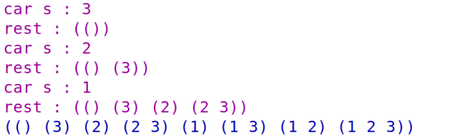


#### **Exercise 2.33.** 

Fill in the missing expressions to complete the following definitions of some basic list-manipulation operations as accumulations:

```lisp
(define (map p sequence)
    (accumulate (lambda (x y) <??>) nil sequence))
(define (append seq1 seq2)
    (accumulate cons <??> <??>))
(define (length sequence)
    (accumulate <??> 0 sequence))
```

```lisp
(define (accumulate op initial sequence)
  (if (null? sequence)
      initial
      (op (car sequence)
          (accumulate op initial (cdr sequence)))))

(define (map p sequence)
    (accumulate (lambda (x y) (cons (p x) y)) nil sequence))

(define (append seq1 seq2)
    (accumulate cons seq2 seq1))

(define (length sequence)
    (accumulate (lambda (x y) (+ 1 y)) 0 sequence))
```

看着accumulate定义写


#### **Exercise 2.34.** 

Evaluating a polynomial in *x* at a given value of *x* can be formulated as an accumulation. 

We evaluate the polynomial

计算多项式在x处的函数值。
$$
a_{n}x^{n}+a_{n-1}x^{n-1}+\cdots+a_{1}x+a_{0}
$$
using a well-known algorithm called ***Horner's rule***, which structures the computation as
$$
(\cdots(a_{n}x+a_{n-1})x+\cdots+a_{1})x+a_{0}
$$
霍纳规则？秦九韶算法。

In other words, we start with $a_n$, multiply by x, add $a_{n-1}$, multiply by x, and so on, until we reach $a_0$

Fill in the following template to produce a procedure that evaluates a **polynomial using Horner's rule.** 

Assume that **the coefficients of the polynomial are arranged in a sequence,** 

系数在一个list中，就是 $a_0$ 到 $a_n$

from $a_0$ through $a_n.$

```lisp
(define (horner-eval x coefficient-sequence)
  (accumulate (lambda (this-coeff higher-terms) <??>)
              0
              coefficient-sequence))
```

For example, to compute $1+3x+5x^3 + x^5$ at x=2 you would evaluate

```lisp
(horner-eval 2 (list 1 3 0 5 0 1))
```

```lisp
(define (horner-eval x coefficient-sequence)
  (accumulate (lambda (this-coeff higher-terms)
                (+ this-coeff (* x higher-terms)))
              0
              coefficient-sequence))
```

**(...) x + a0**


#### **Exercise 2.35.** 

Redefine `count-leaves` from section 2.2.2 as an accumulation:

```lisp
(define (count-leaves t)
  (accumulate <??> <??> (map <??> <??>)))
```

主要就是这个map 怎么填。没有想到特别好的办法，只能先将t 用enumerate 映射得到一个list，list的每个成员都是list，只有一层。

然后就是用length进行求和

```lisp
(define (count-leaves t)
  (accumulate (lambda (x y) (+ (length x) y)) 0
              (map (lambda (x) (enumerate-tree x)) t)))
```


#### **Exercise 2.36.** 

The procedure `accumulate-n` is similar to `accumulate` except that it **takes as its third argument a sequence of sequences,** which are all assumed to **have the same number of elements.** 

第三个参数是一个序列序列

假定所有序列都具有相同数量的元素

It applies the designated accumulation procedure to combine all the **first** elements of the sequences, all the second elements of the sequences, and so on, and returns a sequence of the results. 

For instance, 

if `s` is a sequence containing four sequences,

 `((1 2 3) (4 5 6) (7 8 9) (10 11 12)),`

 **then the value of `(accumulate-n + 0 s)`** should be the sequence `(22 26 30)`. 

**(1+4+7+10, 2+5+8+11, 3+6+9+12)**

Fill in the **missing expressions** in the following definition of `accumulate-n`:

```lisp
(define (accumulate-n op init seqs)
  (if (null? (car seqs))
      nil
      (cons (accumulate op init <??>)
            (accumulate-n op init <??>))))
```

太难想了，答案居然是map car 和 map cdr

即一次移动一列。。。

```lisp
(define (accumulate-n op init seqs)
  (if (null? (car seqs))
      nil
      (cons (accumulate op init (map car seqs))
            (accumulate-n op init (map cdr seqs)))))
```


#### **Exercise 2.37.** 

Suppose we represent vectors $v=(v_j)$ **as sequences of numbers**, 

and matrices $m=(m_{ij})$ as sequences of vectors (**the rows of the matrix**). 

For example, the **matrix**
$$
\left.\left[\begin{array}{cccc}1&2&3&4\\4&5&6&6\\6&7&8&9\end{array}\right.\right]
$$
is represented as the sequence `((1 2 3 4) (4 5 6 6) (6 7 8 9))`. 

向量是一个数字的list，矩阵是list的list。

With this representation, we can use sequence operations to concisely express the basic matrix and vector operations. 

These operations (which are described in any book on matrix algebra) are the following:

向量和矩阵的运算：

**（1）点乘，(dot-product v w)**
$$
\Sigma_{i}v_{i}w_{i}.
$$
**（2）矩阵乘向量，(matrix-*-vector m v)**
$$
\mathrm{returns~the~vector~t,~where~}t_{i}=\sum_{j}m_{ij}v_{j}.
$$
**（3）矩阵乘矩阵，(matrix-*-matrix m n)**
$$
\mathrm{returns~the~matrix~p,~where~p}_{ij}=\sum_{k}m_{ik}n_{kj}.
$$
**（4）矩阵的转置，(transpose m)**
$$
\mathrm{returns~the~inatrix~}n,\mathrm{~where~}n_{ij}=m_{ji}.
$$

```lisp
(define (dot-product v w)
  (accumulate + 0 (map * v w)))
```

上面用的map是扩展后的map

```lisp
(map + (list 1 2 3) (list 40 50 60) (list 700 800 900))
; (741 852 963)

(map (lambda (x y) (+ x (* 2 y)))
     (list 1 2 3)
     (list 4 5 6))
; (9 12 15)
```

Fill in the missing expressions in the following procedures for computing the other matrix operations. (The procedure `accumulate-n` is defined in exercise 2.36.)

```lisp
(define (matrix-*-vector m v)
  (map <??> m))
(define (transpose mat)
  (accumulate-n <??> <??> mat))
(define (matrix-*-matrix m n)
  (let ((cols (transpose n)))
    (map <??> m)))
```

答案：

```lisp
; 矩阵乘向量
(define (matrix-*-vector m v)
  (map (lambda (x) (dot-product x v)) m))
; 矩阵转置
(define (transpose mat)
  (accumulate-n cons nil mat))
; 矩阵乘矩阵
(define (matrix-*-matrix m n)
  (let ((cols (transpose n)))
    (map (lambda (x) (matrix-*-vector cols x)) m)))
```


#### **Exercise 2.38.** 

The `accumulate` procedure is also known as `fold-right`, because **it combines the first element of the sequence with the result of combining all the elements to the right.** 

右折叠，即将第一个元素和右边的所有元素进行 combine

There is also a `fold-left`, which is similar to `fold-right`, except that it combines elements working **in the opposite direction:**

反向运算。

```lisp
(define (fold-left op initial sequence)
  (define (iter result rest)
    (if (null? rest)
        result
        (iter (op result (car rest))
              (cdr rest))))
  (iter initial sequence))
```

What are the values of

```lisp
(fold-right / 1 (list 1 2 3))
(fold-left / 1 (list 1 2 3))
(fold-right list nil (list 1 2 3))
(fold-left list nil (list 1 2 3))
```

**Give a property that `op` should satisfy to guarantee that `fold-right` and `fold-left` will produce the same values for any sequence.**


**op 应该满足什么性质，fold-right 和 fold-left 才能有相同的结果？**

```
a b c d
(((a op b) op c) op d) fold-right
(((d op c) op b) op a) fold-left
```

举例，+ 和 * ，即加法和乘法是肯定可以的。

减法和除法是不行的，cons也是不行的。

**op 需要满足 a op b 和 b op a 是等价的才可以。**

即op 的左右两个操作数是可交换的，那么fold-right 和 fold-left 的结果才相同。


#### **Exercise 2.39.**  

Complete the following definitions of `reverse` (exercise 2.18) in terms of `fold-right` and `fold-left` from exercise 2.38:

```lisp
(define (reverse sequence)
  (fold-right (lambda (x y) <??>) nil sequence))
(define (reverse sequence)
  (fold-left (lambda (x y) <??>) nil sequence))
```

用fold-right 实现 reverse 需要借助 append

```lisp
(define (reverse sequence)
  (fold-right (lambda (x y)
                (if (null? y)
                    (list x)
                    (append y (list x))
                ))
              nil sequence))
(define (reverse sequence)
 (fold-left (lambda (x y) (cons y x)) nil sequence))
```


#### **Exercise 2.40.** 

Define a procedure `unique-pairs` that, given an integer *n*, generates the sequence of pairs (*i*,*j*) with 1<= *j*< *i*<= *n*. 

Use `unique-pairs` to simplify the definition of `prime-sum-pairs` given above.

- 先实现 unique-pairs
- 然后 使用 unique-pairs 实现 prime-sum-pairs


#### **Exercise 2.41.** 

Write a procedure to find all **ordered** triples of **distinct** **positive** integers *i*, *j*, and *k* less than or equal to a given integer *n* that sum to a given integer *s*.

1=<k<j<i<=n

i+j+k == s


**和 unique-pairs 不同，这里的unique-triples 需要两次 append !**


#### **Exercise 2.42.** 

**A solution to the eight-queens puzzle.**

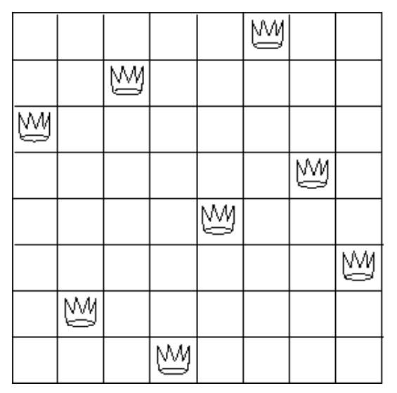

The "eight-queens puzzle'' asks how to place eight queens on a chessboard so that no queen is in check from any other (i.e., no two queens are in the same row, column, or diagonal). 

**没有两个皇后在同一行、同列或同对角线上**

One possible solution is shown in figure 2.8. 

One way to solve the puzzle is to work across the board, placing a queen in each column. 

**Once we have placed *k* - 1 queens, we must place the *k*th queen in a position where it does not check any of the queens already on the board.** 

We can formulate this approach **recursively**: 

**Assume** that we have already generated the sequence of all possible ways to place *k* - 1 queens in the first *k* - 1 columns of the board. 

加定此时我们已经再前k - 1 列放置了 k - 1 个 皇后

For each of these ways, generate an extended set of positions by placing a queen in each row of the *k*th column. 

在 第 k 列的每一行放置一个皇后

Now filter these, **keeping only the positions for which the queen in the *k*th column is safe with respect to the other queens**.

检查每种情况，过滤掉不安全的情况。 

This produces the sequence of all ways to place *k* queens in the first *k* columns. 

于是就完成了将k个皇后放在前k列中的所有方法序列。

By continuing this process, we will produce not only one solution, but all solutions to the puzzle.

**于是就可以得到解决方法了。**

We implement this solution as a procedure `queens`, 

**which returns a sequence of all solutions to the problem of placing *n* queens on an *n*× *n* chessboard.** 

参数就是一个n，即表示一个 n x n 大小的棋盘。

`Queens` has an internal procedure `queen-cols` that **returns the sequence of all ways to place queens in the first *k* columns of the board.**

' Queens '有一个内部过程' queen-cols '，

它返回将皇后放置在棋盘前k列中的所有方法的序列。

```lisp
(define (queens board-size)
  (define (queen-cols k)  
    (if (= k 0)
        (list empty-board)
        (filter
         (lambda (positions) (safe? k positions))
         (flatmap
          (lambda (rest-of-queens)
            (map (lambda (new-row)
                   (adjoin-position new-row k rest-of-queens))
                 (enumerate-interval 1 board-size)))
          (queen-cols (- k 1))))))
  (queen-cols board-size))
```

In this procedure `rest-of-queens` is a way to place *k* - 1 queens in the first *k* - 1 columns, and `new-row` is a proposed row **in which to place the queen for the *k*th column**. 

Complete the program by implementing the representation for sets of board positions, including the procedure `adjoin-position`, **which adjoins a new row-column position to a set of positions**, and `empty-board`, which **represents an empty set of positions**. 

You must also write the procedure `safe?`, **which determines for a set of positions, whether the queen in the *k*th column is safe with respect to the others**. 

(Note that we need **only** check **whether the new queen is safe** -- the other queens are already guaranteed safe with respect to each other.)

实现：

（1）rest-of-queens

（2）new-row

（**3）adjoin-position**

（4）empty-board

**（5）safe?**


想半天，为什么 safe? 需要用到k？居然是可以不需要用k的。。。

**初始返回的空棋盘 是一个 (( ))**

最外层括号表示所有解的集合，里层的括号表示一个空解，即棋盘上没有放皇后。

- **一个点** 用 一个括号括起来，
- 多个点 用 一个括号括起来就是一个**解**，
- 多个解 用括号 括起来，就是**所有解的集合**，
- 解的数量就是 length的值。

```
(enumerate-interval 1 board-size)
```

加设 是 4 * 4 的棋盘，那么 上面的表达式就可以生成 ( 1 2 3 4) 的list

```lisp
(map (lambda (new-row) 
             (adjoin-position new-row
                              k rest-of-queens)) 
     (enumerate-interval 1 board-size))
```

这个map就是得到 **((1 k) (2 k) (3 k) (4 k))** 这个list


看清楚，这里map 和 flatmap 是两层的map。

所以会用乘法枚举所有情况。

(queen-cols (- k 1)) 就是前k-1列解的情况。

比如 k = 1 时， (queen-cols (- k 1)) 就是 (())

那么经过 flatmap 和 map 处理之后就会变成

( ((1 1)) ((2 1)) ((3 1)) ((4 1)) )

flapmap 的直观含义就是对一个list的每个元素**从左到右执行某个特定的过程**，最后将结果用list串起来。

继续一轮，就会得到 ：

```
((1 2) (1 1))
((2 2) (1 1))
((3 2) (1 1))
((4 2) (1 1))
((1 2) (2 1))
((2 2) (2 1))
((3 2) (2 1))
((4 2) (2 1))
((1 2) (3 1))
((2 2) (3 1))
((3 2) (3 1))
((4 2) (3 1))
((1 2) (4 1))
((2 2) (4 1))
((3 2) (4 1))
((4 2) (4 1))
```

然后就是过滤一些不满足要求的

如何理解safe？

```lisp
(define (safe? y)
  (= 0 (accumulate + 0 
                   (map (lambda (x) 
                          (if (check (car y) x) 0 1)) 
                        (cdr y))))) 
```

这里传递到safe? 的y是所有可能的棋盘情况。

就是一个点的集合，我们需要过滤掉所有不满足条件的情况。

- (car y) 得到的是第一个点，刚好就是第k列新加入的点。
- (cdr y) 得到的是多个点的list，刚好就是前k-1列满足条件的点的集合。

所以这个accumulate 的 map 就好理解了，就是遍历前k-1列的所有点，如果发现这个点和第一个点不满足条件，就map成0，否则map成1，最后用accumulate累加，如果发现是0，则说明所有的点都满足条件，那么就是safe的。


**这个题目想写对，很不容易。**


#### **Exercise 2.43.** 

Louis Reasoner is having a terrible time doing exercise 2.42. 

His `queens` procedure seems to work, but it runs extremely slowly.

 (Louis never does manage to wait long enough for it to solve even the 6× 6 case.) 

When Louis asks Eva Lu Ator for help, she points out that he has interchanged the order of the nested mappings in the `flatmap`, writing it as

```lisp
(flatmap
 (lambda (new-row)
   (map (lambda (rest-of-queens)
          (adjoin-position new-row k rest-of-queens))
        (queen-cols (- k 1))))
 (enumerate-interval 1 board-size))
```

Explain why this interchange makes the program run slowly. 

Estimate how long it will take Louis's program to solve the eight-queens puzzle, assuming that the program in exercise 2.42 solves the puzzle in time *T*.

（1）解释为什么变慢了？

（2）相对于2.42 的写法来说花费的时间是多少？

这里应该是交换了 map 和 flatmap 里面操作的对象吧。。

```
(queen-cols (- k 1))
```

- 放到了里面，就会导致每次都会重新计算一次。。。
- 放到外面，只需要计算一次，就可以得到list。

如果是 8 * 8 的棋盘，那么对于每一列，都会有 8 次的重复计算，由于有 8 列，所以 总时间就是 (8 * 8) T 


#### **Exercise 2.44.** 

Define the procedure `up-split` used by `corner-split`. 

It is similar to `right-split`, except that **it switches the roles of `below` and `beside`.**

定义corner-split 使用的 up-split。

可以参考 right-split 实现。


问题就是没法测试代码？

If you are using DrRacket, follow these steps:

\1) Install the package sicp.plt (Go to file>Install Package, type 'sicp.plt' in package source)

\2) Paste this code '(require (planet "sicp.ss" ("soegaard" "sicp.plt" 2 1)))' in your rkt file.

\3) Test the file with the code '(paint einstein)'. You should see a picture of Einstein in your command line.

https://www.zhihu.com/question/20789155


```
#lang sicp
(#%require sicp-pict)
```

别搞错意思了，这个题目就是实现 up-split，只不过这个up-split被corner-split所使用。


#### **Exercise 2.45.** 

`Right-split` and `up-split` can be expressed **as instances of a general splitting operation**. 

Define a procedure `split` with the property that evaluating

```lisp
(define right-split (split beside below))
(define up-split (split below beside))
```

produces procedures `right-split` and `up-split` with the same behaviors **as the ones already defined.**

左拆分和右拆分可以统一为一个抽象。

需要注意的是这里的split返回的是一个递归的lambda表达式，所以按照下面的方式即进行定义会更好一些。

```lisp
(define (split op1 op2)
  (define (iter painter n)
    (if (= n 0)
        painter
        (let ((smaller (iter painter (- n 1))))
          (op1 painter (op2 smaller smaller)))
        ))
  (lambda (painter n) (iter painter n)))
```


#### **Exercise 2.46.** 

A two-dimensional vector **v** running from the origin to a point can be represented as a pair consisting of an *x*-coordinate and a *y*-coordinate. 

以原点为起点的二维向量可以用 (x, y) 表示。

Implement a data abstraction for vectors by giving a constructor `make-vect` and corresponding selectors `xcor-vect` and `ycor-vect`. 

In terms of your selectors and constructor, implement procedures `add-vect`, `sub-vect`, and `scale-vect` that perform the operations vector addition, vector subtraction, and multiplying a vector by a scalar:
$$
\begin{array}{rcl}{(\mathbf{x}_{1},y_{1})+(\mathbf{x}_{2},y_{2})}&{=}&{(\mathbf{x}_{1}+\mathbf{x}_{2},y_{1}+y_{2})}\\{(\mathbf{x}_{1},y_{1})-(\mathbf{x}_{2},y_{2})}&{=}&{(\mathbf{x}_{1}-\mathbf{x}_{2},y_{1}-y_{2})}\\{s\cdot(\mathbf{x},y)}&{=}&{(s\mathbf{x},sy)}\\\end{array}
$$
实现：

- （1）make-vect
- （2）xcor-vect 
- （3）ycor-vect
- （4）add-vect
- （5）sub-vect
- （6）scale-vect

向量加法、向量减法、向量缩放


#### **Exercise 2.47.** 

Here are two possible constructors for frames:

```lisp
(define (make-frame origin edge1 edge2)
  (list origin edge1 edge2))

(define (make-frame origin edge1 edge2)
  (cons origin (cons edge1 edge2)))
```

For each constructor supply the appropriate selectors to produce an implementation for frames.

**实现 frames 的选择器**


#### **Exercise 2.48.** 

**A directed line segment in the plane** can be represented as a pair of vectors -- the vector running from the origin to the start-point of the segment, and the vector running from the origin to the end-point of the segment. 

如何表示平面中的一个有向线段？

- -从原点到起点的向量
- -从原点到终点的向量

Use your vector representation from exercise 2.46 to define a representation for segments with a constructor `make-segment` and selectors `start-segment` and `end-segment`.


#### **Exercise 2.49.** 

Use `segments->painter` to define the following primitive painters:

a. The painter that **draws the outline of the designated frame**.

b. The painter that draws an "X'' by **connecting opposite corners of the frame.**

c. The painter that draws a **diamond shape** by connecting the midpoints of the sides of the frame.

d. **The `wave` painter.**


（1）矩形、X、棱形

（2）wave？

draw

https://www.lispworks.com/documentation/lw70/CAPI-W/html/capi-w-717.htm

不要自己定义 segments->painter，而是用库里面的。

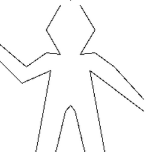

segment、vector也不要用自己的，要用库里面的，然后绘制图像需要用具体的点


#### **Exercise 2.50.** 

Define the transformation `flip-horiz`, which flips painters horizontally, 

and transformations that rotate painters counterclockwise by 180 degrees and 270 degrees.

逆时针旋转。

**（1）flip-horiz**

**（2）rotate270**

**（3）rotate180**

roate180 和 rotate270 可以用 repeated 和 rotate90 来实现。


#### **Exercise 2.51.** 

Define the `below` operation for painters. 

`Below` takes two painters as arguments. 

The resulting painter, given a frame, **draws with the first painter in the bottom of the frame and with the second painter in the top.** 

Define `below` in two different ways -- first by writing a procedure that is analogous to the `beside` procedure given above, and again in terms of `beside` and suitable rotation operations (from exercise 2.50).

（1）实现below，第一种是仿造beside实现below

```lisp
; beside
(define (beside painter1 painter2)
  (let ((split-point (make-vect 0.5 0.0)))
    (let ((paint-left
           (transform-painter painter1
                              (make-vect 0.0 0.0)
                              split-point
                              (make-vect 0.0 1.0)))
          (paint-right
           (transform-painter painter2
                              split-point
                              (make-vect 1.0 0.0)
                              (make-vect 0.5 1.0))))
      (lambda (frame)
        (paint-left frame)
        (paint-right frame)))))

; below
(define (below-1 painter1 painter2)
  (let ((split-point (make-vect 0.0 0.5)))
    (let ((paint-up
           (transform-painter painter1
                              (make-vect 0.0 0.0)
                              (make-vect 1.0 0.0)
                              split-point
                              ))
          (paint-down
           (transform-painter painter2
                              split-point
                              (make-vect 1.0 0.5)
                              (make-vect 0.0 1.0))))
      (lambda (frame)
        (paint-up frame)
        (paint-down frame)))))
```

（2）实现below，第二种是使用beside + 合适的旋转来实现

```lisp
(define (below-2 painter1 painter2)
  (rotate270 (beside (rotate90 painter1) (rotate90 painter2))))
```

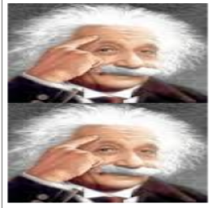


#### **Exercise 2.52.** 

Make changes to the **square limit of `wave`** shown in figure 2.9 by working at each of the levels described above. In particular:

a. Add some segments to the primitive `wave` painter of exercise  2.49 (**to add a smile, for example).**

b. Change the pattern constructed by `corner-split` (for example, **by using only one copy of the `up-split` and `right-split` images instead of two)**.

c. Modify the version of `square-limit` that uses `square-of-four` so as to assemble the corners in a different pattern. (For example, **you might make the big Mr. Rogers look outward from each corner of the square**.)

（1）wave painter中添加一些细节，比如，一个smile

（2）修改 corner-split 的模式，比如，只使用up或者right的一个

（3）修改square-limit来改变 corners 的模式


#### **Exercise 2.53.** 

What would the interpreter print in response to evaluating each of the following expressions?

```lisp
(list 'a 'b 'c)
; (a b c)
(list (list 'george))
; ((george))
(cdr '((x1 x2) (y1 y2)))
; ((y1 y2))
(cadr '((x1 x2) (y1 y2)))
; (y1 y2)
(pair? (car '(a short list)))
; #f
(memq 'red '((red shoes) (blue socks)))
; #f
(memq 'red '(red shoes blue socks))
; (red shoes blue socks)
```


#### **Exercise 2.54.** 

Two lists are said to be `equal?` if they contain equal elements arranged in the same order. For example,

```lisp
(equal? '(this is a list) '(this is a list))
```

is true, but

```lisp
(equal? '(this is a list) '(this (is a) list))
```

is false. 

To be more precise, we can define `equal?` 

recursively in terms of the basic `eq?` equality of symbols by saying that `a` and `b` are `equal?` 

if they are both symbols and the symbols are `eq?`, or if they are both lists such that `(car a)` is `equal?` to `(car b)` and `(cdr a)` is `equal?` to `(cdr b)`. 

Using this idea, implement `equal?` as a procedure.

递归实现 equal?


#### **Exercise 2.55.** 

Eva Lu Ator types to the interpreter the expression

```lisp
(car ''abracadabra)
```

To her surprise, the interpreter prints back `quote`. Explain.

```
 ;; (car ''something) is treated by the interpreter as: 
 ;; (car (quote (quote something))) 
```


#### **Exercise 2.56.** 

Show how to extend the basic differentiator to handle more kinds of expressions. 

扩展微分的表达式！

For instance, **implement the differentiation rule**
$$
\frac{d(u^{n})}{dx}=nu^{n-1}\left(\frac{du}{dx}\right)
$$
by adding a new clause to the `deriv` program and defining appropriate procedures `exponentiation?`, `base`, `exponent`, and `make-exponentiation`. 

添加：

**（1）exponentiation?**

**（2）base**

**（3）exponent**

**（4）make-exponentiation**


**(You may use the symbol `**` to denote exponentiation.)** 

Build in the rules that 

- anything raised to the power 0 is 1
- anything raised to the power 1 is the thing itself.

任何数的0次方的都是1。

任何数的1次方的都是它本身。


这里的 n 应该是数字。。。


#### **Exercise 2.57.** 

Extend the differentiation program to handle **sums and products of arbitrary numbers of (two or more) terms.** 

加法和乘法的项可以有多个。

Then the last example above could be expressed as

```lisp
(deriv '(* x y (+ x 3)) 'x)
```

Try to do this by changing only the representation for sums and products

, **without changing the `deriv` procedure at all.** 

For example, the `addend` of a sum would be the first term, and the `augend` would **be the sum of the rest of the terms.**


#### **Exercise 2.58.** 

Suppose we want to modify the differentiation program so that it works **with ordinary mathematical notation, in which `+` and `*` are infix rather than prefix operators**. 

非前缀表达式，而是中缀表达式

Since the differentiation program is defined in terms of abstract data, we can modify it to work with different representations of expressions solely **by changing the predicates, selectors, and constructors** that define the representation of the algebraic expressions on which the differentiator is to operate.

a. Show how to do this in order to differentiate algebraic expressions presented **in infix form**, such as `(x + (3 * (x + (y + 2))))`. To simplify the task, assume that `+` and `*` always take two arguments and that expressions are fully parenthesized.

b. The problem becomes substantially harder if we allow standard algebraic notation, such as `(x + 3 * (x + y + 2))`, which drops unnecessary parentheses and assumes that multiplication is done before addition. Can you design appropriate predicates, selectors, and constructors for this notation such that our derivative program still works?


（1）改中缀

（2）乘法优先级比加法高

（3）仅修改 predicates、selectors和constructors


首先就是 sum? 和 product? 怎么改

找到表达式中优先级最低的那个符号。

将前缀表达式改成中缀之后，发现修改更少了！！

将所有的 双目 运算抽象为 ：

```
() op ()
```

prefix 和 suffix 就是左边和右边

op 表示最低优先级的那个符号，如果优先级相同，则考虑最左边那个。


#### **Exercise 2.59.** 

Implement the `union-set` operation for the unordered-list representation of sets.

实现并集


#### **Exercise 2.60.** 

We specified that a set would be represented as a list with no duplicates. 

之前是集合不能重复，但是现在可以重复

Now suppose we allow duplicates. 

**For instance, the set {1,2,3} could be represented as the list `(2 3 2 1 3 2 2)`.** 

Design procedures `element-of-set?`, `adjoin-set`, `union-set`, and `intersection-set` that operate on this representation. 

How does the efficiency of each compare with the corresponding procedure for the non-duplicate representation? 

Are there applications for which you would use this representation in preference to the non-duplicate one?

（1）实现元素可重复的集合

（2）element-of-set?、adjoin-set、union-set和intersection-set

（3）比较效率


adjoin-set 变 $O(1)$

但是 element-of-set? 的比较时间可能会变长。


#### **Exercise 2.61.** 

Give an implementation of `adjoin-set` using the ordered representation. 

By **analogy** with `element-of-set?` show how to take advantage of the ordering to produce a procedure that requires on the average about half as many steps as with the unordered representation.

实现 集合 的**有序列表表示的 adjoin-set** 

（1）如果在遍历list的过程中就找到了这个元素，那么直接返回set

（2）最坏情况就是遍历到list的最后一个，发现没有，那么将这个元素插入最后即可

（3）如果在中间某个时刻发现  (car set) < x < (cadr set)，那么将x 插入这两个元素之间即可，保证list有序。


#### **Exercise 2.62.** 

Give a $\theta(n)$ implementation of `union-set` for sets represented as ordered lists.

给出 有序列表表示集合的 union-set 的过程描述。

比较两个集合的第一个元素 x1 和 x2

- 如果x1 == x2 ，那么集合的交集剩余部分就是 (cdr set1) 和 (cdr set2)，需要将x1/x2放入并集
- 如果x1 < x2，那么x1 一定不在 set2 中，那么集合的交集就是 (cdr set1) 和 set2 的并集，需要将x1放入并集
- 如果x2 < x1，那么x2 一定不在 set1 中，那么集合的交集就是 (cdr set2) 和 set1 的并集，需要将x2放入并集


#### **Exercise 2.63.** 

Each of the following two procedures converts a binary tree to a list.

将二叉树转换为列表。

```lisp
(define (tree->list-1 tree)
    (if (null? tree)
        '()
        (append (tree->list-1 (left-branch tree))
                (cons (entry tree)
                      (tree->list-1 (right-branch tree))))))
(define (tree->list-2 tree)
    (define (copy-to-list tree result-list)
        (if (null? tree)
            result-list
            (copy-to-list (left-branch tree)
                          (cons (entry tree)
                                (copy-to-list (right-branch tree)
                                              result-list)))))
    (copy-to-list tree '()))
```

a. Do the two procedures produce the same result for every tree? If not, how do the results differ? 

What lists do the two procedures produce for the trees in figure 2.16?

（1）结果相同吗？

（2）有什么不同？

b. Do the two procedures have the same order of growth in the number of steps required to convert a balanced tree with *n* elements to a list? If not, which one grows more slowly?

（3）将 n 个元素的平衡树转化为一个list所需要的步骤数

（4）那个更快？


结果都是一样的，都是左中右的顺序


第二个要快一些，$T(n) = O(n)$

第一个每次都需要append，$T(n)=O(nlogn)$


#### **Exercise 2.64.** 

The following procedure `list->tree` converts an ordered list to a balanced binary tree. 

The helper procedure `partial-tree` takes as arguments an integer *n* and list of at least *n* elements and **constructs a balanced tree containing the first *n* elements of the list.** 

构造平衡二叉树

The result returned by `partial-tree` is a pair (formed with `cons`) whose `car` is the constructed tree and whose `cdr` is the list of elements not included in the tree.

```lisp
(define (list->tree elements)
  (car (partial-tree elements (length elements))))

(define (partial-tree elts n)
  (if (= n 0)
      (cons '() elts)
      (let ((left-size (quotient (- n 1) 2)))
        (let ((left-result (partial-tree elts left-size)))
          (let ((left-tree (car left-result))
                (non-left-elts (cdr left-result))
                (right-size (- n (+ left-size 1))))
            (let ((this-entry (car non-left-elts))
                  (right-result (partial-tree (cdr non-left-elts)
                                              right-size)))
              (let ((right-tree (car right-result))
                    (remaining-elts (cdr right-result)))
                (cons (make-tree this-entry left-tree right-tree)
                      remaining-elts))))))))
```

a. Write a short paragraph explaining as clearly as you can how `partial-tree` works. 

Draw the tree produced by `list->tree` for the list `(1 3 5 7 9 11)`.

b. What is the order of growth in the number of steps required by `list->tree` to convert a list of *n* elements?

（1）理解这个过程

（2）看最后得到的平衡树长什么样子


```
(1 3 5 7 9 11)
->
(5 (1 () (3 () ())) (9 (7 () ()) (11 () ())))
->
(5 (1 ()
      (3
       ()
       ()))
   (9 (7 () ())
      (11 () ()))
   )
```

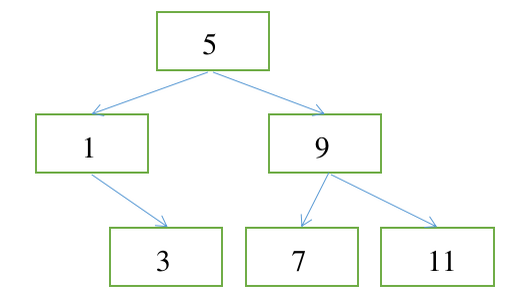

基本思路就是

```lisp
(cons (make-tree this-entry left-tree right-tree) remaining-elts)
```

找到 this-entry、left-tree、right-tree 和 remaining-elts就可以递归构造了

边界情况就是 传入的 n 为0，即表示左侧没有子树，在list的左侧加一个 nil 即可

（1）对于一个list而言，结点 = this_entry + left-tree + right-tree

（2）left-size 就是 (n-1) / 2，right-size 就是 n - (n - 1)/2

（3）left-result 可以通过递归得到。

（4）left-tree 就是 其 左子树的第一个结点

（5）non-left-elts 就是 非左子树部分的结点

（6）this-entry 就是 非左子树部分结点的第一个

（7）right-result 可以通过递归得到。

（8）right-tree 就是右子树部分结点的第一个

（9）remaining-elts 就是剩余的结点


时间复杂度是 $O(n)$


#### **Exercise 2.65.** 

Use the results of exercises 2.63 and  2.64 to give $\theta(n)$ implementations of `union-set` and `intersection-set` for sets implemented as (balanced) binary trees.

实现 平衡二叉树的 集合 set 的交集和并集过程。


（1）可以用 2.63  和 2.64 的 list->tree，还有  tree->list ，毕竟都是 $\theta(n)$

（2）也可以重新写

```lisp
(define (union-set a b) 
   (cond ((null? a) b) 
         ((null? b) a) 
         (else 
          (let ((a-entry (entry a)) 
                (a-left-branch (left-branch a)) 
                (a-right-branch (right-branch a)) 
                (b-entry (entry b)) 
                (b-left-branch (left-branch b)) 
                (b-right-branch (right-branch b))) 
            (cond ((= a-entry b-entry) 
                   (make-tree a-entry 
                              (union-set a-left-branch b-left-branch) 
                              (union-set a-right-branch b-right-branch))) 
                  ((< a-entry b-entry) 
                   (make-tree b-entry 
                              (union-set a b-left-branch) 
                              b-right-branch)) 
                  ((> a-entry b-entry) 
                   (make-tree a-entry 
                              (union-set a-left-branch b) 
                              a-right-branch))))))) 
 (define (intersection-set a b) 
   (cond ((null? a) ()) 
         ((null? b) ()) 
         (else 
          (let ((a-entry (entry a)) 
                (a-left-branch (left-branch a)) 
                (a-right-branch (right-branch a)) 
                (b-entry (entry b)) 
                (b-left-branch (left-branch b)) 
                (b-right-branch (right-branch b))) 
            (cond ((= a-entry b-entry) 
                   (make-tree a-entry 
                              (intersection-set a-left-branch b-left-branch) 
                              (intersection-set a-right-branch b-right-branch))) 
                  ((< a-entry b-entry) 
                   (union-set 
                    (intersection-set a-right-branch 
                                      (make-tree b-entry () b-right-branch)) 
                    (intersection-set (make-tree a-entry a-left-branch ()) 
                                      b-left-branch))) 
                  ((> a-entry b-entry) 
                   (union-set 
                    (intersection-set (make-tree a-entry () a-right-branch) 
                                      b-right-branch) 
                    (intersection-set a-left-branch 
                                      (make-tree b-entry b-left-branch ()))))))))) 
```


主要就是利用了  left-branch < entry < right-branch 这个性质！


#### **Exercise 2.66.** 

Implement the `lookup` procedure for the case **where the set of records is structured as a binary tree, ordered by the numerical values of the keys.**

如果records-set 是通过 binary tree 实现的，请实现 lookup


这个题目居然是让我们写 数据库的查找语句。。。太牛了

```lisp
(define (lookup given-key set-of-records)
  (cond ((null? set-of-records) false)
        ((equal? given-key (key (entry set-of-records)))
         (entry set-of-records)
         )
        ((< given-key (key (entry set-of-records)))
         (lookup given-key (left-branch set-of-records))
         )
        ((> given-key (key (entry set-of-records)))
         (lookup given-key (right-branch set-of-records))
         )
        )
  )
```


#### **Exercise 2.67.** 

Define an encoding **tree and a sample message:**

```lisp
(define sample-tree
  (make-code-tree (make-leaf 'A 4)
                  (make-code-tree
                   (make-leaf 'B 2)
                   (make-code-tree (make-leaf 'D 1)
                                   (make-leaf 'C 1)))))

(define sample-message '(0 1 1 0 0 1 0 1 0 1 1 1 0))
```

Use the `decode` procedure to decode the message, and give the result.

```
(A D A B B C A)
```


#### **Exercise 2.68.** 

The `encode` procedure takes as arguments a message and a tree and produces the list of bits that gives the encoded message.

下面是在给定一个Huffman tree 的情况下  对message进行编码 

```lisp
(define (encode message tree)
  (if (null? message)
      '()
      (append (encode-symbol (car message) tree)
              (encode (cdr message) tree))))
```

`Encode-symbol` is a procedure, which you must write, that **returns the list of bits that encodes a given symbol according to a given tree.** 

返回根据给定树**对给定符号**进行编码的**bits列表**

You should design `encode-symbol` so that it signals an error if the symbol is not in the tree at all. 

**如果符号根本不在树中，它就会发出错误信号**

和 decode 的过程十分类似。

Test your procedure by encoding the result you obtained in exercise 2.67 with the sample tree and seeing whether it is the same as the original sample message.

**使用 2.67 的sample-tree 来进行验证**


- 使用具有泛型特征的 symbols 过程要容易一点
- 记得使用memq 来进行判断

回忆一下memq：

```lisp
(define (memq item x)
  (cond ((null? x) false)
        ((eq? item (car x)) x)
        (else (memq item (cdr x)))))
(memq 'apple '(pear banana prune))
; is false
(memq 'apple '(x (apple sauce) y apple pear))
; is (apple pear).
```

This takes two arguments, a symbol and a list. 

If the symbol is not contained in the list (i.e., is not `eq?` to any item in the list), **then `memq` returns false.** 

Otherwise, it returns the **sublist of the list beginning with the first occurrence of the symbol**


#### **Exercise 2.69.** 

The following procedure takes as its argument a list of symbol-frequency pairs (where no symbol appears in more than one pair) and generates a Huffman encoding tree according to the Huffman algorithm.

pairs 是 **符号 和 频率**的一个对。

successive-merge 就是一个生成Huffman tree 的过程。

```lisp
(define (generate-huffman-tree pairs)
  (successive-merge (make-leaf-set pairs)))
```

`Make-leaf-set` is the procedure given above that **transforms the list of pairs into an ordered set of leaves.** 

make-leaf-set可以将一个 pair 的list转化为 叶子结点的set（有序）

`Successive-merge` is the procedure you must write, using `make-code-tree` to successively merge the smallest-weight elements of the set until there is only one element left, **which is the desired Huffman tree.** 

(This procedure is slightly tricky, but not really complicated. 

If you find yourself designing a complex procedure, **then you are almost certainly doing something wrong.** 

You can take significant advantage of the fact that we are **using an ordered set representation.**)

（1）实现 successive-merge

（2）利用 make-leaf-set 将 传入的  (symbol frequency) 的pair 生成Huffman tree

（3）注意使用 adjoin-set 辅助解决问题


#### **Exercise 2.70.** 

The following eight-symbol alphabet with associated relative frequencies was designed to efficiently encode the lyrics of 1950s rock songs. 

摇滚歌曲中的**单词和频率**。

(Note that the "symbols" of an "alphabet'' need not be individual letters.)

单词不一定是单个字母

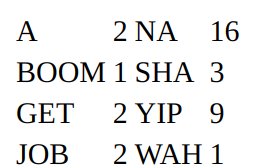

Use `generate-huffman-tree` (exercise 2.69) to generate a corresponding Huffman tree, and use `encode` (exercise 2.68) to encode the following message:

**Get a job**

**Sha na na na na na na na na**

**Get a job**

**Sha na na na na na na na na**

**Wah yip yip yip yip yip yip yip yip yip**

**Sha boom**

How many bits are required for the encoding? 

**What is the smallest number of bits that would be needed to encode this song** 

if we used a fixed-length code for the eight-symbol alphabet?


（1）注意统一大小写

（2）使用 Huffman tree 进行编码需要多少 bit？

84 bit

（3）使用固定长度的编码需要多少 bit？

这里有 8 个单词，每个单词需要3 个bit，这个message 共 36 个单词，所以需要 36 * 3 = 108 bit


#### **Exercise 2.71.** 

Suppose we have a Huffman tree for an alphabet of *n* symbols, and that the relative frequencies of the symbols are 
$$
1, 2, 4, ..., 2^{n-1}.
$$
Sketch the tree for *n*=5; for *n*=10. 

In such a tree (for general *n*) **how many bits are required to encode the most frequent symbol**? 

the least frequent symbol?

加设有 n 个symbol，每个symbol 的频率是 1 2 4 8 16 ...

（1）画出Huffman tree，n = 5

首先是 symbol-freq：

```
A 1
B 2
C 4
D 8
E 16
```

每个symbol对应的编码：

```
A : 0000
B : 0001
C : 001
D : 01
E : 1
```

Huffman tree：

```
                     {a b c d e} 31
                     /           \
                {a b c d} 15      e 16
                 /     \
           {a b c} 7    d 8
             /    \
        {a b} 3    c 4
         /   \
      a 1    b 2
```

（2）对于一般的树而言，最常见的符号需要多少个bit？

可以猜测，最常见的符号就是频率为$2^{n-1}$的符号，编码需要 1 个bit，且就是 1

（3）对于一般的树而言，最不常见的符号需要多少个bit？

可以猜测，最不常见的符号就是频率为1的符号，编码需要 n - 1 个bit，且全是 0


#### **Exercise 2.72.** 

Consider the encoding procedure that you designed in exercise 2.68. 

**What is the order of growth in the number of steps needed to encode a symbol?** 

Be sure to include the number of steps needed to search the symbol list at each node encountered. 

To answer this question in general is difficult. 

Consider the special case where the relative frequencies of the *n* symbols are as described in exercise 2.71, and **give the order of growth (as a function of *n*) of the number of steps needed to encode the most frequent and least frequent symbols in the alphabet.**

（1）得到一个符号的编码的 时间复杂度？  the order of growth

（2）加设 频率分布是  2.71 的特殊类型呢？the most frequent and least frequent symbols 

 最坏情况就是  O(n)，最好情况就是 O(1)

一般就是 O(logn)

树的深度是 n - 1


#### **Exercise 2.73.** 

Section 2.3.2 described a program that performs symbolic differentiation:

回忆，之前我们写了一个计算函数微分的程序。

```lisp
(define (deriv exp var)
  (cond ((number? exp) 0)
        ((variable? exp) (if (same-variable? exp var) 1 0))
        ((sum? exp)
         (make-sum (deriv (addend exp) var)
                   (deriv (augend exp) var)))
        ((product? exp)
         (make-sum
           (make-product (multiplier exp)
                         (deriv (multiplicand exp) var))
           (make-product (deriv (multiplier exp) var)
                         (multiplicand exp))))
        <more rules can be added here>
        (else (error "unknown expression type -- DERIV" exp))))
```

We can regard this program as performing a dispatch on the type of the expression to be differentiated. 

In this situation the "type tag'' of the datum is the **algebraic operator symbol (such as `+`) and the operation being performed is `deriv`.** 

We can transform this program into data-directed style by rewriting the basic derivative procedure as

如果我们将 这个程序看成 是对微分的表达式的 分派呢？

即根据表达式不同的类型，进行不同的操作。

重写过程。

一个表达式的选择器：

（1）运算符

（2）操作数

本质就是对一个表达式求偏导，但是每个表达式的求偏导的具体实现不同，但是对于

sum、product 和 exponentiation 而言，都是 () op () 的形式，即一个 operator 和 多个 operands

那么对于一个表达式而言， 比如 sum 表达式，make-sum 、 sum? 、addend  和 augend 就都是 内部的过程。

deriv 就是外部过程。

operation-and-type table：

|       | sum    | product | exponentiation |
| ----- | ------ | ------- | -------------- |
| deriv | ？？？ | ？？？  | ？？？         |

```lisp
(define (deriv exp var)  
    (cond ((number? exp) 0)     
        ((variable? exp) (if (same-variable? exp var) 1 0))     
        (else ((get 'deriv (operator exp)) (operands exp)                   
                                           var))))
(define (operator exp) (car exp))
(define (operands exp) (cdr exp))
```

a. Explain what was done above. 

Why can't we assimilate the predicates `number?` and `same-variable?` into the data-directed dispatch?

b. **Write the procedures for derivatives of sums and products**, and the auxiliary code required to **install them in the table used by the program above.**

c. Choose any additional differentiation rule that you like, such as the one for **exponents** (exercise 2.56), and install it in this data-directed system.

d. In this simple algebraic manipulator the type of an expression **is the algebraic operator that binds it together.** Suppose, however, we indexed the procedures in the opposite way, so that the dispatch line in `deriv` looked like

```
((get (operator exp) 'deriv) (operands exp) var)
```

What corresponding changes to the derivative system are required?

（1）解释上面新的过程，为什么不能将 number? same-variable? 放入 data-directed dispatch?

**主要原因就是不需要指派，number? 和 same-variable? 都没有运算符，判断逻辑不需要指派。**

（2）写出加法和乘法的求导表达式，并在程序的表格中install 那些辅助代码。

（3）添加求幂的导数表达式。

（4）是否可以将

```lisp
((get 'deriv (operator exp)) (operands exp) var))
```

修改成 

```lisp
((get (operator exp) 'deriv) (operands exp) var)
```

？

这个似乎是将table的行和列互换了。

在所有get 和 put的地方将行和列互换即可。


没有DrRacket中没有 put 和 get？

下面是补充代码，之后会介绍。

```lisp
; 2d table 
; a global table
(define (make-table) (list '*table*))
(define *table* (make-table)) 
; put and get 
(define (put op type item)
  (define (insert2! key-1 key-2 value table) 
    (let ((subtable (assoc key-1 (cdr table)))) 
      (if subtable 
          ; subtable exist 
          (let ((record (assoc key-2 (cdr subtable)))) 
            (if record 
                (set-cdr! record value) ; modify record 
                (set-cdr! subtable 
                          (cons (cons key-2 value) (cdr subtable))) ; add record 
                ) 
            ) 
          ; subtable doesn't exist, insert a subtable 
          (set-cdr! table 
                    (cons (list key-1 (cons key-2 value)) ; inner subtable 
                          (cdr table)) 
                    ) 
          ) 
      ) 
    ) 
  (insert2! op type item *table*)) 
(define (get op type)
  (define (lookup2 key-1 key-2 table) 
    (let ((subtable (assoc key-1 (cdr table)))) 
      (if subtable 
          (let ((record (assoc key-2 (cdr subtable)))) 
            (if record 
                (cdr record) 
                #f 
                ) 
            ) 
          #f 
          ) 
      ) 
    ) 
  (lookup2 op type *table*)) 
```


可以不考虑链式法则。

别忘记：

```lisp
(install-sum-package)
(install-product-package)
(install-exponentiation-package)
```

别忘记将 make-sum 和 make-product 共享：

```lisp
(define (make-sum a1 a2 . an) 
  (apply (get 'make-sum '+) (append (list a1 a2) an))) 
(define (make-product a1 a2 . an) 
  (apply (get 'make-product '*) (append (list a1 a2) an))) 
```


#### **Exercise 2.74.** 

Insatiable Enterprises, Inc., is a highly decentralized conglomerate company consisting of a large number of independent divisions located all over the world. 

The company's computer **facilities have just been interconnected by means of a clever network-interfacing scheme that makes the entire network appear to any user to be a single computer.** 

使整个网络在任何用户看来都像是一台计算机。

Insatiable's president, in her first attempt to exploit the ability of the network to extract administrative information from division files, is dismayed to discover that, **although all the division files have been implemented as data structures in Scheme, the particular data structure used varies from division to division.** 

尽管所有的部门文件都已在Scheme中实现为数据结构，**但所使用的特定数据结构因部门而异。**

A meeting of division managers is hastily called to search for a strategy to integrate the files that **will satisfy headquarters' needs while preserving the existing autonomy of the divisions.**

既能满足总部的需要，又能保持部门现有的自主权。

Show how such a strategy can be implemented with data-directed programming. 

As an example, **suppose that each division's personnel records consist of a single file, which contains a set of records keyed on employees' names.** 

每个部门的人事记录一个文件组成：

包含一组以员工名字位key 记录。


The structure of the set varies from division to division. 

Furthermore, each employee's record is itself a set (structured differently from division to division) that contains information keyed under identifiers such as `address` and `salary`. 

address 和 salary 等是记录的关键信息。


In particular:

a. Implement for headquarters a `get-record` procedure that retrieves a specified employee's record from a specified personnel file. The procedure should be applicable to any division's file. **Explain how the individual divisions' files should be structured. In particular, what type information must be supplied?**

b. Implement for headquarters a `get-salary` procedure that returns the salary information from a given employee's record from any division's personnel file. **How should the record be structured in order to make this operation work?**

c. Implement for headquarters a `find-employee-record` procedure. This should search all the divisions' files for the record of a given employee and return the record. **Assume that this procedure takes as arguments an employee's name and a list of all the divisions' files.**

d. When **Insatiable takes over a new company**, what changes must be made in order to **incorporate the new personnel information into the central system**?

（1）实现 get-record

（2）实现 get-salary

（3）实现 find-employee-record

（4）如果添加一个新的员工信息到系统，需要进行哪些修改？


加设有三个部门，分别有三个表，每个表的表项和表的数据结构如下：

- 部门 A：**id + name + salary + age**，unordered list

(list id name salary age)

- 部门 B：**id + name + salary + age + address**，unordered list

(list id (list name salary age) address)

- 部门 C：**id + name + salary + work-year**，binary tree

(list id (list name (list salary work-year)))


新添加一个员工只需要修改 部门的信息表即可。

除非说需要我们写数据库的添加接口，但是我想是不需要的。


#### **Exercise 2.75.** 

Implement the constructor `make-from-mag-ang` in message-passing style. 

This procedure should be analogous to the `make-from-real-imag` procedure given above.

使用message passing 的方式实现 make-from-real-mag


#### **Exercise 2.76.** 

As a large system with generic operations evolves, **new types of data objects or new operations** may be needed. 

For each of the three strategies -- generic operations with **explicit dispatch, data-directed style, and message-passing-style** -- describe the changes that must be made to a system in order to add new types or new operations. 

Which organization would be most appropriate for a system in which **new types** must often be added? 

Which would be most appropriate for a system in which **new operations** must often be added?

**泛型系统的设计到底是选择 data-directed 还是 message passing ？**

- 对于一个经常添加新操作的系统，哪一种方法最合适？
- 对于一个经常添加新数据表示的系统，哪一种方法最合适？


一个人负责一个数据表示的所有过程的编写。

一个人负责对于所有数据类型的一个过程的编写。


message passing:

**消息传递**允许在不更改已经编写的代码的情况**下添加新类型**

data-directed:

**数据导向**的方法允许我们添加**具有相应操作的新类型**，

也可以通过在调度表中添加新条目来为**现有类型添加新操作**


- 如果是添加过程多，选meessage passing
- 如果是添加数据类型多，选data-directed


#### **Exercise 2.77.** 

Louis Reasoner tries to evaluate the expression `(magnitude z)` where `z` is the object shown in figure 2.24. 

To his surprise, instead of the answer 5 he gets an error message from `apply-generic`, **saying there is no method for the operation `magnitude` on the types `(complex)`.** 

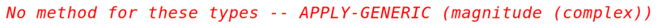

He shows this interaction to Alyssa P. Hacker, who says **"The problem is that the complex-number selectors were never defined for `complex` numbers, just for `polar` and `rectangular` numbers. "** 

 All you have to do to make this work is add the following to the `complex` package:

```lisp
(put 'real-part '(complex) real-part)
(put 'imag-part '(complex) imag-part)
(put 'magnitude '(complex) magnitude)
(put 'angle '(complex) angle)
```

Describe in detail why this works. 

As an example, **trace through all the procedures called in evaluating the expression `(magnitude z)` where `z` is the object shown in figure 2.24.** 

In particular, how many times is `apply-generic` invoked? 

What procedure is dispatched to in each case?


**（1）修改代码，让报错消失**

**（2）跑了多少次 apply-generic？**

2次

**（3）每次指派到哪个过程？**

先是complex 对应的过程，然后是complex内部的polar-package中的magnitude

就是两次指派，两次都是通过 apply-generic 完成的，

第一次是找到 tag 为 complex 的过程，第二次是找到 tag 为 polar 的过程。


#### **Exercise 2.78.** 

The internal procedures in the `scheme-number` package are essentially nothing more than calls to the primitive procedures `+`, `-`, etc. 

It was not possible to use the primitives of the language directly because our type-tag system requires that each data object have a type attached to it. 

In fact, however, all Lisp implementations do have a type system, which they use internally.

**Primitive predicates such as `symbol?` and `number?` determine whether data objects have particular types.** 

Modify the definitions of `type-tag`, `contents`, and `attach-tag` from section 2.4.2 so that our generic system takes advantage of Scheme's internal type system. 

That is to say, the system should work as before except that ordinary numbers **should be represented simply as Scheme numbers rather than as pairs whose `car` is the symbol `scheme-number`.**

所有Lisp实现都有一个类型系统，它们在内部使用。

修改 type-tag、contents和attach-tag，让sheme-number 不需要加tag？


也就是说现在使用scheme的普通数字类型，需要用make-scheme-number，**添加一个没有必要的tag，看如何修改代码让这个tag不需要添加也可以运行。**


加一个特判就可以了：

```lisp
(define (type-tag datum)
  (cond ((pair? datum) (car datum))
        ((number? datum) 'scheme-number)
        (else
         (error "Bad tagged datum -- TYPE-TAG" datum))
        ))
(define (contents datum)
  (cond ((pair? datum) (cdr datum))
        ((number? datum) datum)
        (else
         (error "Bad tagged datum -- CONTENTS" datum))
        )
  )
; scheme-number
(define (install-scheme-number-package) 
  (put 'add '(scheme-number scheme-number)
       (lambda (x y) (+ x y))
       ;(lambda (x y) (tag (+ x y)))
       )
  (put 'sub '(scheme-number scheme-number)
       (lambda (x y) (- x y))
       ;(lambda (x y) (tag (- x y)))
       )
  (put 'mul '(scheme-number scheme-number)
       (lambda (x y) (* x y))
       ;(lambda (x y) (tag (* x y)))
       )
  (put 'div '(scheme-number scheme-number)
       (lambda (x y) (/ x y))
       ;(lambda (x y) (tag (/ x y)))
       )
  (put 'make 'scheme-number
       (lambda (x) x)
       ;(lambda (x) (tag x)))
       ))
```


#### **Exercise 2.79.** 

Define a generic equality predicate `equ?` **that tests the equality of two numbers**, and install it in the generic arithmetic package. 

This operation should work for ordinary numbers, rational numbers, and complex numbers.

添加一个新的泛型操作，equ?，普通的数字，复数和有理数都可以运算。


#### **Exercise 2.80.** 

Define a generic predicate `=zero?` that tests if its argument is zero, and install it in the generic arithmetic package. This operation should work for **ordinary numbers, rational numbers, and complex numbers.**

添加新的泛型操作，=zero?，测试参数是否为0。


#### **Exercise 2.81.** 

Louis Reasoner has noticed that `apply-generic` may try to coerce the arguments to each other's type even if they already have the same type. 

Therefore, he reasons, we need to put procedures in the coercion table to "coerce" arguments of each type to their own type. 

For example, in addition to the `scheme-number->complex` coercion shown above, he would do:

```lisp
(define (scheme-number->scheme-number n) n)
(define (complex->complex z) z)
(put-coercion 'scheme-number 'scheme-number
              scheme-number->scheme-number)
(put-coercion 'complex 'complex complex->complex)
```

自身的类型进行转化：

scheme-number -> scheme-number

complex -> complex

a. With Louis's coercion procedures installed, **what happens if `apply-generic` is called with two arguments of type `scheme-number` or two arguments of type `complex` for an operation that is not found in the table for those types?** 

For example, assume that we've defined a generic exponentiation operation:

```lisp
(define (exp x y) (apply-generic 'exp x y))
```

and have put a procedure for exponentiation in the Scheme-number package but not in any other package:

```lisp
;; following added to Scheme-number package
(put 'exp '(scheme-number scheme-number)
     (lambda (x y) (tag (expt x y)))) 
; using primitive expt
```

**What happens if we call `exp` with two complex numbers as arguments?**

b. Is Louis correct that something had to be done about coercion with arguments of the same type, or does `apply-generic` work correctly as is?

c. Modify `apply-generic` so that it doesn't try coercion if the two arguments have the same type.

**（1）如果没有设置自身类型转换会发生什么？**

**（2）如果我们将两个complex 作为参数传给 exp 会发生什么？**

**（3）需要对相同的类型进行强制转化吗？**

**（4）修改apply-generic，如果两个操作数的类型相同，则不用强制类型转化。**

如果设置了自身类型转化，且某个类型没有在类型操作表中设置过程，

那么程序会一直调用apply-generic，然后就死循环了。


#### **Exercise 2.82.** 

Show how to generalize `apply-generic` to handle coercion in the general case of multiple arguments. 

One strategy is to attempt to **coerce all the arguments to the type of the first argument, then to the type of the second argument, and so on.** 

Give an example of a situation where this strategy (and likewise the two-argument version given above) is not sufficiently general. 

(Hint: Consider the case where **there are some suitable mixed-type operations present in the table** that will not be tried.)

**如何处理多个参数的强制类型转化？**


（1）将参数 2 3 4 ... n 尝试转化为第一个参数的类型

（2）将参数 1 3 4 ... n 尝试转化为第二个参数的类型

（3）....

问题在于这个方法对于混合参数的op不适用，有些时候我们只需要转化部分参数就可以满足op的参数类型需求。

```
types: A B C 
registered op: (op some-A some-B some-B) 
registered coercion: A->B C->B 

Situation: 
Evaluating (apply-generic op A B C) will only 
try (op A B C), (op B B B) and fail  
while we can just coerce C to B to evaluate (op A B B) instead 
```

```lisp
(define (apply-generic op . args)
  ; get type-tags of args
  (define (get-type-tags args)
    (map type-tag args))

  ; try coercion all args to type of target
  (define (try-coerce-to target)
    (map (lambda (x)
           (let ((coercor (get-coercion (type-tag x) (type-tag target))))
             (if coercor
                 (coercor x)
                 x)
             )
           )
         args)
    )

  ; iterate each args to try coerce
  (define (iter-args cur-args)
    (if (null? cur-args)
        (error "No method for these types" (list op (get-type-tags args)))
        (let ((coerced-args (try-coerce-to (car cur-args))))
          (let ((proc (get op (get-type-tags coerced-args))))
            (if proc
                (apply proc (map contents coerced-args))
                (iter-args (cdr cur-args))
                )
            )
          )
        )
    )
  
  ; try op 
  (let ((proc (get op (get-type-tags args))))
    (if proc
        (apply proc (map contents args))
        (iter-args args)
        )
    )
  )
```


#### **Exercise 2.83.** 

Suppose you are designing a generic arithmetic system for dealing with the tower of typs shown in figure 2.25: **integer, rational, real, complex.** 

For each type (except complex), **design a procedure that raises objects of that type one level in the tower**. Show how to install a generic `raise` operation that will work for each type (except complex).

**实现 raise 的过程，且具有通用性**


这里多了一个real：

```lisp
 (put 'raise '(rational) 
          (lambda (x) (make-real (* 1.0 (/ (numer x) (denom x)))))) 
```


#### **Exercise 2.84.** 

Using the `raise` operation of exercise 2.83, modify the `apply-generic` procedure so that **it coerces its arguments to have the same type by the method of successive raising, as discussed in this section.** 

**You will need to devise a way to test which of two types is higher in the tower.** 

Do this in a manner that is "compatible'' with the rest of the system and will not lead to problems in adding new levels to the tower.

**使用 raise，修改apply-generic，完成参数的强制类型转化。**


假设是多个参数的过程，那么首先需要找到在类型 tower 中最高的那个，然后将其他的类型不断 raise，直到为这个最高的type。


#### **Exercise 2.85.** 

This section mentioned a method for "simplifying'' a data object by lowering it in the tower of types as far as possible.

Design a procedure `drop` that accomplishes this for the tower described in exercise 2.83. **The key is to decide, in some general way, whether an object can be lowered.** 

For example, the complex number 1.5 + 0*i* can be lowered as far as `real`, the complex number 1 + 0*i* can be lowered as far as `integer`, **and the complex number 2 + 3*i* cannot be lowered at all.** 

Here is a plan for determining whether an object can be lowered: **Begin by defining a generic operation `project` that "pushes'' an object down in the tower.** 

For example, projecting a complex number would involve **throwing away the imaginary part.** 

Then a number can be dropped if, **when we `project` it and `raise` the result back to the type we started with, we end up with something equal to what we started with.** 

Show how to implement this idea in detail, by writing a `drop` procedure that drops an object as far as possible. 

You will need to design the various projection operations and install `project` as a generic operation in the system. 

You will also need to make use of a generic equality predicate, such as described in exercise 2.79. Finally, use `drop` to rewrite `apply-generic` from exercise 2.84 so that it ``simplifies'' its answers.


**（1）可以使用round，找到实数的下取整。**

**（2）实现drop，完成数据类型的简化。**

**（3）实现project。**

**（4）使用实现的drop修改apply-generic，完成数据的简化。**


如果 先project，然后raise后得到的类型和原类型相同，那么就可以project。

注意 put 的括号。

```lisp
(put 'project 'rational
     (lambda (x) (make-scheme-number (numer x))))
(put 'project 'real
     (lambda (x)
             (define (get-denom-mul10 x)
                 (if (= (round x) x)
                     1
                     (* 10 (get-denom-mul10 (* 10 x)))
                     )           
                 )
             (let ((new-denom (get-denom-mul10 x)))
                  (make-rational (* x new-denom) new-denom)
                  )
             )
     )
(put 'project 'complex
     (lambda (z1)
             (make-real (real-part z1)))
     )
```


#### **Exercise 2.86.** 

Suppose we want to handle complex numbers whose real parts, imaginary parts, magnitudes, and angles can be **either ordinary numbers, rational numbers, or other numbers we might wish to add to the system.** 

Describe and implement the changes to the system needed to accommodate this. 

You will have to define operations such as `sine` and `cosine` that are generic over ordinary numbers and rational numbers.

如何实现让复数的**实部和虚部可以为任意类型的非复数类型的数字？**


需要修改 complex 的所有 直接操作 real-part 、imaginary part 、magnitudes 和 angles 的部分进行修改，改为“泛型”运算。


#### **Exercise 2.87.** 

Install `=zero?` for polynomials in the generic arithmetic package. 

This will allow `adjoin-term` to work for polynomials with **coefficients that are themselves polynomials.**


给 多项式 包添加 =zero? 过程。

**那么多项式的系数就可以为多项式了。**

系数可以为0！

```lisp
(define p5 (make-polynomial 'x '((3 0) (2 0) (0 0))))
```


#### **Exercise 2.88.** 

Extend the polynomial system to include subtraction of polynomials. 

(Hint: You may find it helpful to define a generic **negation** operation.)


添加多项式的减法。

添加泛型的**取反操作**会对实现减法有帮助。


#### **Exercise 2.89.** 

Define procedures that implement the term-list representation described above as appropriate for dense polynomials.


实现针对 稠密多项式的 **构造器、选择器、谓词**。


#### **Exercise 2.90.** 

Suppose we want to have a polynomial system that is efficient for **both sparse and dense polynomials.** 

One way to do this is to **allow both kinds of term-list representations in our system.** 

The situation is analogous to the complex-number example of section 2.4, **where we allowed both rectangular and polar representations.** 

To do this we must distinguish different types of term lists and make the operations on term lists generic. 

Redesign the polynomial system to implement this generalization. 

This is a major effort, not a local change.


对多项式进行修改：

（1）两个类型同时存在

（2）稠密多项式、稀疏多项式

（3）类似 complex 的 极坐标表示 和 直角坐标表示


注意：这里只需要动 term-list，term就不要动了，这就是数据抽象构造的抽象屏障的好处。


#### **Exercise 2.91.** 

A **univariate** polynomial can be divided by another one to produce a polynomial quotient and a polynomial remainder. 

一个单变量多项式可以除以另一个多项式得到**多项式商和多项式余数。**

For example,
$$
\frac{x^{5}-1}{x^{2}-1}=x^{3}+x,\mathrm{remainder}\,x-1
$$
多项式的除法，有商，有余数。

商和余数都是多项式。

也就是大除法的模拟。

Division can be performed via **long division.** 

That is, divide the highest-order term of the dividend by the highest-order term of the divisor. 

The result is the **first term of the quotient.** 

Next, **multiply the result by the divisor**, subtract that from the dividend, and produce the rest of the answer **by recursively dividing the difference by the divisor.** 

Stop when the order of the divisor exceeds the order of the dividend and declare the dividend to be the remainder. 

Also, if the dividend ever becomes zero, **return zero as both quotient and remainder.**

We can design a `div-poly` procedure on the model of `add-poly` and `mul-poly`. 

**The procedure checks to see if the two polys have the same variable.** 

If so, `div-poly` strips off the variable and passes the problem to `div-terms`, **which performs the division operation on term lists.** 

`Div-poly` finally **reattaches** the variable to the result supplied by `div-terms`. 

It is convenient to design `div-terms` to compute both the quotient and the remainder of a division.

 `Div-terms` can take two term lists as arguments and return **a list of the quotient term list and the remainder term list.**

Complete the following definition of `div-terms` by filling in the missing expressions. 

Use this to implement `div-poly`, which takes two polys as arguments and returns a list of the **quotient and remainder polys.**


（1）仿造 add-poly 和 mul-poly 实现 div-poly

（2）需要先实现  div-terms，然后实现 div-poly

```lisp
(define (div-terms L1 L2)
  (if (empty-termlist? L1)
      (list (the-empty-termlist) (the-empty-termlist))
      (let ((t1 (first-term L1))
            (t2 (first-term L2)))
        (if (> (order t2) (order t1))
            (list (the-empty-termlist) L1)
            (let ((new-c (div (coeff t1) (coeff t2)))
                  (new-o (- (order t1) (order t2))))
              (let ((rest-of-result
                     <compute rest of result recursively>
                     ))
                <form complete result>
                ))))))
```


#### **Exercise 2.92.** 

By imposing an ordering on variables, extend the polynomial package so that **addition and multiplication of polynomials works for polynomials in different variables.** 

(This is not easy!)


对变量**施加排序**，扩展多项式包，**使多项式的加法和乘法适用于不同变量的多项式。**


系数和变量是交叉混合的，怎么进行运算？

太麻烦了，跳过这个题目。


#### **Exercise 2.93.** 

Modify the rational-arithmetic package to use generic operations, **but change `make-rat` so that it does not attempt to reduce fractions to lowest terms**. 

Test your system by calling `make-rational` on two polynomials to produce a rational function

```lisp
(define p1 (make-polynomial 'x '((2 1)(0 1))))
(define p2 (make-polynomial 'x '((3 1)(0 1))))
(define rf (make-rational p2 p1))
```

Now add `rf` to itself, using `add`. 

You will observe that this addition procedure does not reduce fractions to lowest terms.

We can reduce polynomial fractions to lowest terms using the same idea we used with integers: **modifying `make-rat` to divide both the numerator and the denominator by their greatest common divisor.** 

The notion of "greatest common divisor'' makes sense for polynomials. 

In fact, **we can compute the GCD of two polynomials using essentially the same Euclid's Algorithm that works for integers.**

The integer version is

```lisp
(define (gcd a b)
  (if (= b 0)
      a
      (gcd b (remainder a b))))
```

Using this, we could make the obvious modification to define a GCD operation that works on term lists:

```lisp
(define (gcd-terms a b)
  (if (empty-termlist? b)
      a
      (gcd-terms b (remainder-terms a b))))
```

where `remainder-terms` picks out the remainder component of the list returned by the term-list division operation `div-terms` that was implemented in exercise 2.91.

（1）修改 rational ，让其支持泛型操作。

（2）修改 make-rat，将分化简为最小项。将分子和分母同时除以它们的最大公约数。

（3）仿造整数版本的gcd，实现多项式版本的gcd。

（4）remainder-terms 已经实现了。


The fact that Euclid's Algorithm works for polynomials is formalized in algebra by saying that polynomials form a kind of algebraic domain **called a *Euclidean ring*.** 

A Euclidean ring is a domain that admits addition, subtraction, and commutative multiplication, together with a way of assigning to each element *x* of the ring a positive integer "measure'' *m*(*x*) with the properties **that m(xy)>m(x) for any nonzero *x* and *y* and that, given any *x* and *y*, there exists a *q* such that *y* = qx + *r* and either *r* = 0 or m(r)< m(x).** 

From an abstract point of view, this is what is needed to prove that Euclid's Algorithm works. 

For the domain of integers, **the measure *m* of an integer is the absolute value of the integer itself.** 

For the domain of polynomials, **the measure of a polynomial is its degree.**

多项式形成了一个叫做欧几里德 环的代数域。


#### **Exercise 2.94.** 

Using `div-terms`, implement the procedure `remainder-terms` and use this to define `gcd-terms` as above. 

Now write a procedure `gcd-poly` that **computes the polynomial GCD of two polys.** 

(The procedure should signal an error **if the two polys are not in the same variable**.) 

Install in the system a generic operation `greatest-common-divisor` **that reduces to `gcd-poly` for polynomials and to ordinary `gcd` for ordinary numbers.** 

As a test, try

```lisp
(define p1 (make-polynomial 'x '((4 1) (3 -1) (2 -2) (1 2))))
(define p2 (make-polynomial 'x '((3 1) (1 -1))))
(greatest-common-divisor p1 p2)
```

and check your result by hand.


（1）使用 div-terms 实现 gcd-terms，即得到多项式版本的最大公因数

（2）仿造其他的poly过程，使用gcd-terms 实现 gcd-poly，即得到两个多项式的GCD

（3）实现 greatest-common-divisor ，一个通用计算GCD的过程。


#### **Exercise 2.95.** 

Define *P*1, *P*2, and *P*3 to be the polynomials
$$
\begin{array}{rl}{P_{1}:}&{{\mathbf{x}^{2}-2\mathbf{x}+1}}\\\\{P_{2}:}&{11\mathbf{x}^{2}+7}\\\\{P_{3}:}&{13\mathbf{x}+5}\\\end{array}
$$
Now define *Q*1 to be the product of *P*1 and *P*2 and *Q*2 to be the product of *P*1 and *P*3, and use `greatest-common-divisor` (exercise 2.94) to compute the GCD of *Q*1 and *Q*2. **Note that the answer is not the same as *P*1.** 
$$
Q_1=P_1P_2\\
Q_2=P_1P_3
$$
This example introduces **noninteger operations into the computation, causing difficulties with the GCD algorithm.** 

To understand what is happening, try tracing `gcd-terms` while computing the GCD or try performing the division by hand.

We can solve the problem exhibited in exercise 2.95 **if we use the following modification of the GCD algorithm (which really works only in the case of polynomials with integer coefficients).** 

Before performing any polynomial division in the GCD computation, we multiply the dividend by an integer constant factor, chosen to guarantee that no fractions will arise during the division process. 

Our answer will thus differ from the actual GCD by an integer constant factor, but this does not matter in the case of reducing rational functions to lowest terms; the GCD will be used to divide both the numerator and denominator, so the integer constant factor will cancel out.

More precisely, if *P* and *Q* are polynomials, let *O*1 be the order of *P* (i.e., the order of the largest term of *P*) and let *O*2 be the order of *Q*. 

Let *c* be the leading coefficient of *Q*. 

Then it can be shown that, if we multiply *P* by the *integerizing factor* *c*1+*O*1 -*O*2, **the resulting polynomial can be divided by *Q* by using the `div-terms` algorithm without introducing any fractions.** 

The operation of multiplying the dividend by this constant and 

then dividing is sometimes **called the *pseudo division* of *P* by *Q*.** 

The remainder of the division is **called the *pseudo remainder***.

（1）使用 greatest-common-divisor 计算 Q1 和 Q2 的GCD

（2）观察结果如何？

（3）怎么解决这个问题？


#### **Exercise 2.96.** 

a.  Implement the procedure `pseudoremainder-terms`, which is just like `remainder-terms` except that it multiplies the dividend by the integerizing factor described above before calling `div-terms`. 

Modify `gcd-terms` to use `pseudoremainder-terms`, and verify that `greatest-common-divisor` now **produces an answer with integer coefficients on the example in exercise 2.95.**

b.  The GCD now has integer coefficients, but they are larger than those of *P*1. 

Modify `gcd-terms` so that it removes common factors from the coefficients of the answer by dividing all the coefficients by their (integer) greatest common divisor.

Thus, here is how to reduce a rational function to lowest terms:

Compute the GCD of the numerator and denominator, using the version of `gcd-terms` from exercise 2.96

When you obtain the GCD, multiply both numerator and denominator by the same integerizing factor before dividing through by the GCD, so that division by the GCD will not introduce any noninteger coefficients. 

As the factor you can use the leading coefficient of the GCD raised to the power 

1 + *O*1 - *O*2, where *O*2 is the order of the GCD and *O*1 is the maximum of the orders of the numerator and denominator. 

This will ensure that dividing the numerator and denominator by the GCD will not introduce any fractions.

The result of this operation will be a numerator and denominator with integer coefficients. 

The coefficients will normally be very large because of all of the integerizing factors, so the last step is to remove the redundant factors by computing the (integer) greatest common divisor of all the coefficients of the numerator and the denominator and dividing through by this factor.

（1）实现 pseudoremainder-terms


#### **Exercise 2.97.** 

a. Implement this algorithm as a procedure `reduce-terms` that takes two term lists `n` and `d` as arguments and returns a list `nn`, `dd`, **which are `n` and `d` reduced to lowest terms via the algorithm given above.** 

Also write a procedure `reduce-poly`, analogous to `add-poly`, that checks to see if the two polys have the same variable. 

If so, `reduce-poly` strips off the variable and passes the problem to `reduce-terms`, then reattaches the variable to the two term lists supplied by `reduce-terms`.

b. Define a procedure analogous to `reduce-terms` that does what the original `make-rat` did for integers:

```lisp
(define (reduce-integers n d)
  (let ((g (gcd n d)))
    (list (/ n g) (/ d g))))
```

and define `reduce` as a generic operation that calls `apply-generic` **to dispatch to either `reduce-poly` (for `polynomial` arguments) or `reduce-integers` (for `scheme-number` arguments).** 

You can now easily make the rational-arithmetic package reduce fractions to lowest terms by having `make-rat` call `reduce` before combining **the given numerator and denominator to form a rational number.** 

The system now handles rational expressions in either integers or polynomials. 

To test your program, try the example at the beginning of this extended exercise:

```lisp
(define p1 (make-polynomial 'x '((1 1)(0 1))))
(define p2 (make-polynomial 'x '((3 1)(0 -1))))
(define p3 (make-polynomial 'x '((1 1))))
(define p4 (make-polynomial 'x '((2 1)(0 -1))))
(define rf1 (make-rational p1 p2))
(define rf2 (make-rational p3 p4))
(add rf1 rf2)
```

See if you get the correct answer, **correctly reduced to lowest terms.**

The GCD computation is at the heart of any system that does operations on rational functions. 

The algorithm used above, **although mathematically straightforward, is extremely slow.** 

The slowness is due partly to the large number of division operations and partly **to the enormous size of the intermediate coefficients generated by the pseudodivisions.** 

One of the active areas in the development of algebraic-manipulation systems is the design of better algorithms for computing polynomial GCDs.


（1）实现 `reduce-terms`，将分式化到最简

（2）仿造 `add-poly`，利用 `reduce-terms`，实现  `reduce-poly`

（3）在 make-rat 之前对传入的 分子和分母使用欧几里德算法进行化简，多项式参数和普通的数字都合法

（4）验证代码是否正确。

算法虽然在数学上很简单，但速度非常慢。

缓慢的部分原因是由于大量的除法操作，部分原因是由于伪除法产生的中间系数的巨大大小。

One extremely efficient and elegant method for computing polynomial GCDs was discovered by Richard Zippel (1979). 

The method is a **probabilistic algorithm**, as is the fast test for primality that we discussed in chapter 1. **Zippel's book (1993) describes this method, together with other ways to compute polynomial GCDs**

