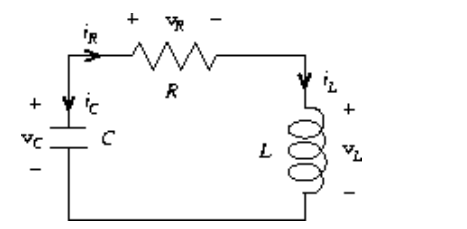

#### **Exercise 3.1.** 

An *accumulator* is a procedure that is **called repeatedly with a single numeric argument and accumulates its arguments into a sum.** 

Each time it is called, it returns the currently accumulated sum. 

Write a procedure `make-accumulator` that generates accumulators, each maintaining an independent sum. 

The input to `make-accumulator` **should specify the initial value of the sum**; for example

```lisp
(define A (make-accumulator 5))
(A 10)
; 15
(A 10)
; 25
```

（1）实现 make-accumulator 

（2）每次调用就是进行累加


#### **Exercise 3.2.** 

In software-testing applications, it is useful to be able to **count the number of times a given procedure is called during the course of a computation.** 

Write a procedure `make-monitored` that takes as input a procedure, `f`, that itself takes one input. 

The result returned by `make-monitored` is a third procedure, **say `mf`, that keeps track of the number of times it has been called by maintaining an internal counter.** 

If the input to `mf` is the special symbol `how-many-calls?`, **then `mf` returns the value of the counter.** 

If the input is the special symbol `reset-count`, **then `mf` resets the counter to zero.** 

For **any other input, `mf` returns the result of calling `f` on that input and increments the counter.** 

For instance, we could make a monitored version of the `sqrt` procedure:

```lisp
(define s (make-monitored sqrt))

(s 100)
; 10

(s 'how-many-calls?)
; 1
```

（1）统计一个过程被调用了多少次。

（2）实现 make-monitored。

（3）how-many-calls？返回counter。

（4）reset-count，重设counter为0。

（5）其他的值，就直接将参数作为被监控程序


#### **Exercise 3.3.** 

Modify the `make-account` procedure so that it **creates password-protected accounts.** That is, `make-account` should take a symbol **as an additional argument, as in**

```lisp
(define acc (make-account 100 'secret-password))
```

The resulting account object should process a request only **if it is accompanied by the password with which the account was created, and should otherwise return a complaint:**

```lisp
((acc 'secret-password 'withdraw) 40)
; 60

((acc 'some-other-password 'deposit) 50)
; "Incorrect password"
```

（1）account 需要密码

（2）密码正确，可以进行操作，密码不正确，返回错误信息


#### **Exercise 3.4.** 

Modify the `make-account` procedure of exercise 3.3 by adding another local state variable so that, if an account is accessed more than seven consecutive times with an incorrect password, it invokes the procedure `call-the-cops`.

如果使用错误的密码连续访问帐户超过7次，**它将调用' call-the-cops '过程。**


#### **Exercise 3.5.** 

*Monte Carlo integration* is a method of estimating **definite integrals by means of Monte Carlo simulation.** 

Consider computing the area of a region of space described by a predicate *P*(*x*, *y*) that is true for points (*x*, *y*) in the region and false for points not in the region. 

For example, t**he region contained within a circle of radius 3 centered at (5, 7) is described by the predicate that tests whether $ (x - 5)^2 + (y - 7)^2< 3^2$**. 

To estimate the area of the region described by such a predicate, begin by choosing a rectangle that contains the region. 

For example, **a rectangle with diagonally opposite corners at (2, 4) and (8, 10) contains the circle above.** 

The desired integral is the area of that **portion of the rectangle that lies in the region.** 

We can estimate the integral by picking, at random, points (*x*,*y*) that lie in the rectangle, and testing *P*(*x*, *y*) for each point to **determine whether the point lies in the region.** 

If we try this with many points, then the fraction of points that fall in the region **should give an estimate of the proportion of the rectangle that lies in the region.** 

Hence, multiplying this fraction by the area of the entire rectangle should produce an estimate of the integral.

Implement Monte Carlo integration as a procedure `estimate-integral` that **takes as arguments a predicate `P`, upper and lower bounds `x1`, `x2`, `y1`, and `y2` for the rectangle**, **and the number of trials** to perform in order to produce the estimate. 

Your procedure should use the same `monte-carlo` procedure that was used above to estimate $\pi$

Use your `estimate-integral` to **produce an estimate of $\pi$ by measuring the area of a unit circle.**

You will find it useful to have a procedure that returns a number chosen at random from a given range. 

The following `random-in-range` procedure implements this in terms of the `random` procedure used in section 1.2.6, **which returns a nonnegative number less than its input.**

```lisp
(define (random-in-range low high)
  (let ((range (- high low)))
    (+ low (random range))))
```

（1）使用蒙特卡罗模拟，估计定积分。

（2）根据随机数找比例，然后利用这个比例计算积分估计值。

（3）实现 estimate-integral，传入 P，x1 ，x2，y1和y2。

（4）estimate-integral 需要用到 mote-carlo，且能够测量单位圆的面积来估计  $\pi$ 。

$$
ration = pi*r^2/(2r)^2
$$
在一个矩形中随机选点，然后给定一个谓词P，**看满足谓词P的点的比例是多少？**
$$
\frac{S_?}{S_r}=factor\\
S_?=factor*S_r
$$


#### **Exercise 3.6.** 

It is useful to be able to **reset a random-number generator** to produce a sequence starting from a given value. 

Design a new `rand` procedure that is called with an argument that is either the symbol `generate` or the symbol `reset` and behaves as follows: 

- `(rand 'generate)` **produces a new random number;** 
- `((rand 'reset) <*new-value*>)` **resets the internal state variable to the designated <*new-value*>.** 

Thus, by resetting the state, one can generate **repeatable sequences.** 

These are very handy to have when testing and debugging programs **that use random numbers.**

重新设计 rand 这个过程。

（1）传入 'generate，就可以生成一个随机数

（2）传入 'reset，将内部状态设置为 new-value，重置状态，可以生成重复的序列

在测试和调试使用随机数的程序时**非常方便**

即可以**多次生成同一个伪随机数序列**。


#### **Exercise 3.7.** 

Consider the bank account objects created by `make-account`, with the password modification described in exercise 3.3.

Suppose that our banking system requires the ability to make joint accounts. 

Define a procedure `make-joint` that accomplishes this. 

`Make-joint` should take three arguments. 

- The first is a **password-protected account.** 
- The second argument must match the password with which the account was defined in order for the `make-joint` operation to proceed. 
- The third argument is **a new password.** 

**`Make-joint` is to create an additional access to the original account using the new password.** 

For example, if `peter-acc` is a bank account with password `open-sesame`, then

```lisp
(define paul-acc
  (make-joint peter-acc 'open-sesame 'rosebud))
```

will allow one to make transactions on `peter-acc` using the name `paul-acc` and the password `rosebud`.

You may wish to modify your solution to exercise 3.3 to accommodate this new feature.


（1）实现make-join，构建共享账户。

（2）参数：有密码的账户，对应的密码，一个新密码。

（3）效果就是，可以用新密码在新账户上对一个共享的账户进行操作。


问题是如果密码错误呢？


#### **Exercise 3.8.** 

When we defined the evaluation model in section 1.1.3, **we said that the first step in evaluating an expression is to evaluate its subexpressions.** 

But we never specified the order in which the subexpressions **should be evaluated (e.g., left to right or right to left).** 

When we introduce assignment, the order in which the arguments to a procedure are evaluated can make a difference to the result. 

Define a simple procedure `f` such that evaluating `(+ (f 0) (f 1))` will return 0 if the arguments to `+` are evaluated from left to right 

**but will return 1 if the arguments are evaluated from right to left.**


（1）引入set!后，对过程的实参求值的顺序会对结果有影响

（2） (+ (f 0) (f 1)) 从左到右，返回0；从右到左，返回1

```lisp
(define f   
  (let ((init 0)) 
    (lambda (x)  
      (set! init (- x init))  
      (- x init))))
```


#### **Exercise 3.9.** 

In section 1.2.1 we used the **substitution** model to analyze two procedures for computing factorials, 

a recursive version

```lisp
(define (factorial n)
  (if (= n 1)
      1
      (* n (factorial (- n 1)))))
```

and an iterative version

```lisp
(define (factorial n)
  (fact-iter 1 1 n))
(define (fact-iter product counter max-count)
  (if (> counter max-count)
      product
      (fact-iter (* counter product)
                 (+ counter 1)
                 max-count)))
```

**Show the environment structures created by evaluating `(factorial 6)` using each version of the `factorial` procedure.**


（1）计算阶乘有递归和迭代两种方式。

（2）分析两种方式 `(factorial 6)` 的environment 结构。


递归：

（1）define

```
global  ________________________
env     | other var.            |
------->| factorial : *         |
        |             |         |
        |_____________|_________|
                      |     ^
                      |     |
                variables : n
                body: (if (= n 1) 1 (* n (factorial (- n 1))))
```

（2）evaluate

```
(factorial 6)
         _______            ^
  E1 -->| n : 6 |___________| GLOBAL
         -------
        (* 6 (factorial 5))
         _______            ^
  E2 -->| n : 5 |___________| GLOBAL
         -------
        (* 5 (factorial 4))
         _______            ^
  E3 -->| n : 4 |___________| GLOBAL
         -------
        (* 4 (factorial 3))
         _______            ^ 
  E4 -->| n : 3 |___________| GLOBAL
         -------
        (* 3 (factorial 2))
         _______            ^
  E5 -->| n : 2 |___________| GLOBAL
         -------
        (* 2 (factorial 1))
         _______            ^
  E6 -->| n : 1 |___________| GLOBAL
         -------
         1
```


迭代：

（1）define

```
global  ___________________________________
env     | other var.                       |
------->| factorial : *                    |
        | fact-iter : |               *    |
        |_____________|_______________|____|
                      |       ^       |  ^
                      |       |       |  |
                      |       |       variable : (product counter max-count)
                      |       |       body: (if (> counter max-count) 
                      |       |                 prod 
                      |       |                 (fact-iter (* counter product)
                      |       |                            (+ counter 1)
                      |       |                            max-count))
                      |       |
                variable: n
                body: (fact-iter 1 1 n)
```

（2）evaluate

```
(factorial 6)
         _______              ^
  E1 -->| n : 6 |_____________| GLOBAL  
         -------
         (fact-iter 1 1 n)

  E2 -->| product   : 1       ^
        | counter   : 1    ___| GLOBAL 
        | max-count : 6
         (fact-iter 1 2 6)

  E3 -->| product   : 1       ^
        | counter   : 2   ____| GLOBAL
        | max-count : 6
         (fact-iter 2 3 6)

  E4 -->| product   : 2       ^
        | counter   : 3  _____| GLOBAL
        | max-count : 6
         (fact-iter 6 4 6)

  E5 -->| product   : 6       ^
        | counter   : 4  _____| GLOBAL
        | max-count : 6
         (fact-iter 24 5 6)

  E6 -->| product   : 24      ^
        | counter   : 5  _____| GLOBAL
        | max-count : 6
         (fact-iter 120 6 6)

  E7 -->| product   : 120     ^
        | counter   : 6  _____| GLOBAL
        | max-count : 6
         (fact-iter 720 7 6)

  E8 -->| product   : 720     ^
        | counter   : 7  _____| GLOBAL
        | max-count : 6
         720
```


迭代中间表达式没有参与运算，就是直接在最后返回结果。

递归中间需要用下一个子过程的结果进行运算。


#### **Exercise 3.10.** 

In the `make-withdraw` procedure, the local variable `balance` is created **as a parameter of `make-withdraw`.** 

We could also create the local state variable explicitly, using `let`, as follows:

```lisp
(define (make-withdraw initial-amount)
  (let ((balance initial-amount))
    (lambda (amount)
      (if (>= balance amount)
          (begin (set! balance (- balance amount))
                 balance)
          "Insufficient funds"))))
```

Recall from section 1.3.2 that `let` is simply syntactic sugar for a procedure call:

```lisp
(let ((<var> <exp>)) <body>)
```

is interpreted as an alternate syntax for

```lisp
((lambda (<var>) <body>) <exp>)
```

Use the environment model to analyze this alternate version of `make-withdraw`, drawing figures like the ones above to illustrate the interactions

```lisp
(define W1 (make-withdraw 100))
(W1 50)
(define W2 (make-withdraw 100))
```

Show that the two versions of `make-withdraw` create objects with the same behavior. How do the environment structures differ for the two versions?


（1）使用lambda 可以**隐式**创建一个local variable。

（2）使用let 可以**显式**创建local variables。

（3）对比两种方法创建的environment的**不同和相同**。


**let 会额外创建一个environment，用来绑定 initial-mount？**


（1）语句1

```lisp
(define W1 (make-withdraw 100))
```

```

global->| make-withdraw : *     |
env.    | W1 :  *         |     |
         -------|---^-----|---^-
                |   |     |   |
                |   |     parameter: initial-mount
                |   |     body: ((lambda (balance) ((...))) initial-mount)
                |   |
                |  _|___Frame_A__________
                | | initial-mount : 100  |<- E0
                |  -^--------------------
                |   |
                |  _|__________Frame_B______
                | | balance : initial-mount | <- E1
                |  -^-----------------------
                |   |
                parameter: amount
                body: (if (>= balance amount) ... )
```

（2）语句2

```lisp
(W1 50)
```

```
global->| make-withdraw : *     |
env.    | W1 :  *         |     |
         -------|---^-----|---^-
                |   |     |   |
                |   |     parameter: initial-mount
                |   |     body: ((lambda (balance) ((...))) initial-mount)
                |   |
                |  _|___Frame_A__________
                | | initial-mount : 100  |<- E0
                |  -^--------------------
                |   |
                |  _|__________Frame_B___
                | | balance : 50         | <- E1
                |  -^--------------------
                |   |
                parameter: amount
                body: (if (>= balance amount) ... )
```

实际上 Frame_A 的initial-mount不会动，**只有Frame_B的balance会改变。**


#### **Exercise 3.11.** 

In section 3.2.3 we saw how the environment model described the behavior of procedures **with local state.** 

Now we have seen how internal definitions work. 

**A typical message-passing procedure contains both of these aspects**. 

Consider the bank account procedure of section 3.1.1:

```lisp
(define (make-account balance)
  (define (withdraw amount)
    (if (>= balance amount)
        (begin (set! balance (- balance amount))
               balance)
        "Insufficient funds"))
  (define (deposit amount)
    (set! balance (+ balance amount))
    balance)
  (define (dispatch m)
    (cond ((eq? m 'withdraw) withdraw)
          ((eq? m 'deposit) deposit)
          (else (error "Unknown request -- MAKE-ACCOUNT"
                       m))))
  dispatch)
```

Show the environment structure generated by the sequence of interactions

```lisp
(define acc (make-account 50))
((acc 'deposit) 40)
; 90
((acc 'withdraw) 60)
; 30
```

Where is the local state for `acc` kept? Suppose we define another account

```lisp
(define acc2 (make-account 100))
```

How are the local states for the two accounts kept distinct? 

Which parts of the environment structure are shared between `acc` and `acc2`?


（1）分析之前的message passing 风格的代码的environment model

（2）acc 的local variable 保存在哪里？

（3）局部变量如何让 acc 和 acc2 有不同的local variable？

（4）acc 和 acc2 共享哪些部分？


**语句1**

```lisp
(define acc (make-account 50))
```

```
global   _________________________________
env  -->| make-account :*                 |
        | acc : *       |                 |
         -------|-------|---^-----------^-
                |       |   |           |
                |     ( * , * )         |
                |       |               |
                        parameter: balance
                |       body: (define (withdraw ... ))
                |                       |
                |                -------Frame 0-      (parameter, body)
                |               | balance  : 50 |      |
                |           E0->| withdraw : *--|--> ( * , * )  
                |               | deposit  : *--|--> ( * , * ) 
                |               | dispatch : *--|--> ( * , * )     
                |                -------^----^--           |
                |    ___________________|    |_____________| 
                |   |
              ( * , * )
                |
                parameter : m           
                body      : (cond ((eq? m ... ))) 
```

make-account 创建一个E0，这个env中有balance，withdraw，deposit和dispatch的定义。

**acc 的body其实就是 dispatch 的body，只不过其env pointer 指向的是 E0。**


**语句2**

```lisp
((acc 'deposit) 40)
```

```
global   _________________________________
env  -->| make-account :*                 |
        | acc : *                         |
         -------|-----------------------^-
                |                       |
                |                -------Frame 0-
                |               | balance  : 50 |
              ( *, *-)--------->| withdraw : *  |
                                | deposit  : *  |<- E0
                                | dispatch : *  |
                                 -^-----^------- (make-account balance)
                         _________|     |
                        |        -------Frame 1-
                        |       | m : 'deposit  |<- E1 
                        |        --------------- (dispatch m)
                 -------Frame 2-
                | amount : 40   |<- E2
                 --------------- (deposit amount)
```

先忽略 make-account，只看acc：

在E0基础上调用了dispatch，也就会创建一个新的env，也就是E1，m 是 'deposit。

根据m，然后调E0中的deposit，amount是40，然后对balance进行修改，程序结束，E1和E2消失，balance已经变为了 90。

```
global   _________________________________
env  -->| make-account :*                 |
        | acc : *                         |
         -------|-----------------------^-
                |                       |
                |                -------Frame 0-
                |               | balance  : 90 |
              ( *, *-)--------->| withdraw : *  |
                                | deposit  : *  |<- E0
                                | dispatch : *  |
                                 --------------- 
```


**语句3**

```lisp
((acc 'withdraw) 60)
```

```
global   _________________________________
env  -->| make-account :*                 |
        | acc : *                         |
         -------|-----------------------^-
                |                       |
                |                -------Frame 0-
                |               | balance  : 90 |
              ( *, *-)--------->| withdraw : *  |
                                | deposit  : *  |<- E0
                                | dispatch : *  |
                                 -^-----^------- (make-account balance)
                         _________|     |
                        |        -------Frame 3-
                        |       | m : 'withdraw |<- E3
                        |        --------------- (dispatch m)
                 -------Frame 4-
                | amount : 60   |<- E4
                 --------------- (withdraw amount)
```

和语句2过程基本一致，只不过E3中的m变为了'withdraw，调用的是withdraw这个过程，最后让 balance变为了30。

```
global   _________________________________
env  -->| make-account :*                 |
        | acc : *                         |
         -------|-----------------------^-
                |                       |
                |                -------Frame 0-
                |               | balance  : 30 |
              ( *, *-)--------->| withdraw : *  |
                                | deposit  : *  |<- E0
                                | dispatch : *  |
                                 ---------------
```


其实，你会发现acc的local variables 就存放在 make-account创建的env中。

acc 和 acc2 各自的local variables 存放在 各自make-account 创建的 env 中。

两者唯一共享的部分就是 global env。


#### **Exercise 3.12.** 

The following procedure for appending lists was introduced in section 2.2.1:

```lisp
(define (append x y)
  (if (null? x)
      y
      (cons (car x) (append (cdr x) y))))
```

`Append` forms a new list by successively `cons`ing the elements of `x` onto `y`. 

**The procedure `append!` is similar to `append`, but it is a mutator rather than a constructor.** 

It appends the lists by splicing them together, modifying the final pair of `x` so that its `cdr` is now `y`. 

(It is an error to call `append!` with an empty `x`.)

```lisp
(define (append! x y)
  (set-cdr! (last-pair x) y)
  x)
```

**Here `last-pair` is a procedure that returns the last pair in its argument:**

```lisp
(define (last-pair x)
  (if (null? (cdr x))
      x
      (last-pair (cdr x))))
```

Consider the interaction

```lisp
(define x (list 'a 'b))
(define y (list 'c 'd))
(define z (append x y))
z
(a b c d)
(cdr x)
; <response>
; (b)
(define w (append! x y))
w
(a b c d)
(cdr x)
; <response>
; (b c d)
```

What are the missing <*response*>s ? 

Draw box-and-pointer diagrams to explain your answer.

（1）对比 append 和 append!

（2）缺失的 response 是什么？

（3）绘制 box-and-pointer 。


`append` 不会改变原先的变量，但是 `append!` 会。


#### **Exercise 3.13.** 

Consider the following `make-cycle` procedure, which uses the `last-pair` procedure defined in exercise 3.12:

```lisp
(define (make-cycle x)
  (set-cdr! (last-pair x) x)
  x)
```

Draw a box-and-pointer diagram that shows the structure `z` created by

```lisp
(define z (make-cycle (list 'a 'b 'c)))
```

What happens if we try to compute `(last-pair z)`?

（1）使用 last-pair 定义make-cycle。

（2）(last-pair z) 会发生什么？估计会死循环。

```lisp
;  ,-------------------,
;  |                   |
;  v                   |
; ( . ) -> ( . ) -> ( . )
;  |        |        |
;  v        v        v
;  'a       'b       'c
```

(make-cycle) 会 无限递归。


#### **Exercise 3.14.** 

The following procedure is quite useful, although obscure:

```lisp
(define (mystery x)
  (define (loop x y)
    (if (null? x)
        y
        (let ((temp (cdr x)))
          (set-cdr! x y)
          (loop temp x))))
  (loop x '()))
```

`Loop` uses the "temporary'' variable `temp` to hold the old value of the `cdr` of `x`, since the `set-cdr!` on the next line destroys the `cdr`. 

Explain what `mystery` does in general.

**Suppose `v` is defined by `(define v (list 'a 'b 'c 'd))`.** 

Draw the box-and-pointer diagram that represents the list to which `v` is bound. 

**Suppose that we now evaluate `(define w (mystery v))`.** 

Draw box-and-pointer diagrams that show the structures `v` and `w` after evaluating this expression. 

What would be printed as the values of `v` and `w` ?

（1）分析 mystery 这个过程。

（2）使用 temp 保存 x 的cdr，原因是 set-cdr! 会丢失 原先x 的 cdr。

（3）分析代码结果。

```lisp
v
; (a)
w
; (d c b a)
```

w 就是原先 v 的逆序。


set-cdr! 的作用就是每次将 x 的car 和 y 进行拼接，不断按照这种方式进行递归。

当 x 空了，那么y就是逆序后的结果。

**v 在第一次 set-cdr! 后就已经变为了 (a)，后续的过程都是在 'a 的前面进行修改。**


#### **Exercise 3.15.** 

Draw box-and-pointer diagrams to explain the effect of `set-to-wow!` on the structures `z1` and `z2` above.

```lisp
(define x (list 'a 'b))
(define z1 (cons x x))
(define z2 (cons (list 'a 'b) (list 'a 'b)))

(define (set-to-wow! x)
  (set-car! (car x) 'wow)
  x)
z1
; ((a b) a b)
(set-to-wow! z1)
;((wow b) wow b)

z2
; ((a b) a b)
(set-to-wow! z2)
;((wow b) a b)
```

```
; z1 -> ( . )
;        | |
;        v v
; x --> ( . ) -> ( . ) -> null
;        |        |
;        v        v
;       'wow     'b
```

```
; z2 -> ( . ) -> ( . ) -> ( . ) -> null
;        |        |        |
;        |        v        v
;        |       'a       'b
;        |                 ^
;        |                 |
;        `-----> ( . ) -> ( . ) -> null
;                 |
;                 v
;                'wow
```

```
(set-car! (car x) 'wow)
```

其实就是将x的car指针所指向的地方修改为'wow


#### **Exercise 3.16.** 

Ben Bitdiddle decides to write a procedure to count **the number of pairs in any list structure.**

It's "easy," he reasons. "The number of pairs in any structure is the number in the `car` plus the number in the `cdr` plus one more to count the current pair.'' 

So Ben writes the following procedure:

```lisp
(define (count-pairs x)
  (if (not (pair? x))
      0
      (+ (count-pairs (car x))
         (count-pairs (cdr x))
         1)))
```

Show that this procedure is not correct. 

In particular, draw box-and-pointer diagrams representing list structures made up of **exactly three pairs for which Ben's procedure would return 3; return 4; return 7; never return at all.**


（1）计算任意list中pair的个数？

（2）构造四个只有3个pair的list，让其过程返回3 4 7 死循环


出现不同结果的本质原因是 pair 可以被共享，出现了重复计数


死循环就是构造最后一个指针向前指，即出现“环”


#### **Exercise 3.17.** 

Devise a correct version of the `count-pairs` procedure of exercise 3.16 that returns the number of distinct pairs in any structure. 

(Hint: Traverse the structure, maintaining an **auxiliary data structure** that is used to keep track of which pairs have already been counted.)

修正 3.16 的代码，可以使用辅助数据结构跟踪那些pair已经被计数。


使用什么数据结构？怎么得到一个pair的唯一标记？

可以直接使用一个list即可，可以通过memq过程来判断一个pair是否在一个list中。

```lisp
(define (memq item x)
  (cond ((null? x) false)
        ((eq? item (car x)) x)
        (else (memq item (cdr x)))))
(memq 'apple '(pear banana prune))
; false
(memq 'apple '(x (apple sauce) y apple pear))
; (apple pear)
```

```lisp
(define (count-pairs x)
  (let ((vis nil))
    (define (iter x)
      (if (or (not (pair? x)) (memq x vis))
          0
          (begin (set! vis (cons x vis))
                 (+ (iter (car x))
                    (iter (cdr x))
                    1))
          )
      )
    (iter x)
    )
  )
```


#### **Exercise 3.18.** 

Write a procedure that examines a list and determines whether it contains a cycle, that is, **whether a program that tried to find the end of the list by taking successive `cdr`s would go into an infinite loop.** 

Exercise 3.13 constructed such lists.

写一个过程，确定一个list是否包含 一个 cycle？。

这里只需要看 cdr 即可，不用看 car，虽然连续的car也可能造成cycle。


#### **Exercise 3.19.** 

Redo exercise 3.18 using an algorithm **that takes only a constant amount of space.** 

(This requires a very clever idea.)

只用常数空间复杂度的算法实现 3.18 

不会是快慢指针的思路把？

This is a well studied problem. Robert Floyd came up with an algorithm to solve this in the 1960s. 

**(Yes, the same Floyd of the from the more famous Floyd-Warshall algorithm.)** 

More infomation at: http://en.wikipedia.org/wiki/Cycle_detection


设置两个指针，一个每次移动一个pair，一个每次移动两个pair

如果发现某个时刻两个指针指向的pair相同，那么就存在cycle

为了加速找到答案，如果在中途发现 快指针和慢指针只有一个pair的距离就相同了，那么也说明存在cycle。

```lisp
(define (exist-cycle? x) 
  (define (scdr l) 
    (if (pair? l) 
        (cdr l) 
        nil )) 
  (define (iter a b) 
    (cond ((not (pair? a)) #f) 
          ((not (pair? b)) #f) 
          ((eq? a b) #t) 
          ((eq? a (scdr b)) #t) 
          (else (iter (scdr a) (scdr (scdr b)))))) 
  (iter (scdr x) (scdr (scdr x))))
```

scdr 就是 safe-cdr 的简写


#### **Exercise 3.20.** 

Draw environment diagrams to **illustrate the evaluation of the sequence of expressions**

```lisp
(define x (cons 1 2))
(define z (cons x x))
(set-car! (cdr z) 17)
(car x)
; 17
```

using the procedural implementation of pairs given above. (Compare exercise 3.11.)

利用 mutation pair 的定义绘制 上面过程的 **env 图**。

```lisp
(define (cons x y)
  (define (set-x! v) (set! x v))
  (define (set-y! v) (set! y v))
  (define (dispatch m)
    (cond ((eq? m 'car) x)
          ((eq? m 'cdr) y)
          ((eq? m 'set-car!) set-x!)
          ((eq? m 'set-cdr!) set-y!)
          (else (error "Undefined operation -- CONS" m))))
  dispatch)
(define (car z) (z 'car))
(define (cdr z) (z 'cdr))
(define (set-car! z new-value)
  ((z 'set-car!) new-value)
  z)
(define (set-cdr! z new-value)
  ((z 'set-cdr!) new-value)
  z)
```

每次evaluate一个过程就会出现一个新的env

cons 其实就是构建了一个有局部变量 x 和 y 的env

x z 等构造的pair本体就是dispatch，只不过其 env pointer 指向的是cons创建的env。


#### **Exercise 3.21.** 

Ben Bitdiddle decides to test the queue implementation described above. 

He types in the procedures to the Lisp interpreter and proceeds to try them out:

```lisp
(define q1 (make-queue))
(insert-queue! q1 'a)
((a) a)
(insert-queue! q1 'b)
((a b) b)
(delete-queue! q1)
((b) b)
(delete-queue! q1)
(() b)
```

"It's all wrong!" he complains. "The interpreter's response shows that the last item is inserted into the queue twice. 

And when I delete both items, the second `b` is still there, so the queue isn't empty, even though it's supposed to be.'' Eva Lu Ator suggests that Ben has misunderstood what is happening. 

**"It's not that the items are going into the queue twice," she explains."**

**It's just that the standard Lisp printer doesn't know how to make sense of the queue representation.** 

If you want to see the queue printed correctly, you'll have to define your own print procedure for queues.'' Explain what Eva Lu is talking about. 

In particular, show why Ben's examples produce the printed results that they do. 

**Define a procedure `print-queue` that takes a queue as input and prints the sequence of items in the queue**

（1）解释以下为什么需要自己实现 print-queue？

（2）自己实现print-queue


queue 的 car 是front-ptr，cdr 是rear-ptr，如果想print-queue，直接输出 (car queue) 即可


#### **Exercise 3.22.** 

Instead of representing a queue as a pair of pointers, **we can build a queue as a procedure with local state.** 

The local state will consist of pointers to the beginning and the end of an ordinary list. 

Thus, the `make-queue` procedure will have the form

```lisp
(define (make-queue)
  (let ((front-ptr ...)
        (rear-ptr ...))
    <definitions of internal procedures>
    (define (dispatch m) ...)
    dispatch))
```

Complete the definition of `make-queue` and provide implementations of the queue operations using this representation.

构造具有 local state 的queue实现。


#### **Exercise 3.23.** 

A *deque* ("double-ended queue'') is a sequence in which **items can be inserted and deleted at either the front or the rear.** 

Operations on deques are the constructor `make-deque`, the predicate `empty-deque?`, selectors `front-deque` and `rear-deque`, and mutators `front-insert-deque!`, `rear-insert-deque!`, `front-delete-deque!`, and `rear-delete-deque!`. 

Show how to represent deques using pairs, and give implementations of the operations.

All operations should be accomplished in $\theta(1)$ steps.

（1）实现deque，可以在front 和 rear 插入和删除

（2）使用 pairs 实现 make-deque、empty-deque?、front-deque、rear-deque、front-insert-deque!、rear-insert-deque!、front-delete-deque!和rear-delete-deque!

（3）保证过程的复杂度是 $\theta(1)$


最大的问题是 rear-delete-deque!，如何得到rear的前一个？

最好的办法就是弄一个 双向list


#### **Exercise 3.24.** 

In the table implementations above, **the keys are tested for equality using `equal?` (called by `assoc`).** 

This is not always the appropriate test. 

For instance, **we might have a table with numeric keys in which we don't need an exact match to the number we're looking up, but only a number within some tolerance of it.** 

Design a table constructor `make-table` that takes **as an argument a `same-key?` procedure that will be used to test "equality" of keys.** 

"make-table" should return a "dispatch" procedure that can be used to access appropriate "lookup" and "insert!" procedures for a local table.


（1）assoc 通过 equal? 对 key 进行检验。

（2）实现 same-key?


#### **Exercise 3.25.** 

Generalizing one- and two-dimensional tables, **show how to implement a table in which values are stored under an arbitrary number of keys and different values may be stored under different numbers of keys.** 

The `lookup` and `insert!` procedures should take as input a list of keys used to access the table.

根据一维表和二维表的结构，将代码扩展为**多维表的结构**。


用可变参数！


#### **Exercise 3.26.** 

To search a table as implemented above, one needs to scan through the list of records. 

This is basically the unordered list representation of section 2.3.3. 

For large tables, it may be more efficient to structure the table in a different manner. 

Describe a table implementation where the (key, value) records are organized using a binary tree, assuming that keys can be ordered in some way (e.g., numerically or alphabetically).

(Compare exercise 2.66 of chapter 2.)


**修改组织方式，用二叉树的结构组织 key value！**


#### **Exercise 3.27.** 

*Memoization* (also called *tabulation*) is a technique that **enables a procedure to record, in a local table, values that have previously been computed.** 

This technique can make a vast difference in the performance of a program. 

A memoized procedure maintains a table in which values of previous calls are stored using as keys the arguments that produced the values. 

When the memoized procedure is asked to compute a value, it first checks the table to see if the value is already there and, if so, just returns that value. 

Otherwise, it computes the new value in the ordinary way and stores this in the table. 

As an example of memoization, recall from section 1.2.2 the exponential process for computing Fibonacci numbers:

```lisp
(define (fib n)
  (cond ((= n 0) 0)
        ((= n 1) 1)
        (else (+ (fib (- n 1))
                 (fib (- n 2))))))
```

The memoized version of the same procedure is

```lisp
(define memo-fib
  (memoize (lambda (n)
             (cond ((= n 0) 0)
                   ((= n 1) 1)
                   (else (+ (memo-fib (- n 1))
                            (memo-fib (- n 2))))))))
```

where the memoizer is defined as

```lisp
(define (memoize f)
  (let ((table (make-table)))
    (lambda (x)
      (let ((previously-computed-result (lookup x table)))
        (or previously-computed-result
            (let ((result (f x)))
              (insert! x result table)
              result))))))
```

Draw an environment diagram to analyze the computation of `(memo-fib 3)`. 

Explain why `memo-fib` computes the *n*th Fibonacci number in a number of steps proportional to *n*. 

Would the scheme still work if we had simply defined `memo-fib` to be `(memoize fib)`?

（1）记忆化就是用表将之前计算过的值存起来。

（2）绘图 (memo-fib 3)

（3）为什么 memo-fib 是  $O(n)$？

没有重复的计算！本质就是递推。

（4）是否可以将 memo-fib 简单定义为 (memoize fib)？

不能，如果这样 递归的部分还是全部走的是 fib，也就是没有用到记忆化


#### **Exercise 3.28.** 

Define an or-gate as a primitive function box. 

Your `or-gate` constructor should be similar to `and-gate`.

实现 或门


#### **Exercise 3.29.** 

Another way to construct an or-gate is as a compound digital logic device, built from and-gates and inverters. 

Define a procedure `or-gate` that accomplishes this. 

**What is the delay time of the or-gate in terms of `and-gate-delay` and `inverter-delay`?**

（1）使用and-gates和inverters构建or-gate

（2）使用不同方法构建的or-gate的延迟有什么区别？

1.  x & y，如果是1，表示x和y都是1，如果是0，表示x和y至少有一个是0
2.  x | y，如果是1，表示x和y至少有一个是1，如果是0，表示x和y都是0

**b = ~ ( (~x) & (~y) ) = x | y**

如果 b 为 0，那么表示 x 和 y都是 0，对应的 x | y = 0

其实就是用德摩根律

```lisp
; 如果延迟：
(define inverter-delay 2)
(define and-gate-delay 3)
(define or-gate-delay 5)
```

那么新构建的or-gate延迟就是 2 + 3 + 2 = 7

主要取决于 and-gate-delay 和 inverter-delay


#### **Exercise 3.30.** 

Figure 3.27 shows a *ripple-carry adder* formed **by stringing together *n* full-adders.** 


This is the simplest form of **parallel adder** for adding two *n*-bit binary numbers. 

The inputs A1, A2, A3, `...`, A*n* and B1, B2, B3, `...`, B*n* are the two binary numbers to be added (each A*k* and B*k* is a 0 or a 1). 

The circuit generates S1, S2, S3, `...`, S*n*, the *n* bits of the sum, and C, the carry from the addition. 

**Write a procedure `ripple-carry-adder` that generates this circuit.** 

The procedure should take as arguments three lists of *n* wires each -- the A*k*, the B*k*, and the S*k* -- and also another wire C. 

**The major drawback of the ripple-carry adder is the need to wait for the carry signals to propagate.** 

What is the delay needed to obtain the complete output from an *n*-bit ripple-carry adder, **expressed in terms of the delays for and-gates, or-gates, and inverters?**

（1）将 n 个全加器串连在一起就可以构成一个n位加法器

（2）S1～Sn 是求和的结果，C是加法的进位，实现 ripple-carry-adder

（3）需要等待进位，所以延迟大

（4）用and-gate、or-gate和inverter的延迟表示这个ripple-carry adder的延迟有多大？


n 个 全加器的延迟？

一个全加器的延迟是 两个半加器的延迟+一个or-gate的延迟。

这里要看  C-n 的延迟和 S-n 的延迟，是一个递归关系。


（1）C-n

 ```lisp
 C-n-delay = 
 (+ Cn-1-delay
    (* 2 and-gate-delay)
    or-gate-delay
    (max or-gate-delay
         (+ and-gate-delay
            inverter-delay)))
 C-0-delay = 0
 ```

```lisp
C-n-delay = 
(+ (* 2 n and-gate-delay)
   (* n or-gate-delay)
   (* n (max or-gate-delay
             (+ and-gate-delay
                inverter-delay)))
```


（2）S-n

```lisp
S-n-delay = 
(+ Cn-1-delay
   (* 2 
      and-gate-delay)
   (* 2
      (max or-gate-delay
           (+ and-gate-delay
              inverter-delay))))
```

```lisp
S-n-delay = 
(+ (* 2 n and-gate-delay)
   (* (- n 1) or-gate-delay)
   (* (+ n 1) (max or-gate-delay
                   (+ and-gate-delay
                      inverter-delay)))
```


延迟主要取决于 C-n-1


#### **Exercise 3.31.**  

The internal procedure `accept-action-procedure!` defined in `make-wire` specifies that **when a new action procedure is added to a wire, the procedure is immediately run.** 

Explain why this initialization is necessary. 

In particular, trace through the half-adder example in the paragraphs above and **say how the system's response would differ if we had defined `accept-action-procedure!` as**

```lisp
(define (accept-action-procedure! proc)
  (set! action-procedures (cons proc action-procedures)))
```

（1）make-wire中的accept-action-procedure!在一个新的过程添加到wire时，**过程会立刻执行**

解释为什么需要这个初始化？

（2）如果修改accept-action-procedure!如上面代码，会发生什么？有什么不同？

如果不立刻执行这个过程，那么名 after-delay无法执行，也就是这个action无法添加到agenda中。

对于我们的事件驱动系统，它需要改变线路的比特来触发一个动作(inverter，and，or，等等)。**但是，当所有连接初始化为0时，将不会触发任何操作。因此，我们需要在初始化阶段手动触发这些操作。**

为了在初始化的时候手动触发，然后所有的wire初始化为0，通过逻辑门得到输出结果。


#### **Exercise 3.32.** 

The procedures to be run during each time segment of the agenda are kept in a queue. 

Thus, the procedures for each segment are called in the order in which they were added to the agenda **(first in, first out).** 

**Explain why this order must be used.** 

In particular, trace the behavior of an and-gate whose inputs change from 0,1 to 1,0 in the same segment and say how the behavior would differ if we stored a segment's procedures in an ordinary list, adding and removing procedures only at the front (last in, first out).

（1）为什么需要将agenda的时间片的过程设置为queue的顺序？

（2）如果采用后进先出会怎样？


更改一个wire的signal，那么就会造成一连串的修改

这个修改必须要FIFO，按照顺序依次进行


总结一下如何用软件模拟逻辑门硬件？

（1）通过多个wire将逻辑门进行连接

（2）每个逻辑门的wire一旦连接，就会给每个wire的回调函数list新增一个action

（3）设置一个agenda，某个时刻修改了一个wire的signal，那么就会将wire的信号修改为新的signal，然后遍历回调函数list，执行每个函数。

（4）每一个回调函数都是将一个时间片放入agenda中，通过propagate依次执行agenda中的action。


#### **Exercise 3.33.** 

Using primitive multiplier, adder, and constant constraints, **define a procedure `averager` that takes three connectors `a`, `b`, and `c` as inputs and establishes the constraint that the value of `c` is the average of the values of `a` and `b`.**

构建约束系统
$$
c=(a+b)/2\\
2*c=(a+b)
$$


#### **Exercise 3.34.** 

Louis Reasoner wants to build a **squarer**, a constraint device with two terminals such that the value of connector `b` on the second terminal will always be the square of the value `a` on the first terminal. 

He proposes the following simple device made from a multiplier:

```
(define (squarer a b) (multiplier a a b))
```

There is a serious flaw in this idea. 

Explain.

构建约束系统
$$
b=a^2
$$
有一个典型的缺陷？是什么？

知道 a 可以十分容易推出 b，但是知道b无法推出a，

**实际上对b开根号就可以得到a，但是按照上面的写法构建约束系统却得不到正确结果**

Because in procedure multiplier, you only  have (has-value? b) true,  **m1, m2 are not set, even they are the same, but multiplier doesn't know that**. 


#### **Exercise 3.35.** 

Ben Bitdiddle tells Louis that one way to avoid the trouble in exercise 3.34 is to define a squarer as a new primitive constraint. 

Fill in the missing portions in Ben's outline for a procedure to implement such a constraint:

```lisp
(define (squarer a b)
  (define (process-new-value)
    (if (has-value? b)
        (if (< (get-value b) 0)
            (error "square less than 0 -- SQUARER" (get-value b))
            <alternative1>)
        <alternative2>))
  (define (process-forget-value) <body1>)
  (define (me request) <body2>)
  <rest of definition>
  me)
```

如何解决3-34的问题？

使用原始的定义，不要用multiplier定义。

下面给出 multiplier 的过程描述，仿造 multiplier 编写 squarer

```lisp
(define (multiplier m1 m2 product)
  (define (process-new-value)
    (cond ((or (and (has-value? m1) (= (get-value m1) 0))
               (and (has-value? m2) (= (get-value m2) 0)))
           (set-value! product 0 me))
          ((and (has-value? m1) (has-value? m2))
           (set-value! product
                       (* (get-value m1) (get-value m2))
                       me))
          ((and (has-value? product) (has-value? m1))
           (set-value! m2
                       (/ (get-value product) (get-value m1))
                       me))
          ((and (has-value? product) (has-value? m2))
           (set-value! m1
                       (/ (get-value product) (get-value m2))
                       me))))
  (define (process-forget-value)
    (forget-value! product me)
    (forget-value! m1 me)
    (forget-value! m2 me)
    (process-new-value))
  (define (me request)
    (cond ((eq? request 'I-have-a-value)
           (process-new-value))
          ((eq? request 'I-lost-my-value)
           (process-forget-value))
          (else
           (error "Unknown request -- MULTIPLIER" request))))
  (connect m1 me)
  (connect m2 me)
  (connect product me)
  me)
```


#### **Exercise 3.36.** 

Suppose we evaluate the following sequence of expressions in the global environment:

```lisp
(define a (make-connector))
(define b (make-connector))
(set-value! a 10 'user)
```

At some time during evaluation of the `set-value!`, the following expression from the connector's local procedure is evaluated:

```lisp
(for-each-except setter inform-about-value constraints)
```

Draw an environment diagram showing the environment in which the above expression is evaluated.

**使用set-value!会调用for-each-except，绘制其env图**


#### **Exercise 3.37.** 

The `celsius-fahrenheit-converter` procedure is cumbersome when compared with a more expression-oriented style of definition, such as

```lisp
(define (celsius-fahrenheit-converter x)
  (c+ (c* (c/ (cv 9) (cv 5))
          x)
      (cv 32)))
(define C (make-connector))
(define F (celsius-fahrenheit-converter C))
```

Here `c+`, `c*`, etc. are the **"constraint" versions of the arithmetic operations.** 

For example, `c+` takes two connectors as arguments and returns a connector that is related to these by an adder constraint:

```lisp
(define (c+ x y)
  (let ((z (make-connector)))
    (adder x y z)
    z))
```

Define analogous procedures `c-`, `c*`, `c/`, and `cv` (constant value) that enable us to define compound constraints as in the converter example above.

（1）实现c-、c*、c/和 cv

（2）让上面的`celsius-fahrenheit-converter`正常运行

最大的好处就是不需要写一堆局部变量了！


面向表达式的格式很方便，因为它**避免了为计算中的中间表达式命名的需要**。

```lisp
(v-sum a b temp1)
(v-sum c d temp2)
(v-prod temp1 temp2 answer)
```

->

```lisp
(define answer (v-prod (v-sum a b) (v-sum c d)))
```


#### **Exercise 3.38.** 

Suppose that Peter, Paul, and Mary share a joint bank account that initially contains 100. 

Concurrently, Peter deposits $10, Paul withdraws \$20, and Mary withdraws half the money in the account, by executing the following commands:

| name:  | operation                                  |
| ------ | ------------------------------------------ |
| Peter: | `(set! balance (+ balance 10))`            |
| Paul:  | `(set! balance (- balance 20))`            |
| Mary:  | `(set! balance (- balance (/ balance 2)))` |

a. List all the different possible values for `balance` after these three transactions have been completed, assuming that the banking system forces the three processes to run sequentially in some order.

b. **What are some other values that could be produced if the system allows the processes to be interleaved?** Draw timing diagrams like the one in figure 3.29 to explain how these values can occur.


（1）Peter、Paul和Mary共享一个account

（2）按照上面的顺序进行操作

（3）如果没有数据竞争，没有过程交叉，强制按照某种顺序，有那些可能？
$$
A_3^3=3*2=6
$$

```
45: Peter +10; Paul -20; Mary /2
35: Peter +10; Mary /2; Paul -20
45: Paul -20; Peter +10; Mary /2
50: Paul -20; Mary /2; Peter +10
40: Mary /2; Peter +10; Paul -20
40: Mary /2; Paul -20; Peter +10
```

（4）如果允许过程交叉进行呢？

Peter、Paul和Mary 每个人的**set!**都是 三个步骤：

读、计算、写


那么其实就是 9 个步骤进行排列，但是一个过程中的三个子过程只有一个顺序，顺序不能错。
$$
\frac{A_9^9}{A_3^3A_3^3A_3^3}=\frac{9!}{3!3!3!}
$$
除以 $A_3^3$ 的过程就是 去序！


#### **Exercise 3.39.** 

Which of the five possibilities in the parallel execution shown above remain if we instead serialize execution as follows:

```lisp
(define x 10)
(define s (make-serializer))
(parallel-execute (lambda () (set! x ((s (lambda () (* x x))))))
                  (s (lambda () (set! x (+ x 1)))))
```

只有一个进程添加了 serializer，结果如何？

121、101

```
(lambda () (set! x ((s (lambda () (* x x))))))
```

set! x 可能会被打断

```
(set! x (+ 10 1)) => x = 11 => (set! x (* 11 11)) => x = 121
(set! x (* 10 10)) => x = 100 => (set! x (+ 100 1)) => x = 101
(set! x ?) => (set! x (+ 10 1)) => x = 11 => (set! x (* 11 11)) => x = 121
```


#### **Exercise 3.40.** 

Give all possible values of `x` that can result from executing

```lisp
(define x 10)
(parallel-execute (lambda () (set! x (* x x)))
                  (lambda () (set! x (* x x x))))
```

Which of these possibilities remain if we instead use serialized procedures:

```lisp
(define x 10)
(define s (make-serializer))
(parallel-execute (s (lambda () (set! x (* x x))))
                  (s (lambda () (set! x (* x x x)))))
```

（1）如果没有进行序列化，有哪些结果？

100、1000、100 * 100 * 100、1000 * 1000、10 * 1000、10 * 10 * 100、10 * 100 * 100

分析方法就是在计算某个 x * x 的中途 x 会被 另一个进程打断，即出现 1000的情况，同理 计算 某个 x * x * x的时候，也会出现 x 被另一个进程打断，出现 100 的情况。

```
100
1000
1000_0
1000_00
1000_000
```

（2）进行了序列化，有哪些结果？

100 * 100 * 100 = 1000_000


#### **Exercise 3.41.** 

Ben Bitdiddle worries that it would be better to implement the bank account as follows (where the commented line has been changed):

```lisp
(define (make-account balance)
  (define (withdraw amount)
    (if (>= balance amount)
        (begin (set! balance (- balance amount))
               balance)
        "Insufficient funds"))
  (define (deposit amount)
    (set! balance (+ balance amount))
    balance)
  ;; continued on next page

  (let ((protected (make-serializer)))
    (define (dispatch m)
      (cond ((eq? m 'withdraw) (protected withdraw))
            ((eq? m 'deposit) (protected deposit))
            ((eq? m 'balance)
             ((protected (lambda () balance)))) ; serialized
            (else (error "Unknown request -- MAKE-ACCOUNT"
                         m))))
    dispatch))
```

**because allowing unserialized access to the bank balance can result in anomalous behavior.** Do you agree? Is there any scenario that demonstrates Ben's concern?

允许 account balance 进行非序列化访问会导致异常行为，正确吗？


不需要，实际上 (dispatch 'balance) 就是一个读操作，出现异常的原因是有写操作导致的数据不一致。

对withdraw和 deposit进行序列化即可。


#### **Exercise 3.42.** 

Ben Bitdiddle suggests that it's a waste of time to create a new serialized procedure in response to every `withdraw` and `deposit` message. 

He says that `make-account` could be changed so that the calls to `protected` are done outside the `dispatch` procedure. 

That is, an account would return the same serialized procedure (which was created at the same time as the account) each time it is asked for a withdrawal procedure.

```lisp
(define (make-account balance)
  (define (withdraw amount)
    (if (>= balance amount)
        (begin (set! balance (- balance amount))
               balance)
        "Insufficient funds"))
  (define (deposit amount)
    (set! balance (+ balance amount))
    balance)
  (let ((protected (make-serializer)))
    (let ((protected-withdraw (protected withdraw))
          (protected-deposit (protected deposit)))
      (define (dispatch m)
        (cond ((eq? m 'withdraw) protected-withdraw)
              ((eq? m 'deposit) protected-deposit)
              ((eq? m 'balance) balance)
              (else (error "Unknown request -- MAKE-ACCOUNT"
                           m))))
      dispatch)))
```

Is this a safe change to make? In particular, is there any difference in what concurrency is allowed by these two versions of `make-account` ?

（1）上面的做法正确吗？

（2）对比分析一下？

看上去没有问题，无论是withdraw还是deposit都是共用一把锁，不会出现数据竞争。


- 原先的版本是**在调用withdraw或deposit时**加锁。
- 现在的版本是**在调用withdraw或deposit前**加锁。


即一个是加在具体的调用上，一个是加在调用函数之前。

  

#### **Exercise 3.43.** 

Suppose that the balances in three accounts start out as \$10, \$20, and \$30, and that multiple processes run, exchanging the balances in the accounts. 

Argue that if the processes are run sequentially, after any number of concurrent exchanges, **the account balances should be \$10, \$20, and \$30 in some order.** 

Draw a timing diagram like the one in figure 3.29 to **show how this condition can be violated if the exchanges are implemented using the first version of the account-exchange program in this section.** 

On the other hand, argue that even with this `exchange` program, **the sum of the balances in the accounts will be preserved.** 

Draw a timing diagram to show **how even this condition would be violated** if we did not serialize the transactions on individual accounts.


（1）三个账户 \$10、\$20、\$30，任意进程执行 exchange，最后得到的账户仍然是\$10、\$20、\$30

（2）如果使用没有序列化的account-exchange ，最后三个账户是否始终是\$10、\$20、\$30的排列？

（3）如果使用没有序列化的account-exchange，三个账户的和是否依然是$60？


下面是原始没有加锁的exchange：

```lisp
(define (exchange account1 account2)
  (let ((difference (- (account1 'balance)
                       (account2 'balance))))
    ((account1 'withdraw) difference)
    ((account2 'deposit) difference)))
```

下面是增加了锁的exchange：

```lisp
(define (make-account-and-serializer balance)
    (define (withdraw amount)
        (if (>= balance amount)
            (begin (set! balance (- balance amount))
                   balance)
            "Insufficient funds"))
    (define (deposit amount)
        (set! balance (+ balance amount))
        balance)
    (let ((balance-serializer (make-serializer)))
         (define (dispatch m)
             (cond ((eq? m 'withdraw) withdraw)
                 ((eq? m 'deposit) deposit)
                 ((eq? m 'balance) balance)
                 ((eq? m 'serializer) balance-serializer)
                 (else (error "Unknown request -- MAKE-ACCOUNT"
                              m))))
         dispatch))
(define (deposit account amount)
    (let ((s (account 'serializer))
          (d (account 'deposit)))
         ((s d) amount)))
(define (withdraw account amount)
    (let ((s (account 'serializer))
          (d (account 'withdraw)))
         ((s d) amount)))
(define (exchange account1 account2)
    (let ((difference (- (account1 'balance)
                         (account2 'balance))))
         ((account1 'withdraw) difference)
         ((account2 'deposit) difference)))
(define (serialized-exchange account1 account2)
    (let ((serializer1 (account1 'serializer))
          (serializer2 (account2 'serializer)))
         ((serializer1 (serializer2 exchange))
          account1
          account2)
         )
    )
```

serializer1、serializer2就是account1和account2的锁，

**通过(serializer1 (serialproblem? (You should assume that the balance in from-account is at least amount.)

（1）上面的transfer 是转账的过程描述。

（2）先从from-account中withdraw amount 的金额，然后deposit to-account 中amount的金额。

（3）transfer 和 exchange 的区别是什么？是否需要像处理exchange那样处理transfer？izer2 exchange)) 得到的就是获取了account1和account2两把锁后的exchange，**

使用这个exchange就可以**原子性的交换account1和account2，不会发生交叉的情况**。


#### **Exercise 3.44.** 

Consider the problem of transferring an amount from one account to another. 

Ben Bitdiddle claims that this can **be accomplished with the following procedure, even if there are multiple people concurrently transferring money among multiple accounts, using any account mechanism that serializes deposit and withdrawal transactions**, for example, the version of `make-account` in the text above.

```lisp
(define (transfer from-account to-account amount)
  ((from-account 'withdraw) amount)
  ((to-account 'deposit) amount))
```

Louis Reasoner claims that there is a problem here, and that we need to use a more sophisticated method, **such as the one required for dealing with the exchange problem.** 

Is Louis right? If not, what is the essential difference between the transfer problem and the exchange problem? (You should assume that the balance in `from-account` is at least `amount`.)

（1）上面的transfer 是转账的过程描述。

（2）先从from-account中withdraw amount 的金额，然后deposit to-account 中amount的金额。

（3）transfer 和 exchange 的区别是什么？是否需要像处理exchange那样处理transfer？


对比一下exchange和transfer？

 ```lisp
 (define (exchange account1 account2)
     (let ((difference (- (account1 'balance)
                          (account2 'balance))))
          ((account1 'withdraw) difference)
          ((account2 'deposit) difference)))
 (define (transfer from-account to-account amount)
   ((from-account 'withdraw) amount)
   ((to-account 'deposit) amount))
 ```

exchange 有一个 中间的读取 balance 并进行计算的过程，但是transfer 没有

transfer的amount是指定的，withdraw和deposit操作的是不同的account，无论怎样，各自withdraw和deposit加锁了，对结果是没有影响的，所以transfer是不需要加锁的！！

exchange，一个帐户的状态依赖于另一个帐户的状态(它们是耦合的)。

In the exchange problem, state of one account depends on the state of another account (they are coupled).


#### **Exercise 3.45.** 

Louis Reasoner thinks our bank-account system is unnecessarily complex and error-prone **now that deposits and withdrawals aren't automatically serialized.** 

He suggests that `make-account-and-serializer` should have exported the serializer (for use by such procedures as `serialized-exchange`) in addition to (rather than instead of) using it to serialize accounts and deposits as `make-account` did. 

He proposes to redefine accounts as follows:

```lisp
(define (make-account-and-serializer balance)
  (define (withdraw amount)
    (if (>= balance amount)
        (begin (set! balance (- balance amount))
               balance)
        "Insufficient funds"))
  (define (deposit amount)
    (set! balance (+ balance amount))
    balance)
  (let ((balance-serializer (make-serializer)))
    (define (dispatch m)
      (cond ((eq? m 'withdraw) (balance-serializer withdraw))
            ((eq? m 'deposit) (balance-serializer deposit))
            ((eq? m 'balance) balance)
            ((eq? m 'serializer) balance-serializer)
            (else (error "Unknown request -- MAKE-ACCOUNT"
                         m))))
    dispatch))
```

**Then deposits are handled as with the original make-account:**

```lisp
(define (deposit account amount)
 ((account 'deposit) amount))
```

Explain what is wrong with Louis's reasoning. 

In particular, consider what happens when `serialized-exchange` is called.


（1）make-account 提供 serializer 

（2）deposit 

本来是这样：

```lisp
(define (deposit account amount)
    (let ((s (account 'serializer))
          (d (account 'deposit)))
         ((s d) amount)))
```

现在变这样：

```lisp
(define (deposit account amount)
 ((account 'deposit) amount))
```

对吗？

并不对，将 serializer 单独设置一个接口就是为了减少耦合，为了更加方便地编码！

比如有些过程的执行就需要获取多个锁，然后才执行特定的过程，那么这样将 serializer 单独拿出来就是十分方便的做法。

```lisp
(define (exchange account1 account2)
    (let ((difference (- (account1 'balance)
                         (account2 'balance))))
         ((account1 'withdraw) difference)
         ((account2 'deposit) difference)))
(define (serialized-exchange account1 account2)
    (let ((serializer1 (account1 'serializer))
          (serializer2 (account2 'serializer)))
         ((serializer1 (serializer2 exchange))
          account1
          account2)
         )
    )
```

如果我们将deposit和withdraw的内部调用全部加上锁，反而会导致exchange实现出问题，原因是在

serialized-exchange中已经加锁了，在exchange中的withdraw和deposit又获取锁，直接出现

**“尝试获取两把相同的锁，即死锁了”**


#### **Exercise 3.46.** 

Suppose that we implement `test-and-set!` using an ordinary procedure as shown in the text, **without attempting to make the operation atomic.** 

Draw a timing diagram like the one in figure 3.29 to demonstrate how the mutex implementation can fail by allowing two processes to acquire the mutex at the same time.


如果 test-and-set! 不是原子的，那么如果两个进程同时acquire就会出现两个进程 同时都获取到了锁，实际上是不正确的！


#### **Exercise 3.47.** 

A semaphore (of size *n*) is a generalization of a mutex. 

Like a mutex, a semaphore supports acquire and release operations, but it is more general in that up to *n* processes can acquire it concurrently. 

Additional processes that attempt to acquire the semaphore must wait for release operations. Give implementations of semaphores.

a. in terms of mutexes

b. in terms of atomic `test-and-set!` operations.


（1）给出信号量的定义

（2）用信号量定义 mutex

（3）用信号量定义 test-and-set!


```lisp
(define (test-and-set! cell)
    (if (car cell)
        true
        (begin (set-car! cell true)
               false)))
(define (make-mutex)
    (let ((cell (list false)))
         (define (clear! cell)
             (set-car! cell false))
         (define (the-mutex m)
             (cond 
                 ((eq? m 'acquire)
                  (if (test-and-set! cell)
                  	  (the-mutex 'acquire))) ; retry
                 ((eq? m 'release)
                  	(clear! cell))))
         the-mutex))
```


semaphore 的过程描述如下：

```lisp
 (define (make-semaphore n) 
   (let ((lock (make-mutex)) 
         (taken 0)) 
     (define (semaphore command) 
       (cond ((eq? command 'acquire) 
              (lock 'acquire) 
              (if (< taken n) 
                  (begin (set! taken (1+ taken)) (lock 'release)) 
                  (begin (lock 'release) (semaphore 'acquire)))) 
             ((eq? command 'release) 
              (lock 'acquire) 
              (set! taken (1- taken)) 
              (lock 'release)))) 
     semaphore)) 
```

（1）lock 用来保护 taken

（2）taken 从0开始，表示目前获取资源的进程个数

（3）每次对 taken 操作，都需要用 (lock 'acquire)，别忘记 (lock 'release)

（4）如果 传递给 semaphore 的message 是 'acquire，那么就需要 (set! taken (1+ taken))

（5）如果 传递给 semaphore 的message 是 'release，那么就需要 (set! taken (1- taken))

（6）'acquire，如果 taken >= n，那么需要先释放锁，然后重新调用semaphore 的acquire！

```lisp
(define (1+ x)
    (+ x 1))
(define (1- x)
    (- x 1))
```


#### **Exercise 3.48.** 

**Explain in detail why** the deadlock-avoidance method described above, (i.e., the accounts are numbered, and each process attempts to acquire the smaller-numbered account first) avoids deadlock in the exchange problem. 

**Rewrite** `serialized-exchange` to incorporate this idea.

(You will also need to modify `make-account` so that each account is created with a number, which can be accessed by sending an appropriate message.)

（1）为什么对account进行编号，然后每个进程每次先尝试获取小的账户就可以避免 exchange 中的 deadlock？

（2）重写 serialized-exchange，实现上面这个编号的过程。

（3）修改 make-account，为每个  account 增加一个编号。


下面是原先的代码：

 ```lisp
 (define (make-account-and-serializer balance)
     (define (withdraw amount)
         (if (>= balance amount)
             (begin (set! balance (- balance amount))
                    balance)
             "Insufficient funds"))
     (define (deposit amount)
         (set! balance (+ balance amount))
         balance)
     (let ((balance-serializer (make-serializer)))
          (define (dispatch m)
              (cond ((eq? m 'withdraw) withdraw)
                  ((eq? m 'deposit) deposit)
                  ((eq? m 'balance) balance)
                  ((eq? m 'serializer) balance-serializer)
                  (else (error "Unknown request -- MAKE-ACCOUNT"
                               m))))
          dispatch))
 (define (deposit account amount)
     (let ((s (account 'serializer))
           (d (account 'deposit)))
          ((s d) amount)))
 (define (withdraw account amount)
     (let ((s (account 'serializer))
           (d (account 'withdraw)))
          ((s d) amount)))
 (define (exchange account1 account2)
     (let ((difference (- (account1 'balance)
                          (account2 'balance))))
          ((account1 'withdraw) difference)
          ((account2 'deposit) difference)))
 (define (serialized-exchange account1 account2)
     (let ((serializer1 (account1 'serializer))
           (serializer2 (account2 'serializer)))
          ((serializer1 (serializer2 exchange))
           account1
           account2)
          )
     )
 ```

下面是使用编号后的代码：

```lisp
(define (make-account-and-serializer id balance)
    (define (withdraw amount)
        (if (>= balance amount)
            (begin (set! balance (- balance amount))
                   balance)
            "Insufficient funds")
        )
    (define (deposit amount)
        (set! balance (+ balance amount))
        balance
        )
    (let ((balance-serializer (make-serializer)))
         (define (dispatch m)
             (cond ((eq? m 'withdraw) withdraw)
                 ((eq? m 'deposit) deposit)
                 ((eq? m 'balance) balance)
                 ((eq? m 'serializer) balance-serializer)
                 (else (error "Unknown request -- MAKE-ACCOUNT"
                              m))))
         dispatch)
    )
(define (serialized-exchange account1 account2) 
    (let* ((serializer1 (account1 'serializer)) 
           (serializer2 (account2 'serializer)) 
           (exchanger (if (< (account1 'id) (account2 'id)) 
                          (serializer1 (serializer2 exchange)) 
                          (serializer2 (serializer1 exchange))
                          )
                      )
           ) 
          (exchanger account1 account2)
          )
    ) 
```

一个进程不可能获得资源a的锁并等待资源b的锁，而另一个进程拥有资源b的锁并等待资源a的锁。

它让获取锁的顺序和account 的id相同，那么获取锁的顺序就不会交叉。


#### **Exercise 3.49.** 

Give a scenario where the deadlock-avoidance mechanism described above does not work. 

(Hint: In the exchange problem, each process knows in advance which accounts it will need to get access to. **Consider a situation where a process must get access to some shared resources before it can know which additional shared resources it will require.**)

（1）给出一个使用编号无法解避免的死锁问题？

（2）**进程必须先访问一些共享资源，然后才能知道它需要哪些额外的共享资源。**


如果无法在请求第一个锁之前知道它需要的所有锁，那么顺序就无法控制，也就无法强制其获取锁的顺序。。。


控制获取锁的顺序是上面算法的关键！！！！


#### **Exercise 3.50.** 

Complete the following definition, which generalizes `stream-map` to allow procedures **that take multiple arguments**, analogous to `map` in section 2.2.3, footnote 12.

```lisp
(define (stream-map proc . argstreams)
  (if (<??> (car argstreams))
      the-empty-stream
      (<??>
       (apply proc (map <??> argstreams))
       (apply stream-map
              (cons proc (map <??> argstreams))))))
```


实现 传递多个参数的 stream-map：

```lisp
(map + (list 1 2 3) (list 40 50 60) (list 700 800 900))
;(741 852 963)

(map (lambda (x y) (+ x (* 2 y)))
     (list 1 2 3)
     (list 4 5 6))
;(9 12 15)
```


回忆一下：

```lisp
(define (accumulate-n op init seqs)
  (if (null? (car seqs))
      nil
      (cons (accumulate op init (map car seqs))
            (accumulate-n op init (map cdr seqs)))))
```


最终得到的发现 cdr 是一个 promise？如果想完整的结果，只能遍历stream，然后输出。

```lisp
; map for stream (multiple arguments)
(define (stream-map proc . argstreams)
  (if (stream-null? (car argstreams))
      the-empty-stream
      (cons-stream
       (apply proc (map stream-car argstreams))
       (apply stream-map
              (cons proc (map stream-cdr argstreams))))))
(stream-map +
            (cons-stream 1 2)
            (cons-stream 40 44)
            (cons-stream 700 704))
```


#### **Exercise 3.51.** 

In order to take a closer look at delayed evaluation, we will use the following procedure, which simply returns its argument after printing it:

```lisp
(define (show x)
  (display-line x)
  x)
```

What does the interpreter print in response to evaluating each expression in the following sequence?

```lisp
(define x (stream-map show (stream-enumerate-interval 0 10)))
(stream-ref x 5)
(stream-ref x 7)
```


看一下程序执行后的结果？

r5 和 r7 会正常显示，但是 stream-map 调用show也就只有8次，即从0～7，说明 stream 的确进行了延迟计算。

但是如果 用 stream-for-each 就可以得到完整的 stream！

```lisp
(define y (stream-for-each (lambda (x)
                             (display x)
                             (newline))
                           (stream-enumerate-interval 0 10)))
```


#### **Exercise 3.52.** 

Consider the sequence of expressions

```lisp
(define sum 0)
(define (accum x)
  (set! sum (+ x sum))
  sum)
(define seq (stream-map accum (stream-enumerate-interval 1 20)))
(define y (stream-filter even? seq))
(define z (stream-filter (lambda (x) (= (remainder x 5) 0))
                         seq))
(stream-ref y 7)
(display-stream z)
```

What is the value of `sum` after each of the above expressions is evaluated? 

What is the printed response to evaluating the `stream-ref` and `display-stream` expressions? 

Would these responses differ if we had implemented `(delay <*exp*>)` **simply** as `(lambda () <*exp*>)` without using the optimization provided by `memo-proc` ? 

Explain.

（1）执行完上述的代码后，sum 变为了什么？

```lisp
; sum
210
```

（2）stream-ref和display-stream打印了什么？

```lisp
;stream-ref
136
; display-stream
10
15
45
55
105
120
190
210
```

（3）如果没有使用 memo-proc实现 delay，会有什么不同？


每次delay计算时，没有记住，那么每次都需要重新计算。

stream-ref 和 display-stream 都需要重新计算，sum 也不同。


#### **Exercise 3.53.** 

Without running the program, describe the elements of the stream defined by

```lisp
(define s (cons-stream 1 (add-streams s s)))
```

1 2 4 8 16 32 64  128 ...


#### **Exercise 3.54.** 

Define a procedure `mul-streams`, analogous to `add-streams`, that produces the elementwise product of its two input streams. 

Use this together with the stream of `integers` to complete the following definition of the stream whose *n*th element (counting from 0) is *n* + 1 factorial:

```lisp
(define factorials (cons-stream 1 (mul-streams <??> <??>)))
```

（1）仿造 add-streams 实现 mul-streams

（2）使用 mul-streams 和 integers 实现 factorials 的无限流

（3）2！、3！、4！、... 


#### **Exercise 3.55.** 

Define a procedure `partial-sums` that takes as argument a stream *S* and returns the stream whose elements are *S*0, *S*0 + *S*1, *S*0 + *S*1 + *S*2, `...`. 

For example, `(partial-sums integers)` should be the stream 1, 3, 6, 10, 15, `...`.

（1）实现 partial-sums ，一个前缀和的无限流

（2）使用 integers 进行测试

```
S:
S0 S1 S2 S3

partial-sum:
S0 S0+S1 S0+S1+S2 S0+S1+S2+S3
```

```
sum[i] = sum[i-1] + a[i]
sum[i+1] = sum[i] + a[i+1]
```

一个最优雅的解法：

向 S 的前面加一个0，

```
S':
0 S0 S1 S2 

partial-sum:
S + S' 
```


```lisp
(define (partial-sums s) 
    (add-streams s (cons-stream 0 (partial-sums s)))) 
```


#### **Exercise 3.56.** 

A famous problem, first raised by R. Hamming, is to enumerate, in ascending order **with no repetitions, all positive integers with no prime factors other than 2, 3, or 5**. 

（1）枚举正整数，这些正整数只有2、3、5这三种素因数

One obvious way to do this is to simply test each integer in turn to see **whether it has any factors other than 2, 3, and 5.** 

（2）一种显而易见的方法是依次**测试每个整数，看看它是否有除2、3和5以外的因子。**

But this is very inefficient, since, as the integers get larger, fewer and fewer of them fit the requirement. 

As an alternative, let us call the required stream of numbers `S` and notice the following facts about it.

- `S` begins with 1
- The elements of `(scale-stream S 2)` are also elements of `S`
- The same is true for `(scale-stream S 3)` and `(scale-stream 5 S)`
- These are all the elements of `S`.

Now all we have to do is combine elements from these sources. 

For this we define a procedure `merge` that combines two ordered streams into one ordered result stream, eliminating repetitions:

```lisp
(define (merge s1 s2)
  (cond ((stream-null? s1) s2)
        ((stream-null? s2) s1)
        (else
         (let ((s1car (stream-car s1))
               (s2car (stream-car s2)))
           (cond ((< s1car s2car)
                  (cons-stream s1car (merge (stream-cdr s1) s2)))
                 ((> s1car s2car)
                  (cons-stream s2car (merge s1 (stream-cdr s2))))
                 (else
                  (cons-stream s1car
                               (merge (stream-cdr s1)
                                      (stream-cdr s2)))))))))
```

Then the required stream may be constructed with `merge`, as follows:

```lisp
(define S (cons-stream 1 (merge <??> <??>)))
```

Fill in the missing expressions in the places marked <*??*> above.

（3）实现 merge ，完成 S 的定义。


#### **Exercise 3.57.** 

How many additions are performed when we compute the *n*th Fibonacci number using the definition of `fibs` based on the `add-streams` procedure? 

Show that the number of additions would **be exponentially greater** if we had implemented `(delay <*exp*>)` simply as `(lambda () <*exp*>)`, without using the optimization provided by the `memo-proc` procedure described in section 3.5.1.

（1）使用 add-streams 构造的 n-th fibs 需要 多少次加法？

（2）思考一下，如果 没有使用 memo-proc 实现 delay ，复杂度是 **指数的**？

```lisp
(define fibs
  (cons-stream 0
               (cons-stream 1
                            (add-streams (stream-cdr fibs)
                                         fibs))))
```

如果没有记忆化，那么每次都需要重新计算，即每次都需要计算 n-1 th fibs。

如果记忆化了，每次都只需要计算1次，原因是在计算 n th fibs  时，前 n-1 个fibs 都计算出来了，并保存了。

但是 第0个和第1个不需要计算，所以就是 需要 max(0, n-1)，n 从0开始。


#### **Exercise 3.58.** 

Give an interpretation of the stream computed by the following procedure:

```lisp
(define (expand num den radix)
    (cons-stream
     (quotient (* num radix) den)
     (expand (remainder (* num radix) den) den radix)))
```

**(`Quotient` is a primitive that returns the integer quotient of two integers.)** 

What are the successive elements produced by `(expand 1 7 10)` ? 

What is produced by `(expand 3 8 10)` ?

- （1）分析一下上面的程序，什么意思？
- （2） (expand 1 7 10) 返回什么？

```
1 4 2 8 5 7 1
```

- （3） (expand 3 8 10) 返回什么？

```
3 7 5 0 0 0 0
```

是(/ num den)以radix为基数的浮点表示形式

```
3/8 = 3 * 10 ^ {-1} + 7 * 10 ^ {-2} + 5 * 10 ^ {-3}
= 0.375
```

基本做法就是乘以 radix ，除以 den 得到当前位，然后递归计算 remainder ，即剩余的部分。


#### **Exercise 3.59.** 

In section 2.5.3 we saw how to implement a polynomial arithmetic system representing polynomials as lists of terms. In a similar way, we can work with *power series*, such as
$$
\begin{aligned}
&e^{x}=1+x+{\frac{x^{2}}{2}}+{\frac{x^{3}}{3\cdot2}}+{\frac{x^{4}}{4\cdot3\cdot2}}+\cdots, \\

&\cos\mathbf{x}=1-{\frac{\mathbf{x}^{2}}{2}}+{\frac{\mathbf{x}^{4}}{4\cdot3\cdot2}}-\cdots, \\

&\sin\mathbf{x}=\mathbf{x}-{\frac{\mathbf{x}^{3}}{3\cdot2}}+{\frac{\mathbf{x}^{3}}{5\cdot4\cdot3\cdot2}}-\cdots,
\end{aligned}
$$
represented as infinite streams. 

（1）之前我们已经能够完整表示多项式的算术系统，接下来可以 用 无限stream 实现 幂级数！

We will represent the series $a_0+a_1x+a_2x^2+a_3x^3+ ...$

as the stream whose elements are **the coefficients *a*0, *a*1, *a*2, *a*3, `...`.**

（2）表示系数即可。

a. The **integral** of the series  $a_0+a_1x+a_2x^2+a_3x^3+ ...$ is the series
$$
c+a_{0}x+\frac{1}{2}a_{1}x^{2}+\frac{1}{3}a_{3}x^{3}+\frac{1}{4}a_{3}x^{4}+\cdots 
$$
where ***c* is any constant.** 

（3）可以用无限stream实现的多项式表示多项式的积分。

Define a procedure `integrate-series` that takes as input a stream

$a_0,a_1,a_2,\ldots $ **representing a power series and returns the stream**

$a_0，(1/2)a_1$，$(1/3)a_2,...$ of coefficients of the non-constant terms of the integral of the series. 

(Since the result has no constant term, it doesn't represent a power series; when we use `integrate-series`, we will `cons` on the appropriate constant.)

（4）实现 integrate-series，可以使用 cons 将常数添上！

b. The function $x\mapsto e^x$ is **its own derivative.** 

This implies that $e^x$ and the integral of $e^\mathrm{x}$ are the same series, **except for the constant term, which is $e^0=1.$** 

Accordingly, we can generate the series for $e^{x}$ as

```lisp
(define exp-series
  (cons-stream 1 (integrate-series exp-series)))
```

Show **how to generate the series for sine and cosine**, starting from the facts that the derivative of sine is cosine and the derivative of cosine is the negative of sine:

```lisp
(define cosine-series
  (cons-stream 1 <??>))
(define sine-series
  (cons-stream 0 <??>))
```

（5）根据 $e^x$ ，表示 sin 和 cos 的序列

sin 的导数是 cos
$$
sin'x=cosx
\\
sinx = sin(0) + \int cosx
$$
cos 的导数是 -sin
$$
cos'x=-sinx
\\
cosx=cos(0)+\int (-sinx)
$$


#### **Exercise 3.60.** 

With power series represented as streams of coefficients as in exercise 3.59, adding series is implemented by `add-streams`. 

Complete the definition of the following procedure for multiplying series:

```lisp
(define (mul-series s1 s2)
  (cons-stream <??> (add-streams <??> <??>)))
```

You can test your procedure by verifying that $sin^2 x + cos^2 x = 1$, using the series from exercise 3.59.

（1）使用 add-streams 完成 mul-series 的定义

（2）验证 $sin^2x+cos^2x=1$


**这个题目值得思考，很神奇的写法。**

```lisp
; multiple two series
(define (mul-series s1 s2)
  (cons-stream (* (stream-car s1)
                  (stream-car s2))
               (add-streams (scale-stream (stream-cdr s2) (stream-car s1))
                            (mul-series (stream-cdr s1) s2))
               )
  )
```


回忆一下之前写的多项式乘法，主要是mul-terms，十分类似。

mul-term-by-all-terms 就是 用一个项乘以另一个多项式的所有项。

```lisp
  ; mul
  (define (mul-term-by-all-terms t1 L)
    (if (empty-termlist? L)
        (the-empty-termlist L)
        (let ((t2 (first-term L)))
          (adjoin-term
           (make-term (+ (order t1) (order t2))
                      (mul (coeff t1) (coeff t2)))
           (mul-term-by-all-terms t1 (rest-terms L))))))
  (define (mul-terms L1 L2)
    (if (empty-termlist? L1)
        (the-empty-termlist L1)
        (add-terms (mul-term-by-all-terms (first-term L1) L2)
                   (mul-terms (rest-terms L1) L2))))
  (define (mul-poly p1 p2)
    (if (same-variable? (variable p1) (variable p2))
        (make-poly (variable p1)
                   (mul-terms (term-list p1)
                              (term-list p2)))
        (error "Polys not in same var -- MUL-POLY"
               (list p1 p2))))
```

```
1+x+x^2+x^3
*
1+x+x^2+x^3
```

无限流的多项式乘法保证了 只需要 (stream-car s1) * (stream-car s2) 就可以得到最底阶的系数，所以每次将

s1 向后移动一位，即可完成递归。


相当于将 之前写过的mul-term-by-all-terms 拆开了。。。


#### **Exercise 3.61.** 

Let *S* be a power series (exercise 3.59) whose constant term is 1. 

Suppose we want to find the power series 1/*S*, that is, **the series *X* such that $S \cdot X = 1$.** 

Write $S = 1 + S_R$ where $S_R$ is the part of *S* after the constant term. 

Then we can solve for *X* as follows:
$$
\begin{aligned}
S\cdot X& \begin{matrix}{=1}\\\end{matrix}  \\
(1+S_{R})\cdot X& \begin{array}{cc}=&1\\\end{array}  \\
X+S_R\cdot X& \begin{array}{cc}=&1\\\end{array}  \\
X& =1-S_{R}\cdot X 
\end{aligned}
$$
In other words, $X$ is the power series whose constant term is 1 and whose higher-order terms are given by the negative of $S_R$ times $X$

**Use this idea to write a procedure `invert-unit-series` that computes 1/*S* for a power series *S* with constant term 1.** 

**You will need to use `mul-series` from exercise 3.60.**

（1）实现 invert-unit-series

（2）利用之前实现过的mul-series


#### **Exercise 3.62.** 

Use the results of exercises 3.60 and 3.61 to define a procedure `div-series` that divides two power series. `Div-series` should work for any two series, provided that the denominator series begins with a nonzero constant term. 

**(If the denominator has a zero constant term, then `div-series` should signal an error.)** Show how to use `div-series` together with the result of exercise 3.59 to generate the power series for tangent.

（1）实现 div-series，分母如果常数为0，则错误，如果常数非0，则可以计算

（2）实现 tanx 的幂级数


$$
tanx=\frac{sinx}{cosx}
$$


#### **Exercise 3.63.** 

Louis Reasoner asks why the `sqrt-stream` procedure was not written in the following more straightforward way, without the local variable `guesses`:

```lisp
(define (sqrt-stream x)
  (cons-stream 1.0
               (stream-map (lambda (guess)
                             (sqrt-improve guess x))
                           (sqrt-stream x))))
```

Alyssa P. Hacker replies that this version of the procedure **is considerably less efficient because it performs redundant computation.** 

Explain Alyssa's answer. 

**Would the two versions still differ in efficiency** if our implementation of `delay` used only `(lambda () <*exp*>)` without using the optimization provided by `memo-proc` (section 3.5.1)?

（1）为什么 sqrt-stream 不使用 局部变量？sqrt-stream 出现了冗余计算？

```lisp
(define (sqrt-stream x)
  (define guesses
    (cons-stream 1.0
                 (stream-map (lambda (guess)
                               (sqrt-improve guess x))
                             guesses)))
  guesses)
```

（2）如果 delay 没有使用 memo-proc 的记忆化进行优化，这两个的效率是否一样？


如果没有记忆化，相同的效率


总结一下，就是原本的过程不创建新的流，每次只会创建并使用一个guesses

而这个：

```lisp
(define (sqrt-stream x)
  (cons-stream 1.0
               (stream-map (lambda (guess)
                             (sqrt-improve guess x))
                           (sqrt-stream x))))
```

每次都会创建一个新的流


#### **Exercise 3.64.** 

Write a procedure `stream-limit` that takes **as arguments a stream and a number (the tolerance).** 

It should examine the stream **until it finds two successive elements that differ in absolute value by less than the tolerance, and return the second of the two elements.** 

Using this, we could compute square roots up to a given tolerance by

```lisp
(define (sqrt x tolerance)
  (stream-limit (sqrt-stream x) tolerance))
```

（1）实现 stream-limit ，参数是一个 stream 和 一个 tolerance

（2）使用 stream-limit 完成 sqrt

（3）检查stream，直到找到两个连续的元素，它们的绝对值相差小于容差，然后返回两个元素中的第二个元素


#### **Exercise 3.65.** 

Use the series
$$
\ln2=1-\frac{1}{2}+\frac{1}{3}-\frac{1}{4}+\cdots
$$
to compute three sequences of approximations to the natural logarithm of 2, in the same way we did above for $\pi$

How rapidly do these sequences converge?

（1）使用类似计算 $\pi$ 的方式计算 $ln 2$

（2）使用加速的收敛！！


对比一下pi的计算公式：
$$
\frac{\pi}{4}=1-\frac{1}{3}+\frac{1}{5}-\frac{1}{7}+\cdots
$$
加速效果十分明显！！！


#### **Exercise 3.66.** 

Examine the stream `(pairs integers integers)`. 

Can you make any general comments about the order in which the pairs are placed into the stream? 

For example, about how many pairs precede the pair (1,100)? the pair (99,100)? the pair (100,100)? 

**(If you can make precise mathematical statements here, all the better.** 

**But feel free to give more qualitative answers if you find yourself getting bogged down.)**

（1）分析 (pairs integers integers)

（2）(1, 100) 之前有多少 pair？(99, 100) 呢？(100, 100) 呢？

（3）给出一个精确的结果？


最好的办法就是将每个 pair 对应的有多少个pair在它之前填在二维平面上，然后找规律。
$$
f(n,m) \\
m>=n (m,n \,is\, Z+)\\
(m-n=0): 2^n - 1\\
(m-n=1): (2^n - 1) + 2^{n - 1}\\
(m-n>1): (2^n - 1) + 2^{n - 1} + (m - n - 1) * 2^n
$$


#### **Exercise 3.67.** 

Modify the `pairs` procedure so that `(pairs integers integers)` will produce the stream of *all* pairs of integers (*i*,*j*) (without the condition $i\leq j$). 

Hint: You will need to mix in an additional stream.

定义  没有 $i \leq j$ 限制的 stream


#### **Exercise 3.68.** 

Louis Reasoner thinks that building a stream of pairs from three parts is unnecessarily complicated. 

Instead of separating the pair (*S*0,*T*0) from the rest of the pairs in the first row, **he proposes to work with the whole first row, as follows:**

```lisp
(define (pairs s t)
  (interleave
   (stream-map (lambda (x) (list (stream-car s) x))
               t)
   (pairs (stream-cdr s) (stream-cdr t))))
```

Does this work? 

**Consider what happens if we evaluate `(pairs integers integers)` using Louis's definition of `pairs`.**

（1）为什么需要将 这个 stream分成三个部分，而不是两个部分？

（2）如果这样写，会怎样？


这个肯定无法运行，直接无限循环。

```
(pairs (stream-cdr s) (stream-cdr t)))
```

中没有进行延迟，直接就无限递归调用pairs了。


#### **Exercise 3.69.** 

Write a procedure `triples` that takes three infinite streams, *S*, *T*, and *U*, and produces the stream of triples $(S_i,T_j,U_k)$ such that $i\leq j\leq k$.  

Use `triples` to generate the stream of all Pythagorean triples of positive integers, i.e., the triples (i, j, k) such that $i \leq j$ and $i^2 + j^2 = k^2$.

（1）编写可以得到 $(S_i,T_j,U_k)$ ，且  $i\leq j\leq k$的无限流

（2）得到满足 $i \leq j$ 且 $i^2+j^2=k^2$ 的triples，$(i,j,k)$


回忆一下之前写过的：

```lisp
(define (unique-triples n)
  (accumulate append
              nil
              (accumulate append
                          nil
                          (map (lambda (i)
                                 (map (lambda (j)
                                        (map (lambda (k) (list i j k))
                                             (enumerate-interval 1 (- j 1))
                                             )
                                        )
                                      (enumerate-interval 1 (- i 1))
                                      )
                                 )
                               (enumerate-interval 1 n)
                               )
                          )
              )
  )
```

triples，可以用 pairs 进行辅助实现！

就不需要用多层 的map进行实现了。


#### **Exercise 3.70.** 

It would be nice to be able to generate streams in which the pairs appear in some useful order, **rather than in the order that results from an *ad hoc* interleaving process.** 

We can use a technique similar to the `merge` procedure of exercise 3.56, if we define a way to say that one pair of integers is "less than"  another. 

One way to do this is to define a "weighting function'' 

$W(i,j)$ and **stipulate** that $(i_1,j_1)$ is less than $(i_2,j_2)$ if $W(i_1,j_1) < W(i_2,j_2)$. 

Write a procedure `merge-weighted` that is like `merge`, except that `merge-weighted` **takes an additional argument `weight`**, which is a procedure that computes the weight of a pair, and is used to **determine the order in which elements should appear in the resulting merged stream.**

Using this, generalize `pairs` to a procedure `weighted-pairs` that takes two streams, together with a procedure that computes a weighting function, and **generates the stream of pairs, ordered according to weight. Use your procedure to generate**

a. the stream of all pairs of positive integers (*i*,*j*) with  $i \leq j$  ordered according to the sum $ i + j$

b. the stream of all pairs of positive integers (*i*,*j*) with  $i \leq j$  where neither *i* nor *j* is divisible by 2, 3, or 5, and the pairs are ordered according to the sum 2 *i* + 3 *j* + 5 *i* *j*.

（1）不要按照一个interleaving 的过程进行，而是按照一个特定的规则

（2）根据权重来排序：

$W(i,j)$ and **stipulate** that $(i_1,j_1)$ is less than $(i_2,j_2)$ if $W(i_1,j_1) < W(i_2,j_2)$. 

权重函数需要满足，当沿着某一行增加时，权重变大，沿着某一列增加时，权重变大。

（3）实现 merge-weighted ，传入一个weight过程，使用 merge-weighted 实现 merge-weighted

（4）获得 sum i + j ，满足  $i \leq j$  条件的pair

（5）pairs 需要排序，根据  2i + 3j + 5 ij，且  $i\leq j$ ，i 和 j 都不能被 2、3或者5整除


#### **Exercise 3.71.** 

Numbers that can be expressed as the sum of two cubes in more than one way are sometimes called ***Ramanujan numbers***, in honor of the **mathematician Srinivasa Ramanujan.**

Ordered streams of pairs provide an elegant solution to the problem of computing these numbers. 

To find a number that can be written as the sum of two cubes in two different ways, we need only generate the stream of pairs of integers (*i*,*j*) **weighted according to the sum $i^3+j^3$ (see exercise 3.70),** then search the stream for two consecutive pairs **with the same weight.** 

Write a procedure to generate the Ramanujan numbers. 

The first such number is 1,729. 

What are the next five?

（1）可以有多种方式表示为两个立方和的数：拉马努金数

（2）根据之前写过的习题，生成 Ramanujan numbers

every positive integer was one of his friends


加权对生成**拉马努金数**

```
1729
4104
13832
20683
32832
39312
40033
46683
64232
65728
```


#### **Exercise 3.72.** 

In a similar way to exercise 3.71 generate a stream of all numbers that can be written as the sum of two squares in three different ways (showing how they can be so written).

（1）仿造 3.71 实现 一个可以生成 **用三种方式 **  写成两个平方和的所有数字的stream


#### **Exercise 3.73**

RC 电路的信号流图


一个电阻+一个电容进行串联

输入电流，得到电压

We can model electrical circuits using streams to represent the values of currents or voltages at a sequence of times. 

For instance, suppose we have an *RC circuit* consisting of a resistor of resistance *R* and a capacitor of capacitance *C* in series. 

The voltage response *v* of the circuit to an injected current *i* is determined by the formula in figure 3.33, whose structure is shown by the accomp(nying signal-flow diagram.

**Write a procedure `RC` that models this circuit.** 

`RC` should take as inputs the values of *R*, *C*, and *dt* and should **return a procedure** that takes as inputs a stream representing the current *i* and an initial value for the capacitor voltage *v*0 and produces as output the stream of voltages *v*. 

For example, you should be able to use `RC` to model an RC circuit with *R* = 5 ohms, *C* = 1 farad, and a 0.5-second time step by evaluating `(define RC1 (RC 5 1 0.5))`. 

**This defines `RC1` as a procedure that takes a stream representing the time sequence of currents and an initial capacitor voltage and produces the output stream of voltages.**

（1）理解 RC 电路

（2）实现过程 RC，参数为 R、C、dt，返回一个过程，这个过程接受一个 stream，然后得到 电压 stream


回忆一下 integrator ：


```lisp
; integral for stream
(define (integral integrand initial-value dt)
  (define int
    (cons-stream initial-value
                 (add-streams (scale-stream integrand dt)
                              int)))
  int)
```

这里的 integral 有一个向回的箭头！！


#### **Exercise 3.74.** 

Alyssa P. Hacker is designing a system to process signals coming from physical sensors. 

One important feature she wishes to produce is a signal that describes the *zero crossings* of the input signal. 

That is, the resulting signal should be + 1 whenever the input signal changes from negative to positive, - 1 whenever the input signal changes from positive to negative, and 0 otherwise. 

(Assume that the sign of a 0 input is positive.) 

**For example, a typical input signal with its associated zero-crossing signal would be**

```
... 1  2  1.5 1  0.5  -0.1  -2  -3  -2 -0.5 0.2 3 4 ...
... 0  0  0   0  0    -1    0   0   0  0    1   0 0 ...
```

In Alyssa's system, the signal from the sensor is represented as a stream `sense-data` and the stream `zero-crossings` is the corresponding stream of zero crossings. 

Alyssa first writes a procedure `sign-change-detector` that takes two values as arguments and compares the signs of the values to produce an appropriate 0, 1, or - 1. 

**She then constructs her zero-crossing stream as follows:**

```lisp
(define (make-zero-crossings input-stream last-value)
  (cons-stream
   (sign-change-detector (stream-car input-stream) last-value)
   (make-zero-crossings (stream-cdr input-stream)
                        (stream-car input-stream))))

(define zero-crossings (make-zero-crossings sense-data 0))
```

Alyssa's boss, Eva Lu Ator, walks by and suggests that this program is approximately equivalent to the following one, **which uses the generalized version of `stream-map` from exercise 3.50:**

```lisp
(define zero-crossings
  (stream-map sign-change-detector sense-data <expression>))
```

Complete the program by supplying the indicated <*expression*>.

（1）zero crossings，

- 如果信号由负变正，那么结果是 +1

- 如果信号由正变负，结果是 -1

- 如果信号符号没有变，那么就是 0


（2）完成使用 多参数的stream-map 完成 zero-crossings

就是 用 cons-stream 和 0进行拼接，即向右移一位，然后进行stream-map 即可

```lisp
(define zero-crossings
  (stream-map sign-change-detector sense-data (cons-stream 0 sense-data)))
```


#### **Exercise 3.75.** 

Unfortunately, Alyssa's zero-crossing detector in exercise 3.74 proves to be insufficient, **because the noisy signal from the sensor leads to spurious zero crossings.** 

Lem E. Tweakit, a hardware specialist, suggests that Alyssa smooth the signal to **filter out the noise before extracting the zero crossings.** 

Alyssa takes his advice and decides to extract the zero crossings from the signal constructed **by averaging each value of the sense data with the previous value.** 

She explains the problem to her assistant, Louis Reasoner, who attempts to implement the idea, altering Alyssa's program as follows:

```lisp
(define (make-zero-crossings input-stream last-value)
  (let ((avpt (/ (+ (stream-car input-stream) last-value) 2)))
    (cons-stream (sign-change-detector avpt last-value)
                 (make-zero-crossings (stream-cdr input-stream)
                                      avpt))))
```

This does not correctly implement Alyssa's plan. 

**Find the bug that Louis has installed and fix it without changing the structure of the program.** 

(Hint: You will need to increase the number of arguments to `make-zero-crossings`.)

（1）噪音对结果有影响

（2）在 zero crossings 之前进行过滤噪音，即对信号进行平滑处理

（3）对 make-zero-crossings 进行修改，让其正确

需要增加一个 参数 last-avpt，且每次计算avpt需要用 当前的 信号 (stream-car inputs-stream) 和 last-value 进行计算

```lisp
(define (make-zero-crossings input-stream last-value last-avpt)
  (let ((avpt (/ (+ (stream-car input-stream) last-value) 2)))
    (cons-stream (sign-change-detector avpt last-avpt)
                 (make-zero-crossings (stream-cdr input-stream)
                                      (stream-car input-stream)
                                      avpt))))
```


#### **Exercise 3.76.** 

Eva Lu Ator has a criticism of Louis's approach in exercise 3.75. 

The program he wrote is not modular, because it intermixes the operation of smoothing with the zero-crossing extraction. 

For example, the extractor should not have to be changed if Alyssa finds a better way to condition her input signal. 

**Help Louis by writing a procedure `smooth` that takes a stream as input and produces a stream in which each element is the average of two successive input stream elements.** 

Then use `smooth` as a component to implement the zero-crossing detector in a more modular style.

（1）将 smooth 操作 和 zero-crossing 进行拆分，即解耦合

（2）smooth 将一个流作为输入，并生成一个流，其中每个元素是两个连续输入流元素的平均值

（3）用“smooth”作为组件，以更模块化的方式实现过零检测器


#### **Exercise 3.77.** 

The `integral` procedure used above was analogous to the "**implicit**'' definition of the infinite stream of integers in section 3.5.2. 

Alternatively, we can give a definition of `integral` that is more like `integers-starting-from` (also in section 3.5.2):

```lisp
(define (integral integrand initial-value dt)
  (cons-stream initial-value
               (if (stream-null? integrand)
                   the-empty-stream
                   (integral (stream-cdr integrand)
                             (+ (* dt (stream-car integrand))
                                initial-value)
                             dt))))
```

When used in systems with loops, this procedure has the same problem as does our original version of `integral`. 

Modify the procedure so that it expects the `integrand` as a delayed argument and hence can be used in the `solve` procedure shown above.


（1）修改上面的 integral ，让其使用延迟参数

```lisp
 (define (integral delayed-integrand initial-value dt) 
         (cons-stream initial-value 
                 (let ((integrand (force delayed-integrand))) 
                         (if (stream-null? integrand) 
                                 the-empty-stream 
                                 (integral (delay (stream-cdr integrand)) 
                                           (+ (* dt (stream-car integrand)) 
                                                      initial-value) 
                                                dt))))) 
```


#### **Exercise 3.78.** 


Signal-flow diagram for the solution to **a second-order linear differential equation.**

Consider the problem of designing a signal-processing system to study **the homogeneous second-order linear differential equation**
$$
\frac{d^{2}y}{dt^{2}}-a\frac{dy}{dt}-by=0
$$
The output stream, modeling *y*, is generated by a network that contains a loop. 

This is because the value of $d^2y/dt^2$ depends u**pon the values of *y* and  dy/dt** and both of these are determined by integrating  $d^2y/dt^2$ . 

The diagram we would like to encode is shown in figure 3.35. 

Write a procedure `solve-2nd` that takes as arguments the constants *a*, *b*, and $dt$ and the initial values  $y_0$ and $dy_0$  for *y* and  dy/dt and **generates the stream of successive values of *y*.**


（1）二阶线性为分方程解的信号流图

（2）设计一个**信号处理系统**来研究**齐次二阶线性微分方程**

（3）实现 solve-2nd，参数为 a、b、dt 和 一个初始值 $y_0$，还有 $dy_0$

（4） $y_0$ 是对于 y 而言，$dy_0$  是对于 dy/dt 而言


参考一下 solve 的信号流图和代码的写法：


```lisp
(define (solve f y0 dt)
  (define y (integral (delay dy) y0 dt))
  (define dy (stream-map f y))
  y)
```

下面是 solve-2nd 的信号流图和代码写法：


```lisp
(define (solve-2nd a b dt y0 dy0)
  (define y (integral (delay dy) y0 dt))
  (define dy (integral (delay ddy) dy0 dt))
  (define ddy (add-streams (scale-stream dy a) (scale-stream y b)))
  y)
```


#### **Exercise 3.79.** 

Generalize the `solve-2nd` procedure of exercise 3.78 so that it can be used to **solve general second-order differential equations $d^2y/dt^2=f(dy/dt,y)$.**

（1）推广之前实现的 solve-2nd

（2）可以解 $d^2y/dt^2=f(dy/dt,y)$


之前的形式是 
$$
\frac{d^{2}y}{dt^{2}}=a\frac{dy}{dt}+by
$$
现在的形式是
$$
\frac{d^{2}y}{dt^{2}}=f(\frac{dy}{dt},y)
$$

之前的信号流图：


现在需要将 add 和 scale-stream 进行扩展，用f 来代替：

需要用多参数的 stream-map 进行求值


#### **Exercise 3.80.** 

A *series RLC circuit* **consists of a resistor, a capacitor, and an inductor connected in series**, as shown in figure 3.36. If *R*, *L*, and *C* are the **resistance, inductance, and capacitance**, then the relations between voltage (*v*) and current (*i*) for the three components are described by the equations

（1）RLC 电路 ： 电阻、电容、电感串联
$$
\begin{array}{rcl}{v_{R}}&{=}&{i_{R}R}\\{v_{L}}&{=}&{L\frac{di_{L}}{dt}}\\{i_{\mathcal C}}&{=}&{C\frac{dv_{\mathcal C}}{dt}}\\\end{array}
$$
（2）电阻、电容和电感的**电压**

and the circuit connections dictate the relations
$$
\begin{array}{rcl}{i_{R}}&{=}&{i_{L}=-i_{C}}\\{v_{\mathcal C}}&{=}&{v_{\mathcal L}+v_{\mathcal R}}\\\end{array}
$$
Combining these equations shows that the state of the circuit (**summarized by $\nu_C$, the voltage across the capacitor, and $i_L$, the current in the inductor**) is described by the pair of differential equations.
$$
\begin{array}{rcl}{\frac{dv_{C}}{dt}}&{=}&{-\frac{i_{L}}{C}}\\{\frac{di_{L}}{dt}}&{=}&{\frac{1}{L}v_{C}-\frac{R}{L}i_{L}}\\\end{array}
$$
The signal-flow diagram representing this system of differential equations is shown in figure 3.37.



串联RLC电路。


解决串联RLC电路的信号流图。

Write a procedure RLC that takes as arguments the parameters $R, L, $and $C$ of the circuit and the time increment $dt$ 

In a manner similar to that of the **RC** procedure of exercise 3.73, RLC should produce a procedure that takes the initial values of the static variables, $\nu_{C_0}$ and $i_{L_0}$, and produces a pair (using cons) of the streams of states $\nu_C$ and $i_L.$ 

Using RLC, generate the pair of streams that models the behavior of **a series RLC circuit with $R= 1$ ohm, $C=0.2$ farad, $L=1$ henry, $dt=0.1$ second, and initial values $i_{L_0}=0$ amps and $\nu_{C_0}=10$ volts.**

（1）实现 RLC 过程，参数是 R、L、C还有 dt

（2）仿造 之前实现的 RC ，RLC 需要返回一个过程，过程的参数 是 $\nu_{C_0}$ 、 $i_{L_0}$

（3）得到  $\nu_C$ and $i_L.$ 

（4）对RLC 进行测试

- R：ohm 欧姆
- C： farad 法拉
- L：henry 亨利
- I：amps 安培
- V：volts 伏特

