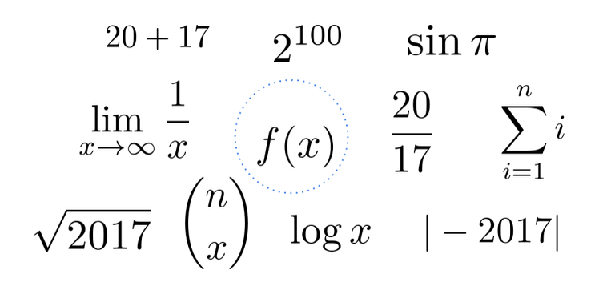
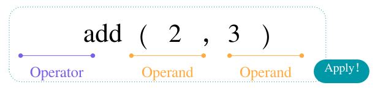
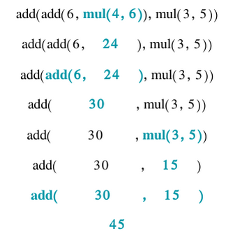
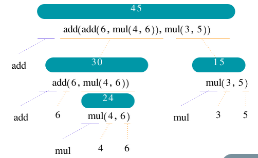

#### CS到底是什么？

1. 用计算可以解决什么问题？
2. 怎么解决问题？
3. 可以使用什么工具解决问题？

#### CS有哪些细分的方向？

- Systems
- Artificial Intelligence
- Graphics
- Security
- Networking
- Programming Languages
- Theory

#### 这个课程可以学到什么？

Mastering abstraction

Programming paradigms

#### 课程的作业？

- 8 programming homeworks
- 4 programming projects
- 1 diagnostic quiz, 1 midterm exam, and 1 final exam
- Lots of course support and a great community

#### program

- **Programs** work by manipulating values
- **Expressions** in programs evaluate to values
- **Primitive expressions** evaluate directly to values with minimal work needed
- **Operators** combine primitives expressions into more complex expressions

#### Expressions

An expression describes a computation and evaluates to a value

#### Call Expressions

Evaluate the **operator**

Evaluate the operands **from left to right**

**Apply** the operator (a function) to the evaluated operands (arguments)

Operators and operands **are also expressions**

So they also **evaluate to values**

#### 如果是嵌套呢？

add(add(6, mul(4, 6)), mul(3, 5))

How does the computer know which call to evaluate first?

expression tree

#### 作业？

lab0

https://inst.eecs.berkeley.edu/~cs61a/su20/lab/lab00/